Можно вечно сидеть с числовым меню на консоли. Однако это далеко не единственный вариант представления меню. Одно из представлений - стрелочное меню. При помощи [взаимодействия с консолью — курсора и очистки](/csharp/consoleuse) его можно быстро и просто реализовать

---

## Структура стрелочного меню

Нарисуем условную стрелочку, которая изначально будет стоять в позиции 0, 1

```csharp
Console.SetCursorPosition(0, 1);
Console.WriteLine("->");
```

Теперь, давайте будем [считывать нажатую клавишу с консоли](/csharp/readkey) и проверять, чему он равен. Если клавиша равна стрелке наверх, то переместить нашу стрелку на позицию 0,0, т.е. на один ряд выше. Если равна стрелки вниз – на позицию 0,2, т.е. на один ряд ниже

```csharp
Console.SetCursorPosition(0, 1);
Console.WriteLine("->");

ConsoleKeyInfo key = Console.ReadKey();
if (key.Key == ConsoleKey.UpArrow)
{
    Console.SetCursorPosition(0, 0);
    Console.WriteLine("->");
}
else if (key.Key == ConsoleKey.DownArrow)
{
    Console.SetCursorPosition(0, 2);
    Console.WriteLine("->");
}
```

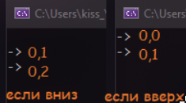

Принцип мы поняли – если мы идем вниз, число увеличивается, если вверх – уменьшается. Давайте вынесем второе число в отдельную переменную и будем ему прибавлять или убавлять значения в зависимости от того, на какую клавишу мы нажали.

```csharp
int position = 1;
Console.SetCursorPosition(0, position);
Console.WriteLine("->");

ConsoleKeyInfo key = Console.ReadKey();
if (key.Key == ConsoleKey.UpArrow)
{
    position--; //или position = position - 1;

    Console.SetCursorPosition(0, position);
    Console.WriteLine("->");
}
else if (key.Key == ConsoleKey.DownArrow)
{
    position++; //или position = position + 1;

    Console.SetCursorPosition(0, position);
    Console.WriteLine("->");
}
```

Строки с SetCursorPosition и WriteLine повторяются и в первом ифе, и во втором, так что мы можем их вызывать под всеми ифами, так как они а) выполнятся в любом случае, б) стояли в конце каждого действия. Стояли бы в начале - вынесли бы выше

```csharp
int position = 1;
Console.SetCursorPosition(0, position);
Console.WriteLine("->");

ConsoleKeyInfo key = Console.ReadKey();
if (key.Key == ConsoleKey.UpArrow)
{
    position--; //или position = position - 1;
}
else if (key.Key == ConsoleKey.DownArrow)
{
    position++; //или position = position + 1;
}

Console.SetCursorPosition(0, position);
Console.WriteLine("->");
```

Давайте обернем это чтение символа в [бесконечный цикл](/csharp/cycles) и посмотрим, что у нас получится

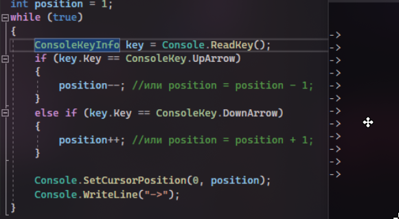

Стрелочки постоянно повторяются, я же хочу, чтобы была одна стрелочка на всё меню. Тогда я добавлю Console.Clear() перед тем, как рисовать новую стрелку

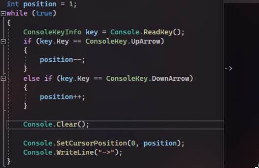

Также, я могу добавить свое текстовое меню в отдельный метод, чтобы каждый раз вызывать его после очищения экрана. Чтобы выбрать какой-то элемент, нам нужно будет читать нажатие клавиши Enter, а выбранный пункт мы можем узнать из переменной position

```csharp
int position = 1;
Menu();
while (true)
{
    ConsoleKeyInfo key = Console.ReadKey();
    if (key.Key == ConsoleKey.UpArrow)
    {
        position--;
    }
    else if (key.Key == ConsoleKey.DownArrow)
    {
        position++;
    }

    Console.Clear();
    Menu();
    Console.SetCursorPosition(0, position);
    Console.WriteLine("->");
}

static void Menu()
{
    Console.WriteLine("Какой цвет вы любите?");
    Console.WriteLine(" 1.Желтый"); //два пробела слева для стрелки, т.к. стрелка занимает 2 символа
    Console.WriteLine(" 2.Красный");
    Console.WriteLine(" 3.Зеленый");
    Console.WriteLine(" 4.Синий");
}
```

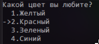

Есть еще другой вариант, чтобы интерфейс не мелькал постоянно, когда мы переключаем стрелку. Можно чистить старую позицию стрелки. Тогда вместо Console.Clear(); мы сделаем иначе.

Как только пользователь нажал клавишу, мы должны поставить два пробела там, где стрелка находится в данный момент. Так мы затираем уже нарисованную стрелку. Потом уже код смотрит, на какую стрелку мы нажали, меняет позицию и рисует стрелку заново

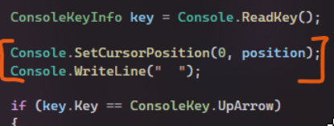

Вот эти две строчки снизу тогда убираем, так как больше не нужно ничего дополнительно чистить

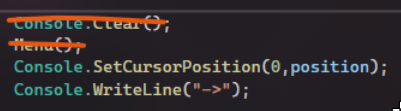

Итоговый код для меню выглядит следующим образом

```csharp
int position = 1;
Menu();
while (true)
{
    ConsoleKeyInfo key = Console.ReadKey();

    Console.SetCursorPosition(0, position);
    Console.WriteLine(" ");

    if (key.Key == ConsoleKey.UpArrow)
    {
        position--;
    }
    else if (key.Key == ConsoleKey.DownArrow)
    {
        position++;
    }

    Console.SetCursorPosition(0, position);
    Console.WriteLine("->");
}

static void Menu()
{
    Console.WriteLine("Какой цвет вы любите?");
    Console.WriteLine("  1.Желтый"); //два пробела слева для стрелки, т.к. стрелка занимает 2 символа
    Console.WriteLine("  2.Красный");
    Console.WriteLine("  3.Зеленый");
    Console.WriteLine("  4.Синий");
}
```

Передвижение стрелки сделали, теперь выбор

---

## Выбор элемента по нажатию на enter

Для начала, по нажатию на enter наш цикл должен закончится. Значит вместо while true ставим условие – while key.Key != ConsoleKey.Enter. Но проблема в том, что key у нас создается на 2 строчки ниже

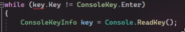

Все, что нам нужно сделать, это переместить этот key выше, из цикла, чтобы цикл узнал что такая переменная существует

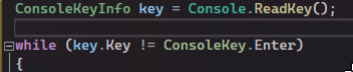

А затем, так как повторно внутри цикла мы клавишу не вводим, нам нужно ее ввести, в самом конце цикла, сразу после отрисовки стрелочки

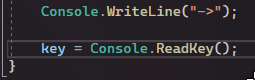

Тогда, как только мы нажмем Enter, программа завершается, потому что после нее ничего нет. Но мы можем сделать отображение того, что за пункт мы выбрали. Делать мы это будем в зависимости от позиции стрелочки. У нас как раз все удобно сделано – 1 строчка – 1 пункт, желтый. 2 строчка – красный и прочее.

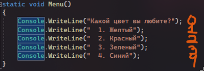

И в зависимости от этого, после цикла, мы можем сделать условия и вывести наш пункт

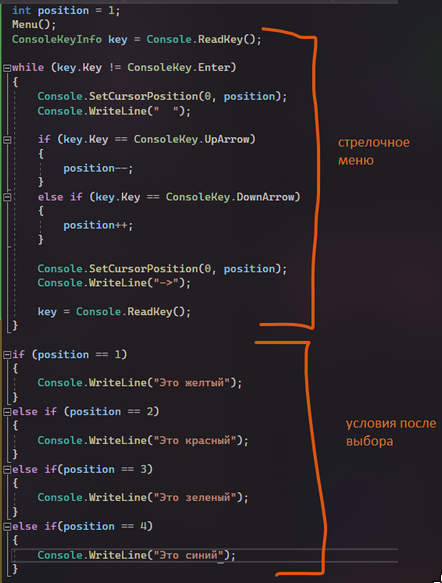

Только обязательно нужно поставить курсор в нужную позицию, иначе он выведет сообщение поверх меню

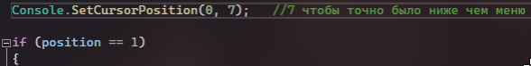

Итоговый код для меню выглядит следующим образом

```csharp
int position = 1;
Menu();
ConsoleKeyInfo key = Console.ReadKey();

while (key.Key != ConsoleKey.Enter)
{
    Console.SetCursorPosition(0, position);
    Console.WriteLine(" ");

    if (key.Key == ConsoleKey.UpArrow)
    {
        position--;
    }
    else if (key.Key == ConsoleKey.DownArrow)
    {
        position++;
    }

    Console.SetCursorPosition(0, position);
    Console.WriteLine("->");

    key = Console.ReadKey();
}

Console.SetCursorPosition(0, 7);

if (position == 1)
    Console.WriteLine("Это желтый");
else if (position == 2)
    Console.WriteLine("Этс красный");
else if(position == 3)
    Console.WriteLine("Это зеленый");
else if(position == 4)
    Console.WriteLine("Это синий");

static void Menu()
{
    Console.WriteLine("Какой цвет вы любите?");
    Console.WriteLine("  1.Желтый"); //два пробела слева для стрелки, т.к. стрелка занимает 2 символа
    Console.WriteLine("  2.Красный");
    Console.WriteLine("  3.Зеленый");
    Console.WriteLine("  4.Синий");
}
```
