В статье ["Классы как свои типы данных"](/csharp/classasmodel). Они пишутся в отдельных классах, где достаточно просто указать все атрибуты объекта в виде обычных переменных. Однако классы существуют не только для того, чтобы хранить в себе переменные, но и для того, чтобы хранить в себе методы, подобно методу Main в классе Program. То есть класс – это большая коробка для некоторых задач внутри.

Понадобится класс может для двух вещей. Первое – удобный перенос кода из программы в программу. Взял, скопировал файл, вставил в другой код, все. Работает.

Второе рассмотрим на примере [стрелочного меню](/csharp/arrowmenu). Если у нас, например, 100 файлов в проекте, и мы хотим, чтобы в 5 из них было стрелочное меню, мы должны вынести код в отдельный класс и постоянно обращаться к нему, чтобы не пришлось копировать этот код 5 раз

---

## Создание класса и написание в нем кода

Возьмем как раз этот пример со стрелочным меню. Напишу маленькую программу, где центральный блок и будет являться стрелочным меню

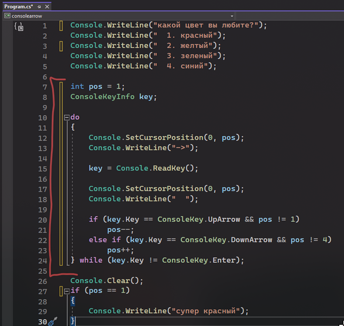

Именно это я и хочу вынести в отдельный класс, чтобы я смогла использовать этот код везде. Чтобы его перенести в класс, надо этот класс создать. Для этого нажимаем ПКМ по названию нашего проекта, находим «Добавить» и в списке находим «Класс»

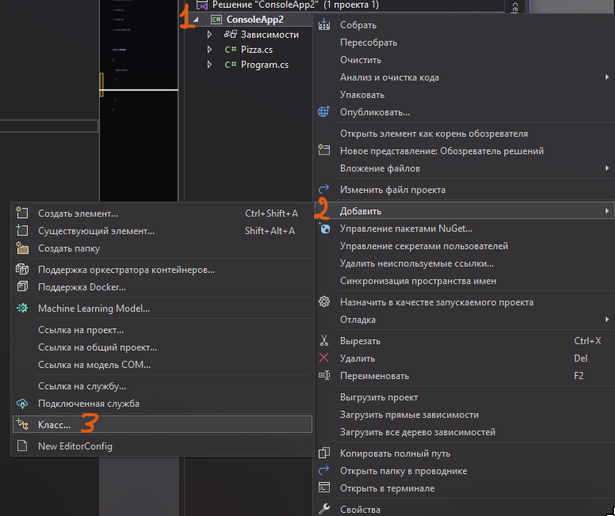

В появившемся диалоговом окне подтвердим, что это класс, дадим название "Menu" нашему классу внизу экрана, а затем нажмем добавить.

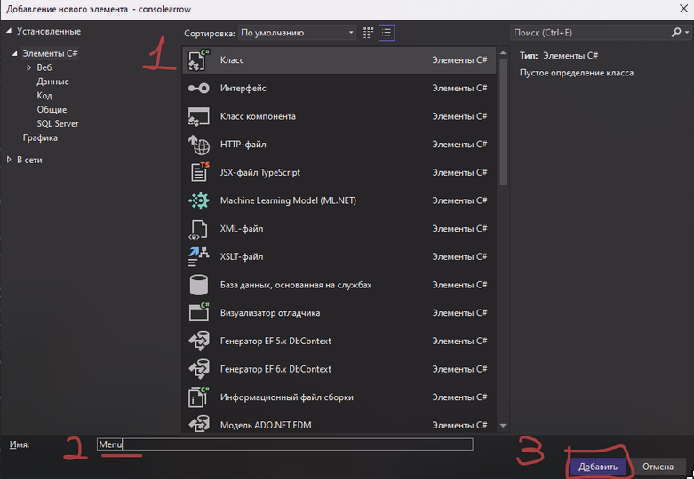

Весь код не может просто хранится в файле. Из предыдущих статей мы узнали, что код хранится в [методах](/csharp/methods), а методы - в **классах**. На подобии того, как метод Main хранится в классе Program, так и тут, создадим метод для стрелочного меню, который будет хранится в классе Menu. Назову его Show()

**Static в наших новых классах писать не нужно, метод можно создать и без него**

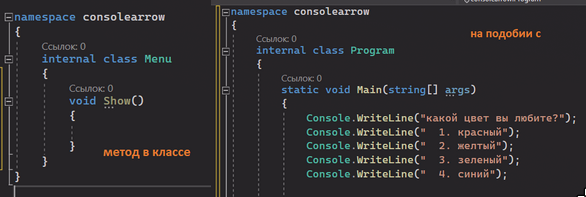

И в этот метод и перемещу наше стрелочное меню

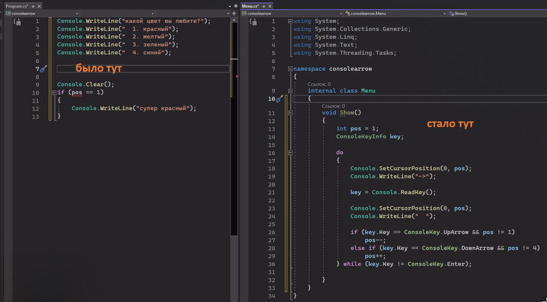

```csharp
internal class Menu
{
    void Show()
    {
        int pos = 1;
        ConsoleKeyInfo key;

        do
        {
            Console.SetCursorPosition(0, pos);
            Console.WriteLine("->");

            key = Console.ReadKey();

            Console.SetCursorPosition(0, pos);
            Console.WriteLine("");

            if (key.Key == ConsoleKey.UpArrow && pos != 1)
                pos--;
            else if (key.Key == ConsoleKey.DownArrow && pos != 4)
                pos++;
        } while (key.Key != ConsoleKey.Enter);
    }
}
```

Но появились проблемы – в основной программе теперь стрелочного меню нет, так еще и ругается на отсутствие позиции, потому что позиция стрелочки была в стрелочном меню.

Чтобы вернуть позицию стрелки, давайте просто **вернем позицию** из метода. В конце метода пишем return pos и не забываем изменить void на int, так как pos это число, значит возвращаем тоже число!

```csharp
internal class Menu
{
    int Show()
    {
        int pos = 1;
        ConsoleKeyInfo key;

        do
        {
            Console.SetCursorPosition(0, pos);
            Console.WriteLine("->");

            key = Console.ReadKey();

            Console.SetCursorPosition(0, pos);
            Console.WriteLine("");

            if (key.Key == ConsoleKey.UpArrow && pos != 1)
                pos--;
            else if (key.Key == ConsoleKey.DownArrow && pos != 4)
                pos++;
        } while (key.Key != ConsoleKey.Enter);
        return pos;
    }
}
```

Теперь проблема с отсутствием стрелочного меню в Program.cs. Метод Show надо там вызвать. А достанем мы его также, как мы доставали элементы из пиццы.

По факту, пицца (тот класс из статьи с [собственными типами данных](/csharp/classasmodel)) – это класс. Мы запихнули внутрь переменные, сказали, что они **публичные**, и с работали с ним как с типом данных. **Класс Menu ничем не отличается, что то класс, что это класс, только в первом случае мы хранили внутри переменные, а во втором случае мы храним там методы**

Это значит, что я могу создать Menu там, где мне нужно, в качестве переменной. А потом через точку обратиться к методу внутри.

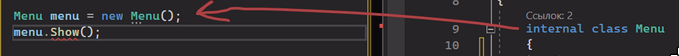

И нужно не забыть метод сделать публичным, чтобы не было ошибки!

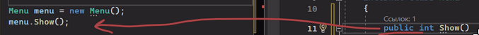

Итого, двумя строками, мы вернули обратно наше стрелочное меню. Единственное что - переменную pos нужно вернуть, чтобы выбор стрелки смог вернуться в Program.cs

Код Menu.cs

```csharp
internal class Menu
{
    public int Show()
    {
        public int pos = 1;
        ConsoleKeyInfo key;

        do
        {
            Console.SetCursorPosition(0, pos);
            Console.WriteLine("->");

            key = Console.ReadKey();

            Console.SetCursorPosition(0, pos);
            Console.WriteLine("");

            if (key.Key == ConsoleKey.UpArrow && pos != 1)
                pos--;
            else if (key.Key == ConsoleKey.DownArrow && pos != 4)
                pos++;
        } while (key.Key != ConsoleKey.Enter);
        return pos;
    }
}
```

Код Program.cs

```csharp
Console.WriteLine("какой цвет вы любите?");
Console.WriteLine(" 1. красный");
Console.WriteLine(" 2. желтый");
Console.WriteLine(" 3. зеленый");
Console.WriteLine(" 4. синий");

Menu menu = new Menu(); //если подсвечивается ошибка, нажмите alt + enter и enter
int pos = menu.Show();

Console.Clear();
if (pos == 1)
    Console.WriteLine("супер красный");
```

Но есть проблема

Стрелочное меню прекрасно работает, если меню будет состоять из 4 пунктов. Если пунктов станет меньше или больше, то меню все еще будет расчитано на 4 пункта, так как в стрелочном меню хардкодом стоит ограничение от 1 до 4

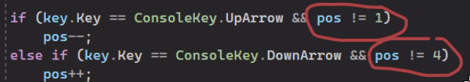

Чтобы его поменять, давайте введем публичные переменные для минимума и максимума. Значение для них будем передавать из Program.cs. Переменные мы будем создавать как для пиццы, **над** методами. Такие переменные называются глобальные, так как они существуют для всего класса.

Передаем значения как для пиццы – хочу воспользоваться menu, а именно (пишу точку) – min или max стрелочкой

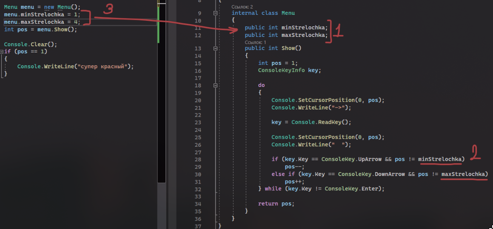

Тогда, в зависимости от количества элементов в меню, значение для максимальной стрелочки можно будет изменить.

Но и здесь есть проблема!

Заключается она в огромном количестве public. Сейчас мы бездумно ставим public на все то, к чему хотим иметь доступ, а так делать нельзя. Если мы ставим public для переменной\метода\класса, значит мы говорим, что этим объектом можно воспользоваться где угодно, как угодно и когда угодно, даже не воспользоваться вовсе. Но рассмотрим, что будет, если мы не будем указывать минимальную и максимальную стрелку – она же public, можем с ней сделать все что угодно

В этом случае, стрелка сможет уходить далеко вниз. А если она поднимется на 0 строчку, то там и застрянет, так как значения для чисел по умолчанию равны нулю, получается, минимальная и максимальная стрелка равны нулю

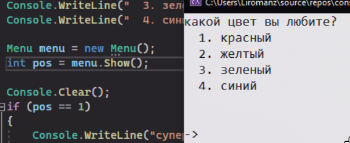

Я не хочу, чтобы у другого программиста, либо у меня через полгода, когда я уже в конец забуду все, что я здесь понаписала, была возможность сломать мое стрелочное меню. Поэтому есть одно правило

**Все, что ломает логику должно быть скрыто – private. Все, что никак не ломает логику должно быть открыто – public.**

Принцип называется сокрытие. Работает внутри инкапсуляции (обеспечение правильности выполнения какого-либо процесса при помощи сокрытия одних методов и показывания других, спасибо википедия). Подробнее об инкапсуляции можете посмотреть в статье о [модификаторах доступа](/csharp/modifiers)

По этой логике, наши переменные должны быть приватные, так как они могут сломать логику нашего стрелочного меню.

```csharp
internal class Menu
{
    private int minStrelochka;
    private int maxStrelochka;

    public int Show()
    {
        public int pos = 1;
        ConsoleKeyInfo key;

        do
        {
            Console.SetCursorPosition(0, pos);
            Console.WriteLine("->");

            key = Console.ReadKey();

            Console.SetCursorPosition(0, pos);
            Console.WriteLine("");

            if (key.Key == ConsoleKey.UpArrow && pos != minStrelochka)
                pos--;
            else if (key.Key == ConsoleKey.DownArrow && pos != maxStrelochka)
                pos++;
        } while (key.Key != ConsoleKey.Enter);
        return pos;
    }
}
```

Но мне все равно нужно передать в них значения. Как быть? Я могу передать значения в момент создания переменной

---

## Передача данных в момент создания экземпляра — конструкторы

Для этого, я мне нужно создать **конструктор** – некий метод, который будет работать при создании моего типа данных. Этот метод у меня будет возвращать тип данных моего класса, т.е. Calculator. Названия у него не будет. Если кратко, пишется как **public НазваниеКласса() {}**. Во всем остальном работает как метод

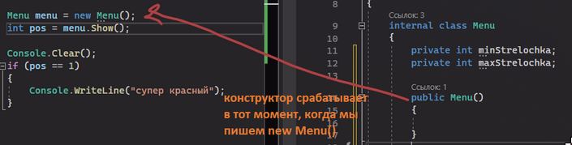

А раз он работает как метод, значит я могу сделать приемники для своих двух значений – минимум и максимум. Значение из этих приемников я запишу в переменные minStrelochka и maxStrelochka, потому что именно они работают с кодом внутри класса

Кратко: minStrelochka и maxStrelochka – переменные, которые не видны другим классам, но видны всем методам **внутри** своего класса. Они нужны для внутреннего кода стрелочного меню. Min и max – переменные, которые не видны методам внутри класса, но видны **другим** классам. Через них мы передаем значение внутрь стрелочного меню

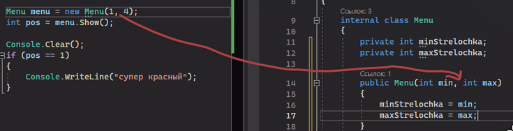

Таким образом мы можем создавать класс с какой-либо логикой, и передавать туда значения, чтобы метод был максимально универсальным. Итоговый код выглядит так

Код Menu.cs

```csharp
internal class Menu
{
    private int minStrelochka;
    private int maxStrelochka;

    public Menu(int min, int max)
    {
        minStrelochka = min;
        maxStrelochka = max;
    }

    public int Show()
    {
        public int pos = 1;
        ConsoleKeyInfo key;

        do
        {
            Console.SetCursorPosition(0, pos);
            Console.WriteLine("->");

            key = Console.ReadKey();

            Console.SetCursorPosition(0, pos);
            Console.WriteLine("");

            if (key.Key == ConsoleKey.UpArrow && pos != 1)
                pos--;
            else if (key.Key == ConsoleKey.DownArrow && pos != 4)
                pos++;
        } while (key.Key != ConsoleKey.Enter);
        return pos;
    }
}
```

Код Program.cs

```csharp
Console.WriteLine("какой цвет вы любите?");
Console.WriteLine(" 1. красный");
Console.WriteLine(" 2. желтый");
Console.WriteLine(" 3. зеленый");
Console.WriteLine(" 4. синий");

Menu menu = new Menu(1, 4); //если подсвечивается ошибка, нажмите alt + enter и enter
int pos = menu.Show();

Console.Clear();
if (pos == 1)
    Console.WriteLine("супер красный");
```
