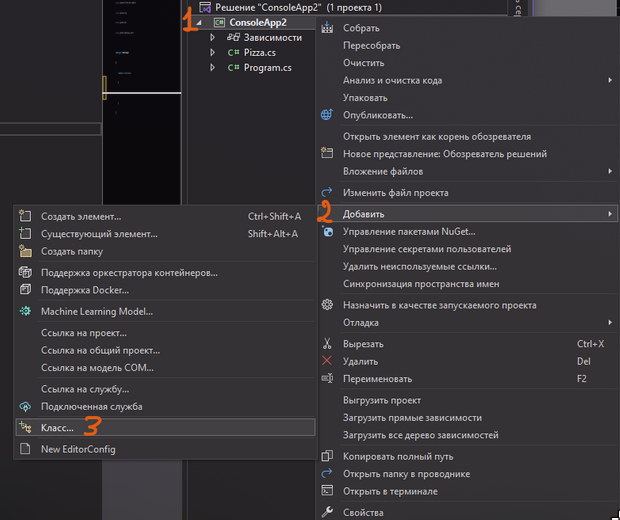
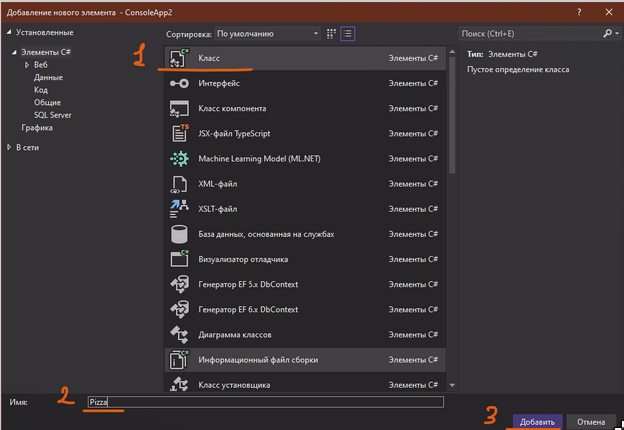
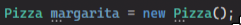
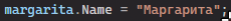
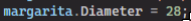

Кроме каких-то базовых типов данных, мы еще можем создавать и свои типы данных. Все в этом мире может быть типом данных – напитки, здания, компьютеры и прочее. Все из этих сущностей хранят в себе какие-то пункты, атрибуты, по которым их можно характеризовать

Например, возьмем пиццу. Пиццы бывают разные: маргарита, гавайская, 4 сыра, однако все это пицца. Также пиццы бывают разного диаметра – 26, 30, 38 дюймов. Опять же, размер разный, но пицца остается пиццей

---

## Создание класса

Давайте создадим тип данных «Pizza». Для этого нам нужно создать новый класс. Нажимаем ПКМ по названию нашего проекта, находим «Добавить» и в списке находим «Класс»



В появившемся диалоговом окне подтвердим, что это класс, дадим название нашему классу внизу экрана, а затем нажмем добавить. **Я назову класс Pizza, так как хочу, чтобы мой будущий тип данных назывался также**



Перед нами создается точно такой же класс, как и Program, только без метода Main внутри и с другим именем. Внутри этого класса мы как раз и будем создавать некие атрибуты, характеризующие нашу пиццу

```csharp
namespace ConsoleApp2
{
    internal class Pizza
    {
    }
}
```

Выше мы уже перечислили, что

- У пиццы есть название – маргарита, гавайская, 4 сыра - текст
- У пиццы есть диаметр – 28, 30, 38 – целое число

Давайте прямо внутри этого класса создадим такие переменные

```csharp
internal class Pizza
{
    string Name;
    int Diameter;
}
```

Однако, чтобы эти переменные работали не только в этом классе, им нужно добавить слово public перед их типом данных. Более подробно поговорим об этом в теме с инкапсуляцией.

```csharp
internal class Pizza
{
    public string Name;
    public int Diameter;
}
```

На этом, создание нашего нового типа данных закончено. Теперь, как его использовать?

---

## Использование новых типов данных

После создания нового типа данных, давайте вернемся в наш класс Program и попробуем поработать с нашим типом данных.

Имя нашего типа данных такое же, как у названия класса – Pizza. Классы – сложный тип данных, значит создавать новую переменную мы будем по шаблону

**типданных название = new типданных;**

В конце, как всегда, ставим то, на что ругается код, в этом случае – круглые скобки. По-умному – мы создаем новый экземпляр класса

Например, я хочу создать маргариту



Однако я помню, что у меня внутри пиццы есть еще две переменные – Name и Diameter, я также хочу задать им значения.

Я хочу использовать маргариту, **а именно** (пишу точку), название. Оно будет равно «маргарита»



Я хочу использовать маргариту, а именно, диаметр. Оно будет равно 28



Таким же образом я могу вывести значения из маргариты

```csharp
Pizza margarita = new Pizza();
margarita.Name = "Маргарита";
margarita.Diameter = 28;

Console.WriteLine(margarita.Name);
Console.WriteLine(margarita.Diameter);
```


Также, я могу сразу же при создании своей переменной дать ей значения, указав в фигурных скобках что к чему относится. Принцип такой же, как в массивах, в фигурных скобках мы передаем все элементы через запятую. Но так как у элементов есть еще и название, то его мы тоже указываем.

```csharp
Pizza margarita = new Pizza()
{
    Name = "Маргарита",
    Diameter = 28
};

Console.WriteLine(margarita.Name);
Console.WriteLine(margarita.Diameter);
```


---

## Коллекции с типом данных

Также, раз это самый настоящий тип данных, то с помощью него можно делать различные виды коллекций.

```csharp
//меню из 10 пицц
Pizza[] menu = new Pizza[10];

//меню где могут быть разное кол-во пицц
List<Pizza> menuList = new List<Pizza>();
```

Внутрь этих коллекций я уже буду добавлять не просто значение, а целую переменную с данными о пицце

```csharp
Pizza margarita = new Pizza();
margarita.Name = "Mаргарита";
margarita.Diameter = 28;

//меню из 10 пицц
Pizza[] menu = new Pizza[10];
menu[0] = margarita;

//меню где могут быть разное кол-во пицц
List<Pizza> menuList = new List<Pizza>();
menuList.Add(margarita);
```

А также при перечислении циклом мне необходимо будет работать именно с этим типом данных, т.е. чтобы что-то вывести, нам опять нужно писать точку и что именно мы хотим взять оттуда

```csharp
foreach (Pizza pos in menuList)
{
    Console.WriteLine(pos.Name);
    Console.WriteLine(pos.Diameter);
}
```
