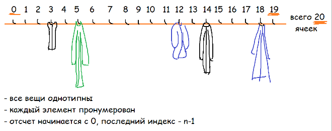
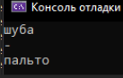
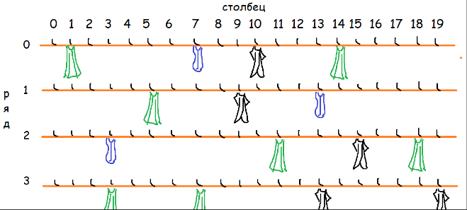
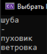
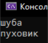
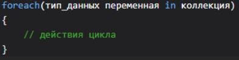
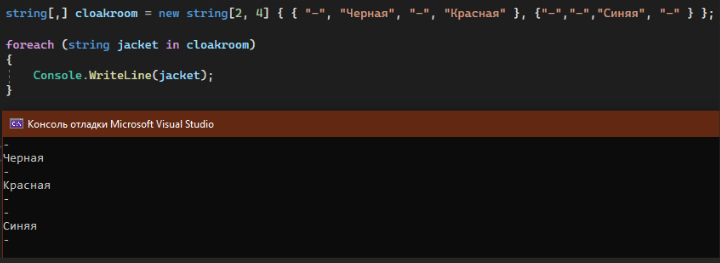
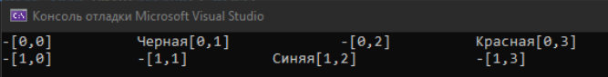

Коллекция – набор однотипных данных, где каждый элемент пронумерован порядковым номером. Например, явный пример коллекции – гардероб. В гардеробе может хранится только верхняя одежда (нельзя повесить в гардероб машину, холодильник или оставить кота), а также все вешалки имеют свой номерок, по которому можно найти определенную куртку (под вешалкой 18 синяя куртка, под вешалкой 5 – зеленая).



Виды коллекций бывают разные: ограниченные, гибкие, многомерные. Разберем по одному виду из каждого – для ограниченных возьмем массив, для гибких - лист и для многомерных - матрицу

---

## Массив

Объявление массива похоже на объявление переменной за тем исключением, что после указания типа ставятся квадратные скобки: **тип_переменной[] название_массива;**

```csharp
string[] garderobe;
```

После определения переменной массива мы можем присвоить ей ее ограниченный размер, если мы указали что в гардеробе 4 вешалки, их не может стать резко больше:

```csharp
string[] mainGarderobe = new string[4];
```

Также мы сразу можем указать значения для этих элементов. Значения мы указываем внутри фигурных скобок через запятую. Вот все варианты того, как можно создать массив.

Заметьте, что только в последнем случае не используются фигурные скобки. Вместо них используются квадратные, будто бы мы сразу ставим стены вокруг нашего гардероба

```csharp
string[] mainGarderobe1 = new string[4] { "шуба", "-", "пуховик", "ветровка"};
string[] mainGarderobe2 = new string[] { "шуба", "-", "пуховик", "ветровка" };
string[] mainGarderobe3 = new[] { "шуба", "-", "пуховик", "ветровка" };
string[] mainGarderobe4 = ["шуба", "-", "пуховик", "ветровка"];
```

---

## Индексация и получение элементов массива

Для обращения к элементам массива используются индексы. Приводя аналогию с гардеробом, индекс - это номерок у вешалки. В массиве - это номер элемента.

У индексов есть пару правил: индекс ВСЕГДА начинается с нуля, и последний индекс массива ВСЕГДА на 1 меньше, чем количество элементов (если в массиве 10 элементов, последний индекс - 9)

```csharp
string[] mainGarderobe = ["шуба", "-", "пуховик", "ветровка"];

Console.WriteLine(mainGarderobe[0]); // первый элемент - шуба
Console.WriteLine(mainGarderobe[3]); // последний элемент - ветровка
```

При помощи индексов можно не только получить значение, но и переписать его. В нашем гардеробе не всегда будет висеть шуба, верно?

Шуба висела под нулевым номерком. Попробуем поменять ей значение и посмотреть, что из этого выйдет

```csharp
string[] mainGarderobe = ["шуба", "-", "пуховик", "ветровка"];
Console.WriteLine(mainGarderobe[0]); // шуба

mainGarderobe[0] = "-";
Console.WriteLine(mainGarderobe[0]); // -

mainGarderobe[0] = "пальто";
Console.WriteLine(mainGarderobe[0]); // пальто
```



Работа с индексами идентична для всех коллекций, так что давайте приступим к изучению других видов. Перейдем к гибким коллекциям

---

## Лист

В отличии от массива, нам не нужно ставить ограничение на то, какого размера будет наш лист. В целом, работа с листом такая же, как и с массивом, но мы можем добавлять и убирать элементы из него.

Для объявления листа нам необходимо написать List\<\> и в угловых скобках указать, какой тип данных мы хотим хранить внутри, например: **List\<тип_переменной\> название = new List\<тип_переменной\>();**

```csharp
List<string> pokupki = new List<string>();
```

```csharp
List<string> pokupki1 = new List<string>() { "яица", "молоко", "хлеб"};
List<string> pokupki2 = new() { "яица", "молоко", "хлеб" };
List<string> pokupki3 = [ "яица", "молоко", "хлеб" ];
```

Как и массивы, каждый элемент листа пронумерован индексом, с помощью которых можно обратиться к определенным элементам: вывести или перезаписать значение в них:

```csharp
List<string> pokupki = ["яица", "молоко", "хлеб"];

Console.WriteLine(pokupki[1]); //молоко

pokupki[1] = "чудо-молочко";
Console.WriteLine(pokupki[1]); //чудо-молочко
```

Главным преимуществом и отличием листов от массивов является их динамичность – в лист можно добавлять или удалять его элементы. Новые элементы будут добавлены в самый конец, а после удаления элементы будут двигаться влево к первому

Для добавления я хочу использовать свой лист, **а именно** добавление. Получается мой метод будет выглядеть как названиелиста.Add(элемент)

```csharp
List<string> pokupki = ["яица", "молоко", "хлеб"];

pokupki.Add("энергетик"); // pokupki = ["яица", "молоко", "хлеб", "энергетик"]
pokupki.Add("хлеб"); // pokupki = ["яица", "молоко", "хлеб", "энергетик", "хлеб" ]
```

Для удаления я хочу использовать свой лист, **а именно** убирание. Получается мой метод будет выглядеть как названиелиста.Remove(элемент);.

Заметьте, что если через Remove убрать элемент, который повторяется несколько раз внутри листа, то уберется только самый первый такой элемент! В примере ниже, внутри листа было два хлеба. Если я прописываю Remove для хлеба, убирается не весь хлеб, а только самый левый

```csharp
List<string> pokupki = ["яица", "молоко", "хлеб"];

pokupki.Add("энергетик"); // pokupki = ["яица", "молоко", "хлеб", "энергетик"]
pokupki.Add("хлеб"); // pokupki = ["яица", "молоко", "хлеб", "энергетик", "хлеб" ]

pokupki.Remove("молоко"); // pokupki = ["яица", "хлеб", "энергетик", "хлеб"]
pokupki.Remove("хлеб"); // pokupki = ["яица", "энергетик", "хлеб" ], последний остался!
```

Если мы хотим удалить все элементы по запросу, например, весь хлеб, то нам нужно воспользоваться циклом. Remove возвращает буленовское значение: true, если удалилось, false.

Цикл вообще в данном случае - костыль, но на данном этапе давайте не загружать голову сложными запросами. Подробнее про правильную запись для удаления всех элементов, подходящих под значение, вы можете прочитать в [LINQ-запросах](/csharp/linq)

```csharp
List<string> pokupki = ["яица", "молоко", "хлеб"];

pokupki.Add("энергетик"); // pokupki = ["яица", "молоко", "хлеб", "энергетик"]
pokupki.Add("хлеб"); // pokupki = ["яица", "молоко", "хлеб", "энергетик", "хлеб" ]

// удалит весь хлеб из списка
while (pokupki.Remove("хлеб")) ; // pokupki = ["яица", "молоко", "энергетик"]
```

Также можно удалить какое-либо значение по индексу при помощи метода RemoveAt. Заметьте, что если мы убираем элемент из центра списка, все остальные элементы после него сдвинутся на один шаг влево

```csharp
List<string> pokupki = ["яица", "молоко", "хлеб"];

pokupki.Add("энергетик"); // pokupki = ["яица", "молоко", "хлеб", "энергетик"]
pokupki.Add("хлеб"); // pokupki = ["яица", "молоко", "хлеб", "энергетик", "хлеб" ]

// удалит весь хлеб из списка
while (pokupki.Remove("хлеб")) ; // pokupki = ["яица", "молоко", "энергетик"]

//элемент под 1 индексом - молоко
pokupki.RemoveAt(1); // pokupki = ["яица", "энергетик"] - теперь под первым индексом энергетик!
```

---

## Матрицы

Если в случае массивов у нас был один ряд, где по условным столбцам хранились наши куртки, то теперь количество рядов становится намного больше одного.



Матрицы также бывают как гибкими, так и ограниченными: можно сделать как массив в массиве, так и лист в листе, или вообще скомбинировать: массив с листами, или лист с массивами - играться можно как угодно!

Для того, чтобы понять, как создается матрица, возьмем создание массива. Вот так мы создавали массив на 4 вешалки в 1 ряду

```csharp
int[] nums = new int[4];
```

Теперь, кроме количества вешалок, мы хотим иметь 2 ряда в нашем гардеробе. Для этого в квадратных скобках мы пишем запятую, а при объявлении указываем два числа: **тип_переменной[,] название_массива;**

Первое число отвечает за количество рядов, а второе - за количество столбцов. Очень просто запомнить: представьте себе билет в театр или кино. На билете написано ваше сидение. В каком порядке идет нумерация? Ответ: ряд \_\_, место \_\_\_. Здесь также: вы сначала указываете количество рядов, а потом количество "мест" - ака столбцов - в матрице.

Всеми следующими способами мы можем объявить массив и только в первом случае в нашей переменной не будет ничего.

Значения для каждого нового ряда будут хранится в своих фигурных скобках, а они, тем временем, будут разделены запятыми и окружены в своих фигурных скобках: каждый ряд в своей "коробочке" из фигурных скобок. Можно сравнить, на примере того, что я разбираю все детальки лего в маленькие мешочки по цветам, а затем кладу эти мешочки в общую коробку

```csharp
int[,] table1;
int[,] table2 = new int[2, 4];
int[,] table3 = new int[2, 4] { { 0, 1, 2, 3 }, { 4, 5, 6, 7 } };
int[,] table4 = new int[,] { { 0, 1, 2, 3 }, { 4, 5, 6, 7 } };
int[,] table5 = new[,] { { 0, 1, 2, 3 }, { 4, 5, 6, 7 } };
int[,] table6 = { { 0, 1, 2, 3 }, { 4, 5, 6, 7 } };
```

Теперь, чтобы обратиться к элементу матрицы, необходимо прописывать не одно число в квадратных скобках, а две, перечисленные через запятую – сначала идет ряд, потом столбец.

Все остальное взаимодействие с матрицами остается таким же, как с массивами или листами: зависит от того, какую матрицу вы создали

```csharp
string[,] cloakroom = new string[2, 4]
{
    {"","Черная куртка", "", "Красная куртка" },
    {"","","Синяя куртка", "" }
};

Console.WriteLine(cloakroom[1,2]); //Синяя куртка
```

---

## Вывод коллекций

Коллекции можно вывести с помощью всех ранее изученных циклов. Например, мы знаем, что for - счетчик, или краткий while. Внутри for мы можем создать переменную, которая будет пробегаться от 0 и до последнего индекса массива, и выводить все элементы. Выглядеть он будет вот так

```csharp
string[] mainGarderobe = ["шуба", "-", "пуховик", "ветровка"];
for (int i = 0; i < mainGarderobe.Length; i++)
{
    Console.WriteLine(mainGarderobe[i]);
}
```



Плюсом такого варианта будет то, что я могу полностью настроить то, сколько элементов, в каком порядке и как они будут выводится. С индексами я могу работать как угодно: вывести каждый второй, в случае чего, вернуться на один назад, сначала вывести четные, а потом нечетные элементы и так далее. Например, так я выведу каждый второй элемент: при помощи i+=2;

```csharp
string[] mainGarderobe = ["шуба", "-", "пуховик", "ветровка"];
for (int i = 0; i < mainGarderobe.Length; i+=2)
{
    Console.WriteLine(mainGarderobe[i]);
}
```



Однако, если нам не нужны никакие сложные операции, а нужно пробежаться по каждому элементу и что-то с ним сделать, специально для коллекций, существует цикл foreach. Объявляется он следующим образом



Его главным отличием от остальных циклов является то, что мы перебираем массив не с помощью индексов, а с помощью самих элементов. Дословный перевод такого цикла: **для каждой** текстовой куртки **в** массиве курток сделаем то-то то-то. Таким образом, внутри переменной kurtka у меня хранится не индекс элемента, а его содержимое. **Внутри этого цикла нельзя менять содержимое коллекции – только прочитать**

```csharp
string[] mainGarderobe = ["шуба", "-", "пуховик", "ветровка"];
foreach (string kurtka in mainGarderobe)
{
    Console.WriteLine(kurtka);
}
```


---

## Вывод матрицы

Матрицу можно также выводить с помощью foreach, тогда мы получим обычное перечисление из каждого ряда и из каждого столбца



Однако если мы хотим узнать точный индекс каждого элемента, нам придется использовать цикл for или цикл while. For для этого случая подходит лучше всего, так как я не хочу работать с переменной I вне цикла. Кроме того, мы пробегаемся по матрице следующим образом:

```
Ряд 1, столбец 1, 2, 3, 4, … n
Ряд 2, столбец 1, 2, 3, 4, … n
…
Ряд m, столбец 1, 2, 3, 4 … n
```

Тогда нам понадобится два цикла для перебора этой матрицы

```csharp
string[,] cloakroom = new string[2, 4]
{
    { "-", "Черная", "-", "Красная" },
    {"-", "-", "Синяя", "-" }
};
for (int m = 0; m < cloakroom.GetLength(0); m++) // Для рядов
{
    for (int n = 0; n < cloakroom.GetLength(1); n++) // Для столбцов
    {
        Console.Write(cloakroom[m,n] + "[" + m + "," + n + "]\t\t");
    }
    Console.WriteLine();
}
```

Заметьте, что в условии для for стоит cloakroom.GetLength(0) и GetLength(1). С помощью этих методов мы берем количество наших рядов и количество наших столбцов. 0 и 1 - измерение, т.е. ряд, или столбец. При GetLength(0) мы берем ряд. В этой матрице значение будет равно 2 (так как при обьявлении мы указали string[2,4], 2 там – первое число, количество рядов). При GetLength(1) мы берем столбцы, в этой матрице значение будет равно 4 (количество столбцов)

Итого, наш код берет сначала первый ряд и пробегается по всем столбцам в этом ряду. Для каждого столбца он выводит значении и индекс этой ячейки. По окончанию пробежки по столбцам, мы переходим на другую строку. Вот как выглядит запущенная программа


