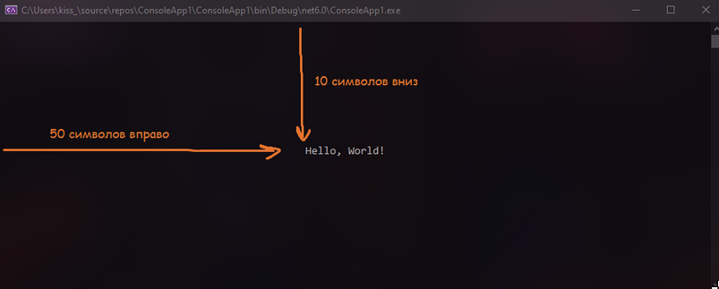
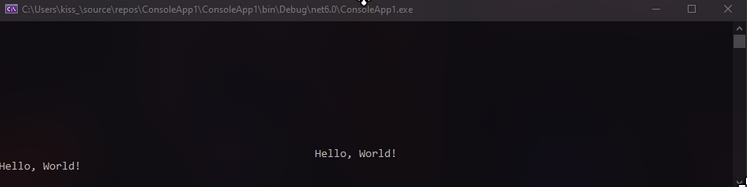
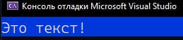
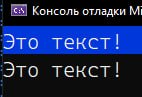

При работе с консолью вы могли заметить, что мы только и делаем, что вводим или выводим что-то на консоль. Давайте расширим наш кругозор и посмотрим, как еще мы можем взаимодействовать с консолью

---

## Очистка консоли

Если у нас есть много лишней информации на экран, о которой мы уже хотим забыть (например, повторяющаяся менюка), то всю эту информацию мы можем очистить с помощью следующего метода:

```csharp
Console.Clear();
```

Все максимально просто, я хочу использовать консоль, **а именно,** очистить ее. Эту очистку мы также можем поместить в любое условие, цикл и прочее. При вызове этого метода очистится вся консоль

---

## Расположение курсора в консоли

Вывод нашего текста зависит от того, где находится курсор в консоли. По умолчанию, курсор находится на позиции 0,0, поэтому и текст выводится у нас с левого верхнего угла. А что, если я хочу вывести текст посередине? Для этого есть следующий метод

```csharp
Console.SetCursorPosition(слева, сверху);
```

Этим методом мы устанавливаем позицию курсора, откуда мы хотим что-то написать. Например, я хочу вывести посередине экрана "Hello, world!". Условно подгоняю, сколько символов мне нужно отступить от левого верхнего края, а только потом пишу вывод

```csharp
Console.SetCursorPosition(50, 10);
Console.WriteLine("Hello, World!");
```



Однако помните, что если мы будем писать что-то сразу же после этого текста, мы будем писать на строчку ниже с начала строки, а не с той позиции, которую мы указали



---

## Цвет консоли

Что цвет текста, что цвет фона, можно менять. Для взаимодействия с цветом консоли существует два свойства и один метод:

- **ForegroundColor** - меняет цвет текста. Можно выбрать либо уже существующие цвета из ConsoleColor, либо ввести собственные через RGB или HEX значения

  ```csharp
  Console.ForegroundColor = ConsoleColor.White;
  ```

- **BackgroundColor** - меняет цвет фона. Выбор цвета аналогичен с текстом.

  ```csharp
  Console.BackgroundColor = ConsoleColor.DarkBlue;
  Console.WriteLine("Это текст!");
  ```

  Если я соединю обе строчки, а затем попробую вывести какой-то текст, к нему применятся эти настройки

  

- **ResetColor()** - метод, возвращающие все цвета к базовым. Все изменения, которые были внесены до этого после применения ResetColor будут сброшены

  ```csharp
  Console.BackgroundColor = ConsoleColor.DarkBlue;
  Console.WriteLine("Это текст!");

  Console.ResetColor();
  Console.WriteLine("Это текст!");
  ```

  

---

## Дополнительные настройки

Из дополнительных настроек можно изменить титульник консоли, размер консоли и установить отображение курсора

- **SetWindowSize(слева, снизу);** - размер экрана. Буферная зона (место, куда можно поместить значения в консоли) при этом меняться не будет. Буферную зону также можно изменить, но только на Windows, через **SetBufferSize(слева, снизу);**. Также, если вы делали цвет фона, то при изменении размера консоли фон будет полностью перекрашен в цвет фона

  ```csharp
  Console.SetWindowSize(100, 10);
  ```

- **Title** - титульник консоли. Туда можно поставить любой текст

  ```csharp
  Console.Title = "Консолька!";
  ```

- **CursorVisible** - видимость мигающего курсора. True - чтобы было видно, false - не видно.

  ```csharp
  Console.CursorVisible = false;
  ```
