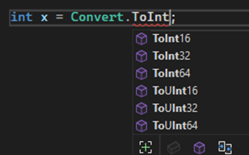
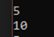

## Конвертация — Convert

Если я хочу сделать из текста цифру, я буду ее конвертировать (переводим на английский – to convert, значит нам нужно слово **Convert**)

Я хочу конвертировать текст, **а именно**, конвертировать в Int, а значение хранить в какой-то переменной, например, x

Однако интов у нас много, что выбрать?



Смотрим:

- Int16 это самый маленький из перечисленных, **короткий инт**, значит тип данных у него **short**
- Int32 — средний инт, самый **обычный**, его тип данных это просто **int**
- Int64 — самый большой, **длинный инт**, занчит тип данных — **long**
- А с UInt16, 32 и 64 та же история, но буква U показывает, что чисто будет только положительным (во всех переменных выше мы можем использовать как отрицательные, так и положительные значения)

Получается, хотим обычный, выбираем Int32

```csharp
int x = Convert.ToInt32(input);
```

И теперь мы можем с ней работать как с обычным числом — складывать, умножать, делить и прочее

Например, напишу маленький код, где я ввожу какой-то текст, например, «5», конвертирую его в число, прибавляю к нему число «5» и вывожу результат

```csharp
string input = Console.ReadLine();
int x = Convert.ToInt32(input);

int result = x + 5;
Console.WriteLine(result);
```

И так будет выглядеть наш результат в консоли. 5 мы ввели сами, 10 вывела программа



---

## типданных.Parse()

Аналог **Convert.ToТипданных** это **типданных.Parse()**.

Convert.ToInt32(строка) это int.Parse(строка). Работают они одинаково – конвертируют значение. Однако есть одно отличие – Convert может работать с null, Parse – нет.

```csharp
string? noValue = null;

int valueOne = Convert.ToInt32(noValue);
Console.WriteLine(valueOne); // выведет 0

int valueTwo = int.Parse(noValue);
Console.WriteLine(valueTwo); // выдаст ошибку
```

Ошибка при null может понадобится в случае, если вы хотите быть ТОЧНО уверены, что значение не null, и не хотите давать пользователю идти дальше, если значение все-таки оказалось null. Может быть полезным при создании валидации (ака проверок на правильность ввода)

Но у типданных.Parse() есть одна интересная конструкция – типданных.**TryParse()**

---

## типданных.TryParse()

В отличии от предыдущих конструкций, эта только пробует конвертировать значение в нужный тип данных. Если у нее это получилось – идем дальше. Если нет – тоже идем дальше, но значения у тебя не будет, установится значение по умолчанию (null или 0). Есть еще отличие – int.TryParse не нужно ни к чему присваивать. Переменная, в которую должно пойти значение, указывается прямо внутри TryParse при помощи слово out

```csharp
string? noValue = null;
int valueTwo;

// Структура:
// int.TryParse(чтоконвертируем, out кудаконвертируем);

int.TryParse(noValue, out valueTwo);
Console.WriteLine(valueTwo); // выдаст 0

valueTwo = int.Parse(noValue);
Console.WriteLine(valueTwo); // выдаст ошибку
```

Ту же valueTwo можно создать прямо внутри TryParse()

```csharp
string? noValue = "45";

int.TryParse(noValue, out int valueTwo);
Console.WriteLine(valueTwo); // выдаст 45
```

TryParse() возвращает буленово значение, т.е. true или false, True – если конвертация успешна, false – если нет. Их можно будет в будущем использовать в условиях и циклах, чтобы, например, раз за разом просить пользователя ввести нормальное значение, которое сможет конвертироваться.

```csharp
string? noValue = "45";
bool isConverted = int.TryParse(noValue, out int valueTwo);
Console.WriteLine(isConverted); // выдаст true
```

```csharp
string? noValue = "блабла";

bool isConverted = int.TryParse(noValue, out int valueTwo);
Console.WriteLine(isConverted); // выдаст false
```
