Цикл - процесс, составляющий кругооборот в течение известного промежутка времени. Кратко – повторяющийся блок кода.

Когда нам стоит использовать циклы?

- Когда у нас есть несколько повторяющихся строк кода, например, 5 выводов в консоль одной и той же информации. Чтобы не копировать код 5 раз, можно внести их в цикл
- Когда мы точно знаем, что код должен повторится, но не знаем сколько раз. Возвращаясь к примеру с бариста и кофе – человек попросил сахар в кофе. Сколько нам нужно ложек сахара? 3, 5, 10? Однако каждый раз мы будем делать одно и тоже – добавлять сахар в чай

Как и с условиями, в русском языке мы можем найти конструкцию, по которой станет понятно, что нам нужен цикл. Слышим слово **пока** – ставим цикл:

- **Пока** человек хочет сахар, добавить сахар в кофе.
- **Пока** я не доехала до нужной станции, оставаться в поезде.
- **Пока \<условие\>, \<действие\>.**
- Говорить, **пока** меня кто-то слушает.
- Прикладывать карту, **пока** оплата не пройдет.
- **\<Действие\>, пока \<условие\>.**

Слово «пока» может быть в двух местах – в начале предложения, и в середине, после запятой. Отсюда, мы можем вывести 2 вида циклов:

- **Цикл с предусловием** (пока \<вставьте условие\>, \<вставьте действие\>) – это цикл, который сразу проверяет условие, и если оно верно, выполняет действие. Может не выполнится ни разу (например, человек сразу же не хочет сахар, значит и добавлять его не нужно)
- **Цикл с постусловием** – цикл, который сначала выполняет действие, а только потом проверяет, нужно ли его повторять, или нет. Всегда выполнится хотя бы один раз, так как код идет сверху вниз, а в таких циклах стоит сначала действие, потом условие (я не пойму, что меня кто-то слушает, если не скажу что-то хотя бы раз). Такие циклы обычно переводят что-то в другое состояние (я начала говорить, я оплатила картой). Условие нужно чтобы проверить, перешли ли мы в это состояние, или нет (слушают ли нас, чтобы мы говорили; прошла ли оплата, чтобы мы оплатили)

Циклы с предусловием: while, for. Циклы с постусловием: do…while

---

## While

While – тот же самый if, только выполняется много раз. Если условие верно, повторять повторять повторять. Структура написания такая же, как у if, только вместо самого слова if ставится слово while

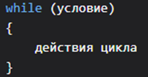

Как и в if, условие могут быть любыми. С bool переменными можно не писать true или false. Можно использовать несколько условий внутри одного цикла при помощи && или ||.

Единственное правило – **если в условии цикла используется переменная, она должна меняться внутри цикла**. Если в условии цикла несколько переменных, хотя бы одна из них должна меняться. Что это значит?

Рассмотрим пример с сахаром и кофе. Мы спросим человека, нужно ли ему кофе, а затем, пока он хочет кофе, будем его добавлять

```csharp
Console.WriteLine("Вам добавить сахар в кофе?");
string answer = Console.ReadLine();

while (answer == "Да")
{
    Console.WriteLine("Добавила ложку сахара в кофе");
}
```

Рассмотрим пример с сахаром и кофе. Мы спросим человека, нужно ли ему кофе, а затем, пока он хочет кофе, будем его добавлять

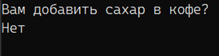

Если мы напишем «Нет», цикл не выполнится ни разу – условие было неверно, while (false) не работает

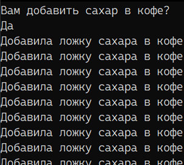

Рассмотрим почему так происходит. На второй строке мы ввели ответ – «Да», в answer теперь хранится «Да». На 4 строке мы смотрим:

- answer равно «Да»? Да, вывести строку
- answer равно «Да»? Да, вывести строку
- answer равно «Да»? Да, вывести строку
- answer равно «Да»? Да, блаблабла и так далее.

Значение answer не меняется внутри цикла, поэтому условие будет верно всегда – while (true) – и этот цикл никогда не закончится. Такой цикл называется бесконечным и тоже нередко используется, например, в таймерах.

В бесконечном цикле вместо условия можно просто написать true. Из таких циклов можно выйти только «насильственно», через оператор break или return, но про них мы поговорим попозже

Сейчас постоянный вывод «Добавила ложку» - это проблема. Я не хочу ему вывалить грузовик сахара в кофе, а значит, мне каждый раз нужно спрашивать, нужно ли продолжать добавлять сахар, или нет

```csharp
Console.WriteLine("Вам добавить сахар в кофе?");
string answer = Console.ReadLine();

while (answer == "Да")
{
    Console.WriteLine("Добавила ложку сахара в кофе");

    //вот тут мы спрашиваем, и значение переменной answer меняется
    //если оно меняется, цикл уже не может быть бесконечным
    Console.WriteLine("Добавить еще?");
    answer = Console.ReadLine();
}
```

И тогда цикл может быть закончен

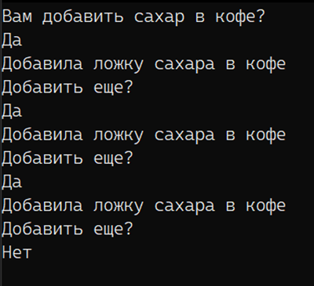

Здесь мы видим, что в условии используется переменная answer. Внутри цикла эта переменная должна меняться, чтобы цикл смог закончится. Если условий несколько, меняться может только одна из этих переменных. Самое главное – следить, чтобы цикл не стал бесконечным, иначе из него можно будет выходить только через break или return. О return мы поговорим попозже, сейчас, рассмотрим что такое break, а вместе с ним – continue

---

## Break и continue

Break и continue – два оператора перехода. break – «ломает» цикл и выходит из него, continue – пропускает все, что было в цикле после него

В качестве примера, сделаем маленький цикл с тем же сахаром, но теперь, скажем, что мы будем добавлять 10 (!) ложек сахара, и цикл должен повторится 10 раз. 10 это очень много, поэтому внутри цикла сделаем условие, что если количество будет больше 5, то мы будем что-то делать – либо ломать цикл, либо продолжать его выполнение. В конце скажем, что мы закончили

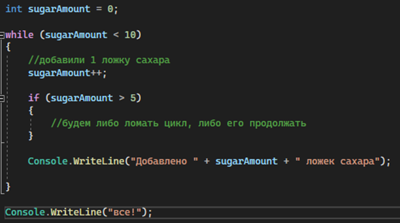

Попробуем поставить внутрь условия break и посмотрим, что он будет выводить. Выведем также количество ложек, на котором сработало условие

Как только цикл дошел до break, цикл был закончен, и код _сразу_ пошел дальше к сообщению "все", не заканчивая все обороты цикла. Break будет полезен в том случае, если у вас бесконечный цикл, который нужно когда-то закончить

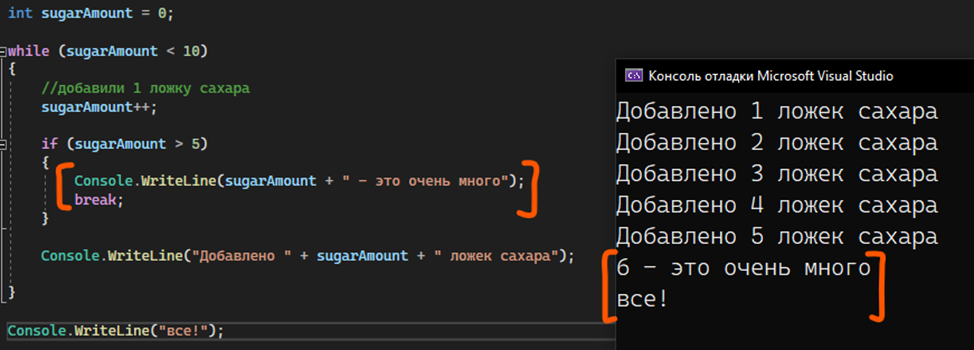

Код для проверки:

```csharp
int sugarAmount = 0;

while (sugarAmount < 10)
{
    //добавили 1 ложку сахара
    sugarAmount++;

    if (sugarAmount > 5)
    {
        Console.WriteLine(sugarAmount + " - это очень много");
        break;
    }

    Console.WriteLine("Добавлено " + sugarAmount + "ложек сахара");
}

Console.WriteLine("все!");
```

Попробуем вместо break поставить continue. Когда цикл доходит до него, все, что идет после continue пропускается, и цикл сразу же идет на новый оборот, новую итерацию – сообщение «Добавлено» не было выведено, так как continue не дал идти дальше. Заметьте, что цикл не заканчивается

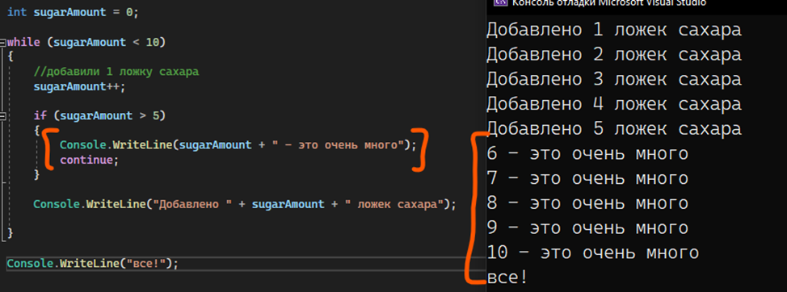

Код для проверки:

```csharp
int sugarAmount = 0;

while (sugarAmount < 10)
{
    //добавили 1 ложку сахара
    sugarAmount++;

    if (sugarAmount > 5)
    {
        Console.WriteLine(sugarAmount + " - это очень много");
        continue;
    }

    Console.WriteLine("Добавлено " + sugarAmount + "ложек сахара");
}

Console.WriteLine("все!");
```

**ВАЖНЫЙ МОМЕНТ!** Break и continue срабатывают только для ближайшего верхнего цикла. Если вы напишите что-то подобное, то прерван будет только цикл внутри цикла, внешний прерван не будет.

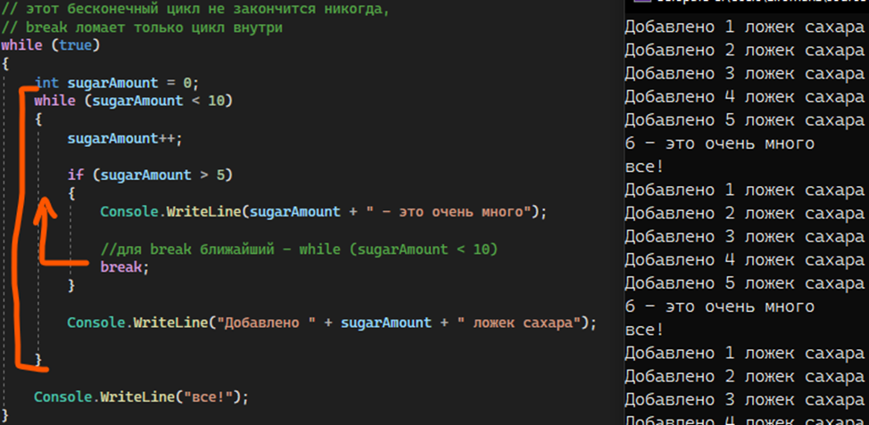

---

## For

For – более компактный вариант записи while, потому что прямо внутри цикла мы можем создавать переменную, ставить условие, и указать действие в конце каждого оборота цикла.

Давайте продолжим развивать тему с количеством ложек сахара. Вместо фантомных десяти ложек из предыдущего примера, спросим у пользователя, сколько ему нужно ложек. Сколько он скажет – сколько и добавим.

Цикл while будет выглядеть следующим образом

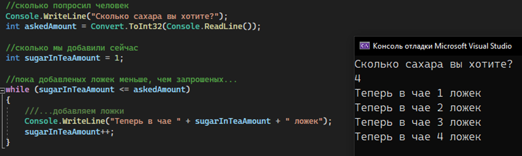

Мы видим тут 2 момента:

- Мы создали отдельную переменную sugarInTeaAmount, которая нужна ТОЛЬКО для цикла, чтобы считать количество
- В конце каждого оборота цикла к переменной sugarInTeaAmount прибавляется единица. Что бы не происходило выше, внизу всегда будет прибавляться единица

Создание переменной и финальное действие в каждом обороте цикла можно записать более компактно, через for. Посмотрим на его структуру

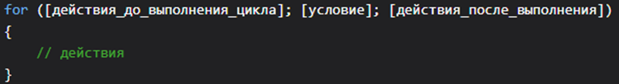

Объявление цикла for состоит из трех частей. Первая часть объявления цикла - некоторые действия, которые выполняются один раз до выполнения цикла. Обычно здесь определяются переменные, которые будут использоваться в цикле.

Вторая часть - условие, при котором будет выполняться цикл. Пока условие равно true, будет выполняться цикл.

И третья часть - некоторые действия, которые выполняются после завершения блока цикла. Эти действия выполняются каждый раз при завершении блока цикла.

После объявления цикла в фигурных скобках помещаются сами действия цикла.

Зная это, while, написанный выше, можно переделать вот в такой for. Работать будет идентично

```csharp
//сколько попросил человек
Console.WriteLine("Сколько сахара вы хотите?");
int askedAmount = Convert.ToInt32(Console.ReadLine());

for (int sugarInTeaAmount = 1; sugarInTeaAmount <= askedAmount; sugarInTeaAmount++)
{
    Console.WriteLine("Теперь в чае " + sugarInTeaAmount + " ложек");
}
```

Так как for – все еще цикл, операторы break и continue могут работать и здесь

---

## Do…while

В отличие от while и for, do…while сначала выполняет код цикла, а только потом проверяет условие цикла. Пока это условие верно, цикл будет повторяться.

Структура do…while полностью обратна while – мы буквально взяли while, переместили его вниз, а сверху, чтобы обозначить, что сейчас будет цикл, поставили do

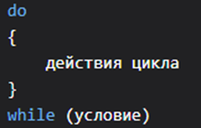

Например, напишу следующий код, согласно условию «говорить, пока меня кто-то слушает». Объявлю переменную isListening для работы, чтобы код смог понять с чем я работаю не только внутри цикла. Внутри каждого оборота я буду проверять, слушает ли меня кто-то

```csharp
bool isListening;

do
{
    Console.WriteLine("Говорю");

    Console.WriteLine("Меня слушают?");
    isListening = Convert.ToBoolean(Console.ReadLine());
} while (isListening == true);

//писать для bool переменных, что они равны
//true не обязательно, так как true == true
//будет равно true. значит можно просто
//оставить значение этой переменной, оно само
//будет проверять значение внутри себя
// while (isListening);
```

Посмотрим результат этой программы. Как мы можем заметить, у нас сразу же показывается на экране «Говорю», которое по коду, находится у нас внутри цикла. Если мы будем писать постоянно true, разница будет не очень видна (скрин слева). Но если мы сразу напишем false, мы увидим, что цикл один раз выполнился, и только под конец проверил, а нужно ли нам это делать (скрин справа).

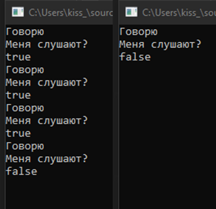
