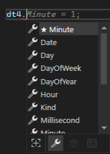
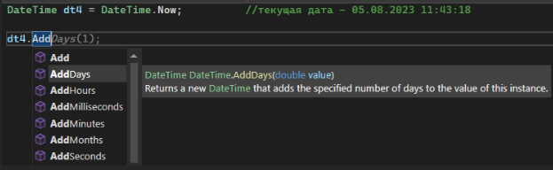
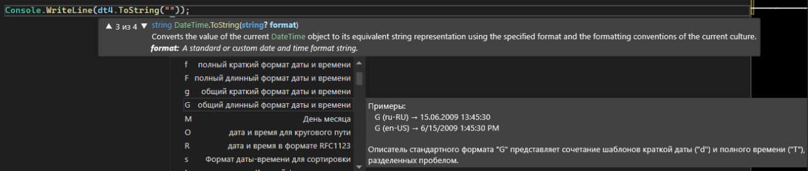

DateTime позволяет нам работать с полным набором – секунды, минуты, часы, дни, месяцы и года, не разбивая это все на 6 отдельных интовых переменных. Создается как [сложные переменные](/csharp/classasmodel) – **типданных название = new типданных.** Создать можно несколькими способами – пустая дата, только дата, дата со временем, и текущая дата при помощи DateTime.Now

```csharp
DateTime dt = new DateTime(); // 01.01.0001 00:00:00
DateTime dt2 = new DateTime(2022,12,30); // 30.12.2022 00:00:00
DateTime dt3 = new DateTime(2022,12,30, 23,40,59); // 30.12.2022 23:40:59
DateTime dt4 = DateTime.Now; //текущая дата - 05.08.2023 11:43:18
```

Из каждой такой даты можно по отдельности взять любое число – год, месяц, дату и прочее. Беру дату, **а именно**, минуту, день, время и прочее



К датам можно прибавлять или убирать дни, месяцы, года и т.п. при помощи методов AddDays, AddMonths, AddYears и прочее.



Чтобы наоборот, вычесть что-либо, необходимо вписать отрицательное число в эти методы.

**Новую дату, что при добавлении, что при вычитании, обязательно надо закинуть обратно в переменную!**

```csharp
DateTime dt4 = DateTime.Now; //текущая дата - 05.08.2023 11:43:18
dt4 = dt4.AddDays(-4); // 01.08.2023 11:43:18
```

Даты можно также отображать в различных форматах – длинном и кратком. Язык в длинной дате зависит от языка вашей системы: в странах СНГ, например, дата пишется в формате DD.MM.YYYY, а в Америке: MM.DD.YYYY

```csharp
Console.WriteLine(dt4.ToShortDateString()); // 01.08.2023
Console.WriteLine(dt4.ToLongDateString()); // 01 августа 2023 г.
```

Можно еще сделать собственное отображение при помощи ToString("&lt;тут формат&gt;"). Возможности формата будут написаны внутри подсказки от Visual Studio и вы можете их использовать как душа пожелает. Если вы вдруг закрыли контекстное меню с подсказками, нажмите Ctrl+Пробел внутри двойных кавычек с форматом



Буквы будут обозначать здесь необходимое отображение даты и времени

Код для проверки:

```csharp
DateTime dt4 = DateTime.Now; //текущая дата - 05.08.2023 11:43:18
dt4 = dt4.AddDays(-4); // 01.08.2023 11:43:18

Console.WriteLine(dt4.ToShortDateString()); // 01.08.2023
Console.WriteLine(dt4.ToLongDateString()); // 01 августа 2023 г.

Console.WriteLine(dt4.ToString("День недели: dddd, Дата: dd MMMM уууу, Время: HH:mm:ss, Часовой пояс: К"));
//День недели: вторник, Дата: 01 августа 2023, Время: 12:07:27, Часовой пояс: +03:00
```
