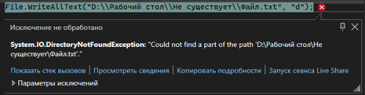
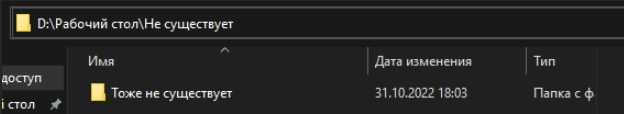
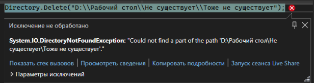
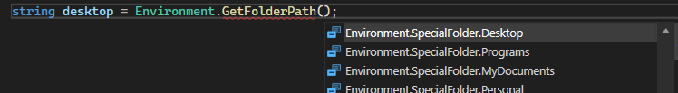
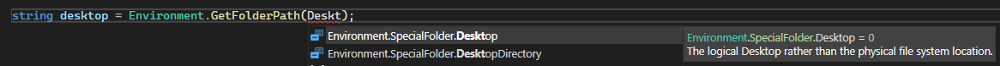
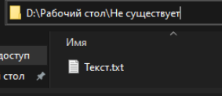
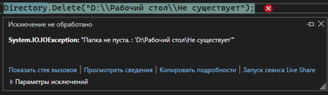
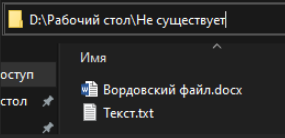
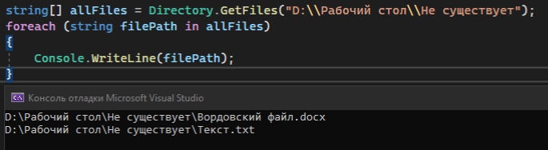

Мы уже научились работать с папками, однако, если мы в [чтении или записи файла](/csharp/files) впишем путь до папки (именно папки, не файла!), которой не существует, мы увидим следующую ошибку



Для того, чтобы она не появлялась, нам необходимо научится работать с папками

---

## Создание папок

Для начала научимся создавать папки. Я хочу использовать папки (Directory), а именно, создать папку. Я так и напишу – Directory.CreateDirectory(). Внутри я укажу полный путь до папки, которую я хочу создать

> **ВАЖНО! Я пишу СВОЙ путь до рабочего стола. У меня рабочий стол находится на диске Д. Чтобы вам протестировать отработку метода, выберите любую папку на своем компьютере и скопируйте полный путь от нее. А в конце, на коде, добавьте \\\\Не существует.**

```csharp
Directory.CreateDirectory("D:\\Рабочий стол\\He существует");
```

Этот метод позволит нам создать все вложенные папки, которых не существует. Например, я внутри папки хочу создать еще папку «Тоже не существует». Мне не нужно прописывать две разные строчки, я могу сразу все написать в одной

```csharp
Directory.CreateDirectory("D:\\Рабочий стол\\He существует\\Тоже не существует");
```



Если такая папка уже создана, код ничего не сделает

---

## Удаление папок

Кроме создания можно еще и удалять папки. Для этого я хочу использовать папку, а именно – удаление. Я напишу команду Directory.Delete("путь до папки");. Из этого пути удалится только последняя папка

```csharp
Directory.Delete("D:\\Рабочий стол\\He существует\\Тоже не существует");
```

Папки, которой нет, мы удалить не можем



Тогда нам нужно сделать проверку на то, существует ли такая папка или нет

---

## Использование системных папок

Также, на каждом компьютере есть несколько основных системных папок – рабочий стол, документы, изображения, музыка, загрузки и прочее. Однако на каждом компьютере путь до этой папки разный. Что же мне делать, если я хочу сохранить файл именно на рабочем столе, вне зависимости от того, на каком компьютере будет запущена моя программа?

Чтобы взять путь до любой системной папки, можно воспользоваться **Environment.GetFolderPath();**. Внутри круглых скобок мне необходимо написать папку, чей путь я хочу взять



Например, хочу взять путь до рабочего стола. В круглых скобках я так и напишу - Desktop. Visual Studio сама предложит мне, как нужно правильно написать обращение до этой папки

Так, в переменной будет храниться путь до моего рабочего стола. В моем случае, это D:\Рабочий стол



Где это можно использовать?

Да везде, это обеспечивает универсальность. Если брать в пример тот же [JSON](/csharp/json), можно сделать универсальное сохранение файлов на рабочий стол, вне зависимости от того, на чьем компьютере была запущена программа

```csharp
string desktop = Environment.GetFolderPath(Environment.SpecialFolder.Desktop);

string json = JsonConvert.SerializeObject(humans);
File.WriteAllText(desktop + "\\Пример.json", json);
```

---

## Дополнительные методы

Я должна сделать проверку на то, существует ли у меня такая папка или нет. Если папка существует, удалить ее. Получается, я хочу проверить, есть ли папка. Я хочу использовать папку, а именно, существует ли он. И, во втором предложении, у нас было слово «если». Видим если – ставим условие. Таким образом, если папка не существует, я ее удалю

```csharp
if (Directory.Exists("D:\\Рабочий стол\\Hе существует\\Тоже не существует"))
{
    Directory.Delete("D:\\Рабочий стол\\He существует\\Тоже не существует");
}
```

Возвращаясь к удалению, я не могу удалить папку, где находятся какие-то файлы.





Значит, мне нужно получить информацию, есть ли в папке какие-то файлы. Я могу получить полный список всех файлов, которые находятся у меня в папке. Сделать я это могу с помощью Directory.GetFiles("путь до папки");. Этот метод вернет мне массив пути всех файлов, который я могу перебрать, например, с помощью цикла foreach





Если я хочу удалить папку, то мне сначала нужно удалить все эти файлы внутри папки. Работу с файлами мы также будем реализовывать через «File.»

```csharp
string[] allFiles = Directory.GetFiles("D:\\Рабочий стол\\He существует");
foreach (string filePath in allFiles)
{
    File.Delete(filePath);
}
Directory.Delete("D:\\Рабочий стол\\He существует");
```

Однако, этот пример будет лучше работать не с удалением, а в том случае, когда я хочу работать с содержимым папки. Например, получить все файлы и вывести их, получить все папки и открыть их содержимое, и прочее. С удалением, на самом деле, все намного проще

```csharp
Directory.Delete("D:\\Рабочий стол\\He существует", true);
```

True в конце этого метода говорит о "рекурсионном удалении". Принцип действия таков:

1. Метод заходит в папку
2. Если в ней есть папка, зайти в нее
3. Повторить пункт 1,2 до тех пор, пока в папке не будет папок
4. Поочередно удалить каждый файл в папке
5. Если нет ни файлов ни папок, удалить эту папку
6. Подняться на папку выше
7. Повторить пункт 3-6 до тех пор, пока внутри первоначальной папки ничего не останется
8. Удалить первоначальную папку

> **БУДЬТЕ ОСТОРОЖНЫ: Если вы в шутку попробуете удалить System32 или любую другую важную папку для системы, надеясь, что она не удалится из-за защиты, или из-за процессов, которые задействуют систему - нет. Она удалится. Частично, конечно, некоторые файлы и папки и правда останутся, но так как некоторые из них не задействованы в определенный момент, половина системы начнет некорректно отрабатывать, а перезапуск компьютера приведет к синему экрану без возможности восстановления, и вам придется переустанавливать систему**

Отдаю дань уважения П50-8-22, которые убедили меня попробовать удалить System32 на паре, развеяв мою уверенность в безопасности системы, и П50-4-22, которые предоставили мне чистый образ Windows на следующей паре 💕

Таким же образом, используя «Directory.», можно сделать что угодно со своим файлом – копировать его, переместить, удалить, узнать, когда он был последний раз изменен, установить время когда он был создан, и т.п и т.п.
