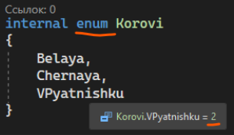
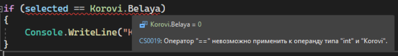
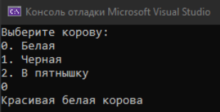
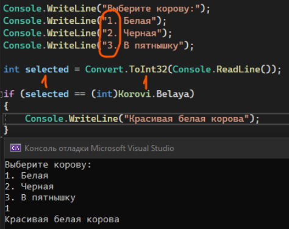
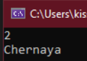
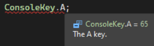

Зачастую, читая код, у нас всегда присутствуют какие-то рандомные числа, которые сложны для понимания другому человеку. Что за massive[4] и почему именно 4? Почему в условии if (position == 8) именно 8, почему не другое число? Почему в цикле for (int I = 0; I < 3; i++) мы перебираем именно до 3, а не больше и так далее. Такие числа называются магическими, потому что взялись они по воле магии и не ясно, что они означают

Чтобы у нас в коде не было магических чисел, есть специальные перечисляемые типы – enum. Выглядят они как отдельный класс с перечислением каких-то слов, которые уже сразу же пронумерованы, начиная с нуля. Когда мы создаем отдельный файл, слово class мы меняем на enum



```csharp
internal enum Korovi
{
    Belaya,
    Chernaya,
    VPyatnishku
}
```

Использовать такой enum очень просто. Я напишу следующий код по выбору коров

```csharp
Console.WriteLine("Выберите корову: ");
Console.WriteLine("0. Белая");
Console.WriteLine("1. Черная");
Console.WriteLine("2. В пятнышку");

int selected = Convert.ToInt32(Console.ReadLine());
```

Вместо того, чтобы писать условия типа if (selected == 0) с магическими числами, я могу этот 0 заменить на свой enum. Для этого мне нужно написать НазваниеEnum.НазваниеПеременной. Однако мы встретимся с вот такой проблемой – int нельзя преобразовать к enum Korovi. Однако мы точно знаем, что эти переменные у нас имеют порядковое число. Тогда как же нам взять это число?



Нам необходимо использовать [приведение](/csharp/transformation) – мы должны Korovi.Belaya привести к int, и тогда код поймет, что из этого enum нужно взять именно порядковый номер

```csharp
Console.WriteLine("Выберите корову: ");
Console.WriteLine("0. Белая");
Console.WriteLine("1. Черная");
Console.WriteLine("2. В пятнышку");

int selected = Convert.ToInt32(Console.ReadLine());

if (selected == (int)Korovi.Belaya)
{
    Console.WriteLine("Красивая белая корова");
}
```



Также мы можем задавать собственные порядковые значения для переменных внутри enum. Например, начинать расчет коров с нуля - это не очень удобно, мы все-таки хотим начать отсчет с единицы. Тогда, нам необходимо каждой переменной задать собственный номер, который мы хотим видеть

```csharp
internal enum Korovi
{
    Belaya = 1,
    Chernaya = 2,
    VPyatnishku = 3
}
```

И уже тогда, когда мы будем брать значение из этих enum, код возьмет то значение, которое мы задали



Если очень кратко, enum – очень простой словарь из string и int – текстовый ключ, числовое значение. И с ключом, и с значением, мы можем работать, НО только на чтение – мы не можем менять данные внутри enum, это как некие константы. Однако, раз мы можем их читать, мы можем сравнивать другие переменные с этим значением, или, например, вывести ключ или значение

То, что мы приводим к int – значение, то, что мы используем просто так – ключ.

```csharp
Console.WriteLine((int)Korovi.Chernaya);
Console.WriteLine(Korovi.Chernaya.ToString());
```



Где это можно использовать?

- Для избавления от магических чисел. Чтобы другой программист понимал, что за числовые константы у меня присутствуют в коде (особенно если их много), я могу изменить статические числа на enum. Самый явный пример enum с которым мы работали – [ConsoleKey](/csharp/readkey). Например возьму символ А. А это ключ, 65 – значение.

  

- Для создания статического словаря string, int, который не будет менять значения, который мы будем только читать. Его и создавать не надо, заполнять не надо, просто вызвал по названиюкласса.названиюпеременной и все
