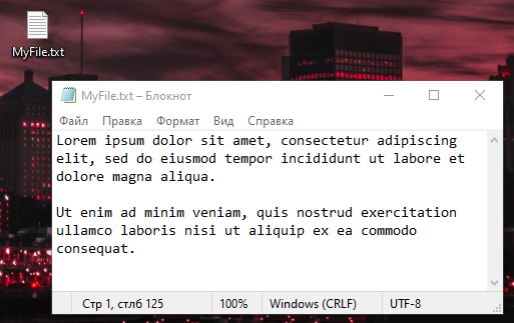
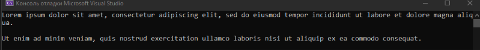
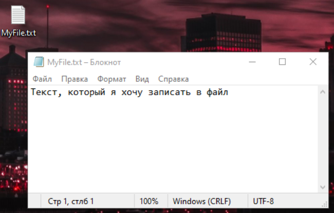
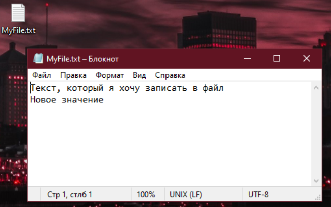
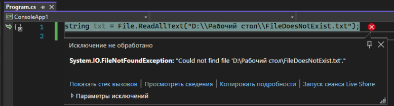

Сейчас все наши многочисленные программы работают до поры до времени – открыл программу, что-то сделал, закрыл, и ничего не сохранилось. Давайте мы научимся работать с текстовыми файлами, чтобы наша программа могла что-то после себя оставить.

Я создам на рабочем столе некий текстовый файл и наполню его любым текстом



Чтобы прочитать в коде мой файл, мне необходимо использовать библиотеку System.Io. Добавить я ее могу двумя способами:

- Прописать вручную вверху кода using System.Io;
- Писать свой код, а потом нажать alt+enter (или ПКМ, «Быстрые действия и рефакторинг», using System.Io) и импортировать библиотеку

Я воспользуюсь вторым пунктом

---

## Чтение файла

Итак, если я хочу работать с файлами, я так и напишу – File. Я хочу использовать File, а именно (пишу точку) – прочитать весь текст. Я так и напишу – File.ReadAllText(). Внутри необходимо указать путь до файла, я скопирую его из свойств файла

Получившуюся строку я поставлю как значение для переменной, так как метод ReadAllText() возвращает нам весь текст из файла

```csharp
string myText = File.ReadAllText("D:\\Рабочий стол\\MyFile.txt");
```

И теперь, я могу вывести в консоль значение этой переменной

```csharp
string myText = File.ReadAllText("D:\\Рабочий стол\\MyFile.txt");
Console.WriteLine(myText);
```



---

## Запись в файл

Также я могу захотеть что-то в свой файл записать. Например, текст из переменной txt. Опять же, я хочу использовать файл, а именно, запись всего текста. Я так и запишу – File.WriteAllText();

```csharp
string txt = "Текст, который я хочу записать в файл";

File.WriteAllText("D:\\Рабочий стол\\MyText.txt", txt);
```

Внутри этого метода я сначала укажу путь до файла, куда я хочу записать текст, а потом, через запятую, либо текст, который я хочу записать, либо переменную, где хранится текст, который я хочу записать.

Запускаем этот код, и помним, что до этого у меня в файле был Lores ipsum. Теперь, после выполнения программы, откроем этот файл, и увидим, что весь старый текст удалился, а поверх него поставился новый



В случае, если такого файла по пути не было, File.WriteAllText() создаст новый файл и запишет туда значение, которое мы хотели передать.

---

## Запись в конец файла

Но что если я не хочу перезаписывать предыдущие данные из своего файла, а хочу записать их в конец? Тогда мне нужно использовать добавление текста. Добавление текста всегда запишет текст в конец

Я хочу использовать файл, а именно, добавить весь текст. Сначала я укажу путь до файла, а затем текст, который я хочу добавить

```csharp
File.AppendAllText("D:\\Рабочий стол\\MyText.txt", "\nНовое значение");
```

Открыв свой файл, я увижу, что новый текст записался в самый конец.



---

## Дополнительные варианты работы с файлами

Если с записью все понятно – я захотела сделать файл и даже если его нет, он создаст новый, то что, если при чтении у меня не будет существовать файла, который я хочу прочитать? Мой код выдаст мне ошибку, а я такого не хочу



Значит я должна сделать проверку на то, существует ли у меня такой файл или нет. Для удобства, вынесу путь до моего файла в отдельную переменную path

Получается, я хочу проверить, есть ли файл. Я хочу использовать файл, а именно, существует ли он. И, в первом предложении, у нас было слово «если». Видим если – ставим условие. Таким образом, если файл существует, я читаю текст внутри него

```csharp
string path = "D:\\Рабочий стол\\FileDoesNotExist.txt";

if(File.Exists(path))
{
    string txt = File.ReadAllText(path);
}
```

В любом другом случае, иначе, я хочу его создать. Хочу использовать файл, а именно, создать его. Я пропишу дополнительный else для этого, и мой код теперь будет выглядеть следующим образом

```csharp
string path = "D:\\Рабочий стол\\FileDoesNotExist.txt";

if(File.Exists(path))
{
    string txt = File.ReadAllText(path);
}
else
{
    File.Create(path);
}
```

Таким же образом, используя «File.», можно сделать что угодно со своим файлом – копировать его, переместить, удалить, узнать, когда он был последний раз изменен, установить время когда он был создан, и т.п и т.п. Все необходимые методы можно найти по аналогии: Copy - скопировать, Move - переместить
