Мы всегда стремимся сделать наши [методы](/csharp/methods) максимально уникальными: сначала методы были просто как контейнер кода, потом мы научились [возвращать значения](/csharp/methods) из этих методов, потом мы научились в эти методы значения [передавать](/csharp/methods). Однако, что если я хочу передавать разные типы данных в свой метод? Мне нужно будет для каждого типа данных делать свой метод?

Последним этапом универсальности, который мы рассмотрим, будут generic-методы. Такие **обобщенные** методы позволяют передавать в метод нужный тип данных и работать с ним. Явный пример обобщения – [List\<тип данных\>](/csharp/collections) и [DeserializeObject\<тип данных\>](/csharp/json)

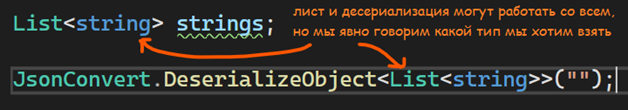

Давайте научимся сами создавать такие методы, которые будут в себя принимать нужный тип данных с помощью угловых скобок. Самый явный пример, зачем нужны обобщенные методы – свой метод по [сериализации и десериализации](/csharp/json). Повторять строчки для сериализации в XML или JSON слишком долго, хочется сделать свой метод, однако делать отдельный метод для каждого типа данных также слишком долго

---

## Пример использования обычных методов

В качестве примера для сериализации, создам свой маленький [класс](/csharp/classascontainer) Human

```csharp
internal class Human
{
    public string Name;
    public int Age;
    public string[] MyFavoriteColour;
}
```

Создадим отдельный [класс](/csharp/classascontainer) и реализуем там два статических метода – MySerialize и MyDeserialize

```csharp
internal class MyConverter
{
    public static void MySerialize()
    {

    }
    public static void MyDeserialize()
    {

    }
}
```

Рассмотрим сериализацию и десериализацию JSON. Напишу код в своем методе по сериализации и десериализации обычного листа с уже знакомым нам типом данных Human:

- Метод MySerialize будет принимать в себя лист, который мы хотим сериализовать
- Метод MyDeserialize будет возвращать лист, который мы сохранили в файл

```csharp
internal class MyConverter
{
    public static void MySerialize(List<Human> humans)
    {
        string json = JsonConvert.SerializeObject(humans);
        File.WriteAllText("D:\\Рабочий стол\\Пример.json", json);
    }

    public static List<Human> MyDeserialize()
    {
        string json = File.ReadAllText("D:\\Рабочий стол\\Пример.json");
        List<Human> humans = JsonConvert.DeserializeObject<List<Human>>(json);
        return humans;
    }
}
```

Здесь все аналогично сериализации и десериализации [JSON](/csharp/json). Однако, что, если я хочу работать не только с List\<Human\>, но еще и с List\<Car\>, List\<string\>, int[] и прочими коллекциями? Я не буду создавать каждый отдельный метод для каждого случая, это надо много писать, я так не хочу. Я хочу сделать место, куда я буду передавать тип данных, с которым я работаю. И это место я назову **T**, от слова Type - тип

---

## Использование T в методах

Вот, например, начнем с десериализации. На примере с [JsonConvert.DeserializeObject\<\>()](/csharp/json), мы видим, что тип данных передается в угловых скобках после названия. Если я хочу создать что-то подобное, тогда мне необходимо после названия своего метода написать такие же угловые скобки и поместить в них T.

T - хранилище для типа данных. При помощи него мы скажем методу, с каким типом данных метод будет работать. Эту T можно в будущем использовать как тип данных для переменных, как тип данных для десериализации, как возвращаемый тип данных, и в целом как **тип данных**

Если мы наведемся на букву T, мы увидим слово «Входной». Это значит, что тип данных внутри Т будет определяться на момент вызова этого метода

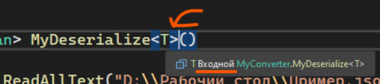

Таким же образом работает [JsonConvert.DeserializeObject\<\>()](/csharp/json). Когда мы вызываем десериализацию, мы передаем в угловые скобки какой-то тип данных. Этот тип данных сохраняется в T, и потом используется внутри всего метода. Вот пример того, как выглядит метод десериализации в NewtonsoftJson под капотом

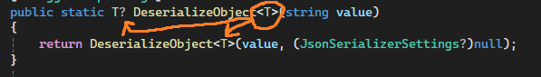

Так как мы хотим внедрить универсальность, нам нужно использовать Т вместо определенного типа данных. Сейчас, наш определенный тип данных - List\<Human\>. Заменим его везде на Т, то есть, на тип данных, который нам передают:

- Вернуть мы хотим уже не List\<Human\>, а Т
- Десериализовать мы хотим не List\<Human\>, а Т. Сохранять получившееся значение мы также будем в переменную типа данных T

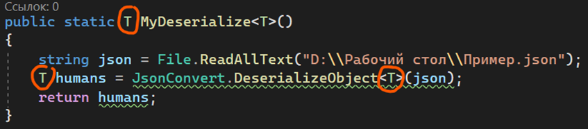

```csharp
public static T MyDeserialize<T>()
{
    string json = File.ReadAllText("D:\\Рабочий стол\\Пример.json");
    T humans = JsonConvert.DeserializeObject<T>(json);
    return humans;
}
```

Таким образом, наш метод сможет работать с любым принимаемым типом данных. При вызове - говорим с каким типом данных мы работаем, и этот тип данных сохраняется в Т

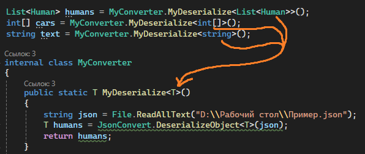

---

Давайте подобным образом переделаем метод сериализации. Здесь мне необходимо передавать тип данных объекта как параметр, т.е. внутри у меня уже будет не List\<Human\> humans, а T humans. Однако откуда взять эту T?

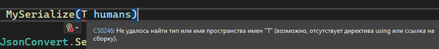

Все просто - **нужно поставить \<T\> после имени. Также, как и для десериализации**

Весь прикол Generic-методов в том, что передача типа данных всегда идет через \<T\>. Что бы мы ни делали - создавали универсальную переменную, возвращали универсальный тип данных, прочее прочее, \<T\> всегда должно стоять после названия метода. Так определяются универсальные - generic - методы.

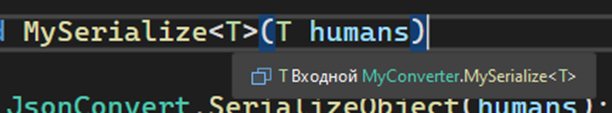

```csharp
public static void MySerialize<T>(T humans)
{
    string json = JsonConvert.SerializeObject(humans);
    File.WriteAllText("D:\\Рабочий стол\\Пример.json", json);
}
```

Использование метода будет таким же, как и MyDeserialize. Однако заметьте, что тип данных в угловых скобках тускло подсвечивается.

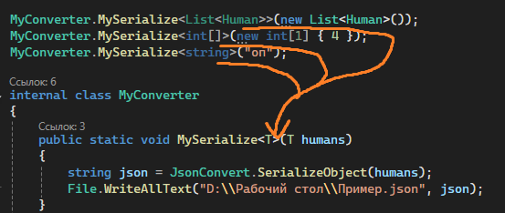

Visual Studio говорит нам, что мы в принципе можем избавиться от написания этого типа данных в угловых скобках. Почему так?

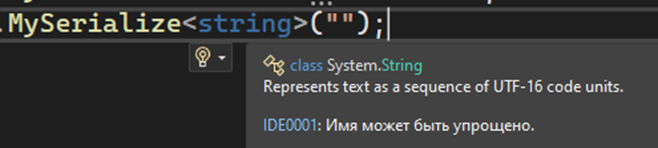

Когда мы передаем внутрь параметра типа данных T какой-то объект, он, подобно var, сам определяет, с каким типом данных мы будем работать в будущем. И если мы передаем туда string, значит и значение в угловых скобках будет string. Если передаем List\<Human\>, значит и в угловых скобках будет List\<Human\>. А если код сам подставил значение для T в момент передачи значения, тогда мы можем не говорить повторно, что мы хотим от него получить именно этот тип данных. Значит при вызове этого метода, мы можем удалить угловые скобки

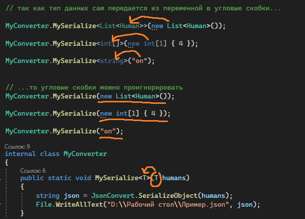

По итогу, мы имеем 2 generic-метода для сериализации и десериализации, победа!

---

## Передача дополнительных параметров в Generic-методы

Чтобы добить универсальности этого метода, как идея, вместо пути, написанного ссылкой, мы можем сохранять все в какую-то системную папку, которая будет автоматически браться с компьютера. Воспользуемся [Environment.GetFolderPath()](/csharp/directory) для этого, адаптируя код так, чтобы он всегда сохранял файл на рабочий стол

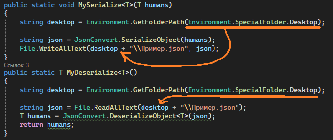

Но я же хочу, чтобы у меня разные данные шли в разные файлы, так? Тогда мне необходимо в этот метод передавать название файла, в который я хочу сохранить свои данные. Передавать я буду с помощью параметра string filename.

Параметры в generic-методы передаются абсолютно также, как и [передача в обычные методы](/csharp/methods)

Адаптируем методы, добавив второй параметр

```csharp
internal class MyConverter
{
    public static void MySerialize<T>(T humans, string fileName)
    {
        string desktop = Environment.GetFolderPath(Environment.SpecialFolder.Desktop);

        string json = JsonConvert.SerializeObject(humans);
        File.WriteAllText(desktop + fileName, json);
    }
    public static T MyDeserialize<T>(string fileName)
    {
        string desktop = Environment.GetFolderPath(Environment.SpecialFolder.Desktop);

        string json = File.ReadAllText(desktop + fileName);
        T humans = JsonConvert.DeserializeObject<T>(json);
        return humans;
    }
}
```

Использование методов тоже немного изменится - теперь нужно передавать параметр с именем

```csharp
List<Human> humans = MyConverter.MyDeserialize<List<Human>>("Human.json");
int[] cars = MyConverter.MyDeserialize<int[]>("ints.json");
string text = MyConverter.MyDeserialize<string>("ints.json");

MyConverter.MySerialize(new List<Human>(), "Human.json");
MyConverter.MySerialize(new int[1] { 4 }, "ints.json");
MyConverter.MySerialize("оп", "string.json");
```
