## Условия — if

Алгоритм программы должен удовлетворить всех. Всегда. Возьмем кофемашину: один хочет просто кофе, другой американо, третий латте, четвертому нужно 2 ложки сахара, пятому – пять. Для каждого из них программа должна работать по-своему. И здесь нам понадобятся условия.

Как бы мы сформулировали мысль, если бы мы были бариста?

Ко мне пришел человек. **Если** он хочет просто кофе, **то** сделать ему эспрессо. **Если** он хочет латте, **то** сделать эспрессо, взбить молоко и слить их вместе. Если \_\_\_, то \_\_\_. Маленькая программа для кофемашины выглядела бы так

```csharp
Console.WriteLine("Что вы хотите?");
string answer = Console.ReadLine();

if (answer == "Кофе")
{
    //делаем кофе
    Console.WriteLine("Вот ваш кофе!");
}
if (answer == "Латте")
{
    //делаем латте
    Console.WriteLine("Вот латте!");
}
```

Чтобы понять, как, что и почему здесь написано, вернемся к описанию работы бариста чуть выше и разберем каждое слово по пунктам

1. Видим в наших рассуждениях слово «Если», пишем if.
2. Все что после «Если» и до запятой (или «то») мы оборачиваем в круглые скобки. Это наше условие.
3. Все что идет после запятой или «то» — действия, которые необходимо выполнить. Эти действия хранятся в контейнере в виде фигурных скобок.

Важно!!! После условия мы не пишем точку с запятой, вместо этого идет пара фигурных скобок – почему так?

Еще одно маленькое определение:

- Точка с запятой – точка в предложении. Когда мы ее ставим, мысль закончена.
- Фигурные скобки – запятая в предложении. Ставя их, мы говорим, что что-то будет дальше

> **Как в предложении я не могу написать «Привет.,», так и в программировании я не могу написать `if ; {}`**

Для составления условия есть следующие операторы:

- `==` - Равно
- `!=` - Не равно
- `>` - Больше
- `<` - Меньше
- `>=` Больше или равно
- `<=` Меньше или равно

Единственный случай, когда в условие можно не ставить оператор, это когда мы сравниваем true или false. Следующие два условия будут работать одинаково

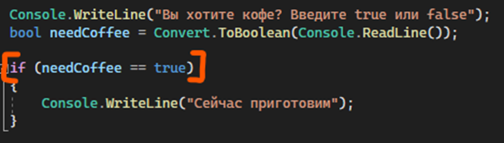

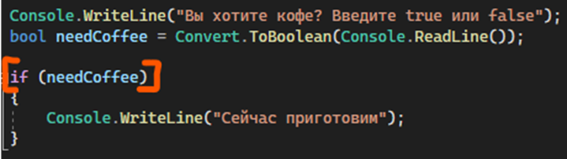

Код для проверки:

```csharp
Console.WriteLine("Вы хотите кофе? Введите true или false");
bool needCoffee = Convert.ToBoolean(Console.ReadLine());

if (needCoffee)
{
    Console.WriteLine("Сейчас приготовим");
}
```

Так работает потому что все сравнения существуют для того, чтобы достать true или false. if (5==5) – верное утверждение, значит 5==5 равно true. If (6==5) – неверное, значит равно false. Два этих условия можно представить, как if (true) и if (false). В первом случае условие выполняется, во втором – нет.

Внутри буленовских переменных уже хранится true или false, а значит, нам не нужно повторно делать условие true == true чтобы получить true. If (needCoffee) уже можно представить как if (true) или if (false), в зависимости от того, что хранится внутри переменной, поэтому в этом случае равно не обязательно

Единственное – чтобы сделать «не равно», синтаксис будет выглядеть так. Обе эти записи идентичные

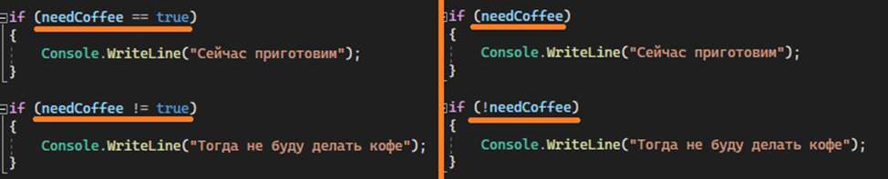

Код для проверки:

```csharp
if (needCoffee)
{
    Console.WriteLine("Сейчас приготовим");
}
if (!needCoffee)
{
    Console.WriteLine("Тогда не буду делать кофе");
}
```

Кроме обычного if с одним условием есть еще различные конструкции:

---

## If с несколькими условиями

Например, я хочу сделать условие «если мне сказали «добавьте молоко» или «сделайте кофе с молоком», я добавлю в кофе молоко». Я могу реализовать это через два условия

```csharp
Console.WriteLine("Что еще добавить в кофе?");
string answer = Console.ReadLine();

if (answer == "добавьте молоко")
{
    Console.WriteLine("Вот кофе с молоком!");
}

if (answer == "сделайте кофе с молоком")
{
    Console.WriteLine("Вот кофе с молоком!");
}
```

Но контейнер (тело двух этих ифов) будут одинаковыми. А мы ленивые, мы не хотим дважды писать одно и то же. Поэтому мы можем обьединить эти два ифа с помощью логической операции — И (на коде - &&) или ИЛИ (на коде - ||). Здесь мы хотим, чтобы выполнилось или то, или то, потому что не может быть такого момента, когда человек скажет и то и то одновременно, поэтому используем ИЛИ. Если мы хотим чтобы выполнялись одновременно два условия — пишем И.

```csharp
Console.WriteLine("Что еще добавить в кофе?");
string answer = Console.ReadLine();

if (answer == "добавьте молоко" || answer == "сделайте кофе с молоком")
{
    Console.WriteLine("Вот кофе с молоком!");
}
```

Важный момент: мы не можем написать **answer == "добавьте молоко" || "сделайте кофе с молоком"**. Каждое условие, которое находится слева или справа || или &&, должно иметь возможность быть вынесено в отдельный if. Если мы будем выносить правое условие в отдельный if, получится вот так

```csharp
if ("сделайте кофе с молоком")
{
    Console.WriteLine("Вот кофе с молоком!");
}
```

И становится неясно: что именно кофе с молоком? Если сделайте? Это как вообще? Не ясно, что чему равно, поэтому как по одиночке такое условие не может существовать, так и внутри другого if

Для наглядности, вот два примера, когда нужно использовать И или ИЛИ в условиях

**Есть условие А и условие B**

**Я хочу, чтобы выполнилось И то, И то - &&**

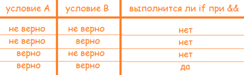

**Я хочу, чтобы выполнилось ИЛИ то, ИЛИ то – ||**

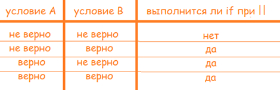

---

## If…else

Если я хочу сделать универсальный ответ для всех вариантов, которые мне не подходят, в C# есть **«иначе»**, переводя на английский - **else**

Возьмем условие: «Если человек попросил кофе, дать ему кофе. Иначе — сказать, что ничего другого у нас нет»

Уже в предложении мы видим, что у иначе нет никакого условия, так как это всё, что будет в любом другом случае — человек ничего не сказал, попросил воды, молока, или огромную спортивную машину. Поэтому это иначе — else — мы пишем без круглых скобок с условием

```csharp
Console.WriteLine("Что вы хотите?");
string answer = Console.ReadLine();

if (answer == "Кофе")
{
    //делаем кофе
    Console.WriteLine("Вот ваш кофе!");
}
else
{
    Console.WriteLine("Ничего другого у нас нет");
}
```

Только в случае «Кофе» у нас выводится ответ «Вот ваш кофе!» Во всех остальных – сообщение «Ничего другого у нас нет»

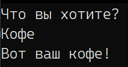

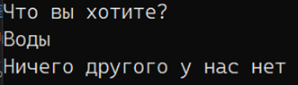

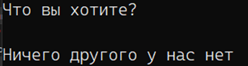

Но что если мне ооооочень нужно написать условие для какого-то из этих событий в «иначе»? Например, если меня попросили сделать кофе, то я дам кофе, но если кофе не просили, а попросили эспрессо, то я дам ему эспрессо, иначе – ничего нет. Это тоже можно реализовать — с помощью else if.

---

## If…else if

Else if объединяет в себе конструкцию else и if. Else if может быть сколько угодно, главное, чтобы они шли после первого if и до последнего else (else вообще необязателен в данном случае)

```csharp
Console.WriteLine("Что вы хотите?");
string answer = Console.ReadLine();

if (answer == "Кофе")
{
    //делаем кофе
    Console.WriteLine("Вот ваш кофе!");
}
else if (answer == "Эспрессo")
{
    Console.WriteLine("Вот ваш эспрессo");
}
else
{
    Console.WriteLine("Ничего другого у нас нет");
}
```

Else if начнет работать **только** если предыдущее условие было неверным. Когда или зачем его использовать, если можно просто написать много if? Рассмотрим на двух примерах

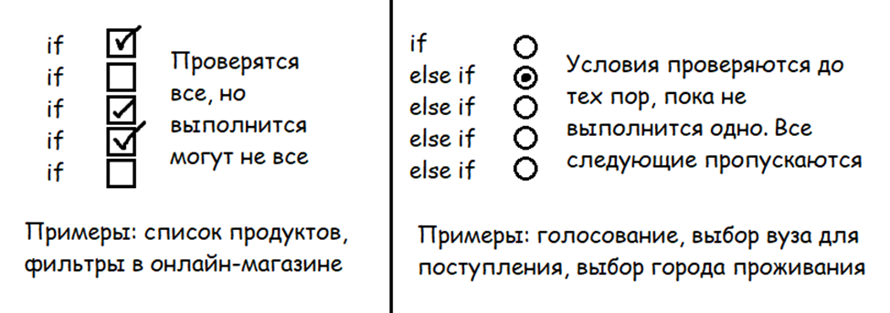

Конструкция if-if-if работают как множественный выбор – каждый if разрозненный, нужно проверить каждый выбор по отдельности: в списке продуктов я могу купить яица, хлеб и молоко, но не купить помидоры. Проверять я буду все по списку, от покупки молока не зависит покупка помидоров

Конструкция if - else if - else if работает как одинарный выбор – каждые if – else if един, каждое последующее условие выполняется только если предыдущее не было выбрано: если из 100 вузов я выбрала пятый, мне не нужно еще 95 раз проверять, что другие вузы не были выбраны

Эту же конструкцию можно представить в формате switch-case

---

## Switch-case

Если наша конструкция if – else if – else if проверяет только значение внутри переменной, без каких-либо дополнительных условий, проверок на больше\меньше и прочее, то ее можно записать в другом формате – switch-case

Конструкция работает по следующему принципу:

- Берется какая-то переменная, значение которой может **меняться**. Она пишется внутри **switch**
- Для разных **случаев** значения переменных пишется отдельные case. Важно! Все case пишутся без фигурных скобок, так что чтобы код понял, что один из case закончился, в конце пишется break
- Вместо else в этой конструкции используется default – вариант по умолчанию. Он также должен закончится break

В сыром формате switch-case выглядит вот так:

```csharp
switch (переменная)
{
    case "Значение1":
        код
        break;
    case "Значение2":
        код
        break;
    ...
    case "ЗначениеN":
        код
        break;
    default:
        код
        break;
}
```

Наш вариант с латте мы также можем переделать под Switch-case:

- В качестве переменной в switch пойдет answer
- Вместо условий answer == "Кофе" идет case "Кофе":
- Весь код пишется не между фигурными скобками, а между case и break
- Вместо else идет default без значения – сразу код, в конце которого будет break

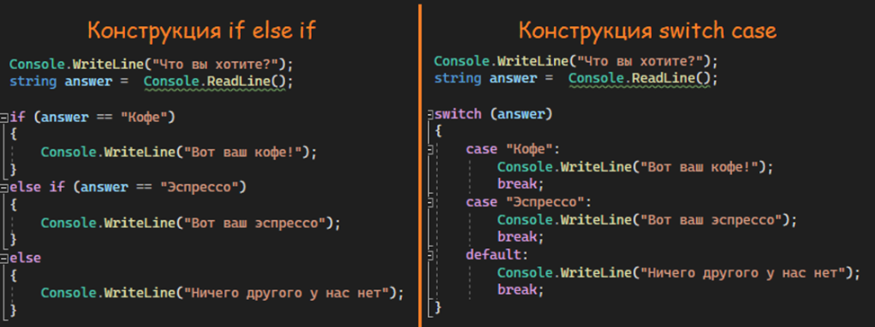

Использовать switch-case приятно в том случае, когда у меня есть несколько вариантов значения переменной, но действие я хочу выполнить одно и тоже. Проще говоря – если ответ равен «Кофе» или «кофе» или «кофейку» или блаблабла, я хочу вывести одно и тоже – «Вот ваш кофе!»

Если мы используем if, мы бы воспользовались оператором ИЛИ (||) и множественными условиями. Код выглядел бы вот так

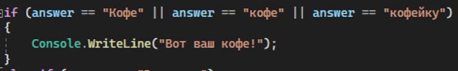

В случае с Switch-case конструкция будет проще – над необходимым действием нужно поставить несколько case

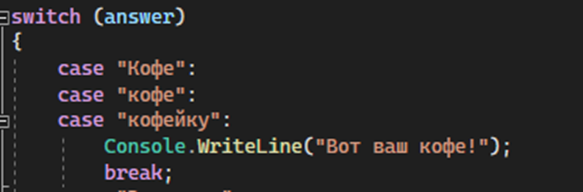

Полностью измененный код выглядит следующим образом

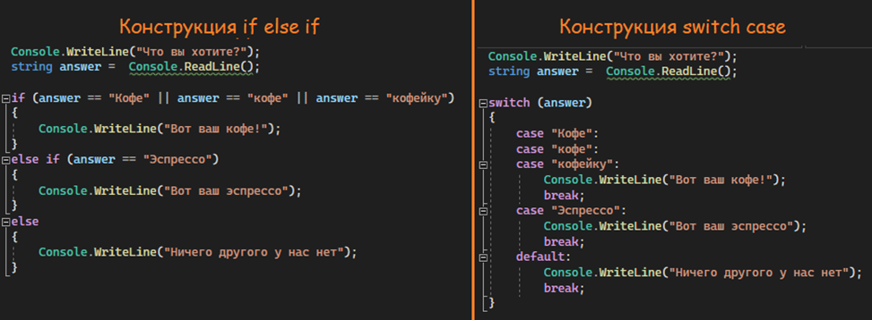

Код для проверки:

```csharp
Console.WriteLine("Что вы хотите?");
string answer = Console.ReadLine();

switch (answer)
{
    case "Кофе":
    case "кофе":
    case "кофейку":
        Console.WriteLine("Вот ваш кофе!");
        break;
    case "Эспресco":
        Console.WriteLine("Вот ваш эспрессo");
        break;
    default:
        Console.WriteLine("Ничего другого у нас нет");
        break;
}
```

Если углубляться внутрь, конструкт switch-case работает немного быстрее, нежели if-else if. Однако нужно помнить, что в ифах вы можете использовать любые условия, а в switch-case – только варьировать код в зависимости от значения переменной, так что не всегда стоит использовать то, что быстрее.
