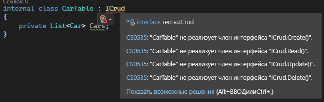
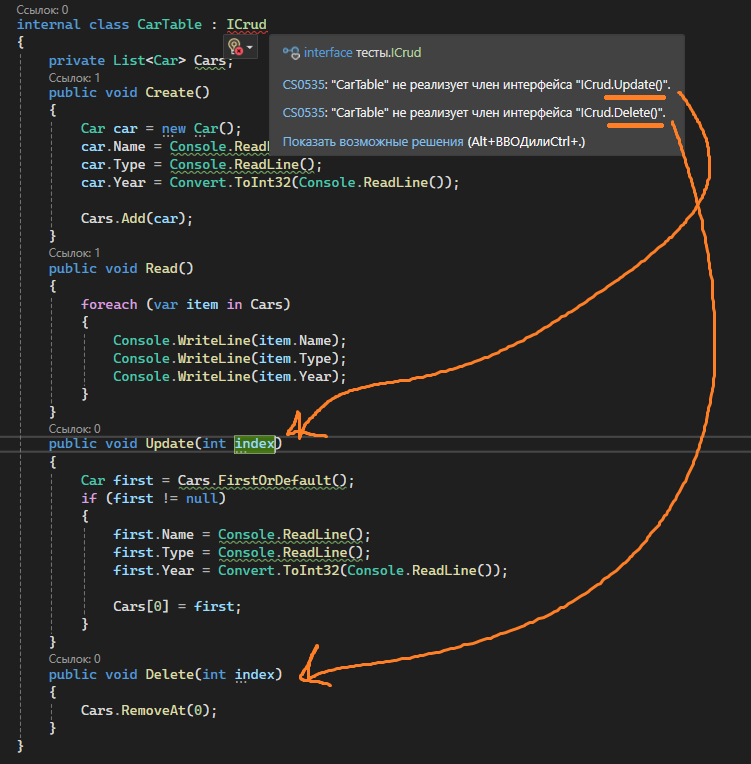
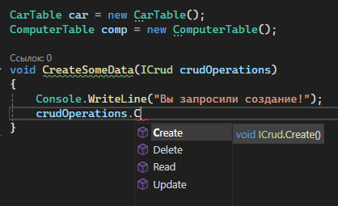
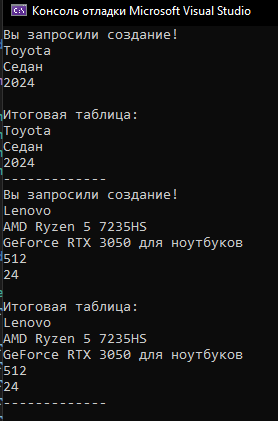

Когда мы открываем класс с кодом и хотим понять, какие методы внутри у нас есть, если внутри методов будет очень много кода, среди него будет сложно найти сами методы. Было бы неплохо, если бы у нас было какое-то оглавление с нашими методами, как в книгах – название глав на первой страничке. Мы можем такое реализовать

Если в книге обязательный список глав называется оглавление, то обязательный список методов называется интерфейс. Интерфейс – новый класс, где вместо слова class будет написано interface. Названия интерфейсов называются с буквы I.

Зачем это надо? При помощи интерфейса мы сможем вызывать одни и те же методы, но их реализация будет отличаться в зависимости от того, какой класс мы передали.

Примеры:

- В реальной жизни - на производствах всегда что-то создают. Но на заводе машин создают машины, на заводе компьютерах создают компьютеры, а на заводе мороженого делаю мороженое. Процесс их создания разный, но при проверке завода проверяют одно и то же - создание
- В реальной жизни - я хочу узнать, как работают интерфейсы в разных языках программирования - в C#, Java и Go. Я прихожу в книжный и нахожу 3 книги по 3 разным языкам программирования. Но я не читаю всю книгу чтобы найти информацию об интерфейсах, я иду в оглавление, ищу слово "Интерфейсы", а потом уже читаю про них. Наполнение книги в трех разных случаях будет разным, но в оглавлении всегда есть слово "Интерфейсы"
- В коде - я хочу сделать приложение, которое будет импортировать данные в БД. Хочу, чтобы у меня импортировались 2 формата файла - xml и json, и импортировалось по перетаскиванию. Приложению должно быть все равно что он импортирует, он просто должен импортировать. Но логика для xml и json разная. Тогда, я могу воспользоваться интерфейсом "IImport" с одним методом Import, а потом сделать два класса - XmlImport и JsonImport, наследуемых от импорта. Логика в этих классах будет разная, но у них будет единый метод - Import, через которое приложение сможет обращаться к импорту, не задумываясь о том, что за файл он импортирует

---

На коде рассмотрим следующий пример: у меня есть база данных из двух табличек. Для всех табличек должны быть реализованы методы по добавлению, изменению, удалению и чтению данных их них. Значит во всех двух классах у меня должны быть методы Create, Read, Update и Delete (далее – **CRUD операции**). Я могу создать какой-то интерфейс с оглавлением этих операций, а затем наследовать этот класс в два класса для табличек. Таким образом я скажу, что в этих классах обязательно должна быть логика CRUD операций

---

## Реализация

Немного подготовимся к реализации нашего примера. Создам два [класса](/csharp/classasmodel) - Car.cs и Computer.cs - это будет две мои аля-таблицы. Базы данных то у нас нет, поэтому вместо таблицы в БД будет класс как тип данных

Файл Car.cs

```csharp
internal class Car
{
    public string Name;
    public string Type;
    public int Year;
}
```

Файл Computer.cs

```csharp
internal class Computer
{
    public string Manufacturer;
    public string Processor;
    public string VideoCard;
    public int PhysicalMemorySize;
    public int OperateMemorySize;
}
```

Вернемся к интерфейсам. Я создам интерфейс с CRUD операциями. Для этого, на равне с Program.cs создам отдельный файл ICrud.cs. Заметьте, что вместо слова class стоит interface

```csharp
internal interface ICrud
{
    void Create();
    void Read();
    void Update();
    void Delete();
}
```

Заметьте, что тут мы логику для метода не реализуем. Мы пишем только название и возвращаемый тип данных, а остальные модификаторы (public, static) мы будем писать уже когда будем [наследовать](/csharp/nasled) этот интерфейс и делать его реализацию.

Теперь этот интерфейс можно наследовать. Создам [класс](/csharp/classascontainer), который будет содержать в себе все CRUD операции для таблицы. В виде таблицы у меня будет [лист](/csharp/collections) с машинами

```csharp
internal class CarTable
{
    private List<Car> Cars = new List<Car>();
}
```

Я хочу сказать, что в этой таблице обязательно должны быть CRUD – операции. Все перечисленные CRUD операции у меня хранятся в моем интерфейсе. Тогда мне его надо наследовать

Однако если я его буду просто наследовать, тогда у меня появятся ошибки, что у меня нет реализованной логики для перечисленных внутри [методов](/csharp/methods)



Для того, чтобы их создать, их нужно либо написать вручную, либо нажать alt + enter (или ПКМ – Быстрые действия и рефакторинг) и выбрать пункт «Реализовать интерфейс». Тогда все эти методы у меня появятся

Их код внутри я очищу

```csharp
internal class CarTable : ICrud
{
    private List<Car> Cars = new List<Car>();

    public void Create()
    {

    }

    public void Delete()
    {

    }

    public void Read()
    {

    }

    public void Update()
    {

    }
}
```

Все 4 метода должны обязательно присутствовать в этом классе, иначе интерфейс будет ругаться, что какая-то логика для метода не реализована. Т.е. у нас не может не быть одного из этих методов. Зато может быть больше! Единственное, что важно - все методы из интерфейса должны быть реализованы в классе.

После их создания, я могу реализовать их логику для одного частного случая – для машин.

```csharp
internal class CarTable : ICrud
{
    private List<Car> Cars = new List<Car>();
    public void Create()
    {
        Car car = new Car();
        car.Name = Console.ReadLine();
        car.Type = Console.ReadLine();
        car.Year = Convert.ToInt32(Console.ReadLine());

        Cars.Add(car);
    }
    public void Read()
    {
        foreach (var item in Cars)
        {
            Console.WriteLine(item.Name);
            Console.WriteLine(item.Type);
            Console.WriteLine(item.Year);
        }
    }
    public void Update()
    {
        Car first = Cars.FirstOrDefault();
        if (first != null)
        {
            first.Name = Console.ReadLine();
            first.Type = Console.ReadLine();
            first.Year = Convert.ToInt32(Console.ReadLine());

            Cars[0] = first;
        }
    }
    public void Delete()
    {
        Cars.RemoveAt(0);
    }
}
```

Но сейчас удаление и обновление - заглушки. Мы всегда удаляем и изменяем первый элемент. А я хочу менять его по индексу, который передаст мне пользователь. Добавлю такие [параметры](/csharp/methods) в методы Update и Delete

Но проблема - появляется ошибка, что такие методы не подходят под реализацию интерфейса



Так происходит потому, что методы визуально отличаются от тех, что находятся в ICrud. Чтобы все корректно работало, нам нужно добавить такие же параметры и в интерфейсы

```csharp
internal interface ICrud
{
    void Create();
    void Read();
    void Update(int index); // Добавили параметр
    void Delete(int index); // Добавили параметр
}
```

Тогда, в CarTable все ошибки пропадут, а мы сможем использовать эти индексы уже на коде. Видоизменю два метода - Update и Delete - так, чтобы они изменяли и удаляли не первый обьект, а тот, что попросили

```csharp
internal class CarTable : ICrud
{
    private List<Car> Cars = new List<Car>();
    public void Create()
    {
        Car car = new Car();
        car.Name = Console.ReadLine();
        car.Type = Console.ReadLine();
        car.Year = Convert.ToInt32(Console.ReadLine());

        Cars.Add(car);
    }
    public void Read()
    {
        foreach (var item in Cars)
        {
            Console.WriteLine(item.Name);
            Console.WriteLine(item.Type);
            Console.WriteLine(item.Year);
        }
    }
    public void Update(int index)
    {
        Car first = Cars[index];
        if (first != null)
        {
            first.Name = Console.ReadLine();
            first.Type = Console.ReadLine();
            first.Year = Convert.ToInt32(Console.ReadLine());

            Cars[index] = first;
        }
    }
    public void Delete()
    {
        Cars.RemoveAt(index);
    }
}
```

Таким образом у нас по одному интерфейсу (оглавлению) реализована логика для одной таблицы. Таким же образом, по тому же интерфейсу, можно реализовать логику для других таблиц, например, уже не для машины, а для компьютеров (лист с компьютерами, к которым можно применить CRUD операции. Внутри этого класса тоже будет [наследоваться](/csharp/nasled) интерфейс ICrud, однако логика самого класса уже будет своя)

```csharp
internal class ComputerTable : ICrud
{
    public List<Computer> Computers = new List<Computer>();

    public void Create()
    {
        Computer comp = new Computer();
        comp.Manufacturer = Console.ReadLine();
        comp.Processor = Console.ReadLine();
        comp.VideoCard = Console.ReadLine();
        comp.PhysicalMemorySize = Convert.ToInt32(Console.ReadLine());
        comp.OperateMemorySize = Convert.ToInt32(Console.ReadLine());

        Computers.Add(comp);
    }

    public void Read()
    {
        foreach (var item in Computers)
        {
            Console.WriteLine(item.Manufacturer);
            Console.WriteLine(item.Processor);
            Console.WriteLine(item.VideoCard);
            Console.WriteLine(item.PhysicalMemorySize);
            Console.WriteLine(item.OperateMemorySize);
        }
    }

    public void Update(int index)
    {
        Computer first = Computers[index];
        if (first != null)
        {
            first.Manufacturer = Console.ReadLine();
            first.Processor = Console.ReadLine();
            first.VideoCard = Console.ReadLine();
            first.PhysicalMemorySize = Convert.ToInt32(Console.ReadLine());
            first.OperateMemorySize = Convert.ToInt32(Console.ReadLine());
            Computers[index] = first;
        }
    }

    public void Delete(int index)
    {
        Computers.RemoveAt(index);
    }
}
```

Интерфейс никак не влияет на саму логику класса, он просто обязывает реализовать некоторое количество методов внутри этого класса. Методов может быть больше, но никак не может быть меньше

Говоря определениями, **интерфейс - контракт о поведении**. Множество классов, даже не связанных отношением наследования, могут объявить, что они обязуются соблюдать этот контракт (**имплементация** интерфейса).

---

## Применение

Использовать его можно следующим способом. Перейдем обратно в Program.cs и создадим метод, который в качестве параметра будет принимать ICrud. Там же создадим 2 [экземпляра класса](/csharp/classasmodel) - ComputerTable comp и CarTable car

Раз мы передали ICrud, то и вызвать мы можем любой метод из этого интерфейса. Скажем, если это создание, то мы можем вызвать метод Create. Можем даже комбинировать методы (например, изменение сделать через Delete и Create (что костыль, не надо так))



ВАЖНО - методы в ICrud не имеют реализации. Реализации будут подтягиваться из классов, которые мы туда передадим. Передадим CarType - будет Create CarType-а. Передадим ComputerType - будет Create ComputerType-а. Рандомный класс с методом Create мы передать не сможем, классы понимают, что связанны из-за [наследования](/csharp/nasled) и такого понятия, как upcast. Если в рандомный класс не будет имплементирован ICrud, то и вставить в метод и вызвать Create мы не сможем

Таким образом, вот такой код сначала вызовет создание и чтение для машины, а потом - для компьютера

```csharp
void CreateSomeData(ICrud crudOperations)
{
    Console.WriteLine("Вы запросили создание!");
    crudOperations.Create();
    Console.WriteLine();
    Console.WriteLine("Итоговая таблица: ");
    crudOperations.Read();
    Console.WriteLine("-------------");
}

CarTable car = new CarTable();
ComputerTable comp = new ComputerTable();

CreateSomeData(car); // сначала запускаем добавление\чтение для машин
CreateSomeData(comp); // потом запускаем для компьютера
```


