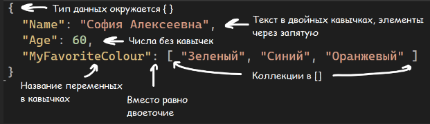
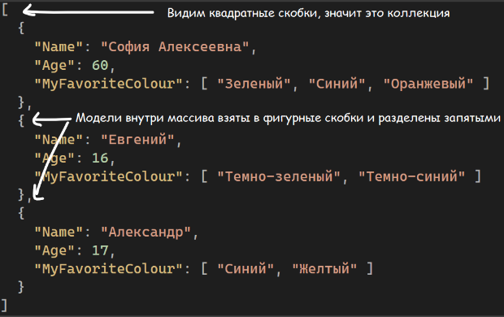
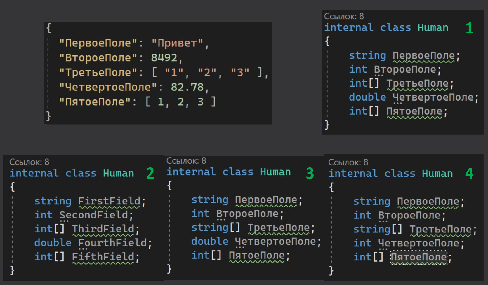
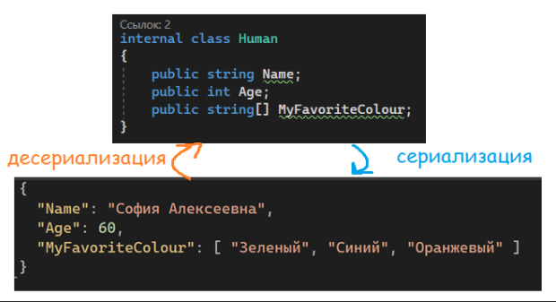
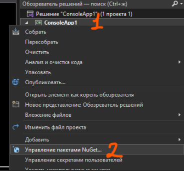
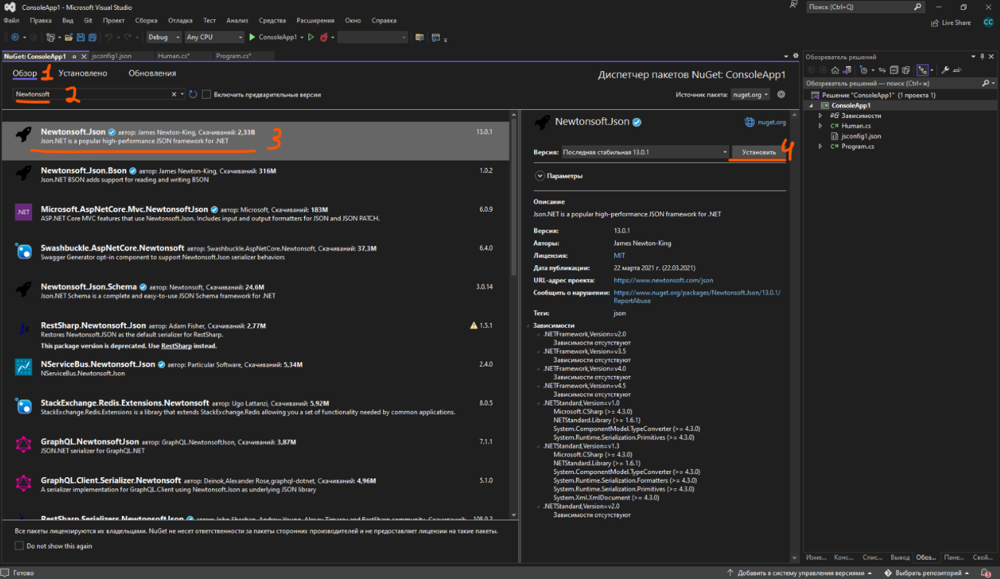
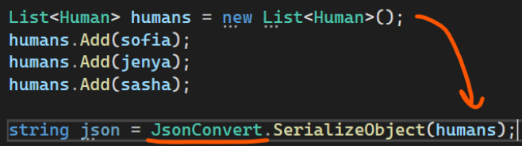
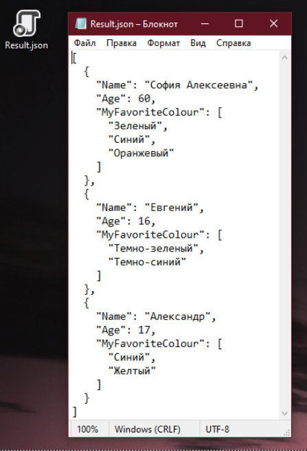
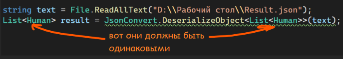
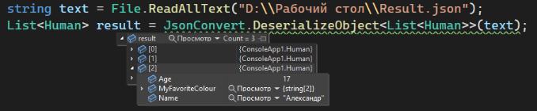

## Формат JSON

Продолжаем тему [работы с файлами](/csharp/files). Если текстовые файлы могут иметь разную структуру файлов, которую сложно будет обработать компьютером, то для простого обмена данными как между компьютерами, так и между людьми, существуют специальные форматы обмена данными. Пусть, первый тип данных, с которым мы будем работать, будет JSON. Давайте сначала разберемся, как он строится

Скажем, я в коде создала [свой тип данных](/csharp/classasmodel), некую модель, которая называется Human. Она состоит из имени человека, возраста и коллекции любимых цветов этого человека

```csharp
internal class Human
{
    public string Name;
    public int Age;
    public string[] MyFavoriteColour;
}
```

Если я захочу создать новый экземпляр своей модели, некую переменную, где я буду хранить информацию, я сделаю это, например, следующим образом: создам массив с любимыми цветами, создам переменную своего типа данных, а затем заполню ее значениями

```csharp
string[] favoriteColour = new string[] { "Зеленый", "Синий", "Оранжевый" };

Human sofia = new Human();
sofia.Name = "София Алексеевна";
sofia.Age = 60;
sofia.MyFavoriteColour = favoriteColour;
```

Точно такую же информацию я могу представить в виде JSON файла. В чистом виде он выглядит вот так

```json
{
    "Name": "София Алексеевна",
    "Age": 60,
    "MyFavoriteColour": [ "Зеленый", "Синий", "Оранжевый" ]
}
```

А теперь я добавлю свои описания на Json выше



Переменные со своим типом данных я также могу хранить в какой-либо коллекции, например, в гибкой коллекции – листе.

```csharp
Human sofia = new Human();
sofia.Name = "София Алексеевна";
sofia.Age = 60;
sofia.MyFavoriteColour = new string[] { "Зеленый", "Синий", "Оранжевый" };


Human jenya = new Human();
jenya.Name = "Евгений";
jenya.Age = 16;
jenya.MyFavoriteColour = new string[] { "Темно-зеленый", "Темно-синий" };


Human sasha = new Human();
sasha.Name = "Александр";
sasha.Age = 17;
sasha.MyFavoriteColour = new string[] { "Синий", "Желтый" };

// ///////// Список из людей
List<Human> humans = new List<Human>();
humans.Add(sofia);
humans.Add(jenya);
humans.Add(sasha);
// /////////
```

И если один элемент массива я могу взять при помощи его индекса (номерка), например, humans[1], то в JSON все модели будут взяты в квадратные скобки, так как это коллекция



Основываясь на информации выше, вот вам маленькая задача. На следующей картинке перед вами будет представлен JSON и четыре класса, которые будут представлять этот JSON. Попробуйте немного остановиться в прочтении здесь, и подумать, какая из моделей лучше всего подойдет к этому JSON?



Разберем последовательно JSON, и поймем, какая модель подойдет лучше всего

- Поля в JSON называются как "Первое поле", "Второе поле" и так далее. 2-ая модель нам не подойдет, так как поля должны называться точно также, как поля в JSON, а во второй модели они называются как "FirstField" и так далее
- Остаются модели 1, 3 и 4. В первом поле мы видим "Привет" с кавычками. Значит это текст. Во втором - 8492 без кавычек, значит это число. В третьем мы видим квадратные скобки, значит это точно список. Однако каждый элемент списка - число !с кавычками!. Значит каждый элемент списка - текст (важно не обманываться значениями внутри, а смотреть именно на их написание). Соответственно, тип данных - string[]. Модель 1 не подходит.
- В четвертом поле мы видим число с точкой - дробное. Дробные числа, согласно [типам данных](/csharp/variables), записываются в double или float. Значит модель 4 нам не подходит.

Итого, правильный ответ - 3! Если вы правильно нашли ответ - поздравляю! Если нет, советую еще раз перечитать блок с структурой, обращая внимание на картинки с структурой самого JSON

Теперь, давайте научимся работать с JSON внутри кода

---

## Сериализация и десериализация

Перед началом работы, введем новые два слова – сериализация и десериализация.

- Десериализация – когда мы читаем текстовый файл (или просто текст с каким-то форматом), переносим его на код, и работаем с ним из кода, т.е из текста в модель
- Сериализация – когда мы из когда записываем данные обратно в текстовый файл или текст, т.е. из модели в текст



В случае с JSON – сериализация – преобразование модели в JSON, и десериализация – преобразование JSON в модель.

Для начала работы с JSON нам необходимо докачать библиотеку – Newtonsoft.JSON. Чтобы докачать библиотеку, надо нажать правой кнопкой по нашему проекту и выбрать «Управление пакетами Nuget»



Затем, в появившемся окне, выбираем «Обзор», в поиск вбиваем «Newtonsoft.JSON» или «Newtonsoft» или «Json» и выбираем первый пункт из списка. После выбора, справа, нажимаем на кнопку «Установить». Во всех последующих всплывающих окнах нажимаем «ОК»



После скачки пакета, возвращаемся обратно в Program.cs. Здесь у меня хранится мой лист human, на котором мы выше разбирали структуру JSON, с тремя людьми внутри. Вот его я и буду сериализовывать и десериализовывать

---

## Сериализация в файл

Для начала сериализуем лист и запишем его в файл, т.е преобразуем код в текст и сохраним его в файл.

Так как на выходе я хочу получить текст, то и переменная, где я буду хранить полученный текст, будет типа данных string. Назову ее json. Далее, я хочу использовать Json конвертер, я так и напишу. ВАЖНО – **JsonConvert**, не **JsonConverter**. Затем, я указываю что хочу сериализовать объект, опять же, так и пишу. Внутри, в круглых скобках, я указываю что именно я хочу сериализовать – свой лист humans

Если JsonConvert не находит, добавьте using через alt+enter или ПКМ по ошибке - Быстрые действия и рефакторинг - using NewtonSoft.Json;

```csharp
List<Human> humans = new List<Human>();
humans.Add(sofia);
humans.Add(jenya);
humans.Add(sasha);

string json = JsonConvert.SerializeObject(humans);
```



Теперь, то, что хранится у меня в переменной json, я [запишу в файл](/csharp/files) на рабочем столе в файл формата json.

```csharp
string json = JsonConvert.SerializeObject(humans);
File.WriteAllText("D:\\Рабочий стол\\Result.json", json);
```

Посмотрим, что находится в моем файле



Полный код будет выглядеть вот так

```csharp
Human sofia = new Human();
sofia.Name = "София Алексеевна";
sofia.Age = 60;
sofia.MyFavoriteColour = new string[] { "Зеленый", "Синий", "Оранжевый" };


Human jenya = new Human();
jenya.Name = "Евгений";
jenya.Age = 16;
jenya.MyFavoriteColour = new string[] { "Темно-зеленый", "Темно-синий" };


Human sasha = new Human();
sasha.Name = "Александр";
sasha.Age = 17;
sasha.MyFavoriteColour = new string[] { "Синий", "Желтый" };

// ///////// Список из людей
List<Human> humans = new List<Human>();
humans.Add(sofia);
humans.Add(jenya);
humans.Add(sasha);
// /////////

string json = JsonConvert.SerializeObject(humans);
File.WriteAllText("D:\\Рабочий стол\\Result.json", json);
```

---

## Десериализация из файла

Для десериализации, наоборот, прочитаем содержимое моего файла как текст, а затем десериализуем (из текста преобразим в код) этот файл. Как нам понять, в какой тип данных мы должны десериализовывать? Для этого, мы должны посмотреть на наш JSON файл.

- Внутри, на самом верху, мы видим квадратную скобку, значит это некая коллекция (лист или массив)
- Внутри этой коллекции у меня хранится модель, которая состоит из трех переменных – Name, Age и MyFavoriteColour которые имеют типы данных string, int и string[] соответственно. Значит, у меня в коде должна быть такая же модель. Ее название меня не волнует, главное, что оно должна быть. У меня есть такая модель, называется Human

Объединяя первый и второй пункт, получаем, что мне нужно создать коллекцию типа данных Human. Например, пусть это будет List\<Human\>. Там я буду хранить получившееся значение

```csharp
string text = File.ReadAllText("D:\\Рабочий стол\\Result.json");
List<Human> result;
```

Для десериализации мне необходимо опять использовать JsonConvert, а именно, я хочу десериализовать объект. В круглых скобках я укажу json текст, а в угловых после метода DeserializeObject – тип данных, который я хочу получить на выходе. Он должен быть тем же, что и тип данных слева



В целом, вы можете использовать [var](/csharp/var) result вместо List\<Human\> result. Однако, советую вам по началу писать именно такой синтаксис, так как он более наглядно показывает, что вы хотите получить, и какой тип данных вы десериализовываете из файла.

Теперь, после запуска программы и ее остановки, посмотрим, что находится у нас внутри листа. И мы можем увидеть, что внутри листа у нас и правда находится 3 модели одного типа данных, ровно так же, как мы его сохранили. Теперь мы можем работать с этим листом, чтобы изменить данные, либо добавить новые.



Например, при помощи такого кода, можно вывести все имена из листа, в который мы десериализовали данные. Это весь код, котоырй нужно написать, т.е. предыдущее содержимое Program.cs нам не понадобится.

```csharp
string text = File.ReadAllText("D:\\Рабочий стол\\Result.json");
List<Human> result = JsonConvert.DeserializeObject<List<Human>>(text);

foreach(var item in result)
{
    Console.WriteLine(item.Name);
}
```
