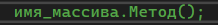
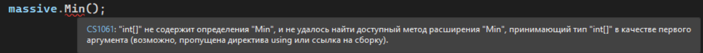
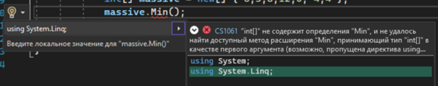
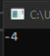
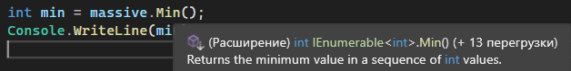
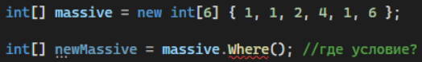
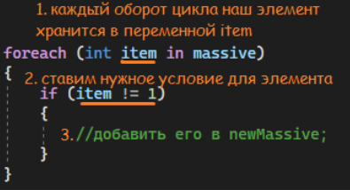
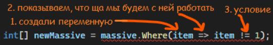
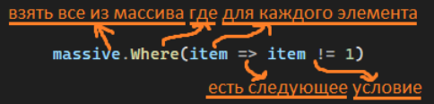

Для работы с [коллекциями — массивами и листами](/csharp/collections) у нас есть много разных методов, которые смогут облегчить нам жизнь. При помощи них мы можем делать выборку, находить минимальное\максимальное значение, перебирать цикл и много многое многое еще. Есть простые методы, где ничего дополнительного не нужно писать, а есть сложные - с условиями внутри

---

## Простые методы

Зацепимся за нахождение минимального числа. Возьмем какой-нибудь массив с числами

```csharp
int[] massive = new[] { 6, 3, 8, 12, 0, -4, 4 };
```

Для нахождения минимума, нам нужно перебрать каждое число - если оно меньше, чем последнее записанное в переменную, то записать в переменную его

```csharp
int[] massive = new[] { 6, 3, 8, 12, 0, -4, 4 };

int min = massive[0];
foreach (int i in massive)
{
    if (i < min)
        min = i;
}

Console.WriteLine(min);
```

Чтобы найти минимальное число, нам не нужно будет перебирать всю коллекцию и пытаться сохранить что-то в переменную. Вместо этого мы можем напрямую использовать метод Min() из библиотеки System.Linq!

Я хочу найти минимальное число. Для этого я хочу использовать свой массив, а именно, метод Min(). Помним, что видим «а именно», ставим точку. Таким образом, наша структура будет выглядеть вот так



А нахождение минимального числа – вот так. Вместо всего кода, показанного выше, мы воспользуемся одним методом!

```csharp
massive.Min();
```

Однако изначально на методе Min будет висеть следующая ошибка. Она говорит нам о том, что не подключена необходимая библиотека для этих методов



> **Алгоритм простой: если в ошибке написано «возможно пропущена директива using или ссылка на сборку», нажимаем на этот метод и нажимаем alt+enter (options + enter на маке) или ПКМ – «Быстрые действия и рефакторинг». Выбираем самую первую строчку, которая добавит нам нужную библиотеку вверх файла, и работаем дальше**



Метод Min() вернет нам какое-то значение из нашего массива. Это значение нам нужно сохранить в переменной, если мы хотим с ним в будущем работать. Как понять, какой мне нужен тип данных для ее хранения?

Min() возвращает минимальный элемент массива. У нас массив интовый, значит и все элементы массива будут интовые. Сохраню значение в переменную min и выведу ее на консоль

```csharp
int[] massive = new[] { 6, 3, 8, 12, 0, -4, 4 };

int min = massive.Min();
Console.WriteLine(min);
```



Еще проще можно понять тип данных, просто наведя на метод. Первое слово, которое мы увидим - тип данных переменной, которую нужно создать, в данном случае, int



Подобно методу Min(), есть также следующие **простые методы:**

- Max(); - максимальное
- Sum(); - сумма элементов
- Count(); - количество элементов (размер коллекции)
- Average(); - среднее значение
- First(); - первый элемент коллекции. Если его нет – ошибка.
- FirstOrDefault(); - первый элемент коллекции. Если его нет – Null, пустота.
- Last(); - последний элемент коллекции. Если его нет – ошибка.
- LastOrDefault(); - последний элемент коллекции. Если его нет – Null, пустота.

Существуют не только они, есть еще много других методов. Их вы можете увидеть, если после массива нажмете на точку и в появившемся контекстном меню полистаете методы. Попробуйте в следующем коде заменит Min на различные методы, которые перечислены выше, и посмотрите на результат!

Все, что перечислено выше - простые методы, где мы просто берем, пишем название и все. Кроме того, чтобы просто брать значения, мы можем еще взять значения по условию - взять минимальное только тех чисел, что ниже нуля, посчитать количество единиц и так далее. Давайте назовем такие методы сложными

---

## Сложные методы

Давайте возьмем другой массив

```csharp
int[] massive = new[] { 1, 1, 2, 4, 1, 6 };
```

Например, я хочу сделать выборку – взять элементы массива, которые не равны единице. При выборке, я жду новый массив, более мелкий, поэтому и сохраню значение я в переменную с типом данных массива. Для этого я могу использовать метод Where();. Однако, если я напишу его просто так, я не пойму, по какому принципу мне нужно сделать выборку своего массива? Как код поймет, что мне нужно то, что не равно единице?



Для того, чтобы сделать условие, давайте вспомним про цикл foreach. Как бы я поступила, если бы не знала про Linq?



Если внутри foreach мы каждый наш элемент храним в переменной item, то и для where нам нужна эта переменная, которую мы будем проверять на условие. Имя переменной может быть любым, хоть **item**, хоть **x**, хоть **dkfjskldjfs**. Впишем ее внутрь круглых скобок.

Затем нарисуем некую стрелочку =>. С помощью нее, мы связываем переменную слева и условие справа, мол, для вот этой переменной есть следующее (=>) условие

Дальше идет условие. Как и внутри if, после этой стрелочки может идти много разных условий, объединенных && или ||.



Однако сейчас наш код выдает нам ошибку – что не так? Дело в том, что Where выдает нам какую-то коллекцию, а мы хотим от него **определенную** коллекцию, а именно массив (т.к. тип данный слева у нас массив. Если бы был лист, мы бы хотели от него получить лист). Чтобы явно сказать ему что мы от него хотим, поставим в конце точку и напишем, что мы хотим преобразовать его в массив.

Итого, мы можем теперь работать с нашей выборкой

```csharp
int[] massive = new int[6] { 1, 1, 2, 4, 1, 6 };

int[] newMassive = massive.Where(item => item != 1).ToArray(); //новый массив { 2, 4, 6 };
```

Чтобы запомнить, что это за стрелочка, и как эта запись работает, можно расписать метод вот так:



Подобно методу Where(), условия можно поставить почти в любой метод Linq, тогда они станут **сложными**. Я добавлю ниже примеры их использования:

- OrderBy(); - сортировка по возрастанию
- OrderByDescending(); - сортировка по убыванию

  ```csharp
  int[] massive = new int[6] { 1, 1, 2, 4, 1, 6 };

  //идентично для OrderBy
  int[] newMassive = massive.OrderByDescending(x => x).ToArray(); //новый массив { 6,4,2,1,1,1 };
  ```

- All(); - все ли элементы коллекции удовлеворяют условию

  ```csharp
  int[] massive = new int[6] { 1, 1, 2, 4, 1, 6 };

  bool isAllOne = massive.All(x => x == 1); //false, не все элементы единица
  ```

- Any(); - удовлетворяет ли хотя бы 1 элемент условию

  ```csharp
  int[] massive = new int[6] { 1, 1, 2, 4, 1, 6 };

  bool isAllOne = massive.Any(x => x > 2); //true, есть пару чисел больше двух
  ```

Также, в простых методах тоже можно использовать эти внутренние условия:

- First(); - первый элемент коллекции. Если его нет – ошибка.
- FirstOrDefault(); - первый элемент коллекции. Если его нет – Null, пустота.

  ```csharp
  int[] massive = new int[7] { 1, 1, 2, 4, -2, 1, 6 };

  //идентично для First
  int item = massive.FirstOrDefault(x => x < 0); //-2, первый элемент, который меньше нуля
  ```

- Last(); - последний элемент коллекции. Если его нет – ошибка.
- LastOrDefault(); - последний элемент коллекции. Если его нет – Null, пустота.

  ```csharp
  int[] massive = new int[7] { 1, 1, 2, 4, 2, 1, 6 };

  //Last выдаст ошибку и закроет программу
  int item = massive.LastOrDefault(x => x < 0); //null, пустота. Такого элемента нет
  ```

- Count(); - количество элементов (размер коллекции)

  ```csharp
  int[] massive = new[] { 1, 1, 2, 4, 1, 6 };

  int count = massive.Count(item => item == 1); // 3, так как 3 единицы
  ```

В листах есть даже больше методов! С их помощью можно делать как все старые действия, так и новые, например, убирать или добавлять элементы по условию.

```csharp
List<int> list = new() { 1, 1, 2, 4, 1, 6 };

list.RemoveAll(item => item == 1);
```

Вот список некоторых методов, которые добавляются при использовании листа

- AddRange - добавляет несколько элементов в лист
- RemoveAll - убирает элементы согласно условию

Попробуйте использовать эти методы на коде и подставить различные условия, чтобы посмотреть, что получится по итогу!
