На данный момент весь наш код пишется сплошняком сверху вниз. Однако некоторые блоки кода выполняют совершенно различные действия: один вводит информацию, другой ее обрабатывает, а третий – выводит. Когда все это хранится сплошняком, код становится тяжело читать и становится неясно, для чего нужен тот или иной блок кода. Поэтому эти блоки кода мы можем проименовать и сделать его **методом**. Такое может понадобится в следующих случаях:

- В основном методе слишком много строк кода (примерно >50)
- Основной код можно разделить на подзадачи
- Блок кода где-либо повторяется

---

## Структура проекта с методами

Для примера, я создала проект на .NET 6.0 и выше с галочкой "Не использовать операторы верхнего уровня". Такой же проект создается на .NET 5.0 или .NET 3.1. Давайте рассмотрим что у него есть

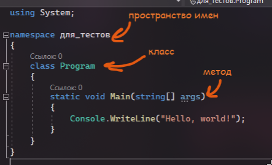

Итак, у нас есть

- Пространство имен – контейнер для классов, грубо говоря, его путь. С помощью него мы говорим где именно у нас хранится наш класс и позже, с помощью пути, мы сможем до него добраться
- Класс – контейнер для методов. Внутри класса хранится своя уникальная логика для чего-либо. Например, класс «Кофемашина» будет хранить в себе методы по заварке эспрессо, капучино и латте, а класс «Калькулятор» будет хранить в себе методы по сложению, вычитанию, умножению и делению
- Метод – контейнер кода. Внутри этих контейнеров мы, непосредственно, храним логику для какого-либо блока алгоритма. Все это время мы писали код внутри метода Main, независимо от того, на какой платформе .NET вы писали код

**!Важно!** – консольные приложения не могут запустится, если внутри них не будет метода Main, поэтому не меняйте название главного метода. Однако, если ничего не будет, а будет сразу код, программа также может запуститься (но только начиная с .NET 6.0!)

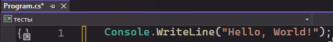

В этом случае, метод уже существует и называется Main. Но если мы создаем обычный проект на версии .NET 6.0 и выше, стартовый проект будет выглядеть вот так и все равно работать.

Дисклеймер: мы будем разбирать методы на одном примере, однако в целом, методы существуют для наименования блоков кода. Один метод должен делать одну задачу. Если думаете: «Где мне применять методы?», ответ – везде. Если я хочу сделать простой конвертер валют, где я ввожу значения, конвертирую их, а затем вывожу, должно быть три метода – ввод, конвертация, вывод. Еще раз – одна задача – один метод. Это в будущем вам поможет, чтобы компоновать разные блоки кода разными способами, как лего

---

## Создание собственного метода

Представим, что есть автомат с жвачкой. Кривоватый, сделанный с божьей помощью ~~как наш код~~, но очень любимый

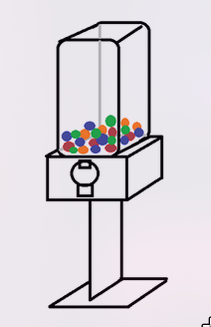

Автоматы просто стоят в торговых центрах и иногда ими пользуются. Они – не основная активность похода в магазин. Но на всякий случай, они там все равно стоят, со своей логикой, в своем месте, и каждый человек в моменте может к ним обратиться

По этой аналогии, есть какой-то блок кода, который иногда нужно использовать. Не факт, что он обязателен всегда, но он хранит какую-то логику для себя и только для себя. Логично будет вынести всю логику одного объекта в одну коробочку – **в метод**

Структура методов выглядит следующим образом:

```csharp
void SomeName() //() - определение, что это метод. void - что он возвращает
{
    // коробочка, куда пойдет код
}
```

Автомат работает по какой-то логике: мы закидываем десятку, прокручиваем ручку, автомат выдает нам жвачку. Давайте создадим метод Avtomat, который будет выбирать жвачку и выдавать ее.

Код пишется в фигурных скобках. Внутри них может быть прописано все что угодно, что вы знали до этого – переменные, условия, циклы и так далее.

```csharp
void Avtomat()
{
    Console.WriteLine("Выбираю жвачку...");
    Console.WriteLine("Вот ваша жвачка!");
}
```

Но если мы запустим сейчас, автомат не будет работать и в консоль ничего не выведется, так как мы, ака программа, ака метод Main, не работал с этим автоматом. Чтобы обратиться к автомату и выполнить весь код внутри, нужно просто написать его название (т.е. название метода), вместе с круглыми скобками

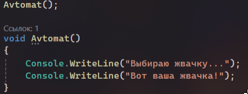

И уже тогда мы увидим результат


Однако сейчас мы подходим к автомату, и он сразу выдает нам нашу жвачку. Даже не так – он просто говорит о том, что он ее нам выдал, однако ничего подобного не сделал. В реальном же мире, должно быть так, что мы внутрь автомата что-то **передаем**, а он нам в ответ что-то **возвращает**

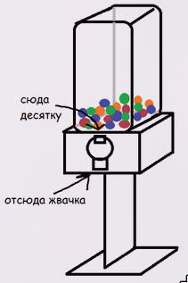

Начнем с того, что автомат должен вернуть нам жвачку

---

## Возврат значения из метода

Console.WriteLine() в данном случае просто выводит на консоль то, что есть жвачка. По аналогии с реальным миром, автомат вывел нам на дисплей сообщение, а сам жвачку зажал. Мне, как потенциальному покупателю жвачки, такое не нравится, я хочу, чтобы она у меня была, потому что тогда я смогу сделать с ней все что угодно – сьесть, перепродать, отдать другу, раздавить (?) и так далее. Единственная задача автомата в данном случае – **вернуть** мне эту жвачку.

Вернуть по-английски – return. Если я хочу вернуть какое-то значение из метода, мне так и нужно написать: **return значение**

Но если мы просто так это напишем и оставим, то у нас появится ошибка

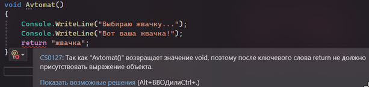

Он ругается на слово void и говорит, что его необходимо заменить. Чтобы его поменять, надо понять, что это

Void, с английского, пустота. Void говорит о том, что метод ничего не возвращает, это просто коробка для кода. Если я хочу что-то вернуть, нужно сказать, что за тип данных будет возвращаться, и подставить этот тип данных вместо void

Например, тут я возвращаю «жвачка». Она в кавычках, значит это текст. Если это текст, ее тип данных будет string. Следовательно, void нужно заменить на string

```csharp
string Avtomat()
{
    Console.WriteLine("Выбираю жвачку...");
    Console.WriteLine("Вот ваша жвачка!");
    return "жвачка";
}
```

Если бы я возвращала число, вместо void стоял бы int. Если возвращаю символ – char и так далее. Кратко говоря:

- Void – пустота, метод ничего не возвращает и является просто хранилищем для кода
- Тип данных вместо void – метод возвращает какое-то значение этого типа данных

Но опять же, при запуске визуально ничего не меняется. Как был вывод двух сообщений, так и остался.


Зачем мы тогда все это делали? Цимес в следующем.

Вспомним, что я хочу делать все что угодно с этой жвачкой – сьесть, перепродать, отдать другу. Чтобы это сделать, мне нужно поймать эту жвачку и положить ее себе в руки – только после этого я смогу с ней взаимодействовать

Сейчас же, мы просто подходим к автомату, и он дает нам жвачку. Когда мы открываем крышку, жвачка просто падает в никуда и больше нигде и никогда не используется

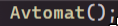

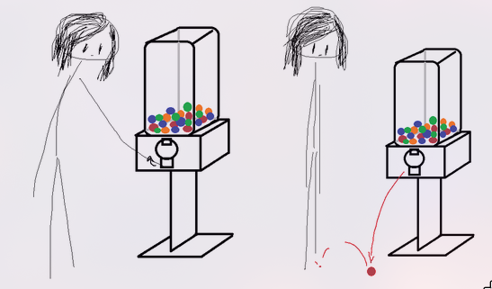

Я же хочу сделать иначе – купленную мною жвачку из автомата я хочу взять в руки, а потом уже с ней взаимодействовать. Переводя на код, возвращенное значение из метода нужно сохранить в переменную, чтобы в будущем этим значением пользоваться

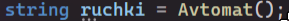

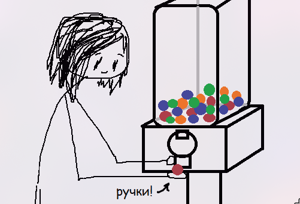

Единственный вопрос, который может появиться – почему переменная именно типа данных string? Все очень просто – **какой тип данных возвращает метод, в такую переменную и нужно сохранить значение.**

Если мы не уверены в том, какой тип данных возвращает метод – посмотрите, что написано перед названием. В нашем случае – string

```csharp
string ruchki = Avtomat();

string Avtomat()
{
    Console.WriteLine("Выбираю жвачку...");
    Console.WriteLine("Вот ваша жвачка!");
    return "жвачка";
}
```

Если вы все еще не уверены, наведитесь на метод. Visual Studio подскажет, какой тип данных она возвращает

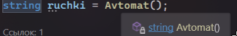

По той же аналогии работает Console.ReadLine() – метод включает консоль, ждет, пока пользователь впишет какое-то значение, а затем возвращает это значение из метода, а мы сохраняем ее в переменную

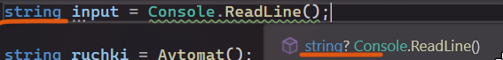

Далее мы уже можем что угодно делать с этой переменной – показать, изменить, передать, и прочее

```csharp
string ruchki = Avtomat();

Console.WriteLine("Вот что у меня в руках: " + ruchki);
Console.WriteLine("Я отдам это другу");

ruchki = "";
Console.WriteLine("Вот что теперь в руках: " + ruchki);

////////////////////////////////

string Avtomat()
{
    Console.WriteLine("Выбираю жвачку...");
    Console.WriteLine("Вот ваша жвачка!");
    return "жвачка";
}
```

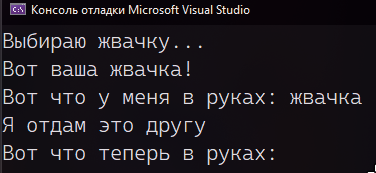

Единственное – автомат выдает нам жвачку каждый раз, когда мы его используем. Мы же должны закинуть в него монетку, т.е., передать какое-то значение в метод

---

## Передача параметров в метод

Кроме того, что метод может что-то вернуть, мы также можем в него что-то **передать**. Эти два функционала не связаны между собой, а значит все можно между собой комбинировать

- Метод может ничего не возвращать и ничего не принимать
- Метод может ничего не возвращать, но что-то принимать
- Метод может что-то возвращать, но ничего не принимать
- Метод может что-то возвращать, и что-то принимать

В случае с автоматом, нам подойдет последний вариант – автомат **принимает** десятку и **возвращает** жвачку. Напомню зарисовку


Чтобы что-то передать в метод, необходимо создать место, куда это значение пойдет. В случае с автоматом, место для приема монет – монетоприемник. В случае с методом – **параметр**, который выглядит как переменная внутри круглых скобок. Структура следующая

```csharp
void SomeMethod(типданных название){

}
```

По той же логике работает Console.WriteLine(). Внутрь круглых скобок мы пишем, что именно мы хотим передать внутрь метода. Чтобы метод принял это значение, он должен хранить его в переменной.

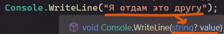

В данном случае я хочу сделать монетоприемник, который будет принимать монетки по 10. Создам этот монетоприемник внутри метода. Хочу передавать туда числа, поэтому тип данных переменных будет int

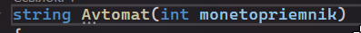

Заметьте, что раз у меня появился параметр, мне обязательно нужно передать туда какое-то значение. Без него метод теперь будет ругаться

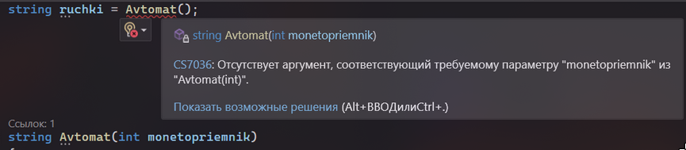

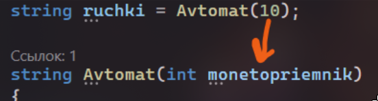

Но я могу передать туда не только 10, я могу передать туда любое число. Поэтому давайте немного видоизменим наш код – поставим проверку на то, точно ли нам закинули десятку в автомат.

```csharp
string Avtomat(int monetopriemnik)
{
    if (monetopriemnik == 10)
    {
        Console.WriteLine("Выбираю жвачку...");
        Console.WriteLine("Вот ваша жвачка!");
        return "жвачка";
    }
    else
    {
        Console.WriteLine("Такую монету я не приму!");
    }
}
```

Но при таком коде у нас будет появляться ошибка – не все пути к методу возвращают значение

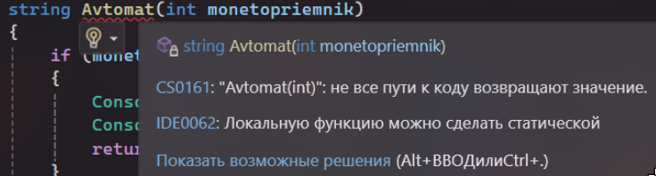

Это происходит не из-за параметра, а из-за return. Если метод что-то возвращает, он должен что-то возвращать **всегда**, при любых поведениях метода. Сейчас он что-то возвращает только если в монетоприемнике есть десятка. Если в ней не десятка, он не знает, как себя вести, поэтому и ругается

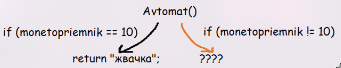

Даже если мы ничего не хотим возвращать, об этом нужно сказать. Давайте так и скажем, что мы вернем «ничего», если монета не равна 10.

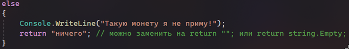

Итого наш код будет выглядеть следующим образом

```csharp
string ruchki = Avtomat(10);

string Avtomat(int monetopriemnik)
{
    if (monetopriemnik == 10)
    {
        Console.WriteLine("Выбираю жвачку...");
        Console.WriteLine("Вот ваша жвачка!");
        return "жвачка";
    }
    else
    {
        Console.WriteLine("Такую монету я не приму!");
        return "ничего"; // можно заменить на return ""; или return string.Empty;
    }
}
```

Я могу передавать далеко не один параметр – их может быть бесконечное количество. Хочу передать что-то еще – создам еще один параметр для принятия значения извне, перечисляя их через запятую.

Например, я хочу точно указать цвет жвачки, которую я хочу получить. Сделаю еще один параметр – colour.

Передавать данные тогда мне нужно в строго том порядке, в котором они написаны внутри метода

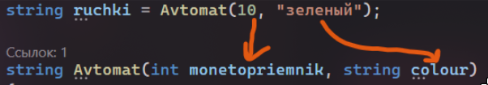

(Если я явно буду указывать, в какой параметр идет значение, то можно не думать насчет порядка)

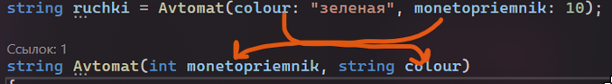

Код для нового параметра я также могу поменять

```csharp
string ruchki = Avtomat(10, "зеленая");

string Avtomat(int monetopriemnik, string colour)
{
    if (monetopriemnik == 10)
    {
        Console.WriteLine("Выбираю жвачку...");
        Console.WriteLine("Вот ваша " + colour + " жвачка!");
        return colour + " жвачка";
    }
    else
    {
        Console.WriteLine("Такую монету я не приму!");
        return "ничего"; // можно заменить на return ""; или return string.Empty;
    }
}
```

Однако бывают случаи, когда я не хочу использовать вторую переменную – некоторые автоматы могут быть без выбора цвета. Как быть?

**1. Дать переменной значение по умолчанию. Эти переменные должны быть в конце**

Как и когда я объявляю переменные, я могу дать им сразу значение, так и в параметрах, я могу им дать значение, которое возьмется по умолчанию. Например, значение по умолчанию у colour поставлю «цветная»

```csharp
string Avtomat(int monetopriemnik, string colour = "цветная")
```

Тогда я могу не передавать значения в эту переменную. Если я его не передаю, он возьмет значение по умолчанию

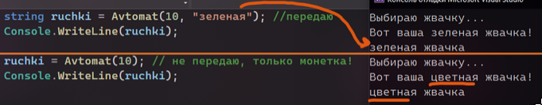

**2. Сделать новый метод с тем же названием, но с другим количеством параметров**

У разных автоматов может быть разный функционал, но от этого он не перестает быть автоматом. Также и с методами. Делают они одно и то же – выдают жвачку, так что имена будут одинаковыми. Однако количество параметров и код внутри будут отличаться.

**ЕДИНСТВЕННОЕ – так может работать только внутри класса, либо, когда есть class Program и отдельный метод Main. Так как мы хотим вызывать методы внутри Main, который является статичным методом, все остальные методы тоже должны быть static.**

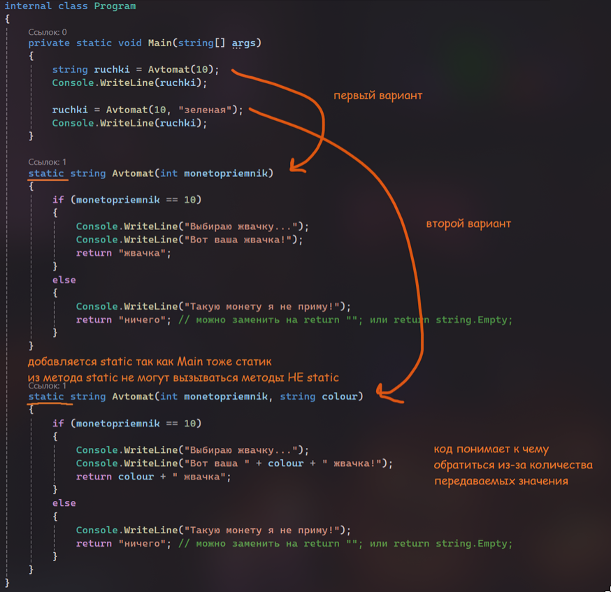

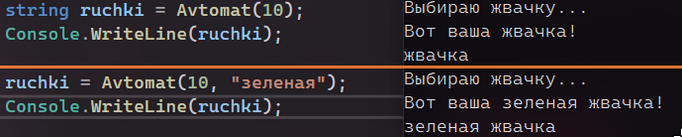

Итоговый код будет выглядеть так

```csharp
internal class Program
{
    private static void Main(string[] args)
    {
        string ruchki = Avtomat(10);
        Console.WriteLine(ruchki);

        ruchki = Avtomat(10, "зеленая");
        Console.WriteLine(ruchki);
    }

    static string Avtomat(int monetopriemnik)
    {
        if (monetopriemnik == 10)
        {
            Console.WriteLine("Выбираю жвачку...");
            Console.WriteLine("Вот ваша жвачка!");
            return "жвачка";
        }
        else
        {
            Console.WriteLine("Такую монету я не приму!");
            return "ничего";
        }
    }

    static string Avtomat(int monetopriemnik, string colour)
    {
        if (monetopriemnik == 10)
        {
            Console.WriteLine("Выбираю жвачку...");
            Console.WriteLine("Вот ваша " + colour + " жвачка!");
            return colour + " жвачка";
        }
        else
        {
            Console.WriteLine("Такую монету я не приму!");
            return "ничего";
        }
    }
}
```

Когда использовать первый, а когда второй вариант?

1. Первый вариант с значениями по умолчанию нужно использовать, когда эти значения сто процентов нужны. Они используются в коде метода, но функционал может немного варьироваться в зависимости от того, какое значение было передано
2. Второй вариант с двумя методами с разным количеством параметров можно использовать, когда код сильно меняется в зависимости от передаваемых параметров. Также можно использовать, когда второй параметр для другого функционала является обязательным.
