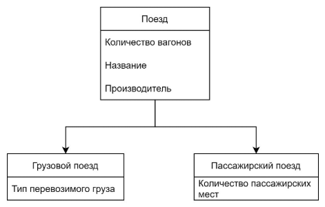
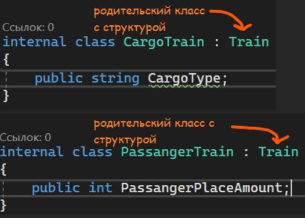
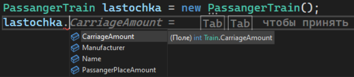
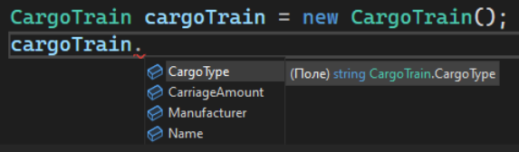
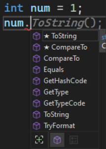

В нашем мире все можно привести к первозданному виду. Например, мухоморы и опята – это частный случай грибов. Грузовые и пассажирские поезда – частные случаи поездов.

У этих первозданных объектов есть какие-то свойства и действия, которые также будут находится во всех частных случаях. Те же поезда – у них есть количество вагонов, название, производитель. Однако из поездов можно сделать еще грузовые и пассажирские поезда. Внутри грузовых будут добавлены еще свои уникальные свойства – например, тип перевозимого груза. Внутри пассажирского будут добавлены свои – например, количество пассажирских мест.



Такую же структуру можно реализовать через три [класса](/csharp/classasmodel) и наследовать класс поезд для грузового и пассажирского поезда. При наследовании, все переменные и методы уже могут быть использованы в дочерних классах.

Давайте реализуем эти поезда в коде. Для начала создадим родительский класс поезд – Train

```csharp
internal class Train
{
    public string Name; //Название
    public int CarriageAmount; //Количество вагонов
    public string Manufacturer; //Производитель
}
```

А затем реализуем дочерние классы – CargoTrain и PassangerTrain. В этих классах мы будем наследовать основу поезда. Для того, чтобы наследовать, нам необходимо после название через двоеточие указать родительский класс – Train

Если наши классы будут наследовать Train, там уже будут созданы переменные Name, CarriageAmount и Manufacturer, в дочернем классе нужно указать только то, что еще не было создано. ВАЖНО - в C# наследоваться можно ТОЛЬКО ОТ ОДНОГО класса



```csharp
// класс с грузовым поездом, условно, файл CargoTrain.cs
internal class CargoTrain : Train
{
    public string CargoType;
}

// класс с пассажирским поездом, условно, файл PassengerTrain.cs
internal class PassengerTrain : Train
{
    public int PassengerPlaceAmount;
}
```

Теперь, когда мы будем создавать типы данных CargoTrain и PassangerTrain, мы сможем использовать все четыре переменные - три основные, при наследовании, и одну из каждого класса по отдельности.





Эти переменные можно будет использовать везде – в [конструкторах](/csharp/classascontainer), при [сериализации](/csharp/json), при [выводе](/csharp/classasmodel) и прочее прочее прочее.

Явный пример наследования – разные [типы данных](/csharp/variables). Внутри типа данных string, int, bool и прочее уже находятся какие-то методы, и они общие для всех типов данных. Откуда они взялись?



Все эти типы данных наследуются от типа данных object. Сам object по умолчанию может хранить в себе все объекты – текст, число, символ. А потом, уже для каждого своего типа данных, реализуются свои уникальные свойства – для string – обработка текста как массив символов, и т.п.

В чем преимущество реализации наследования в своих программах?

Мы можем делать еще более уникальные методы с родительским объектом, хотя передавать мы будем дочерние объекты. На примере с тем же поездом – метод принимает в себя родителя – Train, а значит мы можем передавать в этот метод все, что наследуется от Train – пассажирские и грузовые поезда

Такой вариант передачи называется **Upcast – от дочернего класса до родительского**

```csharp
void ShowTrain(Train train) // передаем Train - родителя
{
    Console.WriteLine(train.Name);
    Console.WriteLine(train.CarriageAmount);
    Console.WriteLine(train.Manufacturer);
}

PassengerTrain passTrain = new PassengerTrain();
passTrain.Name = "Ласточка";
passTrain.CarriageAmount = 10;
passTrain.Manufacturer = "Siemens";
ShowTrain(passTrain); // в метод можно передать PassengerTrain, потому что он 100% имеет все то же, что и Train, так как идет наследование

CargoTrain cargoTrain = new CargoTrain();
cargoTrain.Name = "Крылатка";
cargoTrain.CarriageAmount = 20;
cargoTrain.Manufacturer = "Siemens";
ShowTrain(cargoTrain); // по этой же схеме, так как CargoTrain наследуется от Train, мы можем передать его в метод
```

И наоборот – в методе мы можем принимать дочерние объекты, а передавать родительские, т.е. принимать string, а передавать object. Однако в этом случае нам придется [приводить](/csharp/transformation) передаваемому переменную к типу данных string

Такой вариант передачи называется **Downcast – от родительского класса до дочернего**

```csharp
void ShowText(string text)
{
    Console.WriteLine(text);
}

object obj = "Текст";
ShowText((string)obj);
```
