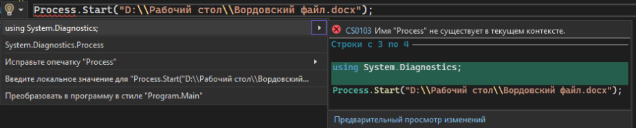
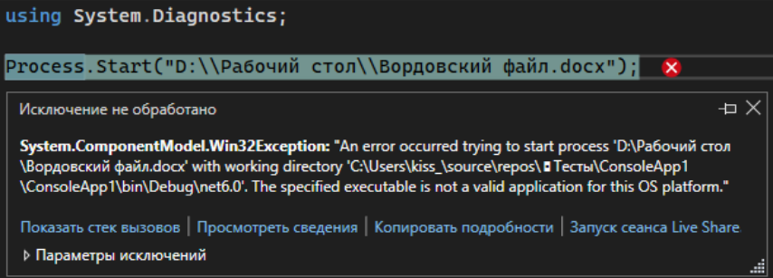
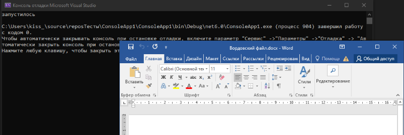

Последнее, что мы разберем по работе с файлами на компьютере – их запуск. Я не буду заставлять вас писать отображение каждого файла в консоли, путь операционная система сама разбирается, через что запустить этот файл. Нам лишь нужно сказать, что этот процесс нужно запустить.

Так как я хочу запустить процесс, я напишу Process.Start();. Для использования процессов нам нужно будет подключить библиотеку System.Diagnostics. Можно вручную прописать этот using, либо нажать alt+enter (или нажать на лампочку) и выбрать первый пункт – using System.Diagnostics.



Один из способов запустить этот файл – напрямую в круглые скобки прописать путь.

```csharp
using System.Diagnostics;

Process.Start("D:\\Рабочий стол\\Вордовский файл.docx");
```

Однако так будет работать только если это exe файл. Для Windows 10 нам необходимо запустить файл через PowerShell, а значит, мы должны как-то в коде это обозначить



Чтобы обозначить это в коде, вместо обычного пути, мы создадим информацию о нашем процессе – ProcessStartInfo. Внутри в фигурных скобках мы укажем название файла – FileName, и использование PowerShell – UseShellExecute = true.

UseShellExecute - свойство, которое позволяет полностью переложить ответственность за открытие файла на систему. Мы буквально отдаем путь в PowerShell, т.е. системную оболочку, а он уже запускает файл согласно своим настройкам (программы по умолчанию, ассоциация программ с расширением, прочее прочее прочее).

И тогда, при запуске приложения, ОС сама подберет, через что стоит запускать этот файл. Так как мы открывали вордовский файл, то и запустит он его через Word

```csharp
Process.Start(new ProcessStartInfo
{
    FileName = "D:\\Рабочий стол\\Вордовский файл.docx",
    UseShellExecute = true
});
Console.WriteLine("запустилось");
```

(Если вам удобно, этот же код можно написать в одну строчку - просто удалите все переносы строк)


