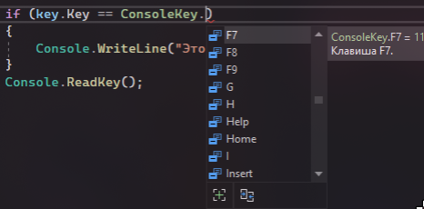
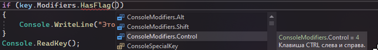
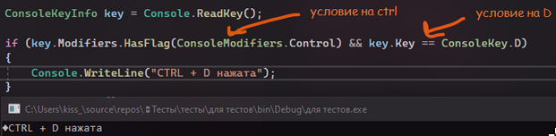
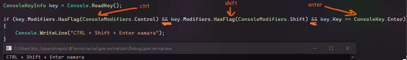

Когда мы что-то вводили в консоль, мы читали конечный результат, то, что возвращалось после Enter. А что, если я хочу ввести какую-то системную клавишу в консоль и прочитать ее? Я же не могу вписать в консоль значение F6 или Print Screen, а использовать хочу. Что делать?

---

## Чтение клавиши — ReadKey

Если текст я брала с помощью Console.ReadLine() – прочитать строку, то клавишу я буду читать с помощью Console.ReadKey() – прочитать клавишу. Тип данных для переменной будет ConsoleKeyInfo, так как мы хотим хранить информацию о клавише, введенной из консоли

```csharp
ConsoleKeyInfo key = Console.ReadKey();
```

Теперь мы можем взаимодействовать с этой клавишей. Например, я могу вывести имя этой клавиши с помощью этой переменной, а именно (ставлю точку) ее ключа (Key). Можете попробовать запустить этот код и в консоли нажать любую клавишу!

```csharp
ConsoleKeyInfo key = Console.ReadKey();

Console.WriteLine(key.Key);
```

Также я могу проверить в условии какая клавиша была нажата и реализовать какой-то код, связанный с ней. Чтобы построить условие, после двойного равно я должна написать ConsoleKey.Названиеклавиши, или выбрать необходимую клавишу из списка.



Например, я хочу клавижу F7 – я так и напишу

```csharp
ConsoleKeyInfo key = Console.ReadKey();
if (key.Key == ConsoleKey.F7)
    Console.WriteLine("Это F7");
```

Также я могу использовать сочетания клавиш, например, ctrl + d, alt + 9, ctrl + shift + enter и так далее.

---

## Использование модификаторов — Ctrl, Alt, Shift

Чтобы узнать, была ли удержана клавиша ctrl, alt или shift для создания какой-то комбинации, есть следующий код. В нем мы буквально спрашиваем "Есть ли вот такой модификатор у нажатой клавиши?".

В качестве модификатора считаются клавиши ctrl, alt или shift. Эти же клавиши не будут работать при ReadKey, так как они не считаются за клавиши, а считаются за модификаторы.



Таким образом, мы смотрим есть ли какие-то **модификаторы** к нашей клавише, добавки. Этими добавками как раз таки и являются ctrl, alt или shift.

Реализую пример выше с ctrl + d. Два условия я объединяю логической операцией И, т.е. &&.

```csharp
ConsoleKeyInfo key = Console.ReadKey();

if (key.Modifiers.HasFlag(ConsoleModifiers.Control) && key.Key == ConsoleKey.D)
    Console.WriteLine("CTRL + D нажата");
```



Чем больше комбинация, тем больше условий надо будет писать. Вот, например, ctrl + shift + enter

```csharp
ConsoleKeyInfo key = Console.ReadKey();

if (key.Modifiers.HasFlag(ConsoleModifiers.Control) && key.Modifiers.HasFlag(ConsoleModifiers.Shift) && key.Key == ConsoleKey.Enter)
    Console.WriteLine("CTRL + Shift + Enter нажата");
```


