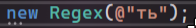
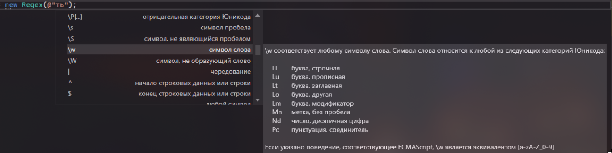
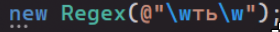
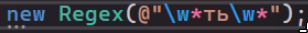
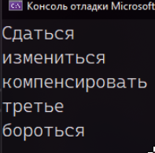
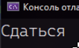
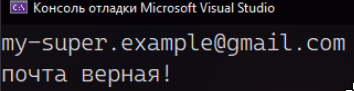
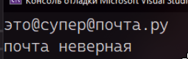
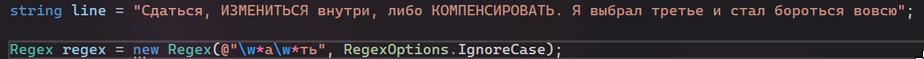
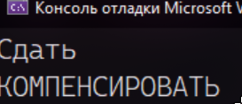

Иногда бывает такое, что нужно проверить текст на правильность формата. Частый пример – ввод email-а как логина. Мы не хотим давать пользователю авторизоваться или зарегистрироваться до тех пор, пока он не введет правильный email. Но как проверить, точно ли формат email верный? Если бы я делала это вручную, мне бы пришлось проверять наличие @ и . через Contains, количество символов после @, есть ли точка после @, сколько символов после точки и так далее. Это неистово муторно. Было бы круто, если бы у меня была возможность указать формат, а потом по формату проверять строки. И такая возможность есть! Называется **регулярные выражения**

Регулярные выражения (по-английски **Reg**ular **ex**pressions, кратко, **regex**) есть в каждом языке программирования. В сути, это свой маленький язык, при помощи которого вы можете сделать формат, а потом по формату проверять все строки.

Внутри этого языка есть много обозначений – буква-символ, цифра-символ, диапазон символов и прочее. Со всеми обозначениями досконально мы разбираться не будем, однако поверхностно Regex разобрать можно, плюс посмотрим, как оно работает в C#

Более подробно поэксперементировать с обозначениями вы можете на MSDN (официальной документации Microsoft) в статье [Элементы языка регулярных выражений — краткий справочник](https://learn.microsoft.com/ru-ru/dotnet/standard/base-types/regular-expression-language-quick-reference). В качестве песочницы для экспериментов можете воспользоваться вот этим сайтом: [https://regexr.com/](https://regexr.com/) Он сразу будет подсвечивать слова, которые подходят под формат

Но чтобы начать понимать, как написать свой формат, давайте ознакомимся с основами

---

## Создание формата для проверки

Основным классом при работе с регулярными выражениями является класс **Regex**. Чтобы создать формат, нужно создать экземпляр класса Regex. Внутри нужно написать формат. Формат – текст, перед которым будет стоять @. Собачка нужна, чтобы код смог расценить символы внутри как обозначения формата

Например, у нас есть некоторый текст и нам надо найти в нем все формы какого-нибудь слова. Создам переменную с текстом и начну создавать формат

```csharp
using System.Text.RegularExpressions;

string text = "Сдаться, измениться внутри, либо компенсировать. Я выбрал третье и стал бороться вовсю";
Regex regex = new Regex(@"");
```

Я хочу найти все слова, которые содержат «ть» внутри слова. Т.е., что слева, что справа, могут быть буквы в неограниченном количестве, либо не быть вовсе. Что делать?

1. Мне сто процентов нужно найти «ть». Я напишу ть внутрь формат

   

2. И слева и справа нужно любое количество символов. Чтобы найти нужное обозначение для букв-символов, внутри строки можно нажать **ctrl+пробел**. Покажется контекстное меню со всеми доступными вариантами. Внутри нужно найти обозначение буквы. Там же можно найти описание этого формата

   

3. Нашли, что \w – символ слова. Если я поставлю \w слева и справа, я скажу, что слева и справа может быть по символу

   

   Но мне нужно сказать, что там не один символ, а сколько угодно символов. Для обозначения любого количества символов есть \*. Поставлю звездочку после \w

   

С форматом закончили! Теперь строку нужно подставить под формат. Проверку можно сделать несколькими способами: найти все подходящие слова в строке, найти все подходящие строки в массиве строк, проверить, подходит ли строка под формат

---

## Проверка строки по формату

Чтобы соотнести формат и строку, возьмем переменную с регексом, **а именно,** методом **Matches**. Внутрь метода передаем строку. Метод вернет все совпадения в формате списка. Если сравнение ничего не нашло, будет просто пустая коллекция

Раз вернулась коллекция, переберем ее при помощи цикла foreach и выведем все получившиеся результаты

```csharp
string line = "Сдаться, измениться внутри, либо компенсировать. Я выбрал третье и стал бороться вовсю";

Regex regex = new Regex(@"\w*ть\w*");
var resultCollection = regex.Matches(line);

foreach (var result in resultCollection)
{
    Console.WriteLine(result);
}
```



С форматом можно экспериментировать как угодно! Например, давайте найдем все слова, которые заканчиваются на «ся», но внутри есть буква «а». Тогда формат можно представить, как «слева и справа от буквы «а» должно быть любое количество символов. В конце «ся», то есть слева любое количество символов, а справа ничего»

```csharp
string line = "Сдаться, измениться внутри, либо компенсировать. Я выбрал третье и стал бороться вовсю";

Regex regex = new Regex(@"\w*а\w*ся"); //по итогу формат ищет все слова ___а___ся
var resultCollection = regex.Matches(line);

foreach (var result in resultCollection)
{
    Console.WriteLine(result);
}
```



---

## Проверка на соотношение строки и формата

Находить несколько подходящих элементов внутри строки конечно круто, но давайте вернемся к первоначальному примеру – человек вводит e-mail, нам нужно проверить, а точно ли он верно введен, точно ли это не «123». Начало будет точно таким же – нужна строка и нужен Regex. Только вот использовать мы будем не Matches, а **условие с IsMatch** – подходит ли формат к строке

Попросим человека ввести строку и сохраним ее в переменную input. Затем, разберем формат e-mail. **Example@example.com, my-email123@mail.ru, super.cool.@gmail.com** – это все почты. Мы видим, что почта делится на имя@почтоваяслужба. Попробуем сделать из него формат

- В имени могут быть буквы, символы и цифры в любом количестве
- После имени обязательно идет собака
- Дальше домен. В домене только буквы, тоже в неограниченном количестве
- После домена обязательно точка
- И в конце ru, com, что угодно. Но короткое, 2-4 символа

Из этого построим формат

```csharp
string input = Console.ReadLine();

Regex regex = new Regex(@"^[\w-._]*@\w*.[A-z]{2,4}$");
```

- ^ - Начало строки (мы не должны найти почту где-то посередине)
- [\w-._] – диапазон символов, куда входят буквы\цифры и символы – . \_
- \* - любое количество этих символов
- @ - собачка, которая обязательно должна быть
- \w\* - любое количество букв\цифр
- . – точка, которая обязательно должна быть
- [A-z]\{2,4\} – все буквы от большой А до маленькой z, но их может быть только от двух до четырех
- $ - конец строки (опять же, не хотим, чтобы после почты что-то еще было написано)

Чтобы полностью проверить строку на формат, воспользуемся методом IsMatch и поместим его в условие – Если формат совпадает – написать «почта верная!». Если нет – сказать, что неверная.

```csharp
using System.Text.RegularExpressions;

string input = Console.ReadLine();
Regex regex = new Regex(@"^[\w-._]*@\w*.[A-z]{2,4}$");

if (regex.IsMatch(input))
    Console.WriteLine("почта верная!");
else
    Console.WriteLine("почта неверная");
```

Попробуем этот код запустить и ввести разные email!





Таким же образом, при помощи IsMatches, можно проверять массивы строк. Просто вместо того, чтобы один раз воспользоваться условием с IsMatches, нужно будет пробежаться по всему массиву и поставить условие для каждого элемента

---

## Дополнительные настройки формата

Класс Regex имеет ряд конструкторов, позволяющих выполнить начальную инициализацию объекта. Две версии конструкторов в качестве одного из параметров принимают перечисление RegexOptions. Некоторые из значений, принимаемых данным перечислением:

- Compiled: при установке этого значения регулярное выражение компилируется в сборку, что обеспечивает более быстрое выполнение;
- CultureInvariant: при установке этого значения будут игнорироваться региональные различия;
- IgnoreCase: при установке этого значения будет игнорироваться регистр;
- IgnorePatternWhitespace: удаляет из строки пробелы и разрешает комментарии, начинающиеся со знака #
- Multiline: указывает, что текст надо рассматривать в многострочном режиме. При таком режиме символы "^" и "$" совпадают, соответственно, с началом и концом любой строки, а не с началом и концом всего текста;
- RightToLeft: приписывает читать строку справа налево;
- Singleline: при данном режиме символ "." соответствует любому символу, в том числе последовательности "\n", которая осуществляет переход на следующую строку.

Например, так мы будем игнорировать регистр.





При необходимости можно установить несколько параметров:

```csharp
Regex regex = new Regex(@"\w*а\w*ть", RegexOptions.IgnoreCase | RegexOptions.Compiled);
```
