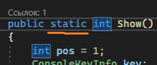
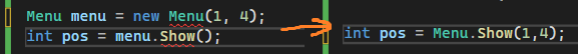

Мы начали изучать методы, зная, что они создаются как static void Название(), а потом, как только мы начали изучать классы, слово static куда-то пропало. И можно было задастся вопросом, что такое static и зачем он нужен?

Ключевое слово static показывает программе то, что этот объект нужно создать прямо в время запуска программы, чтобы этим объектом можно было пользоваться в течении всей программы. **По этой же причине метод Main статичный, так как он создается во время запуска программы.**

Вот например, у меня есть класс – стрелочное меню из прошлой лекции

```csharp
internal class Menu
{
    private int minStrelochka;
    private int maxStrelochka;

    public Menu(int min, int max)
    {
        minStrelochka = min;
        maxStrelochka = max;
    }

    public int Show()
    {
        public int pos = 1;
        ConsoleKeyInfo key;

        do
        {
            Console.SetCursorPosition(0, pos);
            Console.WriteLine("->");

            key = Console.ReadKey();

            Console.SetCursorPosition(0, pos);
            Console.WriteLine("");

            if (key.Key == ConsoleKey.UpArrow && pos != 1)
                pos--;
            else if (key.Key == ConsoleKey.DownArrow && pos != 4)
                pos++;
        } while (key.Key != ConsoleKey.Enter);
        return pos;
    }
}
```

Мы видим, что внутри него нет никаких static. Это значит, что чтобы использовать мой класс, я должна не просто запустить код, а создать переменную с этим классом, и через него уже брать все методы\переменные внутри.

```csharp
Console.WriteLine("какой цвет вы любите?");
Console.WriteLine(" 1. красный");
Console.WriteLine(" 2. желтый");
Console.WriteLine(" 3. зеленый");
Console.WriteLine(" 4. синий");

Menu menu = new Menu(1, 4); // сейчас мы создаем переменную через экземпляр
int pos = menu.Show(); //а к методу обращаемся только тут

Console.Clear();
if (pos == 1)
    Console.WriteLine("супер красный");
```

Я же хочу, чтобы этот класс можно было использовать _везде_ - во всех файлах, в любой части программы, чтобы у меня была возможность сделать что-то настолько глобальное, что будет работать во всей программе. Либо, чтобы я метод смогла вызывать как тот же Console.WriteLine(). Я же никогда не занималась тем, что создавала переменную Console c = new Console(), а потом через c вызывала WriteLine(). Я просто писала Console.WriteLine(). Хочу также!

> В этот момент и вступает ключевое слово **static**

Видоизменю свой класс – добавлю static для метода, который я хочу использовать везде



Заметьте, что тогда нам надо удалить конструктор, потому что теперь мы ничего не передаем при **создании**, создания больше нет. Видоизменю метод, чтобы минимальное и максимальное значение мы передавали сразу в метод

```csharp
internal class Menu
{
    public static int Show(int minStrelochka, int maxStrelochka)
    {
        public int pos = 1;
        ConsoleKeyInfo key;

        do
        {
            Console.SetCursorPosition(0, pos);
            Console.WriteLine("->");

            key = Console.ReadKey();

            Console.SetCursorPosition(0, pos);
            Console.WriteLine("");

            if (key.Key == ConsoleKey.UpArrow && pos != 1)
                pos--;
            else if (key.Key == ConsoleKey.DownArrow && pos != 4)
                pos++;
        } while (key.Key != ConsoleKey.Enter);
        return pos;
    }
}
```

Тогда, если метод стал статичным, я могу его использовать где угодно – в Program.cs, в других классах, и прочее, просто написав названиекласса.объект.



И тогда я смогу использовать свой статичный метод везде. Где нам может это понадобиться?

- Создать **мега глобальные** переменные – мы умеем создавать глобальные переменные для одного класса, а если мы хотим сделать глобальные переменные для всех классов, мы можем вынести их в отдельный класс и пометить переменные ключевым словом static
- Создать класс, логика которого не будет меняться в зависимости от того, что находится внутри. Например, свои типы данных не должны быть статичными, так как они все разные, в зависимости от **переменной**, которую мы создаем. Если бы та же пицца из статьи о своих типах данных была статичная, она была бы одна на весь мир. Представьте, что на всех 8 миллиардов человек будет одна гавайская пицца! Конечно, она может меняться, может быть неделя BBQ, но пицца все еще будет одна. Такого быть не должно, значит свои типы данных не могут быть статичными

  ```csharp
  internal class Pizza
  {
      public string Name;
      public string Nachinka;
      public int Price;
  }
  ```

  А вот стрелочное меню и должно быть «одним на весь мир» - его логика не меняется в течении программы, так что оно может быть статичным

Явный пример статического класса – класс Console (Console.WriteLine(), Console.Beep() и прочее).

Явный пример обычного класса – свои типы данных, Pizza или Human (Pizza pizza = new Pizza()) например, из наших предыдущих лекций
