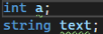
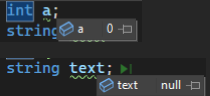
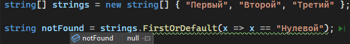
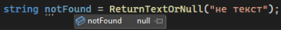
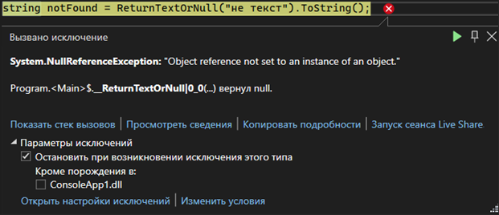
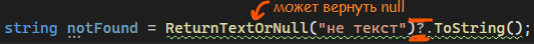
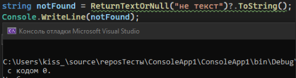
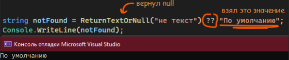
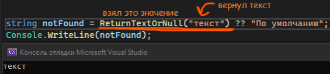

Вы могли заметить, что мы все больше и больше стараемся сократить наш код – делим код на универсальные блоки, используем классы, в каких-то моментах убираем фигурные скобки из условий и циклов. Сегодня мы научимся делать быстрые проверки на пустоту и сокращать простые одностроные if/else, реализуя их не на 8 строк, а на одну

Начнем с простых проверок на пустоту.

---

## Продолжения действия только если слева не null

Что, если у нашей переменной нет никакого первоначального значения? Что, если она ничему не равна? Например, у меня есть вот такие две простые переменные



Мы понимаем, что внутри них нет значений, однако коду это тоже нужно как-то обозначить. Для этого, в программировании есть значение по умолчанию – пустота, null. Для всех типов данных (КРОМЕ ЧИСЛОВЫХ), если внутри нее нет значения, у нее будет значение null. Подробнее об этом можете посмотреть в статье про [переменные](/csharp/variables)

В случае числовых типов данных, значение по умолчанию – 0. С помощью отладки я посмотрю, что находится внутри моих переменных, и увижу пустое значение



Кроме того, что после равно может ничего не быть, бывают случаи, когда код нам возвращает пустоту. Например, методы или Linq запросы могут возвращать null. Например, в этом Linq запросе код не нашел элемент, который равен «Нулевой», и вернул значение по умолчанию – null



Или вот, я создала метод, который будет возвращать текст или null. Если условие не подходит, мы возвращаем null. Я вызвала метод, txt у меня равен «не текст», а значит условие неверно и в переменной будет Null

```csharp
string ReturnTextOrNull(string txt)
{
    if (txt == "текст")
        return txt;
    else
        return null;
}

string notFound = ReturnTextOrNull("не текст");
```



> **ВАЖНО — если у меня переменная null, тогда я не могу делать с ней никакие операции**

Например, я захотела вызвать метод ToString() к этой переменной, но она была null. Тогда, код покажет мне ошибку



Значит, мне нужно реализовать проверку на то, не null ли моя переменная. Я могу сделать это с помощью if (notFound != null), однако тогда нужно писать достаточно много текста. Вместо этого, я могу просто написать вопросительный знак после кусочка кода, который может мне потенциально вернуть null

```csharp
string notFound = ReturnTextOrNull("не текст")?.ToString();
```



Тогда, если значение и правда было null, код просто не пойдет дальше. Метод ToString не выполнится, а значит и ошибки не будет.

```csharp
string notFound = ReturnTextOrNull("не текст")?.ToString();
Console.WriteLine(notFound);
```



Но что, если в случае null, я хочу присвоить своей переменной какое-то значение по умолчанию?

---

## Проверка на пустоту

Для присвоения значения в случае null я могу прописать следующий if

```csharp
string notFound = ReturnTextOrNull("не текст");
if (notFound == null)
    notFound = "По умолчанию";
```

Однако, это опять же долго. Опять же, я могу выполнить это условие в одну строчку – мне нужно поставить два равно после кода, который может потенциально вернуть null, а после них написать значение, которое я хочу, чтобы присвоилось. Тогда, если значение было равно пустоте, тогда у меня присвоится значение правее ??. Если значение было **не** равно пустоте, тогда присвоится значение левее ??

```csharp
string notFound = ReturnTextOrNull("не текст") ?? "По умолчанию";
Console.WriteLine(notFound);
```





Уже понятно, что вещь это удобная, так как она сокращает наш код. У нас может возникнуть вопрос, а если мы простой однострочный if записали в одну строку, можем ли мы так сделать и для других if?

---

## Сокращение if

Мы можем сократить запись для конструкции if/else, даже тех, которые к null никак не относятся. Такие выражения называются **тернарными**

Например, у меня есть такое условие

```csharp
string notFound = ReturnTextOrNull("текст");

if (notFound == "текст")
    notFound = "Метод вернул текст";
else
    notFound = "Метод вернул пустоту";

Console.WriteLine(notFound);
```

Его я могу представить следующим образом

```csharp
string notFound = ReturnTextOrNull("текст") == "текст" ? "Метод вернул текст" : "Метод вернул пустоту";
Console.WriteLine(notFound);
```

Кратко - любой if, который существует **чисто для того**, чтобы присвоить в переменную разные значения, и не делает больше ничего, можно превратить в тернарное выражение

У тернарников следующая структура построения:


- Условий может быть несколько, перечисленные через логические операторы И (&&) или ИЛИ (||)
- Выражений должно быть обязательно 2 – для true или false
- Тернарники можно применять только для присваивания какого-то значения

---

## Итог

- Хочу сделать так, чтобы код не шел дальше, если он встретил null - **ставлю ? после null-значения**
- Хочу внести значение по умолчанию, если вдруг переменная была равна Null - **ставлю ?? и после него значение по умолчанию**
- Если я хочу сократить условие, внутри каждого действия которого есть присваивание значения в переменную - **строю if через ? :**
