По-хорошему, все для стабильной работы надо тестировать. Как и люди пинают роботов в Boston Dynamics чтобы посмотреть, насколько они стабильны, так и мы должны придумать всевозможные тесты на проверку стабильности и вариативности написанного нами кода. Сделать это можно при помощи библиотеки NUnit и отдельного проекта.

Я не научу вас как правильно составлять тест-кейсы, видам тестирования и прочему огромному теоретическому бекграунду тестирования, так как это очень большой пласт информации, который нужно рассматривать в отдельных курсах. Но, я кратко покажу вам, каким образом можно тестировать свой код на C#

---

## Настройка главного проекта

У меня есть маленькое приложение, которое ничего не делает, просто имеет пустой класс Program.cs

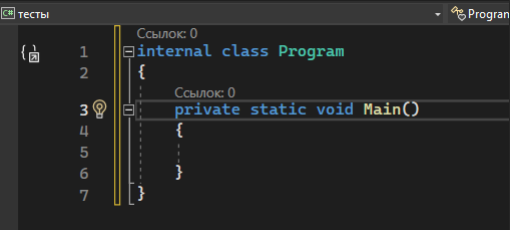

…один класс TestData который хранит в себе тестовые данные некоторых файлов

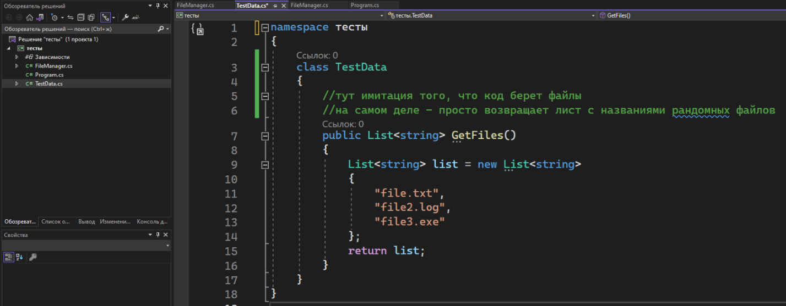

```csharp
namespace тесты
{
    public class TestData
    {
        //тут имитация того, что код берет файлы
        //на самом деле - просто возвращает лист с названиями рандомных файлов
        public List<string> GetFiles()
        {
            List<string> list = new List<string>
            {
                "file.txt",
                "file2.log",
                "file3.exe"
            };
            return list;
        }
    }
}
```

…и один класс FileManager, который берет все «файлы» из первого класса, а потом смотрит, есть ли в этом листе запрошенный файл.

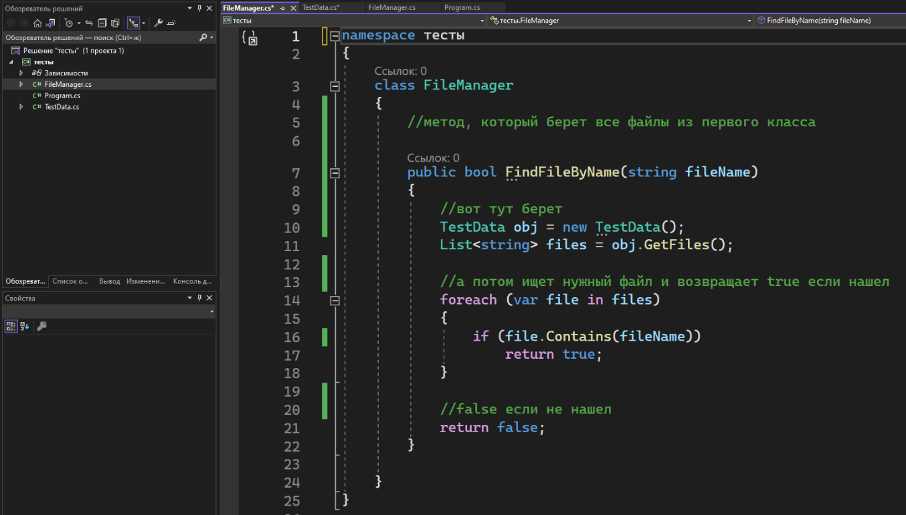

```csharp
namespace тесты
{
    class FileManager
    {
        //метод, который берет все файлы из первого класса

        public bool FindFileByName(string fileName)
        {
            //вот тут берет
            TestData obj = new TestData();
            List<string> files = obj.GetFiles();

            //a потом ищет нужный файл и возвращает true если нашел
            foreach (var file in files)
            {
                if (file.Contains(fileName))
                    return true;
            }

            //false если не нашел
            return false;
        }
    }
}
```

Мне и не требуется иметь код в Program.cs либо в любой другой основной программе. Тестируем мы именно отдельные классы (модули), а это значит, что приложение должно быть модульным (разделенным на классы).

---

## Создание тестового проекта

Чтобы начать тестирование, нам необходимо создать отдельный проект. Для этого ПКМ нажмем по решению -> добавить -> создать проект

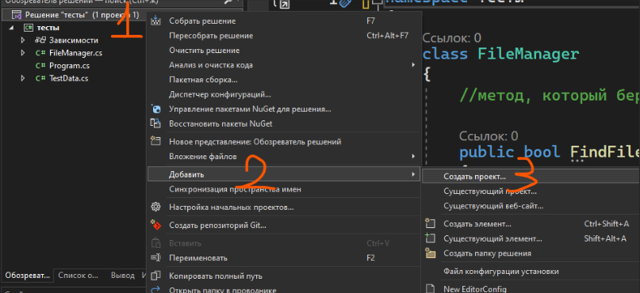

Перед нами появится то же самое окно, которое появляется, когда мы создаем новый проект. В поиске мы должны написать NUnit – это библиотека, при помощи которой мы будем создавать тесты. Выберем самый первый появившийся вариант, для C#

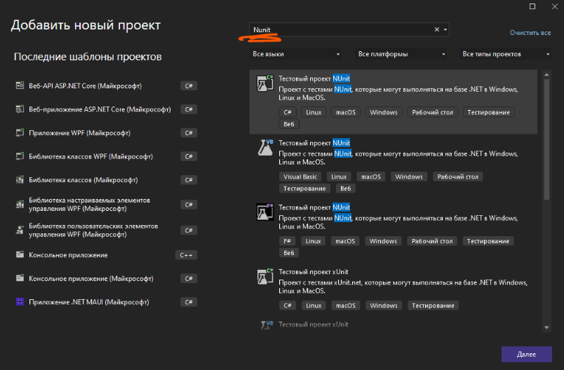

Далее мы как-либо называем проект, снова выбираем версию, и создаем. Все как при создании любого другого приложения

При создании перед нами появится класс с ошибками. Это нормально, ошибки появляются потому, что проект пока что только строится и докачивает пакет NUnit (этот пакет вы, кстати, можете найти в управление пакетами Nuget). Как только он все докачает, то все станет зеленым. Важно: для того, чтобы все загрузилось, у вас должен быть интернет

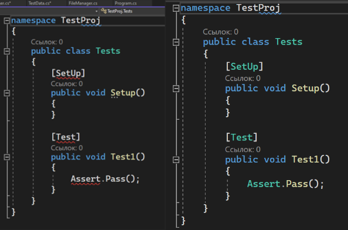

Разберем подробнее что здесь что

Внутри класса Tests хранятся 2 метода – Setup и Test1. Эти два метода помечены какой-то штукой в квадратных скобках – **атрибутами**. Этот атрибут задает поведение для метода:

- Атрибут **SetUp** говорит методу запустится перед всеми тестами, чтобы их настроить (создать переменные, задать первоначальные значения и прочее)
- Атрибут **Test** говорит методу, ну, быть тестом. Без этого атрибута Visual Studio подумает, что это самый обычный метод, как и все те, что мы делали до этого, и не сможет запустить тест. Так что в каждом методе, который должен быть тестом, должен быть этот атрибут Test

Внутри метода Test1 мы видим одну строчку кода – **Assert.Pass();** - это, на данный момент, заглушка. **При помощи класса Assert проводятся тесты**, а Pass – просто метод, который сделает тест намеренно пройденным, не проверяя ничего.

---

## Работа с тестами

Внутри Assert есть огромное количество проверок: IsNull – равна ли переменная Null, Less – меньше ли переменная n-ому значению, Negative – является ли значение меньше нуля и прочее прочее прочее. Опять же, список огромен, все что нам требуется – написать Assert. и искать в появившемся списке интересный нам тест

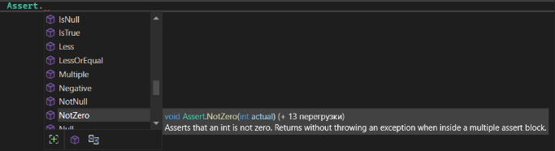

Я верну Assert.Pass(); чтобы показать, как работают тесты

Чтобы запустить все тесты внутри решения, нужно перейти во вкладку «Тест» и выбрать «Запуск всех тестов»

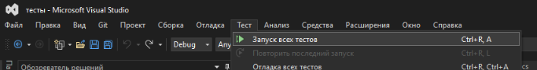

Все решение соберется и перед нами появится вот такое вот окошко, где галочкой будут показаны все пройденные тесты, крестиком – непройденные, а окружность – тест, который не запустился

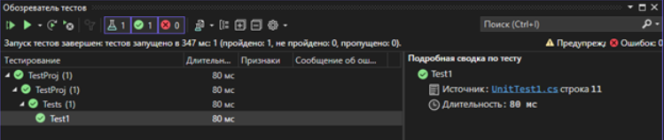

За тест будет считаться каждый метод. Если внутри одного метода есть, например, 5 Assert-ов, и один из них не выполнился, весь тест считается за невыполненный.

Теперь, я хочу протестировать свои два класса, которые я показала в самом начале лекции. Для этого мне нужно сначала подключить проект (Зависимости\Ссылки у проекта с тестами -> Добавить ссылку на проект и галочку у нужного проекта)

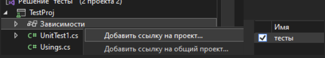

А потом нужно создать переменные с ними, их я буду делать в SetUp

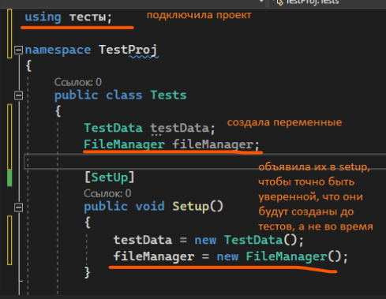

```csharp
using тесты;
{
    namespace TestProj
    {
        public class Tests
        {
            TestData testData;
            FileManager fileManager;

            [SetUp]
            public void Setup()
            {
                testData = new TestData();
                fileManager = new FileManager();
            }
        }
    }
}
```

Напомню, что TestData отвечает за файлы, а FileManager – за поиск файлов из TestData

Напишу три теста для TestData – создался ли лист (не null), не пустой ли он (лист.count > 0) и точно ли там названия файлов (элемент листа имеет точку)

Точно также для FileManager – три теста – находится ли нужный файл, найдется ли пустое название (не должно), и найдется ли что-то если я передам null (опять же, не должно)

Заметьте, что каждый тест помечен атрибутом Test, а сами тесты сделаны через Assert в отдельном методе

```csharp
using тесты;
{
    namespace TestProj
    {
        public class Tests
        {
            TestData testData;
            FileManager fileManager;

            [SetUp]
            public void Setup()
            {
                testData = new TestData();
                fileManager = new FileManager();
            }

            [Test]
            public void ListTest1()
            {
                Assert.IsNotNull(testData.GetFiles());
            }

            [Test]
            public void ListTest2()
            {
                Assert.Greater(0, testData.GetFiles().Count);
            }

            [Test]
            public void ListTest3()
            {
                var list = testData.GetFiles();

                foreach (var item in list)
                {
                    Assert.IsTrue(item.Contains("."));
                }
            }
            [Test]
            public void FileTest1()
            {
                Assert.IsTrue(fileManager.FindFileByName("file2.log"));
            }

            [Test]
            public void FileTest2()
            {
                Assert.IsFalse(fileManager.FindFileByName(""));
            }

            [Test]
            public void FileTest3()
            {
                Assert.IsFalse(fileManager.FindFileByName(null));
            }
        }
    }
}
```

Запущу все тесты и увижу следующее. Во первых – когда он искал пустоту, он нашел такой файл, хотя не должен был. А также, когда мы отправили туда null, код выдал ошибку, хотя опять же, не должен был.

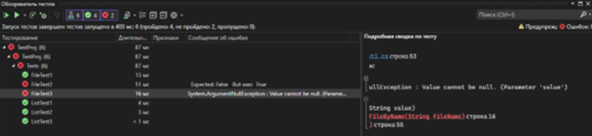

Работа тестировщика на этом этапе заканчивается, снова включается разработчик. При помощи таких тестов мы можем понять поведение нашего кода и исправить его. Например, я поправлю код в FileManager так, чтобы все тесты были пройдены

Тогда, код в FileManager.cs будет выглядеть вот так

```csharp
namespace тесты
{
    class FileManager
    {
        public bool FindFileByName(string fileName)
        {
            //добавлю строку для null
            if (fileName == null) return false;

            TestData obj = new TestData();
            List<string> files = obj.GetFiles();

            //a потом ищет нужный файл и возвращает true если нашел
            foreach (var file in files)
            {
                //изменю условие с Contains на ==
                if (file == fileName)
                    return true;
            }

            //false если не нашел
            return false;
        }
    }
}
```

И снова попробую запустить тесты. Теперь мой код будет готов к любым непреднамеренным передачам данных, не будет кидать ошибки, и будет работать корректно

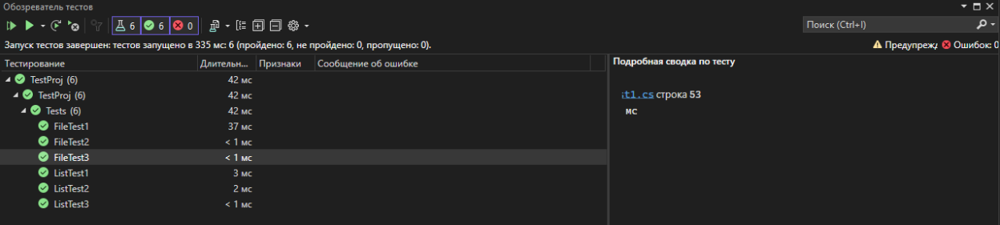

Модульное тестирование обеспечивает проверку кода на отрабатывание во всех ситуациях - хороших, плохих и даже странных. Такое покрытие, которые мы прописали выше, позволяет проверять внесенные изменения и всегда знать - корректно ли работает новый\старый код, или нужно внести правки
