После того, как мы узнали про [Linq запросы](/csharp/linq), мы узнали, что у коллекций тоже есть свои методы, которые могут сами взять все значения из переменных и работать с ним. Например, разберем следующий код

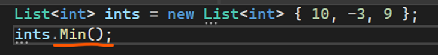

Здесь у нас есть гибкая коллекция чисел ints. Из нее я хочу взять минимальное число. Чтобы это сделать, мне нужно просто написать ints.Min(); Метод Min сам подтянет все значения из переменной ints, и, с помощью перебора и условия, найдет минимальное значение и вернет его. Как же он подтянет все значения из переменной ints? Посмотрим, как устроен метод Min, и увидим, что внутри него есть перегрузка с числовой коллекцией, слева от которой написано слово **this**

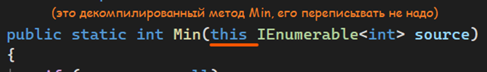

Мы можем писать такие же методы, однако для начала нам нужно разобраться, что такое this

This имеет два определения. При помощи него мы можем обратиться к значениям внутри _этого_ класса (буквально, values in **this** class), или к значениям из _этой_ переменной (аналог – values from **this** variable)

---

## This, как значения из этого класса

Ключевое слово this указывает на текущий объект данного класса. Соответственно через this мы можем обращаться внутри класса к любым его объектам (методы, переменные). Через this мы можем даже передавать текущий экземпляр класса в другие методы!

Например, у меня есть свой тип данных, моя модель данных Human. Выглядит она следующим образом

```csharp
internal class Human
{
    public string Name;
    public int Age;
    public string[] MyFavoriteColour;
}
```

Я хочу сделать [конструктор](/csharp/classascontainer) для этого типа данных. Однако параметры, которые я передаю в конструктор, называются также, как и переменные внутри класса

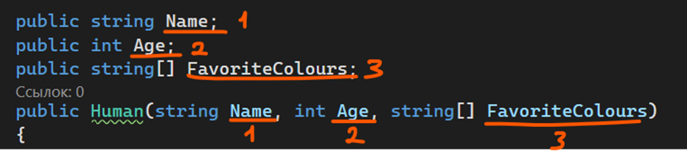

Если я просто начну присваивать Name к Name, не будет понятно, что к чему я хочу присвоить.

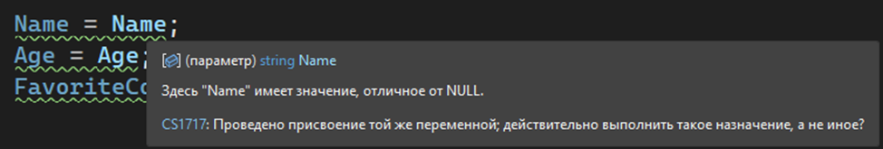

Я же хочу сказать, что я хочу присвоить передаваемые значения к переменным **этого** класса. Переводим слово **этого** – получаем this

Получается, чтобы использовать объекты этого класса, мне необходимо написать this.названиеобъекта. Тогда, код поймет, к чему именно мне нужно обратиться

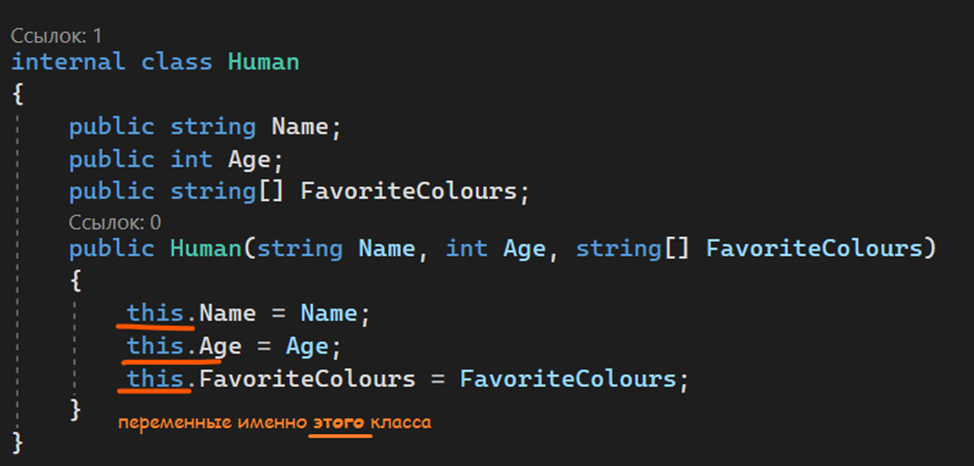

```csharp
internal class Human
{
    public string Name;
    public int Age;
    public string[] MyFavoriteColour;

    public Human(string Name, int Age, string[] MyFavoriteColour)
    {
        this.Name = Name;
        this.Age = Age;
        this.MyFavoriteColour = MyFavoriteColour;
    }
}
```

Через this можно передавать значения всего класса в другие [методы](/csharp/methods). Например, я внедряю метод по клонированию человека (до чего техника дошла…). На данном этапе, если я хочу клонировать все значения, то мне придется вручную вписывать каждый из объектов в конструктор

```csharp
public Human CloneObject()
{
    return new Human(this.Name, this.Age, this.MyFavoriteColour);
}
```

Но я буквально использую **это** имя, **этот** возраст и **эти** любимые цвета. Почему я не могу просто взять и передать весь **этот** класс? И, почему сразу не могу, могу!

Однако для этого мне нужно добавить конструктор, который все еще будет переделывать из старого Human новый Human

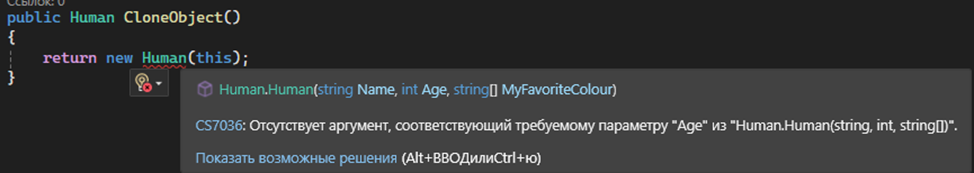

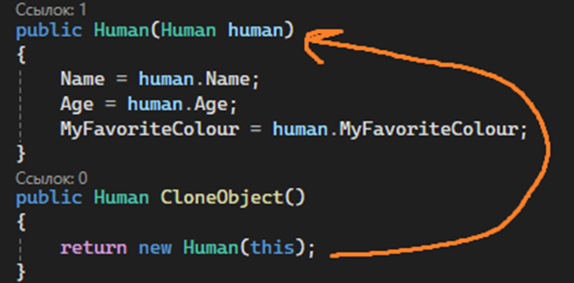

В этом случае я не буду использовать слово this в конструкторе (на самом деле, просто чтобы вас не путать). Это и не нужно, так как противоречий между названиями свойств и названием передаваемых параметров нет

---

## This, как значения из этой переменной

Теперь, вернемся к [LINQ](/csharp/linq) и методу Min. Слово this в этом случае говорит там, что методу нужно взять данные из **этой** переменной и сохранить их в переменной source. Если я хочу взять переменные из **этой** интовой коллекции, тогда моя переменная так и будет объявляться – **this** IEnumerable\<int\>. После этого, я напишу название параметра, где значения переменной будут хранится.

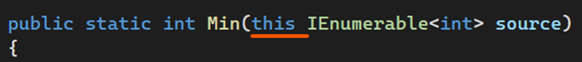

Если у параметра метода слева стоит this, то значение для этого параметра автоматически заполнится из переменной, из которой ее вызвали. По факту, внутрь метода ничего передавать не нужно


Методы, которые сами получают значение текущей переменной и работают с ней, называются **методами расширения.** И такие методы мы можем создавать сами

Сразу отвечу на вопрос – а зачем они нам? В маленьком проекте в них нет необходимости. НО – если ваш проект большой, или если вы часто делаете одни и те же действия с одним и тем же типом данных, то вы можете сделать надстройку над типом данных, вызывая метод расширения

Рассмотрим преобразование [DateTime](/csharp/datetime) в читабельный текст, и скажем, что мы сделали его не через метод расширения.

- Если у вас большой проект, вам придется искать статический метод, фиг пойми где, фиг пойми как, который отработает так, как вам нужно. И не факт, что вы его найдете, а не просто забьете и создадите собственный, практически идентичый.
- Если вы используете DateTime в разных классах, и сделали метод преобразования DateTime в текст приватным, вам каждый раз придется копировать исходный метод, и перемещать его в новый класс

С методом расширения, вы сможете создать переменную типа DateTime, и через точку быстро найти нужный метод. Это выглядит намного удобнее, чем примеры выше

---

## Методы расширения

Чтобы разобраться в их работе, возьмем тот же пример с датами, но начнем с самого начала, когда еще метода нет вовсе. Я создам переменную с какой-либо датой. Эту переменную я хочу привести в текстовый вид формата «Дата: год.месяц.день. Время: часы:минуты:секунды». Я могу это сделать вручную:

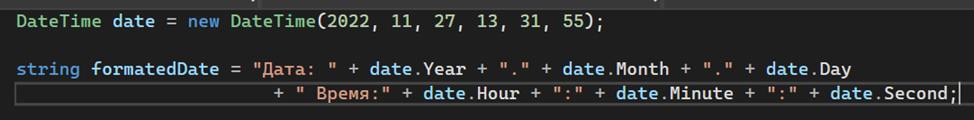

Однако согласитесь, что каждый раз прописывать такой код для каждой переменной это слишком муторно. А если муторно, я могу сократить вызов этого кода, закинув его в метод.

Опять же, я могу сделать метод, который в себя будет просто принимать дату

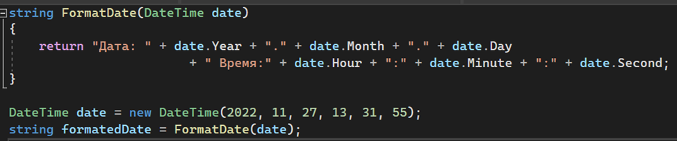

Однако в этом случае нам постоянно придется писать внутрь этого метода какую-то переменную. Это тоже может быть долго, если название переменной большое, или внутри стоит [тернарное выражение](/csharp/ternar). Плюс, не всегда можно знать о том, что такой метод вообще существует. Проще будет, что когда мы после нашей переменной с датой напишем точку, нам отобразится возможные методы расширения, которые мы можем использовать по отношению к этой переменной

Тогда, чтобы наш метод стал методом расширения, немного видоизменим его. Во-первых, перед параметром **DateTime date** добавим слово **this**, чтобы метод знал, что данные нужно взять именно из **этой** переменной. Однако, после этого у нас появится ошибка. Метод требует универсальный класс.

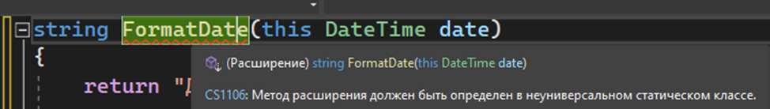

Давайте тогда переместим этот метод в какой-то универсальный класс (по факту, просто отдельный [статический](/csharp/staticclass) класс).

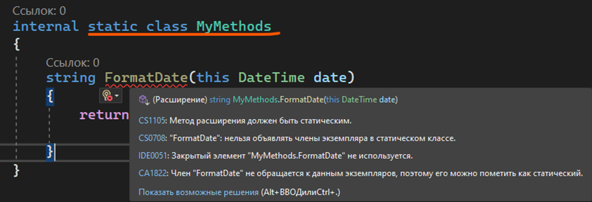

После этого появятся еще больше ошибок, все они в частности зависят от доступа и статичности. Нам этот метод необходимо сделать публичным и статичным. Тогда, все ошибки пропадут

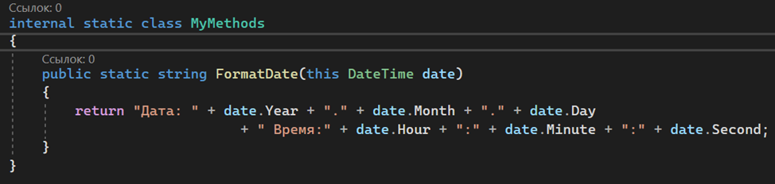

```csharp
internal static class MyMethods
{
    public static string FormatDate(this DateTime date)
    {
        return "Дата: " + date.Year + "." + date.Month + "." + date.Day
            + ". Время: " + date.Hour + ":" + date.Minute + ":" + date.Second;
    }
}
```

И, после исправления ошибок, мы можем выделить основные принципы создания методов расширений

- Все методы расширения должны быть в отдельном статическом классе
- Сам метод расширения должен быть публичным и статичным (public static)
- Внутри метода расширения должен быть параметр с ключевым словом this, чтобы метод смог взять значения переменной, к которой он привязан
- Метод расширения может быть использован только к переменным того типа данных, что указан в параметре (если в параметре DateTime, то тогда мы можем использовать этот метод только с переменными типа DateTime)

Как же использовать этот метод? Также, как и с LINQ – у нас просто есть какая-то переменная нужного нам типа данных, и чтобы вызвать метод расширения, необходимо написать названиеПеременной.МетодРасширения().

Если вдруг у вас метод подсвечивается с ошибкой, мол, он не найден, нажмите по нему alt+enter или нажмите на лампочку -> Быстрые действия и рефакторинг -> пункт с Using. Такое может происходить, если метод расширения находится в другом файле, или, тем более, в проекте

```csharp
DateTime date = DateTime.Now;
string formatedDate = date.FormatDate();
Console.WriteLine(formatedDate);
```

Таким образом, FormatDate сам возьмет данные date, отформатирует их, и запишет в переменную formatedDate. Если мы выведем значение этой переменной, мы увидим следующее

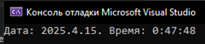

Методы расширения, как и обычные методы, могут принимать в себя неограниченное количество параметров. Главное, чтобы у первого параметра было ключевое слово this.

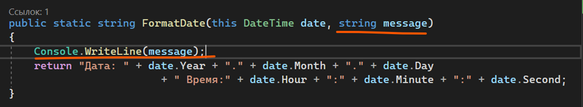

```csharp
public static string FormatDate(this DateTime date, string message)
{
    Console.WriteLine(message);
    return "Дата: " + date.Year + "." + date.Month + "." + date.Day
        + ". Время: " + date.Hour + ":" + date.Minute + ":" + date.Second;
}
```

При обращении к этому методу, присваивание значений в параметры начнется со второго параметра. Например, здесь я передаю какой-то текст. Текст будет записан не в переменную date, а переменную message, так как первое значение записалось из самой переменной date

```csharp
DateTime date = DateTime.Now;
string formatedDate = date.FormatDate("попробовали внедрить второй параметр");
Console.WriteLine(formatedDate);
```

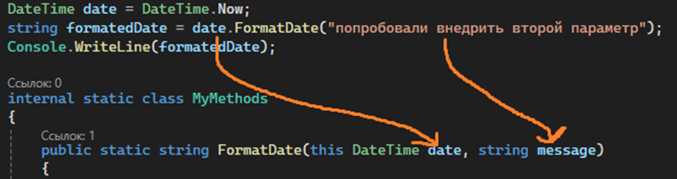

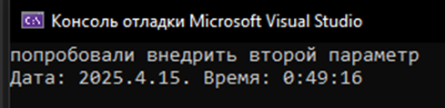
