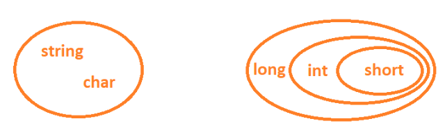
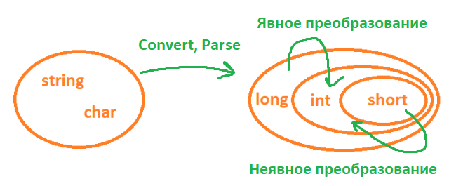

Преобразование - тоже самое, что и конвертация. Использовать явное и неявное преобразование можно для того, чтобы не писать каждый раз конвертацию, когда это не необходимо. Кратко - писать код можно меньше.

Вопрос: а когда это нужно? Давайте разберем на маленьком макете. Возьмем две группы типа данных - строковые (string, char) и числовые (short, int и long). Для числовых, сделаю кружок для каждого, по мере возрастания - short входит в int, int входит в long



Между всеми типами данных мы можем использовать конвертацию. ИЛИ, давайте глянем на это по-другому

У нас получается два круга, не связанные друг с другом - я не могу прибавить число к строке, я не могу убрать третий символ из числа.

- Если я хочу переделать тип данных из одного круга в другой, например, из string в int, я использую **конвертацию**
- Если я хочу переделать тип данных из маленького круга в больший в рамках одной группы, например, из short в int, я использую **неявное преобразование**
- Если я хочу переделать тип данных из большего круга в меньший в рамках одной группы, например, из int в short, я использую **явное преобразование**



Разберем на примерах

---

## Неявное преобразование

Скажем, у меня есть int-овое значение и я хочу поместить его в переменную типа данных long. **Неявное** преобразование можно выполнить, если значение может уместиться в переменной без усечения или округления. Long больше чем int, значит у нас все хорошо получится, и никакую дополнительную конвертацию писать не нужно

```csharp
int num = 3758392;
long bigNum = num; //все ок!
```

Тем не менее если преобразование нельзя выполнить без риска потери данных, код требует явно указать, что за тип данных мы хотим получить – явное преобразование, которое называется приведением.

---

## Явное преобразование (приведение)

**Приведение** — это способ явно указать компилятору, что необходимо выполнить преобразование и что мы в курсе, что может произойти потеря данных или приведение может завершиться сбоем во время выполнения.

Приведение можно выполнить двумя способами:

1. С помощью круглых скобок перед переменной. В этом случае, если при приведении типа данных что-то пойдет не так, тогда код выкинет нам ошибку, и продолжение будет невозможно. Такое преобразование рискованно

   ```csharp
   double dou = 1024.5;
   int num = (int)dou;

   Console.WriteLine(num); //1024
   ```

2. С помощью оператора as. В этом случае, если при приведении типа данных что-то пойдет не так, тогда **вместо значения в переменную напишется null**, а сам код продолжит свою работу. Такое преобразование безопасно, так как не выкинет ошибку.

   ```csharp
   object dou = 1024.5;
   string text = dou as string;

   Console.WriteLine(text); //null
   ```
