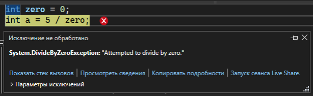
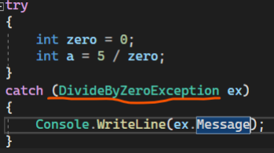
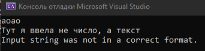
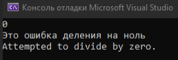
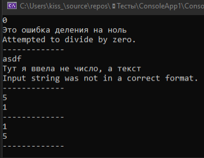

Иногда наша программа выкидывает нам ошибку. После этих ошибок программа заканчивается, однако, мы хотим, чтобы даже после критической ошибки, программа продолжила работу, только лишь оповестив пользователя о том, что что-то не так.



Для решения этой проблемы можно было бы написать много условий, что в случае этой ошибки вывести это, в случае другой ошибки – вывести это. Однако, что будет если ошибок будет 100 – писать 100 условий?

Как раз-таки для обработки ошибок существует конструкция try-catch-finally.

Try-catch позволяет нам выполнить какой-то код, который находится в блоке try. Если этот код выкинул ошибку, тогда выполнение кода в try прервется мы перейдем в блок catch. Оттуда мы можем узнать, что именно за ошибка произошла и, например, вывести ее в консоль.

```csharp
try
{
    int zero = 0
    int a = 5 / zero;
}
catch (Exception ex)
{
    Console.WriteLine(ex.Message);
}
```

Здесь мы видим, что после слова catch идут круглые скобки, где указана переменная ex типа данных Exception. Exception – как раз таки ошибка, которую мы получаем. Если наша ошибка хранится в переменной ex, мы можем сделать с ней что угодно – узнать источник, вывести сообщение ошибки, узнать последовательность действий, которая привела к ошибке и прочее. В этом случае, я хочу вывести сообщение об ошибке, я выведу его с помощью Message

Exception берет вообще любую ошибку, которая возникает у меня в коде. Если я хочу обработать какую-то определенную ошибку, например, деление на ноль, тогда вместо Exception я могу написать тип данных ошибки – тот же, что показывает нам Visual Studio




Если я хочу обработать несколько разных частных ошибок, в которых будет разный код, я могу сделать несколько блоков catch. Я немного видоизменю код, чтобы я смогла вводить делитель числа с помощью Console.ReadLine(). Тогда, у меня может появиться потенциальная ошибка – FormatException. Я добавлю еще один catch для этого

```csharp
try
{
    string zero = Console.ReadLine();
    int a = 5 / Convert.ToInt32(zero);
}
catch (DivideByZeroException ex)
{
    Console.WriteLine("Это ошибка деления на ноль");
    Console.WriteLine(ex.Message);
}
catch (FormatException ex)
{
    Console.WriteLine("Тут я ввела не число, a текст");
    Console.WriteLine(ex.Message);
}
```





Также есть необязательный блок finally. Если в конструкции try-catch есть блок finally, после выполнения try или catch, код пойдет в этот блок, как завершающий этап выполнения обработки ошибок

Если кратко:

- Когда все хорошо, выполняется try-finaly
- Когда все плохо, выполняется try-catch-finally

Опять же, видоизменю код, чтобы у меня переменная с делителем существовала не только в try-catch, но и в принципе в коде. Тогда в finally я смогу написать логику для повторного ввода переменной, так как finally выполняется всегда

```csharp
string zero = Console.ReadLine();

while (true)
{
    try
    {
        int a = 5 / Convert.ToInt32(zero);
        Console.WriteLine(a);
    }
    catch (DivideByZeroException ex)
    {
        Console.WriteLine("Это ошибка деления на ноль");
        Console.WriteLine(ex.Message);
    }
    catch (FormatException ex)
    {
        Console.WriteLine("Тут я ввела не число, a текст");
        Console.WriteLine(ex.Message);
    }
    finally
    {
        Console.WriteLine("--------------------------");
        zero = Console.ReadLine();
    }
}
```


