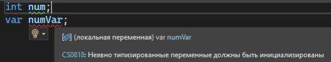
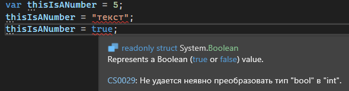

Иногда, когда мы создаем переменные, Visual Studio нам вместо определенного типа данных переменной предлагает подставить **var**. Что же это такое и с чем его едят?

```csharp
int num = 5: //int тут излишен, и так понятно, что это целое число
var numVar = 5;
```

Var не может понять что за тип данных хранится в этой переменной, если значения нет. С обычными типами данных проблем нет



Также var не является аналогом для слаботипизированной переменной. Проще говоря - если вы создаете переменную через var, это не значит, что там можно будет хранить и число, и текст, и класс, и коллекцию и прочее прочее прочее.

Var - просто удобное слово для того, чтобы не писать тип данных каждый божий раз. Компилятор при запуске смотрит на значение переменной, подставляет вместо var нужный тип данных, и работает с ней дальше как с этим типом данных.

Если мы попробуем присвоить значение другого типа данных для переменной, к которой var уже подставил тип данных, мы увидим ошибку



Var выглядит очень удобно, но есть правило, когда его стоит использовать, а когда нет. **Если справа от равно сразу понятно, что за тип данных у нас будет использоваться, тогда стоит ставить var. Если не понятно – стоит явно указать тип данных**

Раз мы поняли, что компилятор может сам понимать, что за тип данных мы хотим от него получить, даже без конвертера, можно задуматься – а может ли код конвертировать один тип данных в другой сам по себе? Может. Мы можем использовать [явное и неявное преобразование переменных](/csharp/transformation)
