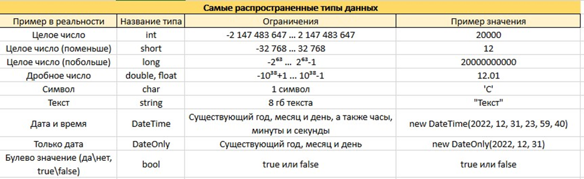
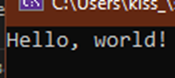
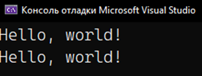
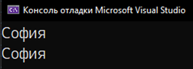

## Переменные

Переменная — некое значение, которому дали имя. Значение внутри переменной может меняться. Кратко говоря — коробочка с названием, в которой мы можем хранить что-то одного типа. Например\

- В коробку «ТолькоКрасные» я могу положить только красные карандаши и не могу положить синие. Однако количество и вид карандаша может быть любым. Здесь «карандаш» — тип данных, а «ТолькоКрасные» — имя переменной
- В коробку «MyNumber» я могу положить только целое число и не могу положить дробное. Однако число может быть любое. Целое число — тип данных. MyNumber — название переменной

Базовые типы данных в C# очень много. Мы можем взять парочку основных:

- int - целое число
- double - дробное (потому что два числа, разделенные точкой, 45.5, double - два)
- string - текст
- char – символ
- bool – буленово значение



Их все (и даже больше!) можно использовать для того, чтобы создавать переменные. Создаются они по примеру **типданных название;**

---

Создадим переменную MyNumber из верхнего примера. Мы уже знаем, что целое число это int, значит у нас получится

```csharp
int MyNumber;
```

В конце каждой строчки в C# мы будем писать точку с запятой. Она – аналогия точки в предложениях. Мысль закончена – ставим точку. Создали переменную, присвоили значение, блаблабла – ставим точку с запятой.

Изначально, внутри переменной ничего нет. Ничего в мире программирования – null. Чтобы присвоить ей значение, мы пишем, что наша **переменная равна значению.** Не наоборот, иначе ничего не заработает! Присваивание значения это всегда переменная = значение

```csharp
int MyNumber;
MyNumber = 1;
```

Также, значение в эту переменную можно сразу записать при ее создании, не разбивая код на две строки. Тогда, верхние две строчки сократятся в одну

```csharp
int MyNumber = 1;
```

Наше «ничего», т.е. null, тоже можно присвоить, но только к типам данных, которые не являются числами

```csharp
string myText = null; //все ок, но ему не очень нравится, что переменная пустая
int MyNumber = null; //не ок, null для чисел - 0
```

Чтобы все равно разрешить хранение null в переменной, даже в числовых, после типа данных нужно поставить «?».

```csharp
string? myText = null; //все ок
int? MyNumber = null; //все ок
```

Запомните этот символ как «штучка для null», она вам понадобится, когда мы будем разбирать такую вещь, как [тернарные выражения и проверки на null](/csharp/ternar). Но об этом позже

Вернемся к созданию переменных. Если их много и они все одного типа данных, их можно обьявить подряд, через запятую.

```csharp
int numberThree, numberFour, numberFive;
numberThree = 3;
numberFour = 4;
numberFive = 5;
```

Также, помним что значение наших переменных можно записать сразу при создании, тогда строка будет выглядеть следующим образом.

```csharp
int numberThree = 3, numberFour = 4, numberFive = 5;
```

---

## Ввод-вывод в консоль

Ввод и вывод в консоль — это методы (блок кода, которому дали название, позже подробнее о них поговорим). У всех методов после их имени будут стоять круглые скобки.

С названиями в C# все очень просто – я хочу **написать строку** или **прочитать строку** в консоли. Все что мне нужно – запастись переводчиком или знанием английского языка, и перевести необходимое мне действие.

Я хочу **написать строку** – I want to **write a line**

Чаще всего вы встретитесь с тем, что такой метод реально существует, и его можно использовать. С вводом-выводом данных в консоль история такая же.

Итак, ввод и вывод в консоль, это методы ReadLine() и WriteLine() соответственно. Но просто так в код их вписать не получится: пустой код и внезапное ReadLine() выдаст ошибку, потому что он не понимает, откуда взять логику для ReadLine – может я читаю строку из файла, из консоли, из программы?

Мы должны сказать коду, что мы хотим использовать консоль, **а именно**, методы ReadLine() или WriteLine()

Если мы слышим это «а именно», значит между первым словом (в нашем случае, консоль), и вторым (ReadLine() или WriteLine()) будет стоять точка

Итого, методы для ввода вывода: **Console.ReadLine()** и **Console.WriteLine()**

---

### Console.WriteLine();

С помощью этого метода мы можем вывести каждый раз новую строку в нашу консоль. Например следующий код выведет нам в консоль Hello, world! и нажмет энтер

```csharp
Console.WriteLine("Hello, world!");
```



Как мы выводим значение напрямую, таким же способом мы можем вывести число 5, 45.5, букву к и прочее – все что угодно может находится внутри этих круглых скобок.

И тут можно вспомнить, что значения могут хранится еще и в переменных. Их тоже можно вывести! Просто вместо значения в Console.WriteLine нужно написать название переменной. Следующий код выведет одно и то же

```csharp
Console.WriteLine("Hello, world!");

string hiiii = "Hello, world!";
Console.WriteLine(hiiii);
```



Здесь нужно запомнить о переменных одну вещь: переменная – прозвище для какого-либо значения. Как например, меня зовут София, но друзья называют меня Софа. София – значение, Софа - прозвище

- Ко мне можно обратиться по полному имени
- Ко мне можно обратиться по прозвищу

```csharp
string sofa = "София";

Console.WriteLine("София");
Console.WriteLine(sofa);
```

И результат будет единым – вы все равно обратитесь ко мне :)



Поэтому для обращения к любому значению внутри переменной – просто введите название переменной. Это также увеличит читаемость кода, если вы будете давать значениям понятные прозвища

Также, если вы не хотите переносить текст на новую строку, вы можете использовать обычный Console.Write(). Тогда значения будут идти в строчку

```csharp
string sofa = "София";

Console.Write("София");
Console.Write(sofa);
```


---

### Console.ReadLine();

Этот метод позволяет нам считать целую введенную **строку** из консоли.

C# - строго типизированный язык, а значит, он не может сам понять, что ему ввели. Он просто знает, что что-то ввели с клавиатуры. 5, true, блабла, все что вы читаете – **текст**, который был введен с клавиатуры. А тип данных для текста – string.

Введенное нами значение надо где-то хранить, поэтому сделаем переменную типа данных string и присвоим ей значение из консоли

```csharp
string input = Console.ReadLine();
```

С этим значением мы тоже можем делать что угодно – выводить, резать, взять только первый символ, но только в рамках текста. Что делать если мы ввели цифру 5 и хотим работать с ней прямо как с цифрой, а не как с текстом? Об этом вы можете просмотреть в статье о [конвертации](/csharp/converters) данных
