## Формат XML

Кроме JSON есть и другой текстовый формат – XML. XML – некий язык разметки, похожий на HTML, с помощью которого можно как писать документацию, так и передавать данные.

Опять же, как и в прошлой лекции, давайте создадим свой тип данных, некую модель Human, которая будет состоять из имени человека, возраста и коллекции любимых цветов.

> **ВАЖНО — для XML тип данных должен быть НЕ internal, а public**

```csharp
public class Human
{
    public string Name;
    public int Age;
    public string[] MyFavoriteColour;
}
```

Если я захочу создать новый экземпляр своей модели, некую переменную, где я буду хранить информацию, я сделаю это, например, следующим образом: создам переменную своего типа данных, а затем заполню ее значениями – текстом, числом и текстовым массивом

```csharp
string[] favoriteColour = new string[] { "Зеленый", "Синий", "Оранжевый" };

Human sofia = new Human();
sofia.Name = "София Алексеевна";
sofia.Age = 60;
sofia.MyFavoriteColour = favoriteColour;
```

Точно такую же информацию я могу представить в виде XML. В чистом виде он выглядит вот так

```xml
<?xml version="1.0" encoding="utf-8"?>
<Human xmlns:xsi="http://www.w3.org/2001/XMLSchema-instance" xmlns:xsd="http://www.w3.org/2001/XMLSchema">
    <Name>София Алексеевна</Name>
    <Age>60</Age>
    <MyFavoriteColour>
        <string>Зеленый</string>
        <string>Синий</string>
        <string>Оранжевый</string>
    </MyFavoriteColour>
</Human>
```

Добавлю описания, чтобы визуально было понятно, что за что отвечает

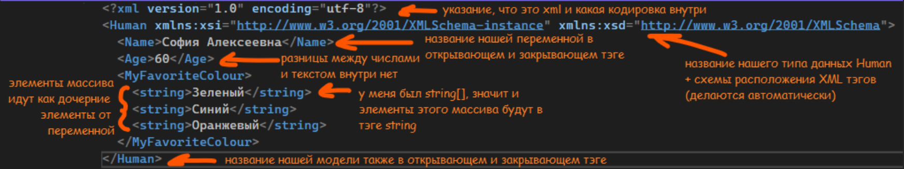

Как мы можем заметить, в отличии от JSON, здесь нет четкого разделения на типы данных, только если это не массив. Переменная Age может быть как типа данных int, так и типа данных double, string, float и т.п. Главное – чтобы название каждого тэга совпадало с названием внутри нашего типа данных – класс называется Human, переменная с именем – Name, переменная с возрастом – Age и т.п.

Значит, если мы видим, что внутри какого-то большого тэга хранятся названия, а не типы данных, мы понимаем, что мы должны создать подобную модель. Если мы видим, что внутри переменной есть еще какие-то дочерние элементы, это значит, что это массив

Рассмотрим пример с листом. Как в предыдущей лекции, создам коллекцию из нескольких людей и добавлю их в гибкую коллекцию – лист.

```csharp
Human sofia = new Human();
sofia.Name = "София Алексеевна";
sofia.Age = 60;
sofia.MyFavoriteColour = new string[] { "Зеленый", "Синий", "Оранжевый" };


Human jenya = new Human();
jenya.Name = "Евгений";
jenya.Age = 16;
jenya.MyFavoriteColour = new string[] { "Темно-зеленый", "Темно-синий" };


Human sasha = new Human();
sasha.Name = "Александр";
sasha.Age = 17;
sasha.MyFavoriteColour = new string[] { "Синий", "Желтый" };

// ///////// Список из людей
List<Human> humans = new List<Human>();
humans.Add(sofia);
humans.Add(jenya);
humans.Add(sasha);
// /////////
```

В случае с XML, все модели Human будут взяты в один общий тэг – ArrayOfHumans. И ему опять же не важно, что это за коллекция, главное, чтобы она была

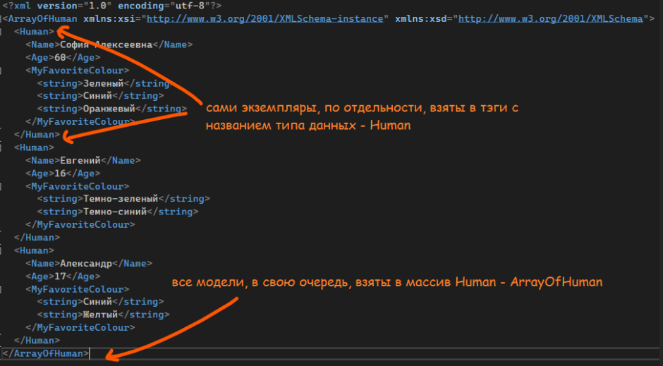

Дальше, давайте разберемся с тем, как работать с XML из кода

---

## Сериализация и десериализация

XML-формат также можно сериализовывать и десериализовывать. Напомню то, что мы обсуждали в [JSON](/csharp/json):

- Десериализация – когда мы читаем текстовый файл (или просто текст с каким-то форматом), переносим его на код, и работаем с ним из кода, т.е из текста в модель
- Сериализация – когда мы из когда записываем данные обратно в текстовый файл или текст, т.е. из модели в текст

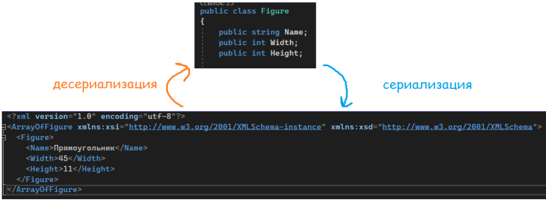

В случае с XML – сериализация – преобразование модели в XML, и десериализация – преобразование XML в модель.

---

## Сериализация в файл

Начнем с сериализации. Чтобы начать работу с XML, необходимо этот XML сериализатор создать. Сделаем отдельную переменную типа данных XmlSerializer, с помощью которой мы будем все сохранять в файл. Этот тип данных сложный, он заставляет нас думать, так что обьявляем мы его через new

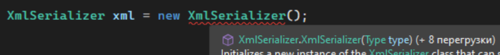

Видим, что на обычное создание у нас код ругается. Он хочет какой-то тип внутри круглых скобок. Этот тип – тип данных, который мы хотим сохранить. Например, сейчас я хочу сохранить свою переменную sofia, она имеет тип данных Human. Значит внутрь круглых скобок я и укажу этот тип данных

Но ему опять что-то не нравится

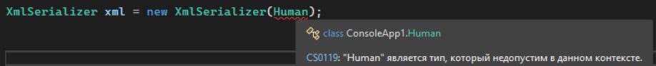

Дело в том, что Human – это, по сути, класс. А мы хотим сказать, что это именно тип данных. Чтобы сделать это именно как тип данных, необходимо написать typeof(ТипДанных), в нашем случае - Human. Вот теперь то все будет хорошо

```csharp
XmlSerializer xml = new XmlSerializer(typeof(Human));
```

Идем дальше. Я хочу использовать переменную xml, а именно, сериализацию. Я так и напишу – xml.Serialize(). Внутрь круглых скобок я должна передать то, что я хочу сериализовать, давайте в этом разбираться

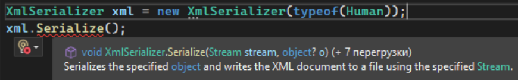

Внутри нам нужно два значения – какой-то стрим, ака поток и какой-то объект. С объектом все понятно – там будет объект, который я хочу сериализовать, т.е. переменную sofia. Но что за поток?

Если кратко, с файлами можно работать не только через File.Write() и File.Read(), но и через некий поток данных, через которых можно понять – доступен ли файл, можно ли сейчас через этот поток что-либо записать, можно ли прочитать этот файл и т.п. Эти потоки – как процесс на компьютере: если мой поток сейчас работает с этим файлом, то никакой другой процесс не может использовать этот файл.

Потоки существуют для того, чтобы частично читать или записывать данные в файл (например, мне нужно прочитать файлик на 2 ГБ. Если я просто воспользуюсь File.ReadAllText, все содержимое файла сохранится в оперативную память, и производительность сильно упадет), или, если чтение\запись - слишком длительный процесс, потоком можно заблокировать файл, пока процесс точно не завершиться.

Так как xml волнуется о защите своих данных и формировании верной структуры, он также просит поток данных.

Итак, нам необходимо открыть наш файл как поток, т.е. создать файловый поток (FileStream), указать, для каких задач мы его создаем (открыть, создать и открыть, записать туда данные) его открыть, и его закрыть. Для потоков существует специальный контейнер – using, где открывающая фигурная скобка – открытие потока, а закрывающая – ее закрытие соответственно. Давайте создадим следующий поток для файла

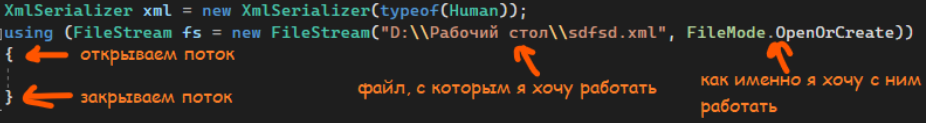

И уже внутри мы будем использовать xml.Serialize(). Первое значение будет fs – наш поток, а второе – объект, который я хочу сериализовать.

```csharp
Human sofia = new Human();
sofia.Name = "София Алексеевна";
sofia.Age = 60;
sofia.MyFavoriteColour = new string[] { "Зеленый", "Синий", "Оранжевый" };

XmlSerializer xml = new XmlSerializer(typeof(Human));
using (FileStream fs = new FileStream("D:\\Рабочий стол\\sdfsd.xml", FileMode.OpenOrCreate))
{
    xml.Serialize(fs, sofia);
}
```

Итак, по итогу, у нас есть несколько пунктов, которые мы должны учитывать:

- Когда мы создаем переменную XmlSerializer, внутри мы должны указать тип данных, который мы хотим сериализовать. Указываем через typeof()
- Для сериализации нам нужен поток, его делаем через using. Внутри указываем путь до файла и то, как мы хотим с ним работать
- Чтобы сериализовать, используем xml.Serialize(). Внутри передаем поток и объект, который мы хотим сериализовать

На выходе, у меня будет следующий файл

```xml
<?xml version="1.0" encoding="utf-8"?>
<Human xmlns:xsi="http://www.w3.org/2001/XMLSchema-instance" xmlns:xsd="http://www.w3.org/2001/XMLSchema">
    <Name>София Алексеевна</Name>
    <Age>60</Age>
    <MyFavoriteColour>
        <string>Зеленый</string>
        <string>Синий</string>
        <string>Оранжевый</string>
    </MyFavoriteColour>
</Human>
```

---

## Десериализация из файла

Для десериализации нам понадобится все то же самое, что было нужно для сериализации – XmlSerializer и поток. Единственное отличие – вместо OpenOrCreate мы только открываем файл, т.е. у нас будет FileMode.Open. Сразу создам переменную и поток

> **ВАЖНО — тип данных XmlSerializer все равно останется в XmlSerializer, даже для десериализации**

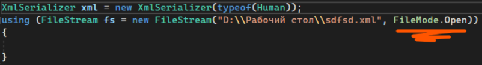

Теперь, я хочу десериализовать данные из файла. Получившийся результат я хочу сохранить в некую переменную типа данных Human. Создам ее чуть выше

```csharp
Human human;

XmlSerializer xml = new XmlSerializer(typeof(Human));
using (FileStream fs = new FileStream("D:\\Рабочий стол\\sdfsd.xml", FileMode.Open))
{

}
```

А затем, я присвою human десериализуемое значение. Чтобы получить это значение, надо использовать мой сериализатор (переменная xml), а именно, десериализацию. Внутри, в круглых скобках, мне необходимо только указать поток файла, из которого я хочу прочитать

Однако, просто записав так, у меня будет ошибка

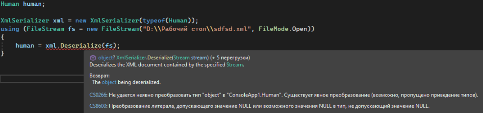

Ошибка решается очень просто – либо alt+enter (или ПКМ -> Быстрые действия и рефакторинг) и выбор самого первого пункта

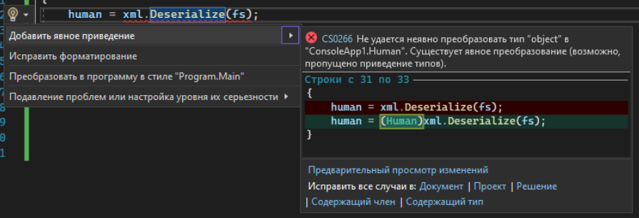

…либо [явно преобразовать](/csharp/transformation) к типу данных, который я хочу получить в итоге. Для этого, перед значением, надо в круглых скобках указать, что за тип данных я хочу получить

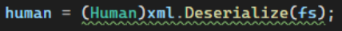

По итогу, мой код будет следующим

```csharp
Human human;

XmlSerializer xml = new XmlSerializer(typeof(Human));
using (FileStream fs = new FileStream("D:\\Рабочий стол\\sdfsd.xml", FileMode.Open))
{
    human = (Human)xml.Deserialize(fs);
}
```

А значение в переменной – следующим

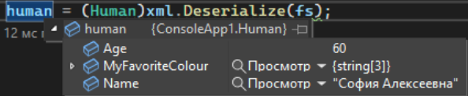

Таким образом, я могу использовать все значения после using, например, вывести их в консоль и посмотреть результат.

```csharp
Human human;

XmlSerializer xml = new XmlSerializer(typeof(Human));
using (FileStream fs = new FileStream("D:\\Рабочий стол\\sdfsd.xml", FileMode.Open))
{
    human = (Human)xml.Deserialize(fs);
}

Console.WriteLine(human.Name);
Console.WriteLine(human.Age);
foreach(var item in human.MyFavoriteColour){
    Console.WriteLine("-" + item);
}
```
