В WPF, как и на любом другом визуальном фреймворке, приложение можно дополнить огромным количеством анимаций: переход между окон, всплывающие картинки, исчезающие кнопки и так далее. Все анимации можно условно разделить на 3 группы: линейные (плавные), покадровые и геометрические (путевые).

В каждую из этих групп входит огромное количество классов, которые позволят анимировать различные свойства. Каждый из них строится по шаблону, где первое слово — тип данных анимированного свойства. Например, для ширины стоит использовать `DoubleAnimation`, так как ширина представляется дробным числом, а для флагов у `CheckBox` и `RadioButton` стоит использовать `ByteAnimation`, так как флаг может быть только отмеченным (`true`) или неотмеченным (`false`).

Тот же принцип распространяется и на другие две группы. Вот полный список всех анимаций, которые есть в этих группах.

## Линейные — `<type>Animation`

- `ByteAnimation`
- `ColorAnimation`
- `DecimalAnimation`
- `DoubleAnimation`
- `Int16Animation`
- `Int32Animation`
- `Int64Animation`
- `PointAnimation`
- `Point3DAnimation`
- `QuarternionAnimation`
- `RectAnimation`
- `Rotation3DAnimation`
- `SingleAnimation`
- `SizeAnimation`
- `ThicknessAnimation`
- `VectorAnimation`
- `Vector3DAnimation`

## Покадровые — `<type>AnimationUsingKeyFrames`

- `BooleanAnimationUsingKeyFrames`
- `ByteAnimationUsingKeyFrames`
- `CharAnimationUsingKeyFrames`
- `ColorAnimationUsingKeyFrames`
- `DecimalAnimationUsingKeyFrames`
- `DoubleAnimationUsingKeyFrames`
- `Int16AnimationUsingKeyFrames`
- `Int32AnimationUsingKeyFrames`
- `Int64AnimationUsingKeyFrames`
- `MatrixAnimationUsingKeyFrames`
- `ObjectAnimationUsingKeyFrames`
- `PointAnimationUsingKeyFrames`
- `Point3DAnimationUsingKeyFrames`
- `QuarternionAnimationUsingKeyFrames`
- `RectAnimationUsingKeyFrames`
- `Rotation3DAnimationUsingKeyFrames`
- `SingleAnimationUsingKeyFrames`
- `SizeAnimationUsingKeyFrames`
- `StringAnimationUsingKeyFrames`
- `ThicknessAnimationUsingKeyFrames`
- `VectorAnimationUsingKeyFrames`
- `Vector3DAnimationUsingKeyFrames`

## Геометрические — `<type>AnimationUsingPath`

- `DoubleAnimationUsingPath`
- `MatrixAnimationUsingPath`
- `PointAnimationUsingPath`

## Линейная анимация

Начнем сразу же с примера. У меня есть большая цветная кнопка.

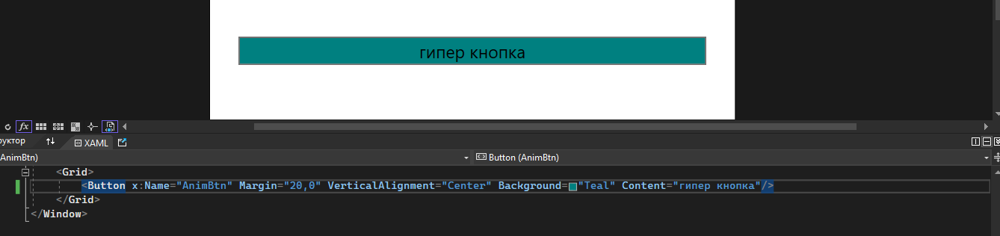

Я хочу, чтобы после нажатия на эту кнопку её высота начала постепенно увеличиваться. За это будет отвечать следующий код.

```csharp
private void AnimBtn_Click(object sender, RoutedEventArgs e)
{
    DoubleAnimation heightAnim = new DoubleAnimation();
    heightAnim.From = AnimBtn.ActualHeight;
    heightAnim.To = 300;
    heightAnim.Duration = TimeSpan.FromSeconds(3);
    AnimBtn.BeginAnimation(Button.HeightProperty, heightAnim);
}
```

Так как мы хотим менять высоту, то мы возьмём `DoubleAnimation`. Создадим переменную и укажем ей 3 основных свойства — начальное значение (`From`), конечное значение (`To`) и длительность анимации (`Duration`, указывается при помощи типа данных `TimeSpan`).

Анимация начинается при помощи метода `BeginAnimation`. Такой метод есть у каждого элемента, даже у самого окна. Внутри него нужно указать что за свойство будет задействовано в анимации (в данном случае высота) и что за анимация будет воспроизводиться (`heightAnim`). Метод применяется к самому элементу.

Запустим код и увидим, как после нажатия на кнопку она начинает увеличиваться.

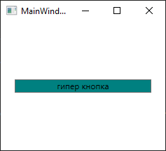

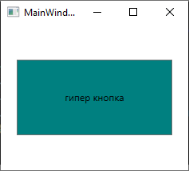

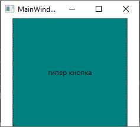

Кроме этих трёх основных свойств есть ещё несколько:

- `RepeatBehavior` — позволяет установить, как анимация будет повторяться.
- `AccelerationRatio` — задает ускорение анимации.
- `DecelerationRatio` — устанавливает замедление анимации.
- `SpeedRatio` — устанавливает скорость анимации. По умолчанию значение `1.0`.
- `AutoReverse` — при значении `true` анимация выполняется в противоположную сторону.
- `FillBehavior` — определяет поведение после окончания анимации. Если оно имеет значение `Stop`, то после окончания анимации объект возвращает прежние значения: `AnimBtn.FillBehavior = FillBehavior.Stop`. Если же оно имеет значение `HoldEnd`, то анимация присваивает анимируемому свойству новое значение.

Например, поставив `AutoReverse = true`, кнопка начнет становится меньше после конца анимации, также в течении 3 секунд.


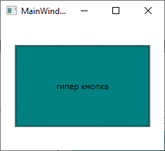

## Несколько анимаций одновременно и клонирование brush

Если я хочу добавить ещё одну анимацию, я просто пропишу её вместе с анимацией высоты. Например, поменять цвет на салатовый. Для этого я использую `ColorAnimation`.

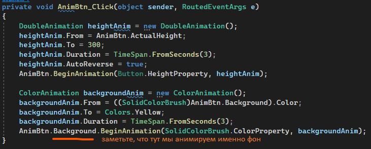

Но при анимации более сложных свойств может появиться вот такая ошибка. Фон заморожен, так как мы выставили ему статичное значение прямо в XAML.

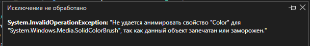

В таких случаях нам нужно клонировать это свойство. Для нас, нам нужно клонировать фон. И если значение клонировано, нам можно даже не использовать свойство `From`, он автоматом возьмет значение из фона.

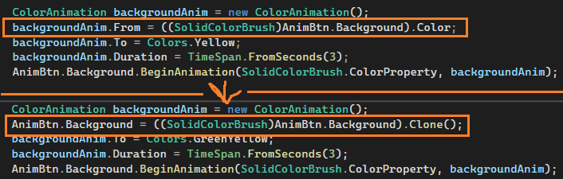

И у нас получится вот такая анимация!

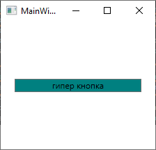

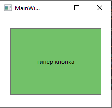

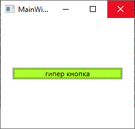

## Покадровая анимация

Покадровая анимация позволяет настроить каждый кадр какой-либо анимации, между которыми будет происходить каждая анимация, а также в какой промежуток времени она должна выполнится. Создается примерно как и линейная анимация, но вместо `From` и `To` здесь будут кадры — `KeyFrames`.

Для примера, анимируем ширину окна. Так как это ширина, то и анимация будет `Double`. Скажу, что она должна длиться 6 секунд.

```csharp
public MainWindow()
{
    InitializeComponent();

    DoubleAnimationUsingKeyFrames widthFrameAnim = new DoubleAnimationUsingKeyFrames();
    widthFrameAnim.Duration = TimeSpan.FromSeconds(6);
}
```

Из ширины в 500 пикселей она должна перейти в ширину 100. Где-то на 200 пикселей она должна немного замедлиться, а затем, как только анимация достигнет конца, быстро, но плавно, вернуться в первоначальное положение. Для такой анимации мне понадобится 3 фрейма — 500, 200 и 100 пикселей, а также бесконечный повтор.

Фреймы мы добавим в лист `KeyFrames`. Внутри для линейной и простой анимации добавим `LinearDoubleKeyFrame`, которая состоит из значения для анимации (500, 200 и 100), а также в какой момент времени из всей анимации кадр должен закончится (2, 4 и 6. Всего анимация идет 6 секунд, на каждый фрейм по 2 секунды).

Кроме `LinearDoubleKeyFrame` у `KeyFrame` есть ещё много различных вариантов, так же как и у других анимация (`Double`, `Point` и прочее), так что здесь просто нужно подобрать тот самый.

```csharp
widthFrameAnim.KeyFrames.Add(new LinearDoubleKeyFrame(500, KeyTime.FromTimeSpan(TimeSpan.FromSeconds(2))));
widthFrameAnim.KeyFrames.Add(new LinearDoubleKeyFrame(200, KeyTime.FromTimeSpan(TimeSpan.FromSeconds(4))));
widthFrameAnim.KeyFrames.Add(new LinearDoubleKeyFrame(100, KeyTime.FromTimeSpan(TimeSpan.FromSeconds(6))));
```

А бесконечный повтор мы можем сделать при помощи `RepeatBehavior`.

```csharp
widthFrameAnim.RepeatBehavior = RepeatBehavior.Forever;
```

Применим анимацию так же как и с линейным — берем элемент и через `BeginAnimation` запускаем анимацию для нужного свойства. Я хочу анимировать ширину окна, я это и пропишу.

```csharp
this.BeginAnimation(WidthProperty, widthFrameAnim);
```

И по итогу мы увидим следующее!

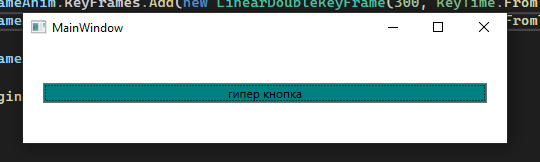

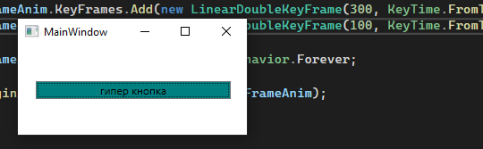

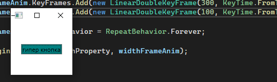


## Путевая анимация

Для путевых анимаций ситуация такая же, как и с предыдущими двумя. Я хочу сделать так, чтобы у меня что-то крутилось вокруг кнопки. Я добавлю картинку звёздочки, и буду делать анимацию для неё.

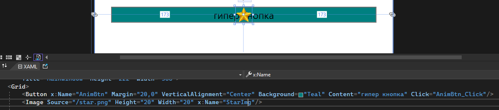

Старую анимацию я закомментирую.

```csharp
public MainWindow()
{
    InitializeComponent();

    /* DoubleAnimationUsingKeyFrames widthFrameAnim = new DoubleAnimationUsingKeyFrames();
    widthFrameAnim.Duration = TimeSpan.FromSeconds(6);

    widthFrameAnim.KeyFrames.Add(new LinearDoubleKeyFrame(500, KeyTime.FromTimeSpan(TimeSpan.FromSeconds(2))));
    widthFrameAnim.KeyFrames.Add(new LinearDoubleKeyFrame(200, KeyTime.FromTimeSpan(TimeSpan.FromSeconds(4))));
    widthFrameAnim.KeyFrames.Add(new LinearDoubleKeyFrame(100, KeyTime.FromTimeSpan(TimeSpan.FromSeconds(6))));

    widthFrameAnim.RepeatBehavior = RepeatBehavior.Forever;
    this.BeginAnimation(WidthProperty, widthFrameAnim); */
}
```

Далее для анимации мне нужно будет сделать геометрический путь. Так как я хочу, чтобы она каталась по прямоугольнику, создам `RectangleGeometry`. Подгоню его под размеры кнопки.

Чтобы сказать, что этот прямоугольник — путь для анимации, его нужно запихнуть внутрь пути — `PathGeometry`.

```csharp
RectangleGeometry myRectangleGeometry = new RectangleGeometry();
myRectangleGeometry.Rect = new Rect(-160, -18, 320, 36);

PathGeometry animationPath = new PathGeometry();
animationPath.AddGeometry(myRectangleGeometry);
```

А затем, так как гугл мне сказал что я не могу использовать точки для перемещения объектов, а `double` для позиции не очень подходит, я буду использовать анимацию с матрицами — `MatrixAnimationUsingPath`.

Как и раньше, мне нужно указать время и его поведение. Чтобы указать путь, скажу, что `PathGeometry` анимации равен тому пути, который мы создали чуть-чуть до этого. И, так как это сложная анимация с свойством внутри свойства, клонирую текущую позицию и задам для нее анимацию.

```csharp
MatrixAnimationUsingPath pointPathAnim = new MatrixAnimationUsingPath();
pointPathAnim.Duration = TimeSpan.FromSeconds(3);     // Анимация идёт 3 секунды
StarImg.RenderTransform = new MatrixTransform();      // Клонируем текущую позицию
pointPathAnim.PathGeometry = animationPath;           // Путь для позиции равен пути чуть выше
pointPathAnim.RepeatBehavior = RepeatBehavior.Forever; // Анимация повторяется всегда

// Для позиции (RenderTransform) начинаем анимацию по передвижению
StarImg.RenderTransform.BeginAnimation(MatrixTransform.MatrixProperty, pointPathAnim);
```

Анимация будет выглядеть вот так.

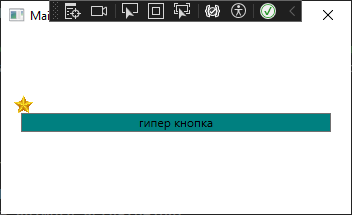

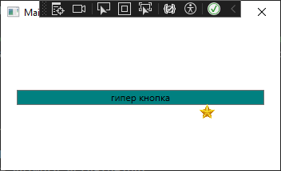

На этом разбор трёх видов анимаций закончен.

## Анимации через триггеры в XAML

Все эти же анимации можно реализовать и при помощи триггеров в XAML. Разберём те же примеры.

Линейные анимации — высота и цвет кнопки:


Покадровые анимации — ширина окна:


Путевые анимации — звёздочка бегает вокруг кнопки:


## Полный код примера

`MainWindow.xaml` с кнопкой и звёздочкой, готовый к подключению C#-анимаций:

```xml
<Window x:Class="WpfApp1.MainWindow"
        xmlns="http://schemas.microsoft.com/winfx/2006/xaml/presentation"
        xmlns:x="http://schemas.microsoft.com/winfx/2006/xaml"
        Title="MainWindow" Height="222" Width="366">
    <Grid>
        <Button x:Name="AnimBtn" Margin="20,0" VerticalAlignment="Center"
                Background="Teal" Content="гипер кнопка" Click="AnimBtn_Click"/>
        <Image Source="/star.png" Height="20" Width="20" x:Name="StarImg"/>
    </Grid>
</Window>
```

`MainWindow.xaml.cs` — линейная анимация по клику и путевая на загрузке окна:

```csharp
using System;
using System.Windows;
using System.Windows.Media;
using System.Windows.Media.Animation;

namespace WpfApp1
{
    public partial class MainWindow : Window
    {
        public MainWindow()
        {
            InitializeComponent();

            RectangleGeometry myRectangleGeometry = new RectangleGeometry();
            myRectangleGeometry.Rect = new Rect(-160, -18, 320, 36);

            PathGeometry animationPath = new PathGeometry();
            animationPath.AddGeometry(myRectangleGeometry);

            MatrixAnimationUsingPath pointPathAnim = new MatrixAnimationUsingPath();
            pointPathAnim.Duration = TimeSpan.FromSeconds(3);
            StarImg.RenderTransform = new MatrixTransform();
            pointPathAnim.PathGeometry = animationPath;
            pointPathAnim.RepeatBehavior = RepeatBehavior.Forever;

            StarImg.RenderTransform.BeginAnimation(MatrixTransform.MatrixProperty, pointPathAnim);
        }

        private void AnimBtn_Click(object sender, RoutedEventArgs e)
        {
            DoubleAnimation heightAnim = new DoubleAnimation();
            heightAnim.From = AnimBtn.ActualHeight;
            heightAnim.To = 300;
            heightAnim.Duration = TimeSpan.FromSeconds(3);
            heightAnim.AutoReverse = true;
            AnimBtn.BeginAnimation(Button.HeightProperty, heightAnim);

            AnimBtn.Background = ((SolidColorBrush)AnimBtn.Background).Clone();
            ColorAnimation backgroundAnim = new ColorAnimation();
            backgroundAnim.To = Colors.GreenYellow;
            backgroundAnim.Duration = TimeSpan.FromSeconds(3);
            AnimBtn.Background.BeginAnimation(SolidColorBrush.ColorProperty, backgroundAnim);
        }
    }
}
```
