Очень малое количество приложений используют прямое подключение к БД, так как это не шибко безопасно, имеет возможность только получать/отправлять данные, а все дополнительные вычисления необходимо делать самому в приложении. По этой причине существует API — Application Programming Interface — некое приложение, которое позволит обрабатывать промежуточные данные и отправлять их клиенту уже в готовом виде.

## Зачем нужен API

Пример: я разрабатываю приложение по продаже мармеладок. У меня в базе данных хранится всё, что связано с ними. Вот логическая модель БД.

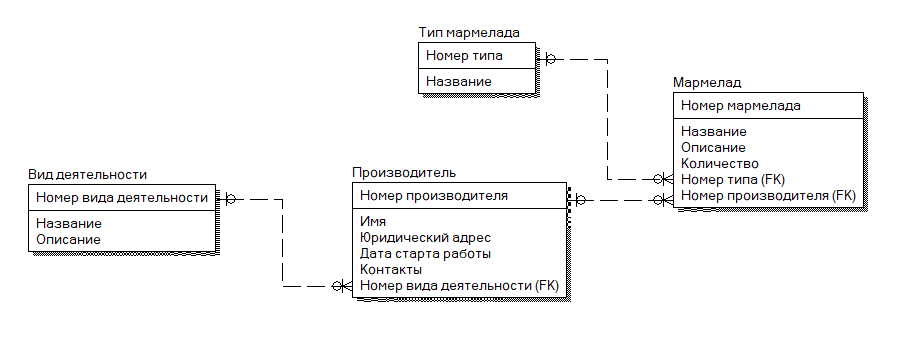

Я хочу вывести в карточку свои данные об этих мармеладках. Для такой карточки мне понадобятся следующие данные:

- Название — таблица «Мармелад».
- Описание — таблица «Мармелад».
- Цена — таблица «Мармелад» — должна меняться в зависимости от страны клиента (конвертироваться в другую валюту).
- Количество — таблица «Мармелад» — по количеству будет определяться есть ли в наличии товар или нет.
- Имя — таблица «Производитель».

Карточки конечно замечательные, однако смотря на список выше, мы видим, что нам нужно сделать действия по конвертации валюты по текущему курсу (который кстати тоже можно взять через API!) и определить, в наличии ли товар или нет. Мы бы могли сделать следующим образом:

- Подключить базу данных.
- Взять всю информацию из таблицы.
- Взять всю информацию из другой таблицы.
- Циклом пробежаться по каждому элементу и понаделать условий:
  - Если страна пользователя — Россия, то оставить цену.
  - Если страна пользователя — Америка, то разделить цену на 79,93.
  - Если страна пользователя находится в Евросоюзе, то разделить цену на 85,79.
  - Если количество товара равно нулю, отобразить грид «Нет в наличии :(».
  - Согласно ID поставщику, вывести имя нужного поставщика.

И так нужно будет делать каждый раз, когда мы захотим взять правильные данные. Для каждого отдельного случая — отдельный блок кода для обработки данных.

ИЛИ мы можем тоже делать все эти блоки кода, но уже в другом приложении, которое будет иметь прямой доступ к БД, хранится где-то на сервере, а мы при помощи парочки методов будем взаимодействовать уже с готовыми данными. И тогда нам самим не придется вручную прописывать всю вышеперечисленную логику, API всё сделает за нас!

Но нам опять придется работать с JSON, потому что ответ с сервера выглядит вот так.

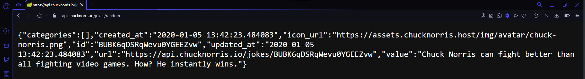

Зачем это нужно и почему мы не можем просто сразу в программе написать все условия?

API:

- можно скинуть на другого человека чтобы он его разрабатывал, а вы сидели на всём готовеньком;
- это отдельный модуль, так что если нам не нравится то, как выглядят данные, поменять пару строк в API будет намного проще, чем искать каждую обработку данных внутри нашего кода;
- можем создавать не только мы, но и другие люди, а раз у API имеется постоянный доступ к БД, мы всегда будем получать актуальную информацию из других сервисов;
- …поэтому мы можем поломать или взломать БД при помощи API.

Сначала мы научимся к нему подключаться, а затем, научимся его создавать. Но это уже в [другой лекции](/wpf/aspnet-api).

## Методы API

Здесь нужно понимать 2 вещи:

- Вам нужно будет самим, на основе JSON, создать модель данных, по которой вы будете десериализовать ваши данные.
- Вам нужно будет выучить 1 метод, из которого вы сможете сделать остальные 4.

Что за методы и почему их 5? У нас есть 4 основных вида запроса к API — `GET`, `POST`, `PUT`, `DELETE`, что отвечает за чтение, добавление, изменение и удаление соответственно. 5 их по той причине, что `GET` делится на взятие всех данных и взятие одной записи по ID.

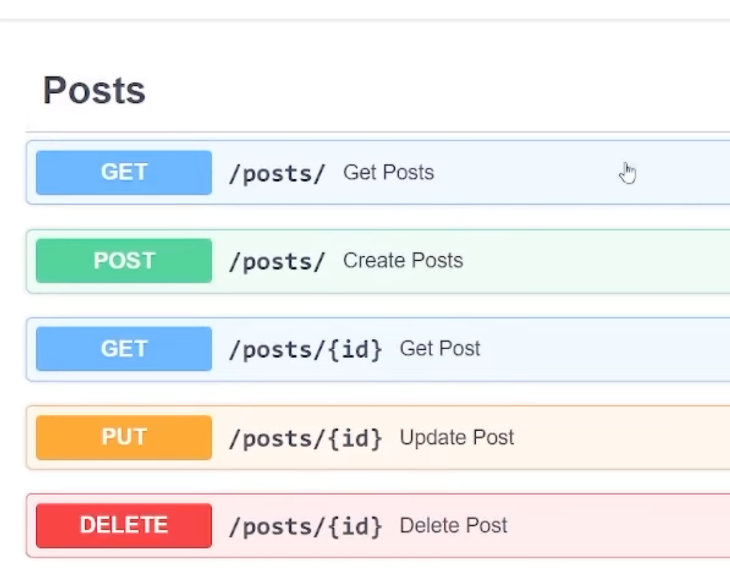

Для получения данных из каждого такого запроса нам необходимо будет писать 5 отдельных методов. Но выучить нужно только 1.

В качестве примера мы с вами возьмем API с интернета с заметками. Вот ее документация и примеры JSON на возврат: [dummyjson.com/docs/todos](https://dummyjson.com/docs/todos).

Для разработки и просмотра API существует такая программа, как Postman. На неё нужно авторизироваться и она не работает без интернета. Есть как WEB версия, так и компьютерная. С её помощью вы также в будущем сможете работать над своими API, потому что у вас примерно никогда не всегда будет удобная документация, как в dummyjson.

Возьмем 5 ссылок для из dummyjson для издевательства над ними:

- `GET` — `https://dummyjson.com/todos`
- `GET` с id — `https://dummyjson.com/todos/1`
- `POST` — `https://dummyjson.com/todos/add`
- `PUT` — `https://dummyjson.com/todos/1`
- `DELETE` — `https://dummyjson.com/todos/1`

## Краткий тур по Postman

Перед тем, как мы начнем, краткий экскурс в то, что есть у API и Postman, и как с этим работать. В Postman я создам новый запрос.

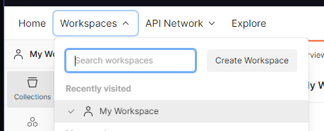

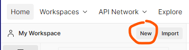

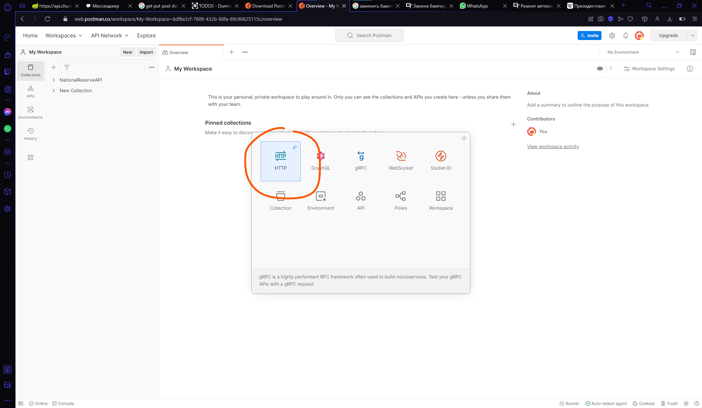

Возьму ссылку для получения запроса — GET запрос: `https://dummyjson.com/todos` — и вставлю её в специальное место для ссылок. Нажмем Send.

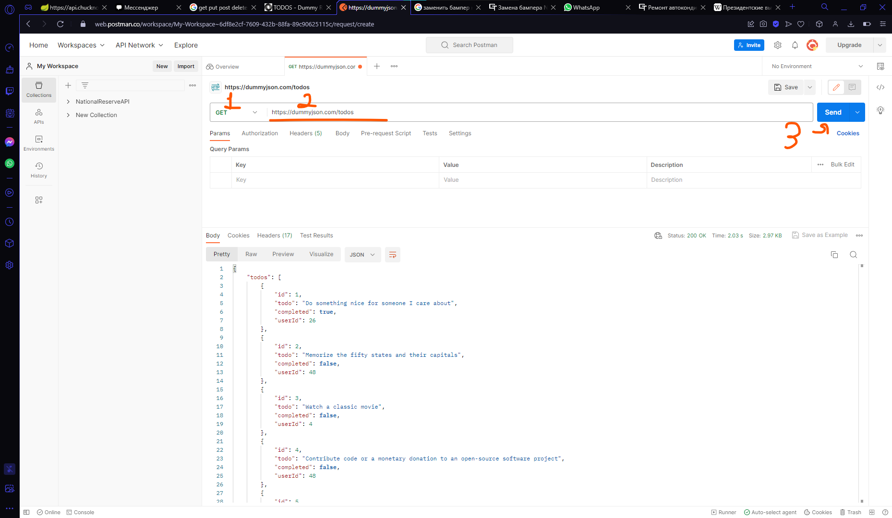

Внизу у нас появится нормальное представление JSON, которое мы уже сможем использовать для моделей. Внизу, в JSON, мы видим, что это массив, сколько именно значений внутри массива, какой статус вернул запрос, сколько времени это заняло и прочее.

Чуть выше, под ссылкой, есть некоторые вкладки, которые мы быстро посмотрим.

`Params` — удобное отображение каждого параметра с значением, которое передается прямо в ссылке.

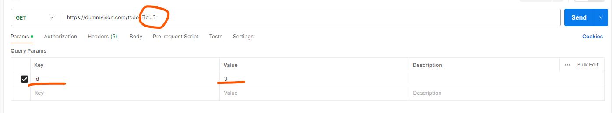

`Body` — зашифрованное содержимое, внутрь которого помещается JSON на отправку. Его предварительно нужно настроить, выбрав `raw` и `json`. `Body` используется для `POST` и `PUT` запросов, когда мы хотим что-то кинуть на сервер.

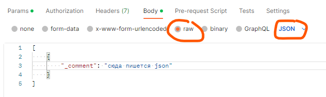

Возьмем, например, `PUT` запрос с сайта. На сайте он выглядит так.

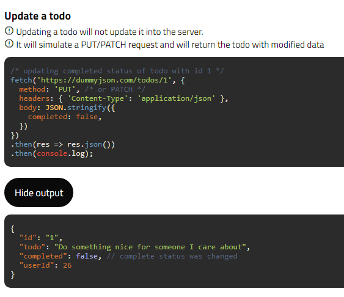

В Postman он будет выглядеть так.


## Модель данных под JSON

Перейдём уже к самой разработке.

Начнем с реализации модели по JSON. Выполним `GET` запрос и посмотрим, что возвращает нам сервер. Для понимания понадобится только верхняя часть, и максимум самый низ, чтобы убедиться, что модель сделана верно.

Верхняя часть:

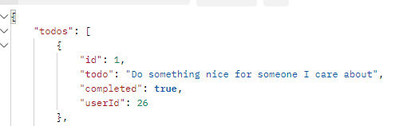

Мы видим, что это какая-то модель, в которой есть переменная `todos`. `todos` — массив с моделью, которая состоит из `id`, `todo`, `completed` и `userId`.

Нижняя часть:

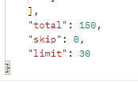

В самом низу мы видим, что наша модель с массивом состоит ещё и из переменных `total`, `skip` и `limit`. Во всех них хранится число, так что и тип данных у них интовый.

Создам приложение WPF и пойду от самой глубокой модели (та, что правее всего в JSON), до самой верхней. Т.е. я сначала создам модель с `id`, `todo` и прочее, а только потом модель с массивом, `total`, `skip` и `limit`. В рамках [MVVM](/wpf/mvvm) они будут внутри папки `Model`.

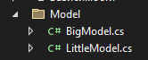

```csharp
internal class LittleModel
{
    public int id { get; set; }
    public string todo { get; set; }
    public bool completed { get; set; }
    public int userId { get; set; }
}
```

```csharp
internal class BigModel
{
    public List<LittleModel> todos { get; set; }
    public int total { get; set; }
    public int skip { get; set; }
    public int limit { get; set; }
}
```

Сразу докачаем пакет `Newtonsoft.Json`, так как мы собираемся работать с сериализацией и десериализацией.

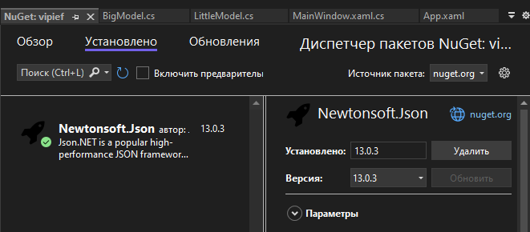

## Универсальный метод Put

Теперь нам необходимо получить JSON с сайта. Но вместо того, чтобы выучивать каждый метод, давайте создадим класс и сразу из него выучим `PUT` запрос. На основе него мы сделаем другие методы.

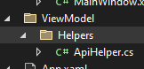

Создам метод `Put` и сделаю его статичным, чтобы я смогла вызвать его без привязки к экземпляру класса. У меня всё равно внутри класса ничего не меняется, это просто контейнер для методов.

`Put` должен возвращать `string`, так как мы постоянно будем возвращать либо JSON, либо статус.

Внутри сделаю приватную статичную переменную с дефолтным URL. Т.е. я вижу, что во всех ссылках одинаковая часть — `https://dummyjson.com/todos`. Значит именно она у меня и будет внутри переменной.

```csharp
internal class ApiHelper
{
    private static string Url = "https://dummyjson.com/todos";

    public static string Put()
    {

    }
}
```

Поставим внутри `try…catch` чтобы наверняка. В случае ошибки вернем сообщение с ней.

```csharp
public static string Put()
{
    try
    {

    }
    catch (Exception ex)
    {
        return ex.Message;
    }
}
```

А теперь начнём самое интересное — код внутри `try`.

Нам нужно подключиться к сайту, все сайты это у нас HTTP. Если мы подключаемся — мы клиенты, так было и в [сокетах](/wpf/tcp-ip), и в Imap. Поэтому нам надо создать `HttpClient`, через который мы будем работать. Добавим сразу же библиотеку `System.Net.Http`.

Изменение (`PUT` запрос) содержит в себе тело, некий контент (данные для изменения), который нам надо также отправить. Для этого есть ещё один тип данных — `HttpContent`. Сам контент мы будем передавать извне в формате JSON, так что нам нужен параметр для него.

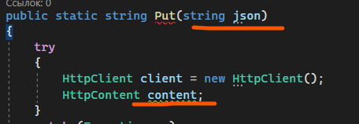

Так как JSON это текст, то `content` будет равен `StringContent`. Это важно, не `HttpContent`. `StringContent` принимает в себя 3 параметра — содержимое, т.е. сам JSON, её кодировка (ставим UTF8, чтобы русские буквы воспринимались) и формат содержимого (в Postman, когда мы ставили Body, мы могли выбрать что это будет за формат — текст, json, html, xml или javascript. нам надо указать что это json. Указывается это через `application/json`). Обе последние настройки можно найти в Postman, чтобы никогда не ошибиться. Делаем любой запрос, видим внизу JSON, и вместо вкладки Body нажимаем на Headers. Там, в `content-type` будет всё необходимое: `application/json; charset=utf-8`.

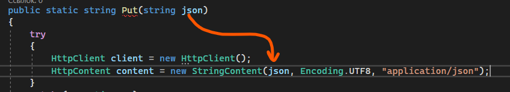

Затем нам необходимо отправить сам запрос. Когда мы отправляем запрос мы получаем что? Правильно, ответ. Ответ по-английски `Response`, так что мы так и напишем — `HttpResponseMessage`.

Этот `message` будет равен запросу через клиент. Хотим сделать `PUT` запрос — пишем `Put`. Хотим сделать `Get` запрос — пишем `Get` и т.п. Внутрь мы передадим ссылку, куда мы отправляем запрос, а затем содержимое, которое мы отправляем на изменение. Так как метод асинхронный но `await` у него нет, то мы поставим `Result`. И VS даже почти правильно предложила — ссылка и контент, но вот только ссылку мы поставили дефолтную, а нам нужно передать ещё ID записи, которую мы хотим изменить. Это мы тоже передадим как число и добавим к ссылке.

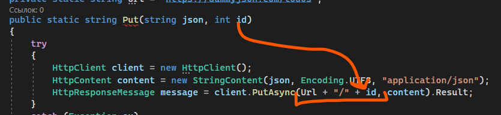

И последнее — результат. Нам из нашего ответа надо вернуть результат нашего содержимого как текст, и так как он асинхронный, в конце ставим `Result`.

```csharp
return message.Content.ReadAsStringAsync().Result;
```

Всё, метод `Put` закончен.

```csharp
private static string Url = "https://dummyjson.com/todos";
public static string Put(string json, int id)
{
    try
    {
        HttpClient client = new HttpClient();
        HttpContent content = new StringContent(json, Encoding.UTF8, "application/json");
        HttpResponseMessage message = client.PutAsync(Url + "/" + id, content).Result;
        return message.Content.ReadAsStringAsync().Result;
    }
    catch (Exception ex)
    {
        return ex.Message;
    }
}
```

Кратко пробежимся ещё раз по полному коду:

- В изменение мы пихаем json с данными и номер изменяемой записи, так что нам нужен `json` и `id`.
- Делаем HTTP-клиента, через который мы будем отправлять запрос.
- В запрос мы должны передать контент с json, он стринговый, так что равен он будет `StringContent`. Внутри мы говорим что я передаю json кодировки `utf8`.
- Отправляя запрос, я хочу получить сообщение от сервака, пишу `HttpResponseMessage`. Визуал студио сама всё пишет.
- Через клиент отправляем нужный запрос. Нужен `Put` — пишем `Put`. `Get` — `Get` и так далее. Внутрь пихаем нужную ссылку с ID и содержимое. В конце видим `Async` — ставим `Result`.
- Возвращаем содержимое сообщения как текст.

## Остальные 4 метода из Put

Из этого метода `PutAsync` делаем все остальные:

`Get` — хотим получить все? Значит ни `id` ни тело не нужно, удаляем эти переменные. Появились ошибки потому что что-то удалили? Удалим ошибки. Вместо `PutAsync` — `GetAsync`.

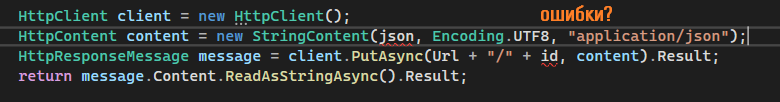

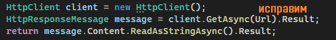

- `GetById` — хотим получить но по `id`? Тогда тело не нужно, удаляем переменную с телом, удаляем ссылку на эту переменную, меняем `PutAsync` на `GetAsync`. `Url` оставляем.
- `Post` — хотим добавить? Значит `id` не нужно, удаляем из URL `id`.
- `Delete` — удаляем по айдишнику? Удали вместе с ним и тело, ссылку на эту переменную, а `PutAsync` замени на `DeleteAsync`.

Всё. По итогу мы получаем полностью готовый класс для работы с API.

## Использование в WPF

Для взаимодействия с этими методами давайте я сделаю интерфейс с `DataGrid` и выгружу туда все задачи.

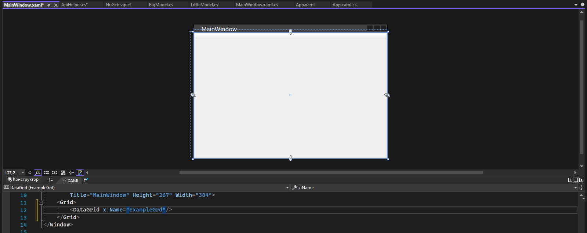

Взаимодействие максимально простое. Сначала получаем JSON, потом десериализуем.

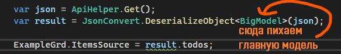

Как результат — мы имеем данные с сервера, который мы вообще не трогали, просто через API.

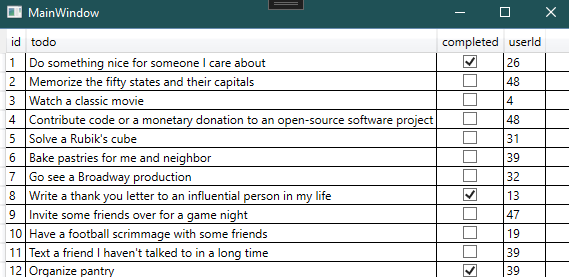

Если хотим наоборот, отправить какие-то данные, сначала преобразуем их в json (или имеем уже готовый json), а потом уже отправляем. Например, вот так надо преобразовать изменение данных.

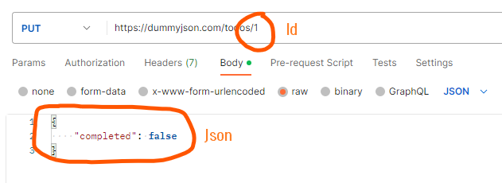

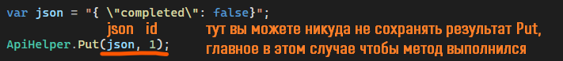

## Тестирование API

Для тестирования API, вашего, не вашего, вы в основном должны проверять следующие пункты:

- **Проверьте корректность кода состояния HTTP.** Например, создание ресурса должно возвращать `201 CREATED`, а запрещенные запросы должны возвращать `403 FORBIDDEN` и т.д.
- **Проверьте полезную нагрузку ответа.** Проверьте правильность тела JSON, имен, типов и значений полей ответа, в том числе в ответах на ошибочные запросы.
- **Проверьте заголовки ответа.** Заголовки HTTP-сервера влияют как на безопасность, так и на производительность.
- **Проверьте правильность состояния приложения.** Это необязательно и применяется в основном к ручному тестированию или когда пользовательский интерфейс или другой интерфейс можно легко проверить.
- **Проверьте базовую работоспособность.** Если операция была завершена успешно, но заняла неоправданно много времени, тест не пройден.

Выполнять вы их можете так же при помощи [NUnit тестов](/wpf/ui-tests) и отдельной библиотеки как на стороне клиента, так и на стороне самого API (либо вообще Postman использовать и документировать свой каждый пункт).

Эти пункты были взяты из статьи на Habr, с которой более подробнее вы можете ознакомиться по ссылке [habr.com/ru/articles/568360](https://habr.com/ru/articles/568360/).

## Различные примеры JSON

- Тренировочный API — [dummyjson.com/docs/products](https://dummyjson.com/docs/products)
- API с шутками про Чака Норриса — [api.chucknorris.io](https://api.chucknorris.io)
- API с валютным курсом — [freecurrencyapi.com](https://freecurrencyapi.com)
- API с погодой — [openweathermap.org/api](https://openweathermap.org/api)
- API с новостями — [newsapi.org](https://newsapi.org)

## Полный код примера

`Model/LittleModel.cs` и `Model/BigModel.cs` — модели под JSON ответа `/todos`:

```csharp
internal class LittleModel
{
    public int id { get; set; }
    public string todo { get; set; }
    public bool completed { get; set; }
    public int userId { get; set; }
}

internal class BigModel
{
    public List<LittleModel> todos { get; set; }
    public int total { get; set; }
    public int skip { get; set; }
    public int limit { get; set; }
}
```

`ViewModel/Helpers/ApiHelper.cs` — статический хелпер с 5 методами под dummyjson:

```csharp
using System;
using System.Net.Http;
using System.Text;

namespace WpfApp1.ViewModel.Helpers
{
    internal class ApiHelper
    {
        private static string Url = "https://dummyjson.com/todos";

        public static string Get()
        {
            try
            {
                HttpClient client = new HttpClient();
                HttpResponseMessage message = client.GetAsync(Url).Result;
                return message.Content.ReadAsStringAsync().Result;
            }
            catch (Exception ex) { return ex.Message; }
        }

        public static string GetById(int id)
        {
            try
            {
                HttpClient client = new HttpClient();
                HttpResponseMessage message = client.GetAsync(Url + "/" + id).Result;
                return message.Content.ReadAsStringAsync().Result;
            }
            catch (Exception ex) { return ex.Message; }
        }

        public static string Post(string json)
        {
            try
            {
                HttpClient client = new HttpClient();
                HttpContent content = new StringContent(json, Encoding.UTF8, "application/json");
                HttpResponseMessage message = client.PostAsync(Url + "/add", content).Result;
                return message.Content.ReadAsStringAsync().Result;
            }
            catch (Exception ex) { return ex.Message; }
        }

        public static string Put(string json, int id)
        {
            try
            {
                HttpClient client = new HttpClient();
                HttpContent content = new StringContent(json, Encoding.UTF8, "application/json");
                HttpResponseMessage message = client.PutAsync(Url + "/" + id, content).Result;
                return message.Content.ReadAsStringAsync().Result;
            }
            catch (Exception ex) { return ex.Message; }
        }

        public static string Delete(int id)
        {
            try
            {
                HttpClient client = new HttpClient();
                HttpResponseMessage message = client.DeleteAsync(Url + "/" + id).Result;
                return message.Content.ReadAsStringAsync().Result;
            }
            catch (Exception ex) { return ex.Message; }
        }
    }
}
```

`MainWindow.xaml.cs` — десериализация в DataGrid и пример PUT-запроса:

```csharp
using System.Windows;
using Newtonsoft.Json;
using WpfApp1.Model;
using WpfApp1.ViewModel.Helpers;

namespace WpfApp1
{
    public partial class MainWindow : Window
    {
        public MainWindow()
        {
            InitializeComponent();

            var json = ApiHelper.Get();
            var result = JsonConvert.DeserializeObject<BigModel>(json);
            ExampleGrd.ItemsSource = result.todos;

            // Пример обновления:
            // var updateJson = "{ \"completed\": false}";
            // ApiHelper.Put(updateJson, 1);
        }
    }
}
```
