## Настройка приложения — иконки, события при сборке

Приложение можно настраивать, например, дать ему иконку или изменить версию целевой платформы (с `.NET 6.0` на `.NET 7.0` например).

Для того, чтобы открыть эти свойства, необходимо ПКМ нажать на проект → Свойства. Перед нами появится огромное окно с различными свойствами, все из которых можно настраивать.

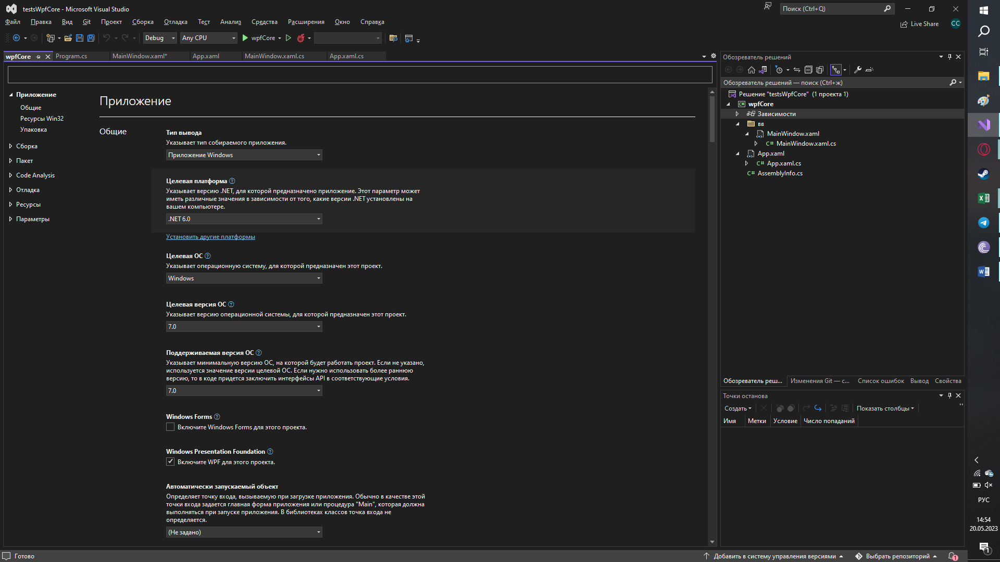

У каждого пункта есть своё описание, так что здесь можно интуитивно разобраться, но давайте рассмотрим самые интересные из них.

### Целевая платформа

Изменение целевой версии платформы на версию ниже или выше. Заметьте, что здесь вы не можете изменить приложение с `.NET` на `.NET Framework`.

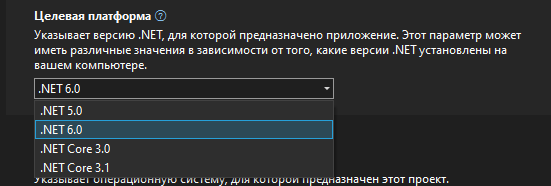

### WPF и Windows Forms

Добавление WPF или Forms в проект — прямо на главной странице есть следующие галочки, которые позволят добавить библиотеки, которые есть внутри проекта. Например, `RichTextBox` или `OpenFileDialog` форм намного проще, нежели версия WPF.

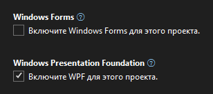

### Общие — идентификатор и версия пакета

Наименование, версия, авторские права и вся информация приложения — вся находится внутри вкладки «Общие».

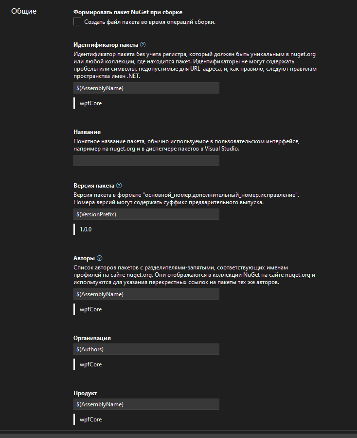

### Иконка приложения

Иконка приложения — любую квадратную картинку можно конвертануть в формат `.ico` и использовать как иконку для приложения. Для этого нужно будет эту картинку добавить внутрь свойства «Значок». Если у вас такого пункта нет, тогда проверьте, чтобы пункт «Ресурсы» у вас стоял на значении «Значок и манифест».


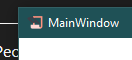

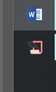

### Code Analysis — ускорение Visual Studio

Анализатор кода — вынесла его чисто потому, что иногда он может жрать ресурсы вашего компьютера. Поигравшись здесь с галочками визуалка может работать быстрее.


Также, раз уж мы заговорили про быстродействие Visual Studio, отключите аналитический сбор информации о ваших действиях в Visual Studio, перейдя в вкладку «Справка» → «Конфиденциальность» → «Конфиденциальность и параметры».

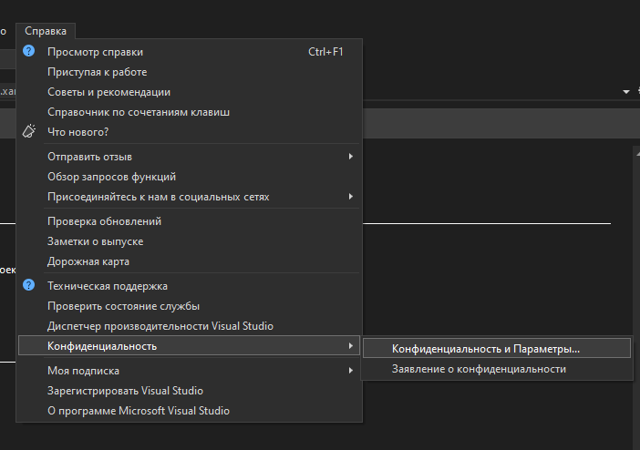

В появившемся окне выберите «Нет, я не хочу участвовать» и перезапустите Visual Studio. В моём случае она помогла мне запускать вижлу и работать с ней на несколько секунд быстрее, и компьютер уже не так задыхается.

## Параметры проекта — хранение данных внутри приложения

Статичные переменные мы, всё это время, хранили внутри приложения в каком-то рандомном классе. Если их нужно было сохранить, мы использовали [сериализацию](/csharp/json) или просто сохранение в обычный txt файл (в случае с темой приложения). Но у нас есть место лучше — параметры проекта. Внутри этого файла мы можем сохранить любые данные, и они будут сохраняться автоматически.

### Создание Settings.settings

Для того, чтобы создать параметры проекта, необходимо открыть свойства приложения, перелистнуть в самый низ и выбрать «Создать или открыть параметры приложения».


У нас создастся файл `Settings.settings`. Располагаться он будет внутри папки `Properties`, это системная папка и её название менять не стоит. Зато внутри можно создавать сколько угодно папок, например, папку со стилями можно поместить сюда.

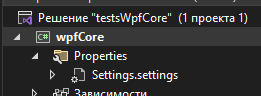

Внутри этого файла будет следующий датагрид, который мы сможем менять.

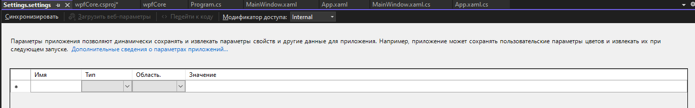

- **Имя** — название переменной, к которой мы будем обращаться.
- **Тип** — тип данных, `string`, `int`, `bool`, собственный тип данных или прочее.
- **Область** — есть «Приложение», есть «Пользователь». Приложение — статичное значение только для чтения, его нельзя менять, а вот «Пользователь» — значение, которое менять можно.
- **Значение** — непосредственно, значение.

### Пример — сохранение темы приложения

Как самый явный пример, давайте вспомним наши темы приложения и сохраним тему уже не в TXT файл, а в параметры приложения. Согласно [лекции 23](/wpf/dictionaries-themes), я создам приложение по изменении тем.

Остановлюсь на том моменте, когда надо сохранить нашу тему в файл. В данный момент наш `App.xaml.cs` выглядит следующим образом.

```csharp
public partial class App : Application
{
    private static string theme;

    public static string Theme
    {
        get { return theme; }
        set
        {
            theme = value;

            var d = new ResourceDictionary { Source = new Uri($"/Properties/Styles/{value}.xaml", UriKind.Relative) };
            Current.Resources.MergedDictionaries.RemoveAt(0);
            Current.Resources.MergedDictionaries.Insert(0, d);
        }
    }

    public App()
    {
        InitializeComponent();
    }
}
```

И теперь, вместо файла, сохраним всё значение внутрь параметра приложения. Для этого создадим его. Я назову его `CurrentTheme`, тип данных будет `string`, область «Пользователь», чтобы мы смогли менять переменную прямо внутри кода, и дефолтное значение — дефолтная тема, т.е. оранжевая.

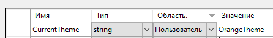

Чтобы получить доступ к этой переменной, нужно обратиться к ней при помощи `приложение.Properties.Settings.Default.названиесвойства`.

Уже этому свойству мы присвоим значение.

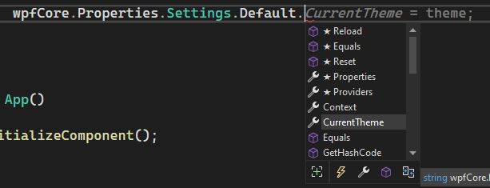

Чтобы его сохранить, нужно написать `приложение.Properties.Settings.Default.Save();`.

```csharp
wpfCore.Properties.Settings.Default.CurrentTheme = theme;
wpfCore.Properties.Settings.Default.Save();
```

И всё. Больше ничего. Никаких файлов и прочее. Но пожалуйста, не сохраняйте туда никакие данные для сериализации/десериализации, это неверное решение для использования параметров приложения.

### Чтение параметра при старте

Если нужно будет взять данные и при старте программы их куда-то присвоить, логика взятия этой переменной точно такая же.

```csharp
public App()
{
    InitializeComponent();
    Theme = wpfCore.Properties.Settings.Default.CurrentTheme;
}
```

## Полный код примера

`App.xaml.cs` — `Theme` через `MergedDictionaries`, чтение и сохранение в `Settings.Default`:

```csharp
using System;
using System.Windows;

namespace wpfCore
{
    public partial class App : Application
    {
        private static string theme;

        public static string Theme
        {
            get { return theme; }
            set
            {
                theme = value;

                var d = new ResourceDictionary { Source = new Uri($"/Properties/Styles/{value}.xaml", UriKind.Relative) };
                Current.Resources.MergedDictionaries.RemoveAt(0);
                Current.Resources.MergedDictionaries.Insert(0, d);

                wpfCore.Properties.Settings.Default.CurrentTheme = theme;
                wpfCore.Properties.Settings.Default.Save();
            }
        }

        public App()
        {
            InitializeComponent();
            Theme = wpfCore.Properties.Settings.Default.CurrentTheme;
        }
    }
}
```
