Взаимодействовать с API мы [научились](/wpf/api-testing), теперь нужно научится его создавать. API можно создать на любом языке и фреймворке для сайтов — Django (Python), Spring (Java), ASP.NET (C#). Как по мне, на аспе это делать проще всего, так как там есть автоматический генератор API, с которым мы сейчас научимся работать.

## Установка ASP.NET

Прежде всего, необходимо скачать ASP.NET. Для этого зайдём в Visual Studio Installer и нажмём на «Изменить».

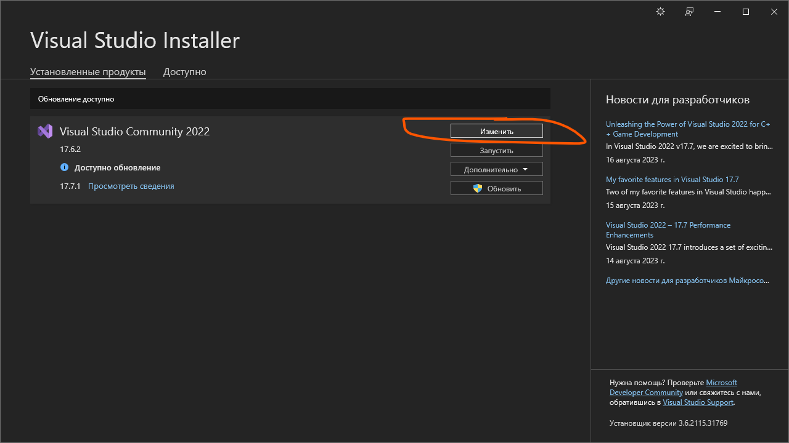

Из всего перечисленного нам необходимо докачать ASP.NET. Поставим галочку в одноимённой карточке и нажмём на «Изменить».

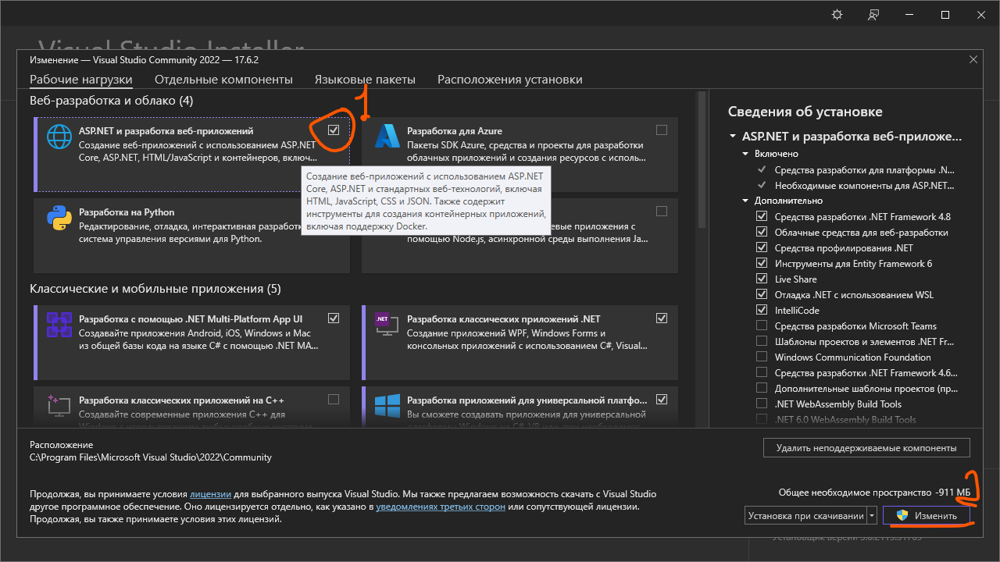

## Создание проекта Web API

После полной установки мы можем создать первый проект на аспе и рассмотреть его.

Откроем Visual Studio и создадим новый проект. В поисковую строчку введем «API». Нам понадобится тот, что на C#.

Кроме API можно создавать и обычные сайты, но это уже другие дисциплины вам про сайты расскажут.

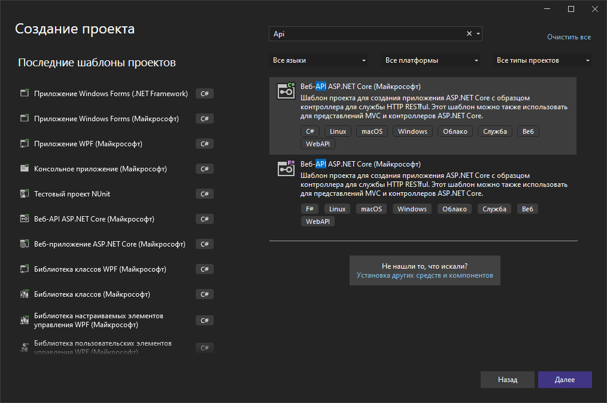

Всё остальное в создании такое же (почти). При выборе платформы ниже появляются различные галочки, которые трогать мы не будем. Они отвечают за настройку самого веб-ресурса: нужно ли настроить его для протокола HTTPS или оставить только на HTTP, нужен ли контроллер, и нужна ли нам поддержка OpenAPI (а она точно нужна, так как она позволяет видеть наше API не просто в формате json, а в виде красивого радужного сайта).

Короче — пишете имя, галочки оставляете, создаете проект.

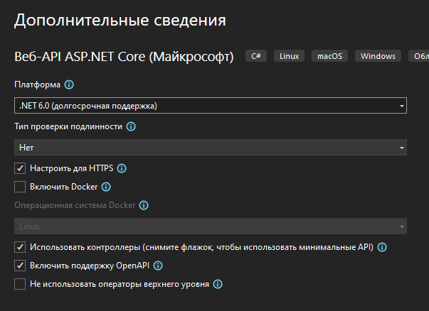

## Архитектура MVC

Новоиспеченный проект встречает вас каким-то приветственным окном, на которое я никогда не смотрела, и новым паттерном проекта, которая называется MVC — Model, View, Controller. Он используется почти повсеместно в разработке веб-приложений.

Из всех этих модулей в проекте мы видим только `Controllers` — папку для кода, но если бы это был целый сайт, тут были бы все 3 папки.

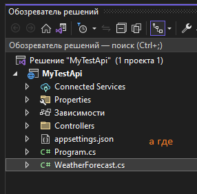

Папки `View` нет потому что в API просто нет визуальной части, а папки `Model` нет потому что потому, создадим сами значит.

Мы с вами знаем архитектуру [MVVM](/wpf/mvvm), почему же тут не она, а MVC? Даже две буквы одинаковые, почему вместо вьюмодели вдруг появился контроллер? Разница во взаимодействии:

- В MVVM каждый чих, который мы сделаем над интерфейсом, сразу будет отправлен в код (так как мы используем привязку), сразу будет обработан и сразу будет выдан результат.
- В MVC вьюшка и контроллер полностью отделены друг от друга (потому что связать воедино HTML и язык программирования — проблема нереальная). Если я нажму на кнопку, View перейдет в контроллер. Про страницу на этом моменте уже все забыли. Если я хочу просто вывести какие-то данные обратно на страницу, контроллер должен её заново создать и показать. И на этом моменте уже все забудут про контроллер. Никаких привязок, никаких динамических обновлений, только постоянные обращения туда-обратно и перезапуск.

Вот как описывает эту архитектуру интернет:

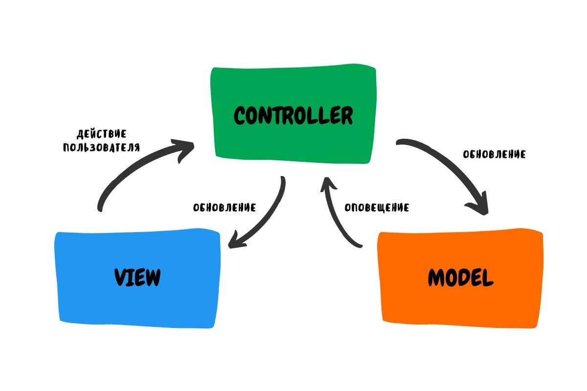

Вот как описываю эту архитектуру я:

![Диаграмма MVC «по-человечески»: View сверху, Controller слева, Model справа. Стрелки и подписи: «1. Я, глупый пользователь, потыкала кнопочки на интерфейсе», «2. Когда я тыкаю на кнопочки, страница заполняет разные данные в модель, чтобы потом их можно было в код отправить», «2.1. Данные должны быть на странице, чтобы было понятно что заполнять», «3. Если я потыкала на совсем что-то сложное, например, авторизация, интерфейс ни бе ни ме ни кукаре что я от него хочу, поэтому он обращается к коду», «4. Когда код всё сделал, он открыл новую страничку»](../../assets/wpf/aspnet-api/07_mvc_explanation.png)

И раз ASP.NET также использует архитектуру MVC, мы должны будем играть по её правилам. Вернёмся к API.

## Тестовый проект Swagger UI

На самом деле базовый пример API уже создан — мы видим класс `WeatherForecast`. Для него есть готовый контроллер, где хранится вся логика для API. И если мы на этом этапе запустим приложение, то мы

а) увидим огромное количество всплывающих окон, где везде нужно нажать ОК;
б) увидим сайт, который запустится в нашем браузере по умолчанию на localhost, при помощи которого можно удобно посмотреть на каждый запрос и выполнить его при помощи кнопки «Try it out» → «Execute».

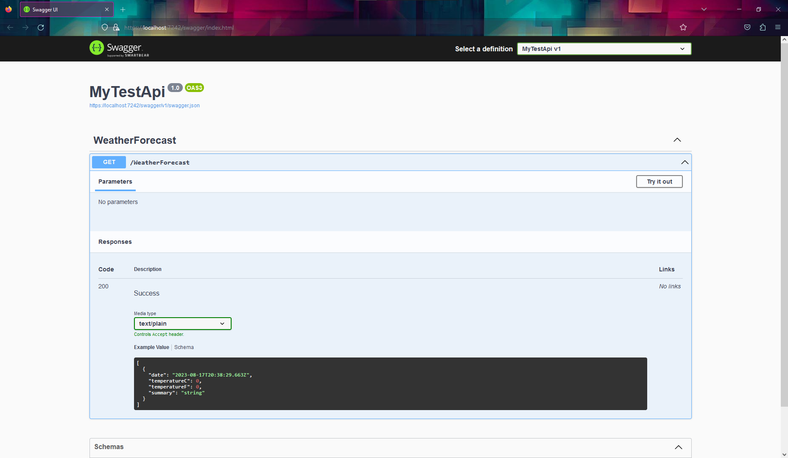

Если мы хотим взять ссылку, по которой идет запрос, то в `Request URL` как раз будет то, что нам нужно.

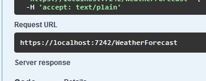

И введя эту строчку в браузер мы увидим старый добрый JSON.

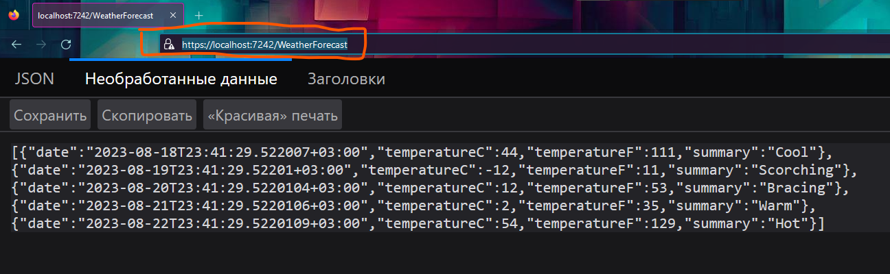

Так как API сейчас работает на нашем локальном компьютере, то как только мы проект выключим, API тоже выключится и данные получать станет невозможно. Так что следите за этим.

## Генерация API из базы данных

Итак, на тестовый проект мы посмотрели, теперь давайте сделаем своё API для базы данных.

В пример я возьму свою любимую БД — цвет, и человек с этим любимым цветом.

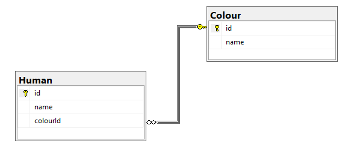

Если вам для эксперимента нужна маленькая БД, держите её скрипт. Просто скопируйте и запустите его.

```sql
create database [ExampleDB]
go
use [ExampleDB]
go
create table [Colour](
    [id] int not null identity(1,1) primary key,
    [name] varchar(25) not null
)
create table [Human](
    [id] int not null identity(1,1) primary key,
    [name] varchar(25) not null,
    [colourId] int not null foreign key references [Colour]([id])
)
go
insert into [Colour]([name]) values ('Красный'), ('Синий'), ('Желтый'), ('Зеленый')
go
insert into [Human]([name], [colourId]) values ('Василий', 2), ('Герасим', 4), ('Василиса', 1), ('Евдокия', 3)
go
```

Далее будет расписано краткое описание создания API. Суммарно последовательность состоит из 11 пунктов.

### 1. Удаляем сгенерированный пример

Удаляем сгенеренное до этого API — файл `WeatherForecast` и `WeatherForecastController` в папке `Controllers`.

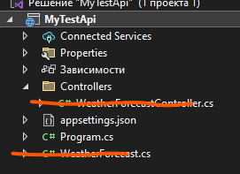

### 2. Создаем папку Models

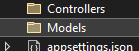

### 3. Устанавливаем Entity Framework

Открываем управление пакетами NuGet (ПКМ по проекту), открываем обзор и ищем `EntityFramework`. Устанавливаете `EntityFrameworkCore.SqlServer` и `Tools`. Если вы создали проект на .NET 5.0, то качайте версию `5.0.X`. Если вы на .NET 6.0 — `6.0.X`, .NET 7.0 — `7.0.X` и так далее.

Вручную API мы не будем создавать, нам поможет Entity Framework. Для генерации понадобятся 2 пакета — `Tools` и пакет с той БД, которую мы используем. В нашем примере это `SqlServer`. У меня проект .NET 6.0, так что и пакеты я ставлю соответствующие.

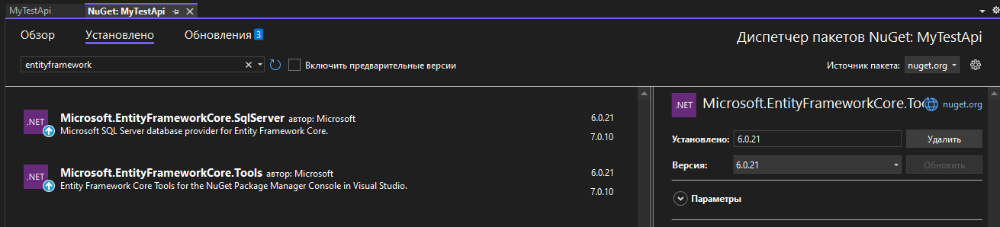

### 4. Подключаемся к базе данных

Сверху нажимаете на средства → Подключится к базе данных. Все поля необходимо заполнить.

Имя сервера можно найти в MSSQL: либо через ПКМ по названию сервера → Свойства → Имя сервера, либо через кнопку розетки чуть правее слова «Соединить» над сервером.

Нет разницы между подключением через Windows и подключением через SQL Server, во втором случае только пароль надо будет писать. Логин: `sa`.

Если все правильно, при открытии списка с базами данных у вас появится список. Если нет — он будет долго грузить. Там выбираем БД, с которой будем работать.

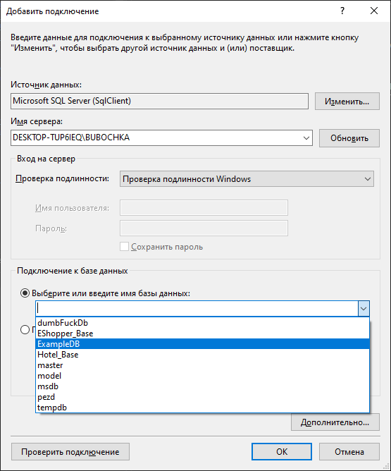

### 5. Берём строку подключения

После подключения необходимо открыть обозреватель серверов (лучше найти его через поиск сверху). Внутри находим нашу БД с зеленой иконкой и нужным именем БД, нажимаем по ней ПКМ и открываем свойства. Внутри свойств будет строка подключения, копируем её.

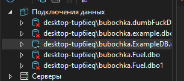

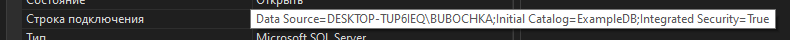

### 6. Scaffold-DbContext

Затем открываем консоль диспетчера пакетов (через поиск) и вписываем туда следующее:

```
Scaffold-DbContext "строкаподключения" Microsoft.EntityFrameworkCore.SqlServer -OutputDir Models
```

Если всё ок, появляется желтая строка на всю консоль, а через время откроется сгенерированный файл.

> Модели НЕ СГЕНЕРИРУЮТСЯ ЕСЛИ В ПРОЕКТЕ ЕСТЬ ХОТЯ БЫ ОДНА ОШИБКА.

Можно ещё запомнить таким образом, при помощи автозаполнения через Tab. Tab в саму команду писать не нужно:

```
Scaf <таб> "строкаподключения" Micro <таб, выбираем sql> -o <таб> Models
```

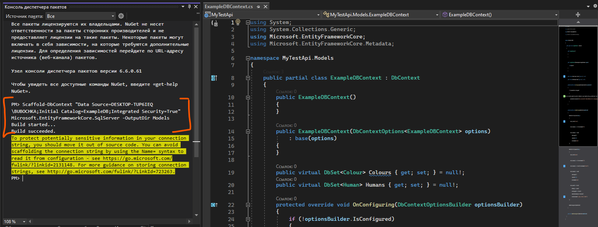

### 7. Выносим строку подключения в appsettings.json

Внутри файла контекста (тот, который называется как `имябдContext.cs` и находится в папке `Models`) вылезет предупреждение, что строка подключения не защищена. Копируем только строку, переходим в `appsettings.json` и пишем следующее:

```json
"ConnectionStrings": {
    "con": "строкаподключения"
}
```

Сам метод `OnConfiguring`, откуда мы взяли строку подключения, можно удалить.

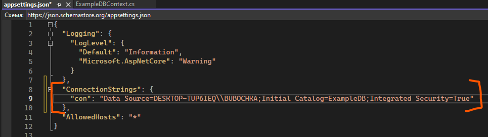

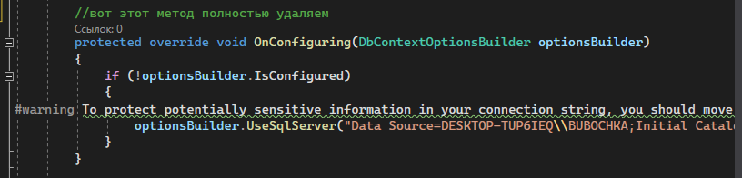

Это предупреждение ругается на то, что наша строка подключения находится в коде, а не в защищенном пространстве — `appsettings.json`. Перемещая строку подключения туда, мы а) обеспечиваем защиту и б) заставляем приложение работать более корректно.

### 8. AddDbContext в Program.cs

Из-за того, что подключение мы удалили, а подключить БД всё ещё надо, мы переходим в:

(Если у вас .NET 5.0) — `Startup.cs` и пишем следующую строчку после `services.AddControllers();`:

```csharp
services.AddDbContext<Папкасфайлом.ФайлКонтекста>(x => x.UseSqlServer(Configuration.GetConnectionString("con")));
```

(Если у вас .NET 6.0 и выше) — `Program.cs` и пишем следующую строчку после `builder.Services.AddControllers();`:

```csharp
builder.Services.AddDbContext<Проект.Папкасфайлом.ФайлКонтекста>(x => x.UseSqlServer(builder.Configuration.GetConnectionString("con")));
```

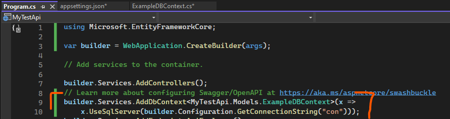

### 9. Чистим модели

Переходим в модели и очищаем их от конструкторов и виртуальных переменных. После `int` у айдишников и ключей таблиц пишем `?`, если у них есть `identity`. После очистки перейдем в файл контекста и удалим там все блоки, которые вызывают ошибку.

Эти виртуальные переменные отвечают за более глубокое отображение JSON у API. Например, вместо того, чтобы просто показать ID любимого цвета у человека, виртуальная переменная позволяет автоматически взять всю информацию об этом цвете — её имя, id, и вывести в JSON. Однако из-за этих виртуальных переменных появляется проблема с отправкой данных — мы не сможем отправить Post запросом такую модель, так как он будет требовать заполненную виртуальную переменную.

Вопросительные знаки у айдишников нужны для создания. Вот пример: мы пишем запрос insert в SQL. Там мы не указываем id, так как у него стоит автоинкремент — `identity`. Здесь при добавлении мы также не должны указывать id, иначе SQL будет ругаться, мол, я сам создам, не надо мне число передавать. И как раз таки чтобы ему ничего не передать, мы должны вместо id отправить ему `null`, что и позволяет сделать тип данных `int?`.

> Краткая схема очистки модели и контекстного файла: всё что я не знаю, я удаляю. Если я удалил и появилась ошибка — её я тоже удаляю. У айдишников поставлю вопросительный знак.

Вот такая модель была:

```csharp
public partial class Colour
{
    public Colour()
    {
        Humans = new HashSet<Human>();
    }

    public int Id { get; set; }
    public string Name { get; set; } = null!;

    public virtual ICollection<Human> Humans { get; set; }
}
```

Вот такой стала:

```csharp
public partial class Colour
{
    public int? Id { get; set; }
    public string Name { get; set; } = null!;
}
```

В контекстном файле вот тут была ошибка:

```csharp
entity.HasOne(d => d.Colour)
    .WithMany(p => p.Humans)
    .HasForeignKey(d => d.ColourId)
    .OnDelete(DeleteBehavior.ClientSetNull)
    .HasConstraintName("FK_Human__colourId__398D8EEE");
```

Этот блок целиком удаляем, и ошибка пропадает. С остальными моделями и блоками в контекстном файле та же история.

### 10. Создаём контроллеры

Создадим контроллеры. Для этого нажмем ПКМ по папке `Controllers` → Добавить → Создать шаблонный элемент → «Контроллер API с действиями, использующий Entity Framework». Внутри окошка необходимо выбрать только модели, другие файлы не надо. Класс контекста там один. Название оставляем. Так делаем со всеми моделями.

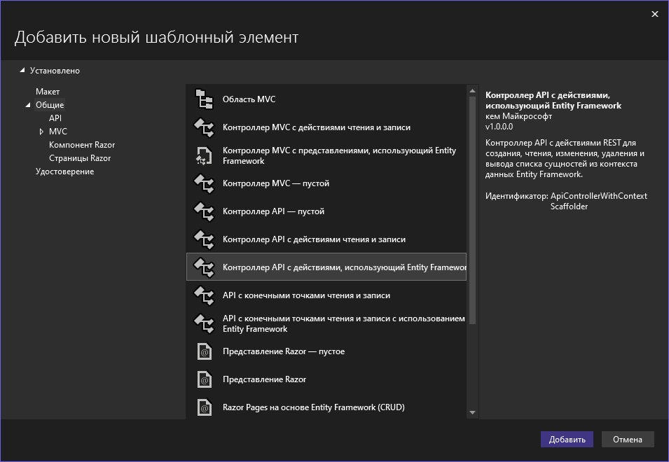

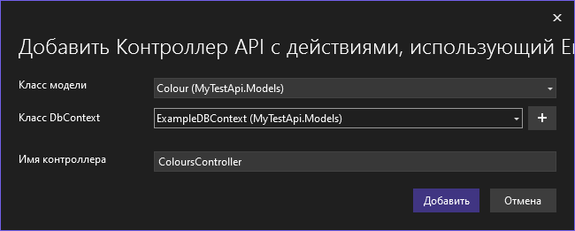

Если всё ок, перед нами появится созданный контроллер с пятью запросами — `Get`, `Get` по ID, `Post`, `Put`, `Delete`. Структуру самих контроллеров мы рассмотрим на [следующей паре](/wpf/aspnet-requests).

### 11. Готово!

Запускаем, каждая табличка будет на `https://localhost:порт/api/таблицавомножественномчисле`.

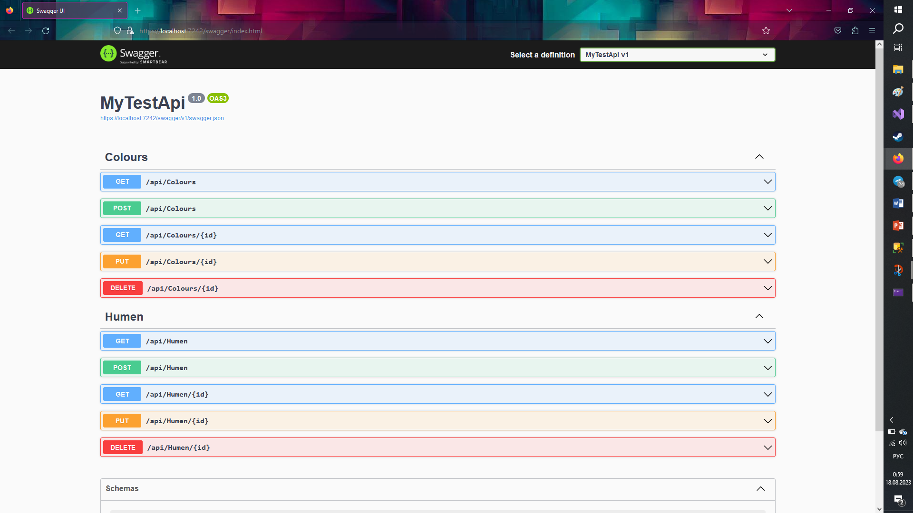

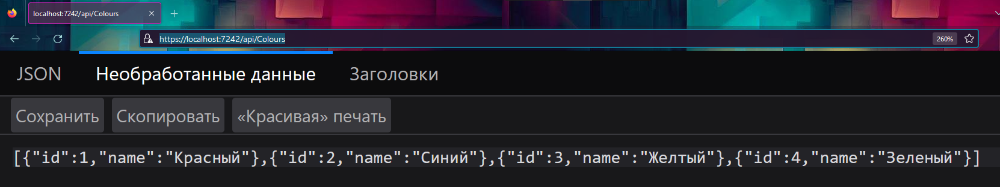

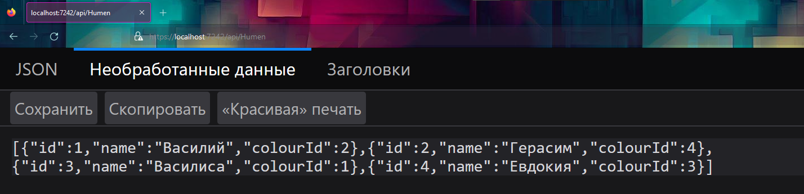
