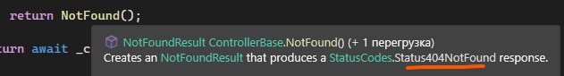
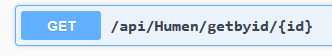
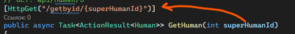
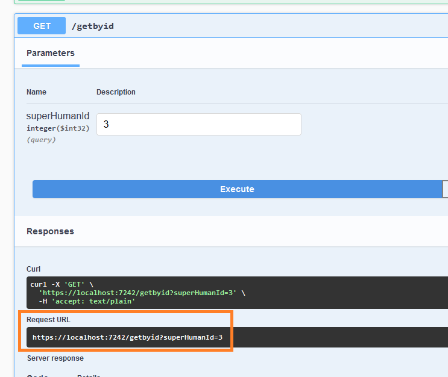
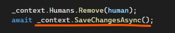
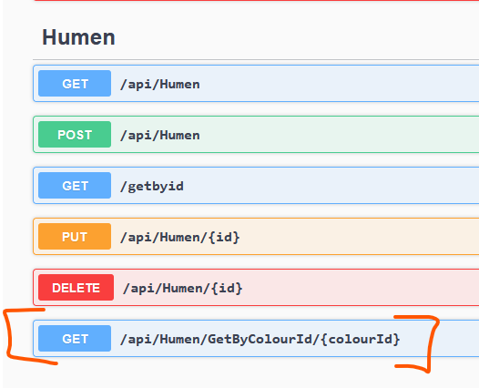
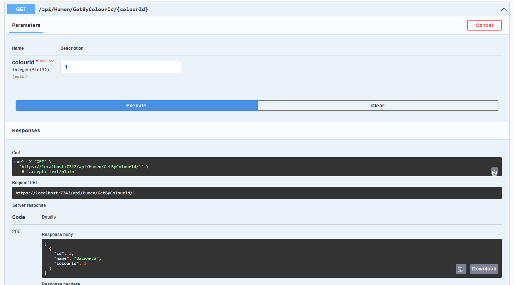

В прошлой лекции мы с вами [сгенерировали рабочее API](/wpf/aspnet-api). Он генерирует 5 дефолтных запросов для каждой таблицы. Но если у нас появляется нужда в создании своих запросов или изменении существующих, нам нужно понять как работают контроллеры.

## Структура контроллера

Возьмем API с прошлой пары и откроем контроллер человека — `HumenController`. Начнем сверху.

```csharp
namespace MyTestApi.Controllers
{
    [Route("api/[controller]")]
    [ApiController]
    public class HumenController : ControllerBase
    {
        private readonly ExampleDBContext _context;

        public HumenController(ExampleDBContext context)
        {
            _context = context;
        }
        // ...
    }
}
```

Первое что мы видим — штуки в квадратных скобках. Они называются атрибуты. Подобные вещи мы видели, когда писали [тесты](/wpf/ui-tests). Напомню, атрибуты — надстройки над кодом, которые определяют её поведение. Так:

- `Route` — говорит по какому URL будет доступно это API.
- `ApiController` — говорит, что это не просто класс, а класс для API.

Потом мы видим переменную `_context`. В ней хранится вся БД и через неё мы можем обращаться ко всем табличкам как коллекциям (`List<Human>`, `List<Colour>` и прочее). А чтобы переменная не была пустой, ей автоматически дается значение в `public HumenController`.

## Атрибут HttpGet и возврат данных

Каждый запрос — отдельный метод с нужным атрибутом. Например GET запрос.

```csharp
// GET: api/Humen
[HttpGet]
public async Task<ActionResult<IEnumerable<Human>>> GetHumans()
{
    if (_context.Humans == null)
    {
        return NotFound();
    }
    return await _context.Humans.ToListAsync();
}
```

Он помечен атрибутом `HttpGet` и возвращает коллекцию с `Human`, которая потом автоматом преобразуется в JSON. Название метода тут не играет роли.

Внутри из переменной `_context` метод спокойно берёт таблицу `Humans` и возвращает все данные из неё. Вернуть метод может не только данные, но и какой-нибудь статус-код, как например, `404 — NotFound`.

(Таких методов кстати очень много — `Ok`, `BadRequest`, `NoContent` и прочее. Какой они возвращают статус-код вы можете узнать, наведясь на сам метод.)



## GET по ID и параметры в маршруте

Чуть ниже есть `GET` запрос по Id. В комментарии показано как к нему нужно обращаться — `api/Humen/5`.

```csharp
// GET: api/Humen/5
[HttpGet("{id}")]
public async Task<ActionResult<Human>> GetHuman(int id)
{
    if (_context.Humans == null)
    {
        return NotFound();
    }

    var human = await _context.Humans.FindAsync(id);

    if (human == null)
    {
        return NotFound();
    }

    return human;
}
```

Здесь мы уже видим отличия. Кроме как кода, который ищет запись по id и, если он её нашел, возвращает её (а если не нашел — статус-код 404), мы ещё видим, что в атрибуте `HttpGet` появились круглые скобки с `"{id}"` внутри, и появилась переменная `int id` в методе. Как они связаны?

Когда в запросе (не важно, `HttpGet`, `HttpPost`, `HttpPut` и прочее) появляются круглые скобки с текстом внутри, они перезаписывают обращение к этому методу. В этом случае мы уже видим, что к дефолтному `api/Humen` добавляется число.


Если я хочу поменять обращение, я сделаю вот так:

```csharp
[HttpGet("getbyid/{id}")]
public async Task<ActionResult<Human>> GetHuman(int id)
```

Запрос будет выглядеть вот так:



Я поставлю слеш перед `getbyid`:

```csharp
[HttpGet("/getbyid/{id}")]
```

И то, что было до этого (`api/Humen`) полностью уберется.


Также заметим, что в этих фигурных скобках написано название нашей переменной. Соответственно, если я её поменяю, то и в запросе её также нужно поменять.



Обращение всё равно каким было, так и останется — `https://localhost:порт/getbyid/5`.


## Query-параметры

А вот если я вовсе уберу этот `{переменная}` из моего пути, тогда обращение поменяется.

```csharp
[HttpGet("/getbyid/")]
public async Task<ActionResult<Human>> GetHuman(int superHumanId)
```

В этом случае данные уже будут передаваться в виде параметра, через вопросительный знак.



В таком виде данные обычно отправляются если они не обязательны, а являются просто как надстройка. Возьмем например ютуб:

- `https://youtu.be/dQw4w9WgXcQ` — это обычная ссылка на видео.
- `https://youtu.be/dQw4w9WgXcQ?t=43` — это ссылка с таймкодом — необязательная вещь, открывает всю ту же страницу, но если данные были переданы, тогда происходит что-то дополнительно.

В случае, если ссылка та же, но мы хотим вывести вообще другое, лучше использовать `ссылка/данные`. Если ввод этих данных опционален, мы делаем `ссылка?переменная=данные`. Ещё полезно, когда переменных много.

## SaveChangesAsync для изменений

Со всеми остальными запросами происходят такие же действия, только в добавлении/изменении/удалении данных есть одна интересная строчка — сохранение изменений. Вот например в удалении.



Эта строчка должна быть в конце каждого запроса, если мы как-либо изменяем данные. Так они сохранятся в БД.

## Свой запрос в контроллере

На основе этих знаний мы можем создать свои методы в контроллере — свои запросы. Вот скажем я хочу сделать запрос, который возьмет всех людей, которые любят какой-то цвет, который я им передам. Если я хочу получить данные, ничего зашифрованного отправлять не собираюсь, это будет `Get` запрос. Создам такой метод где-то ниже. Метод будет мне возвращать коллекцию с людьми, так как людей, которые любят, например, зеленый цвет, может быть много.

```csharp
[HttpGet]
public async Task<ActionResult<List<Human>>> GetHumansByColour()
{

}
```

Добавлю интовую переменную, в которую я буду передавать айдишник цвета.

```csharp
GetHumansByColour(int colourId)
```

В `HttpGet` напишу путь до этого запроса.

```csharp
[HttpGet("GetByColourId/{colourId}")]
public async Task<ActionResult<List<Human>>> GetHumansByColour(int colourId)
{

}
```

И напишу код.

```csharp
public async Task<ActionResult<List<Human>>> GetHumansByColour(int colourId)
{
    if (_context.Humans == null)          // если записей в таблице нет вовсе
    {
        return NotFound();                // вернуть 404
    }

    var humans = _context.Humans.ToList().Where(x =>    // ищу все записи в таблице,
                x.ColourId == colourId);                // где ColourId равен тому, что я передала

    if (humans == null || humans?.Count() == 0)         // если и тут ничего нет
    {
        return NotFound();                              // вернуть 404
    }
    return Ok(humans);                                  // возвращаю лист с статусом 200 — всё ок
}
```

Запущу API чтобы посмотреть, как будет работать мой метод. Во-первых я сразу вижу, что мой метод появился в Swagger.



Выполняя запрос, он мне возвращает всех людей, которые любят этот цвет. В нашем случае это только одна девушка — Василиса, но даже в этом случае API вернуло коллекцию (потому что в JSON есть квадратные скобки).



## Полный код примера

`Controllers/HumenController.cs` — стандартные запросы плюс свой `GetByColourId`:

```csharp
using Microsoft.AspNetCore.Mvc;
using Microsoft.EntityFrameworkCore;
using MyTestApi.Models;

namespace MyTestApi.Controllers
{
    [Route("api/[controller]")]
    [ApiController]
    public class HumenController : ControllerBase
    {
        private readonly ExampleDBContext _context;

        public HumenController(ExampleDBContext context)
        {
            _context = context;
        }

        // GET: api/Humen
        [HttpGet]
        public async Task<ActionResult<IEnumerable<Human>>> GetHumans()
        {
            if (_context.Humans == null)
                return NotFound();
            return await _context.Humans.ToListAsync();
        }

        // GET: api/Humen/5
        [HttpGet("{id}")]
        public async Task<ActionResult<Human>> GetHuman(int id)
        {
            if (_context.Humans == null)
                return NotFound();

            var human = await _context.Humans.FindAsync(id);
            if (human == null)
                return NotFound();

            return human;
        }

        // DELETE: api/Humen/5
        [HttpDelete("{id}")]
        public async Task<IActionResult> DeleteHuman(int id)
        {
            var human = await _context.Humans.FindAsync(id);
            if (human == null)
                return NotFound();

            _context.Humans.Remove(human);
            await _context.SaveChangesAsync();
            return NoContent();
        }

        // Свой запрос: GET api/Humen/GetByColourId/2
        [HttpGet("GetByColourId/{colourId}")]
        public async Task<ActionResult<List<Human>>> GetHumansByColour(int colourId)
        {
            if (_context.Humans == null)
                return NotFound();

            var humans = _context.Humans.ToList().Where(x => x.ColourId == colourId);

            if (humans == null || humans?.Count() == 0)
                return NotFound();

            return Ok(humans);
        }
    }
}
```
