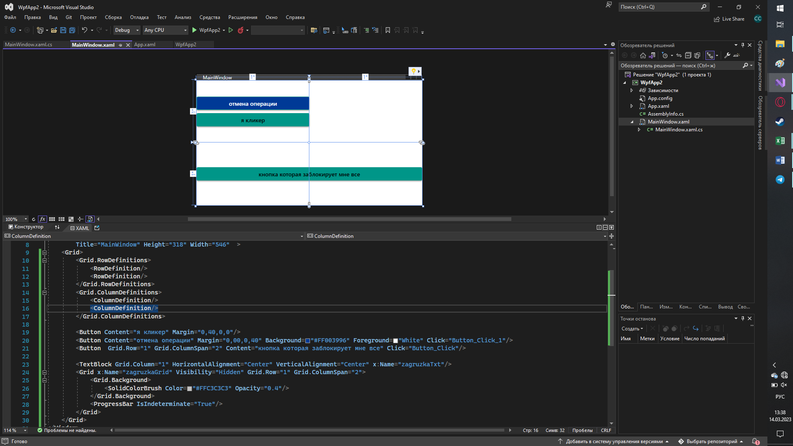
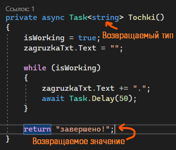
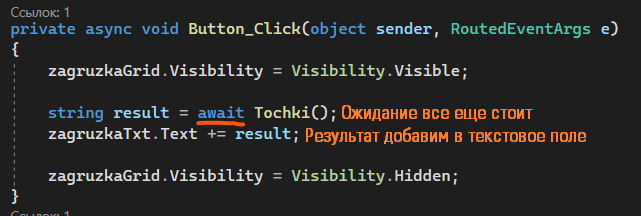
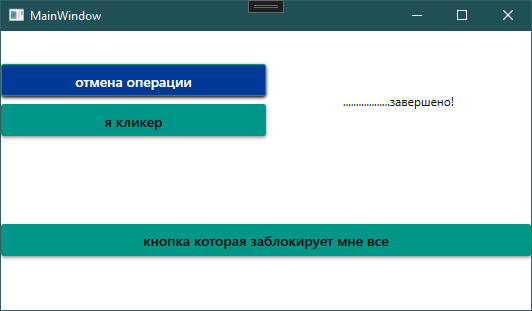

Мы с вами умеем создавать многопоточность через `Thread`, однако создавая его, мы сильно нагружаем систему — создавая 100 `Thread` и запуская их, мы выделяем оперативку под 100 потоков. А если мы будем использовать `Task`, он сам поймёт, в каком потоке его выполнять. Т.е. создавая 100 `Task`, они сами поймут, в каком потоке их использовать, и потоков может быть только три.

Пример из жизни: один большой проект разделён на 100 задач. Если мы для каждой задачи возьмем отдельного человека, у нас будет 100 людей, а ими сложно управлять. Будет лучше, если 100 задач будет распределено между 3 людьми, которые сами могут правильно распределить своё время — выполнить одну задачу одновременно с другой, или отложить другую задачу в приоритет другой. 100 человек на 100 задач — `Thread`, 100 задач на 3 человека — `Task`.

## Интерфейс примера

Разберем следующий код. Я создам интерфейс с 3 кнопками:

- «Кнопка, которая заблокирует мне всё» — кнопка, на которую я нажимаю и у меня запускается какой-то очень долгий процесс, который по идее, блокирует мне интерфейс. Блокировки интерфейса происходить не должно, так что мы должны это исправить. Процесс должен завершаться, как только мы нажмем отмену.
- «Я кликер» — кнопка, по которой мы будем проверять, работает ли интерфейс или нет.
- «Отмена операции» — кнопка, по нажатию на которую мы должны отменить действие, которое запустилось по нажатию на первую кнопку.



В интерфейсе также есть грид с ползунком, который показывает, что сейчас идёт какое-то действие. Этот грид называется `zagruzkaGrid`.

Для имитации действия я буду ставить точку в текстовое поле. Текстовое поле у меня называется `zagruzkaTxt`.

Для её работы у нас есть следующий код.


```csharp
public partial class MainWindow : Window
{
    private bool isWorking;

    public MainWindow()
    {
        InitializeComponent();
    }

    private async void Button_Click(object sender, RoutedEventArgs e)
    {
        zagruzkaGrid.Visibility = Visibility.Visible;
        await Tochki();
        zagruzkaGrid.Visibility = Visibility.Hidden;
    }

    private void Button_Click_1(object sender, RoutedEventArgs e)
    {
        isWorking = false;
    }

    private async Task Tochki()
    {
        isWorking = true;
        zagruzkaTxt.Text = "";

        while (isWorking)
        {
            zagruzkaTxt.Text += ".";
            await Task.Delay(50);
        }
    }
}
```

У нас есть 3 метода, 2 из которых событие, и одна глобальная переменная — `isWorking`.

- Метод `Tochki` — метод, который должен работать параллельно с интерфейсом. Чтобы он работал параллельно, он должен являться `Task` — задачей — поэтому вместо `void` мы пишем `Task`. Задача определяется тем, что он возвращает тип данных `Task`. Задача должна идти асинхронно с остальной программой, поэтому она помечена как `async`.
- Глобальная переменная нужна для остановки нашего метода. Если она `false` — метод остановится. `true` — заработает.
- `Button_Click` — метод, который будет показывать наш ползунок с загрузкой, а также запускать метод `Tochki`.
- `Button_Click_1` — метод, который будет завершать метод `Tochki`, ставя значение для `isWorking = false`.

## Task

Разберем отдельно `Task` и `async`/`await`.

`Task` здесь существует для того, чтобы распараллелить выполнение двух задач — работу интерфейса и создание точек. В отличии от `Thread`, который представляет собой физический, системный поток выполнения, `Task` — это штука, которая по сути перепрыгивает из потока в поток, а зачастую и вовсе не находится ни в каком потоке! В результате у вас может быть всего 10 активных потоков, но тысячи `Task`'ов.

Внутри `Task` мы можем не подключаться к интерфейсу, как мы делали это в 3-й практической для слайдера через `Dispatcher.Invoke` или `DispatcherTimer` — `Task` сам перепрыгнет на нужный поток с окном, когда это понадобится.

## Async / await

Так как мы распараллеливаем задачи, мы должны указать, что метод должен выполняться асинхронно с основной программой — `async`, asynchronously. `async` мы пишем после модификаторов доступа — `private` или `public`.

Вы также можете заметить, что напротив некоторых методов стоит `await`. Он нужен для того, чтобы ожидать выполнение некоторых методов. Зачем? Представим, у нас не было бы этого `await`. Тогда код бы шел следующим образом.


`await` позволяет нам подождать, пока метод выполнится, т.е. код остановится на метод `Tochki`. Прогресс бар (ползунок с загрузкой) всё ещё будет отображаться, т.к. код дойдет до момента его выключения только когда метод с точками закончится, т.е. когда мы нажмем на кнопку «Отмена операции».

`await` не заставляет метод работать в том же потоке, мы всё ещё можем использовать интерфейс, он всего лишь заставляет код подождать, пока метод закончится.


`await` пишется перед методом, который мы хотим подождать. Если в методе есть `await`, метод должен быть помечен как `async`.

## Возвращаемые значения из Task

Также, главным преимуществом у `Task` является то, что он может возвращать значения. Чтобы вернуть значения из `Task`, их нужно указать в угловых скобках после `Task`. Скажем, что по окончанию этого метода я хочу вернуть текст «завершено!». Вся логика возвращения значения будет такая же, как и у обычных методов.



```csharp
private async Task<string> Tochki()
{
    isWorking = true;
    zagruzkaTxt.Text = "";

    while (isWorking)
    {
        zagruzkaTxt.Text += ".";
        await Task.Delay(50);
    }

    return "завершено!";
}
```

Чтобы получить значение из метода, нам опять же нужно записать его в переменную, например, `result`. Получившееся значение помещу в текстовое поле, к остальным точкам. Так как я хочу дождаться, пока код дойдет до конца метода `Tochki`, мы его ждем при помощи `await`. Если бы не ждал, результата бы не было.



```csharp
private async void Button_Click(object sender, RoutedEventArgs e)
{
    zagruzkaGrid.Visibility = Visibility.Visible;

    string result = await Tochki();
    zagruzkaTxt.Text += result;

    zagruzkaGrid.Visibility = Visibility.Hidden;
}
```

Результат будет следующим. Таким образом, мы можем возвращать любой тип данных.



## Полный код примера

`MainWindow.xaml` — три кнопки и блок с индикатором загрузки:

```xml
<Window x:Class="WpfApp1.MainWindow"
        xmlns="http://schemas.microsoft.com/winfx/2006/xaml/presentation"
        xmlns:x="http://schemas.microsoft.com/winfx/2006/xaml"
        Title="MainWindow" Height="300" Width="540">
    <Grid>
        <Grid.RowDefinitions>
            <RowDefinition/>
            <RowDefinition/>
            <RowDefinition Height="Auto"/>
        </Grid.RowDefinitions>
        <Grid.ColumnDefinitions>
            <ColumnDefinition/>
            <ColumnDefinition/>
        </Grid.ColumnDefinitions>

        <Button Content="отмена операции" Background="#1F3F8F" Foreground="White"
                Margin="10" Click="Button_Click_1"/>
        <Button Grid.Row="1" Content="я кликер" Background="#0A8A7B" Foreground="White"
                Margin="10"/>
        <TextBlock Grid.Column="1" Grid.RowSpan="2" x:Name="zagruzkaTxt"
                   VerticalAlignment="Center" Margin="10"/>

        <Grid Grid.Row="2" Grid.ColumnSpan="2" x:Name="zagruzkaGrid"
              Visibility="Hidden" Background="#0A8A7B">
            <ProgressBar IsIndeterminate="True" Height="6" Margin="20,0"/>
        </Grid>
        <Button Grid.Row="2" Grid.ColumnSpan="2" Content="кнопка которая заблокирует мне всё"
                Background="#0A8A7B" Foreground="White" Margin="10" Click="Button_Click"/>
    </Grid>
</Window>
```

`MainWindow.xaml.cs` — `async`/`await` с `Task<string>` и кнопкой отмены:

```csharp
using System.Threading.Tasks;
using System.Windows;

namespace WpfApp1
{
    public partial class MainWindow : Window
    {
        private bool isWorking;

        public MainWindow()
        {
            InitializeComponent();
        }

        private async void Button_Click(object sender, RoutedEventArgs e)
        {
            zagruzkaGrid.Visibility = Visibility.Visible;

            string result = await Tochki();
            zagruzkaTxt.Text += result;

            zagruzkaGrid.Visibility = Visibility.Hidden;
        }

        private void Button_Click_1(object sender, RoutedEventArgs e)
        {
            isWorking = false;
        }

        private async Task<string> Tochki()
        {
            isWorking = true;
            zagruzkaTxt.Text = "";

            while (isWorking)
            {
                zagruzkaTxt.Text += ".";
                await Task.Delay(50);
            }

            return "завершено!";
        }
    }
}
```
