Все наше время мы передавали данные на интерфейс при помощи `<название объекта>.<свойство>`. Это занимало достаточно большие куски кода, если нужно было передать много данных. Однако мы можем привязать данные из переменных так, чтобы значения сразу брались из переменных и отображались на интерфейсе, без постоянных `TextBox.Text` или `ListBox.ItemsSource`. Такая привязка данных называется `Binding`.

Привязать данные мы можем несколькими способами:

- От одного элемента интерфейса к другому элементу интерфейса (например, от текстового поля к текстовому блоку).
- От переменной к элементу интерфейса.

Начнем с первого — два элемента интерфейса, между которыми создана привязка данных.

## Элемент к элементу

Я создам маленькое приложение WPF со следующим интерфейсом:

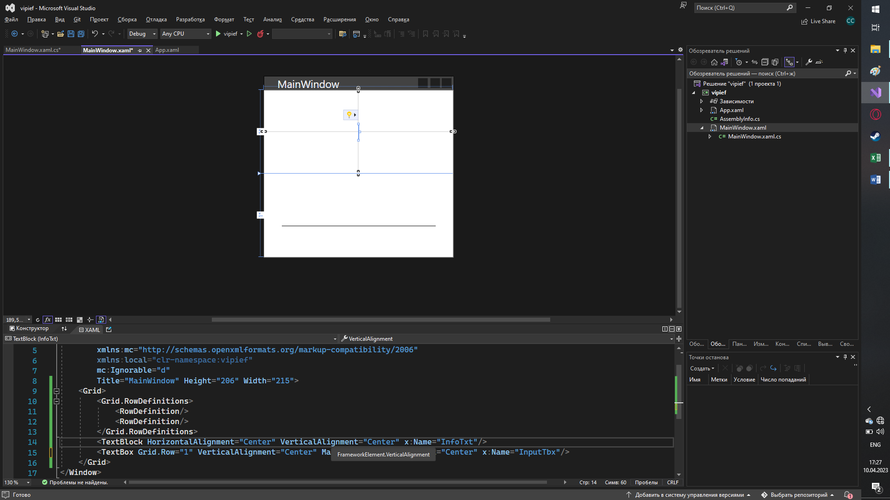

Здесь у меня есть текстовое поле, куда я буду вводить данные. Оно называется `InputTbx`. Также у меня есть текстовый блок для отображения вводимых данных — `InfoTxt`. Если я прямо сейчас запущу программу, никаких изменений вы не увидите — все будет работать, как и всегда, текстовое поле отдельно, текст отдельно.

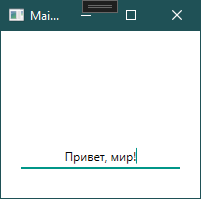

Наша же задача — привязать данные из текстового поля в текст. У нас постоянно должно обновляться свойство `Text`, поэтому именно к нему мы и будем привязывать данные. Чтобы привязать данные, внутри этого свойства необходимо прописать `{Binding}`. Прописываем мы это именно там, где хотим видеть постоянно обновляющийся текст, то есть в текстблоке.

```xml
<TextBlock Text="{Binding}" .../>
```

Далее нам необходимо каким-то образом привязать данные из текстового поля. Для этого к нему нужно обратиться при помощи `ElementName` — имя элемента интерфейса. `ElementName` мы пишем сразу после `Binding`, а значение указываем через равно, без двойных кавычек.

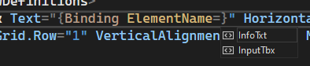

Я хочу привязать свой текст к текстовому полю, которое называется `InputTbx` — я так и напишу:

```xml
<TextBlock Text="{Binding ElementName=InputTbx}" .../>
```

Однако на нашем интерфейсе теперь мы можем увидеть следующее: в текстовое поле просто выводится информация о том, что это текстбокс. Внутри текстового поля очень много разных свойств и сейчас наша привязка просто не понимает к чему именно нужно обратиться.

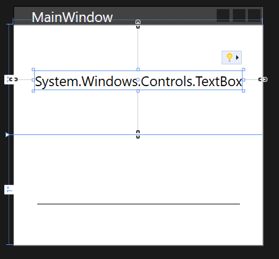

Нам нужен текст из текстбокса. Значит мы должны указать путь, откуда привязка должна взять значения. Путь — `Path` — мы также прописываем внутри фигурных скобок привязки. Заметьте, что после названия элемента нам обязательно нужно поставить запятую, иначе привязка потеряется в значениях.

Введем то, что мы хотим взять именно текст из текстового поля, и по итогу привязка будет выглядеть следующим образом:

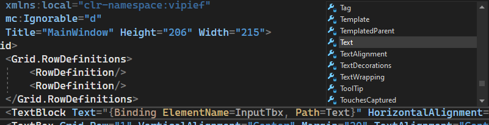

Уже на этом моменте мы можем запускать наше приложение и увидеть, что текст меняется автоматически с текстовым полем.

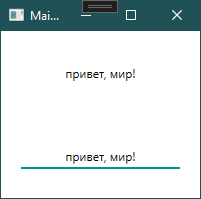

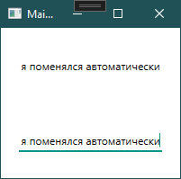

Кроме этих настроек внутри `Binding` существуют еще несколько свойств. Разберем самые простые из них в данном случае:

- **StringFormat** — формат текста, который будет выводиться с привязкой. Например, если написать `StringFormat=Текст: {0}`, тогда перед нашим вводимым текстом всегда будет появляться слово «Текст: ». `{0}` в этом случае фигурирует как текст, к которому мы привязались. Сюда же можно вставить формат даты.

```xml
<TextBlock Text="{Binding ElementName=InputTbx, Path=Text, StringFormat=Текст: {0}}" .../>
```

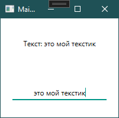

- **TargetNullValue** — если свойство, на которое мы биндим, равно `null`, тогда вместо свойства подставится вписанное значение.

```xml
<TextBlock Text="{Binding ElementName=InputTbx, Path=Text, TargetNullValue=Пусто}" .../>
```

## Элемент к переменной

Разберем второй тип привязки — элемент к переменной и обратно. Эта вещь будет немного сложнее, так как теперь нам нужно сослаться на файл xaml.cs, где будут находиться переменные, к которым мы привязываемся. Чтобы сослаться на этот файл, необходимо прописать следующее в окне:

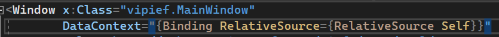

Мы указываем контекст для нашего окна и ссылаемся на себя же, так как `MainWindow.xaml` и `MainWindow.xaml.cs` связаны.

Затем, создадим переменную внутри `MainWindow.xaml.cs`, на которую мы будем ссылаться. У этой переменной обязательно должен быть [get; set;](/wpf/properties).

Укажу сразу же значение для своей переменной `MyExample`:

```csharp
public partial class MainWindow : Window
{
    public string MyExample { get; set; } = "Это пример!";
}
```

А далее, чтобы реализовать привязку, мы просто сразу после `Binding`, без указания чего-либо еще, пропишем название переменной. Если все прописано верно, тогда привязка сама предложит нам вписать нужную переменную.

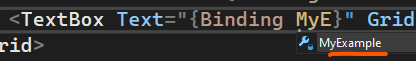

Если мы запустим сейчас, у нас изменится наше текстовое поле. Однако сейчас, при изменении текстового поля, сама переменная меняться не будет.

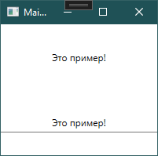

## Mode и направление привязки

Для того, чтобы переменная менялась в две стороны — и из кода, и из интерфейса, ей необходимо указать режим привязки — `Mode`. `Mode` бывают разными:

- **OneWay** — свойство объекта-приемника изменяется после изменения свойства объекта-источника. Пример: из переменной в интерфейс, но не обратно.
- **OneTime** — свойство объекта-приемника установится по свойству объекта-источника только один раз, потом изменений не будет. Пример: один раз из переменной в интерфейс.
- **OneWayToSource** — объект-приемник, в котором объявлена привязка, меняет объект-источник. Пример: из интерфейса в переменную, но не обратно.
- **TwoWay** — изменения происходят в две стороны. Пример: из интерфейса в переменную и из переменной в интерфейс.
- **Default** — по умолчанию (если меняется свойство `TextBox.Text`, то имеет значение `TwoWay`, в остальных случаях `OneWay`).

Для нашего случая очень подойдет `TwoWay`. Установим это значение:

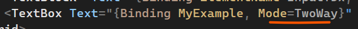

И теперь, по идее, наши изменения должны выполняться в две стороны — если я изменю переменную или если я изменю текстовое поле, в любом случае текст внутри текстового поля должен поменяться. Создам дополнительную кнопку, которая будет выводить `MessageBox` с значением переменной.

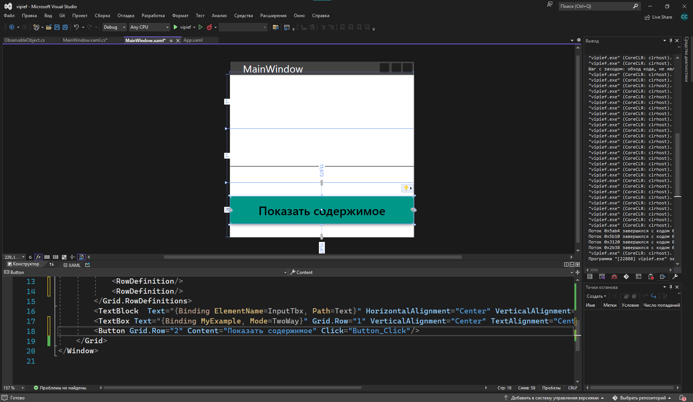

Код внутри кнопки будет следующим:

```csharp
private void Button_Click(object sender, RoutedEventArgs e)
{
    MessageBox.Show(MyExample);
}
```

Если мы запустим приложение, изменим текстовое поле и нажмем на кнопку — содержимое переменной изменится. Ее текущее содержимое можно увидеть в всплывающем окне.

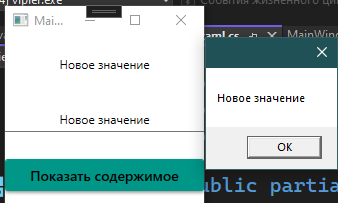

Однако попробуем вписать значение внутрь переменной и узнать, поменяется ли текстовое поле после этого:

```csharp
private void Button_Click(object sender, RoutedEventArgs e)
{
    MessageBox.Show(MyExample);
    MyExample = "Новое значение из кода";
}
```

Запустим и два раза нажмем на кнопку. Сначала `MessageBox` отобразит нам то же самое значение, что было в текстовом поле. Однако при повторном вводе, когда значение из переменной изменится, `MessageBox` меняется, а текстовое поле нет.

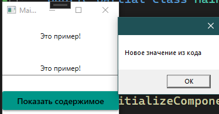

## INotifyPropertyChanged

Это происходит по причине, что привязка из кода происходит только тогда, когда переменная создается. Если внутри нее просто меняется значение, привязка не знает, в какой момент оно изменилось, и не станет обновлять текстовые поля.

Для того, чтобы привязка узнала, что мы изменили наше поле, необходимо использовать [интерфейс](/csharp/interface) `INotifyPropertyChanged`, который и будет обрабатывать изменения значений. Наследую его в окно.

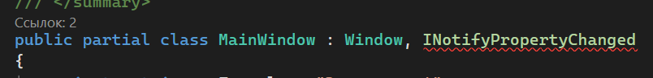

Чтобы реализовать интерфейс, чуть ниже мне необходимо реализовать следующий код. Я его помещу в самый низ, чтобы он не мозолил мне глаза.

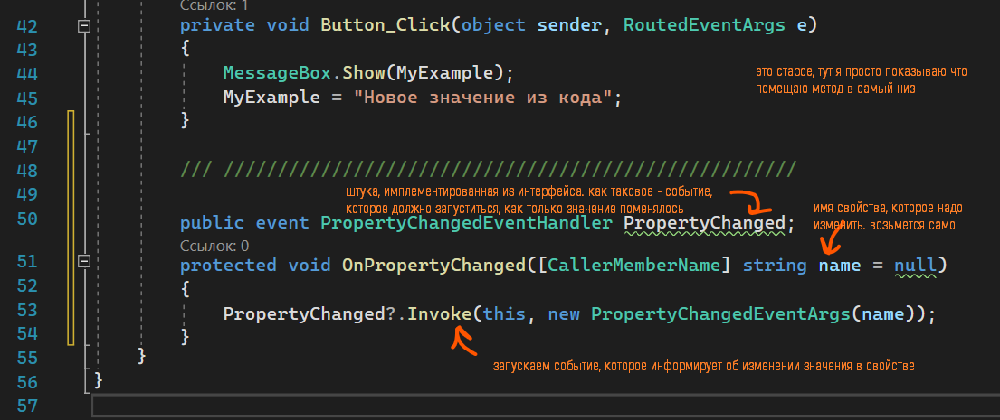

```csharp
public event PropertyChangedEventHandler PropertyChanged;

protected void OnPropertyChanged([CallerMemberName] string name = null)
{
    PropertyChanged?.Invoke(this, new PropertyChangedEventArgs(name));
}
```

Чтобы мой код узнал, что значение изменилось, я должна буду постоянно вызывать `OnPropertyChanged` сразу после того, как я установила значение внутри свойства (переменной с `get; set;`). А значит, метод должен идти сразу после `set`. Если я меняю `set`, мне уже нужно полное свойство (более подробно в лекции про [get и set](/wpf/properties)). Заменю старое краткое свойство на полное, написав `propfull` и нажав два таба чуть ниже и видоизменив его под нужную мне переменную.

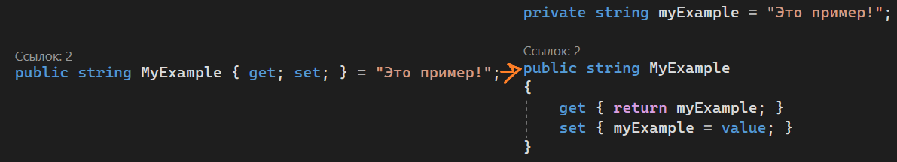

`OnPropertyChanged` пропишу сразу после `myExample = value`:

```csharp
private string myExample = "Это пример!";

public string MyExample
{
    get { return myExample; }
    set
    {
        myExample = value;
        OnPropertyChanged();
    }
}
```

И уже теперь моя привязка будет работать в две стороны — как из переменной внутрь интерфейса, так и из интерфейса в переменную.

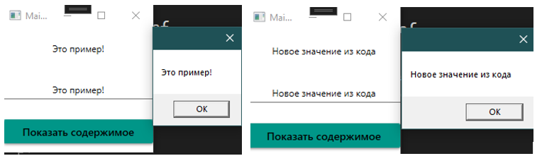

Если мы захотим привязать больше переменных, внутри каждого из них нужно будет писать `OnPropertyChanged();`.

## Привязка листов

Также, при работе со списками и [датагридами](/wpf/datagrid), вам понадобится привязывать листы с моделями. Рассмотрим, как это делать на примере датагрида. Создам новый простой интерфейс:

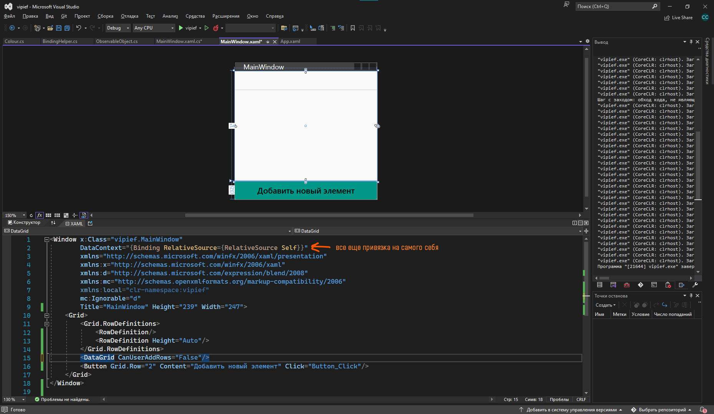

А также простую модель данных, чью информацию я и буду выгружать в датагрид:

```csharp
namespace vipief
{
    public class Colour
    {
        public string Name { get; set; }
        public string Hexademical { get; set; }
    }
}
```

Как источник данных, мне понадобится лист с этой моделью `Colour`. Однако раз я хочу привязать этот лист к датагриду, мне сразу нужно прописать его правильно — полное свойство при помощи `propfull`, внутри которого будет `OnPropertyChanged`.

Свойство будет являться [листом](/csharp/collections) с моделью и называться `Colours`. Внутри приватной переменной будет новый лист:

```csharp
private List<Colour> colours = new List<Colour>();

public List<Colour> Colours
{
    get { return colours; }
    set
    {
        colours = value;
        OnPropertyChanged();
    }
}
```

Привяжу источник элементов датагрида к этой переменной:

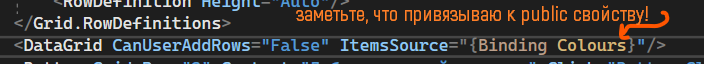

А также пропишу создание заглушек внутрь моего листа по нажатию на кнопку:

```csharp
private void Button_Click(object sender, RoutedEventArgs e)
{
    Colour c = new Colour();
    c.Name = "заглушка";
    c.Hexademical = "FFFFFF";
    Colours.Add(c);
}
```

Если я запущу сейчас и нажму несколько раз на кнопку, таблица не обновится сразу. Чтобы она обновилась, мне нужно отфильтровать одну из колонок, а это не самое лучшее решение.

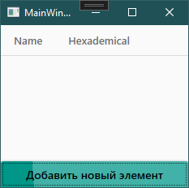

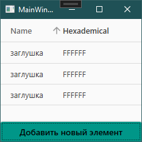

## ObservableCollection

Чтобы исправить эту проблему, нам необходимо заменить `List` на `ObservableCollection` — коллекция, которая может просматриваться. Такое решение будет лучшим для привязок.

```csharp
private ObservableCollection<Colour> colours = new ObservableCollection<Colour>();

public ObservableCollection<Colour> Colours
{
    get { return colours; }
    set
    {
        colours = value;
        OnPropertyChanged();
    }
}
```

После замены, элементы сами будут ставиться внутрь датагрида.

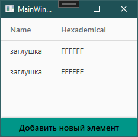

## Кастомизация датагрида

Если я хочу изменить названия столбцов для датагрида, я также могу это реализовать. Для этого укажу, что колонки я буду создавать вручную:

```xml
<DataGrid CanUserAddRows="False" ItemsSource="{Binding Colours}" AutoGenerateColumns="False">
```

И создам 2 колонки со своими названиями. Чтобы у меня значения шли внутрь них из моей модели, воспользуюсь свойством `Binding` и внутрь напишу привязку к названиям моих свойств — `Name` и `Hexademical` соответственно.

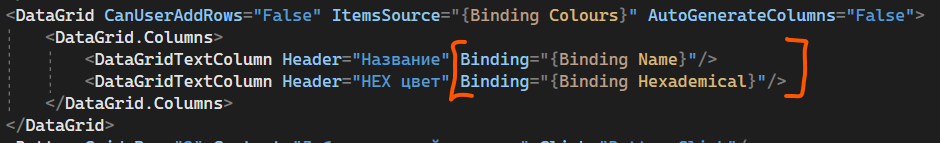

Работать будет также, но названия столбцов уже будут изменены.

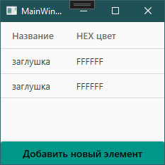

## Полный код примера

`Colour.cs` — модель с двумя свойствами:

```csharp
namespace vipief
{
    public class Colour
    {
        public string Name { get; set; }
        public string Hexademical { get; set; }
    }
}
```

`MainWindow.xaml` с DataContext на себя и кастомным датагридом:

```xml
<Window x:Class="vipief.MainWindow"
        xmlns="http://schemas.microsoft.com/winfx/2006/xaml/presentation"
        xmlns:x="http://schemas.microsoft.com/winfx/2006/xaml"
        DataContext="{Binding RelativeSource={RelativeSource Self}}"
        Title="MainWindow" Height="239" Width="547">
    <Grid>
        <Grid.RowDefinitions>
            <RowDefinition/>
            <RowDefinition Height="Auto"/>
        </Grid.RowDefinitions>

        <DataGrid CanUserAddRows="False"
                  ItemsSource="{Binding Colours}"
                  AutoGenerateColumns="False">
            <DataGrid.Columns>
                <DataGridTextColumn Header="Название" Binding="{Binding Name}"/>
                <DataGridTextColumn Header="HEX цвет" Binding="{Binding Hexademical}"/>
            </DataGrid.Columns>
        </DataGrid>

        <Button Grid.Row="1" Content="Добавить новый элемент" Click="Button_Click"/>
    </Grid>
</Window>
```

`MainWindow.xaml.cs` с `INotifyPropertyChanged` и `ObservableCollection`:

```csharp
using System.Collections.ObjectModel;
using System.ComponentModel;
using System.Runtime.CompilerServices;
using System.Windows;

namespace vipief
{
    public partial class MainWindow : Window, INotifyPropertyChanged
    {
        private ObservableCollection<Colour> colours = new ObservableCollection<Colour>();

        public ObservableCollection<Colour> Colours
        {
            get { return colours; }
            set
            {
                colours = value;
                OnPropertyChanged();
            }
        }

        public MainWindow()
        {
            InitializeComponent();
        }

        private void Button_Click(object sender, RoutedEventArgs e)
        {
            Colour c = new Colour();
            c.Name = "заглушка";
            c.Hexademical = "FFFFFF";
            Colours.Add(c);
        }

        public event PropertyChangedEventHandler PropertyChanged;

        protected void OnPropertyChanged([CallerMemberName] string name = null)
        {
            PropertyChanged?.Invoke(this, new PropertyChangedEventArgs(name));
        }
    }
}
```
