Перед нами, ещё с момента изучения `Thread`, стоял вопрос — как закончить поток? `Thread.Stop()` и `Thread.Abort()` давно не поддерживается, а оставлять поток открытым не хочется. Тогда что делать?

Начнем с того, что теперь, вместо потоков, мы используем [асинхронное программирование и Task](/wpf/async-await). Их тоже нужно отменять, так что разберем на их примере.

## От `bool` к `CancellationTokenSource`

Возьмем пример из предыдущей лекции. Там у нас был бесконечный цикл, сделанный при помощи переменной `isWorking`, и, если мы хотели отменить действие, мы давали ей значение `false`, и да, действие отменялось.

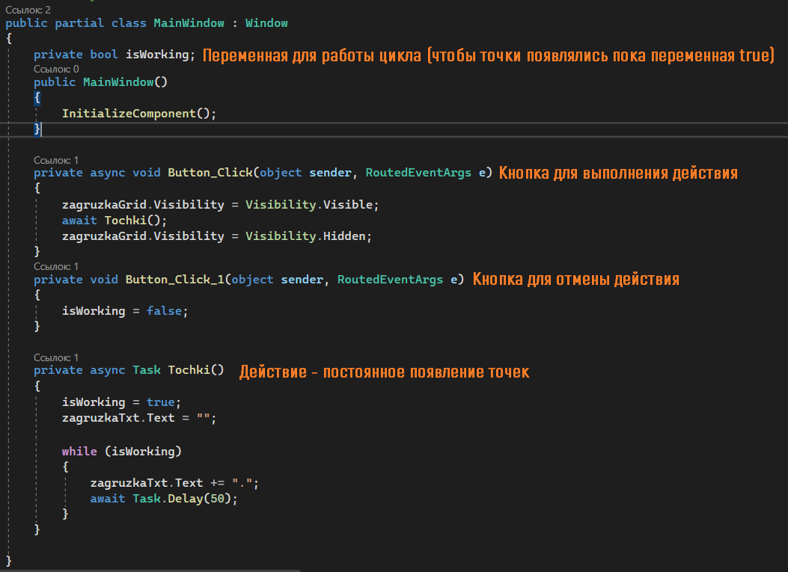

Но если я хочу иметь немного больше контроля над ситуацией (посмотреть, отменяется ли он в данный момент, уже отменился или ещё продолжается), я буду использовать `CancellationToken`.

Сам токен — некий `enum`, где хранятся состояния токена на данный момент. Чтобы мы смогли вызвать отмену токена, нам нужно создать `CancellationTokenSource` — источник. У каждой задачи свой источник токена.

Заменю `bool` переменную на `CancellationTokenSource`.

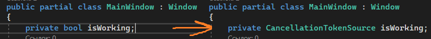

Вместо `isWorking = false` теперь я могу вызвать отмену — `isWorking.Cancel()`.

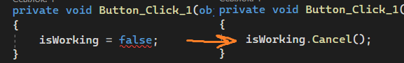

А сам цикл я заменю на следующий вызов.

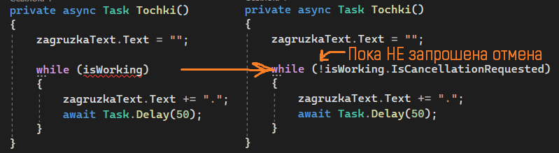

Если мы оставим всё как есть, тогда у нас появится ошибка — токен был `null`. Нам нужно создавать токен каждый раз перед новой задачей.

```csharp
private async void Button_Click(object sender, RoutedEventArgs e)
{
    zagruzkaGrid.Visibility = Visibility.Visible;
    isWorking = new CancellationTokenSource();
    await Tochki();
    zagruzkaGrid.Visibility = Visibility.Collapsed;
}
```

## Передача токена параметром

Так и правда можно оставить код, но это будет несколько неправильно. Наш метод всё ещё зависит от большой глобальной переменной, а метод должен принимать в себя любой токен отмены в любой момент. Для этого вместо глобальной переменной мы сделаем параметр — метод будет принимать в себя токен, чтобы он не зависел ни от каких внешних факторов.

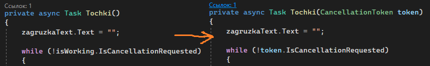

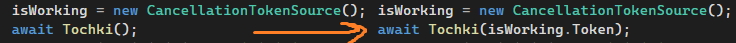

(На всякий случай, если мы не хотим всегда передавать токен, мы всегда в параметре можем написать `CancellationToken token = default`.)

В полном формате наш код будет выглядеть следующим образом.

```csharp
public partial class MainWindow : Window
{
    private CancellationTokenSource isWorking;

    public MainWindow()
    {
        InitializeComponent();
    }

    private async void Button_Click(object sender, RoutedEventArgs e)
    {
        zagruzkaGrid.Visibility = Visibility.Visible;
        isWorking = new CancellationTokenSource();
        await Tochki(isWorking.Token);
        zagruzkaGrid.Visibility = Visibility.Collapsed;
    }

    private void Button_Click_1(object sender, RoutedEventArgs e)
    {
        isWorking.Cancel();
    }

    private async Task Tochki(CancellationToken token)
    {
        zagruzkaText.Text = "";

        while (!token.IsCancellationRequested)
        {
            zagruzkaText.Text += ".";
            await Task.Delay(50);
        }
    }
}
```

## Статусы Task

Однако, что это нам дало? Работает ведь так же, как работало с `bool`. А разница есть. Чтобы её увидеть, нам необходимо посмотреть статус нашего таска. Сделаем следующее.

Раз таск возвращает значение `Task`, значит её можно поместить в переменную. Я создам глобальную переменную типа данных `Task`, чтобы у меня была возможность посмотреть на этот метод отовсюду.

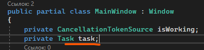

Вместо того, чтобы ожидать этот метод, я запишу его в переменную `task`. Если я записываю его в такую переменную, я не могу ожидать окончание этого метода, так как при `await` метод начнет возвращать `void`.

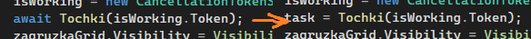

Чуть ниже пропишем ожидание этой задачи.

```csharp
task = Tochki(isWorking.Token);
await task;
```

Теперь у меня есть доступ к этому методу. Воспользуюсь моей бесполезной кнопкой «Кликер». Дам ей название — `statusBtn` — и обработаю нажатие на неё.

Как только я нажимаю на эту кнопку, текст внутри неё будет меняться на статус моего таска при помощи `task.Status`.

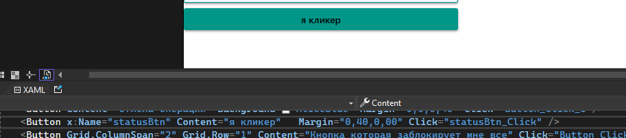

```csharp
private void statusBtn_Click(object sender, RoutedEventArgs e)
{
    statusBtn.Content = task.Status;
}
```

Теперь я могу посмотреть статус моей кнопки. На данный момент у меня есть 2 статуса —

`WaitingForActivation` — метод в данный момент идёт.

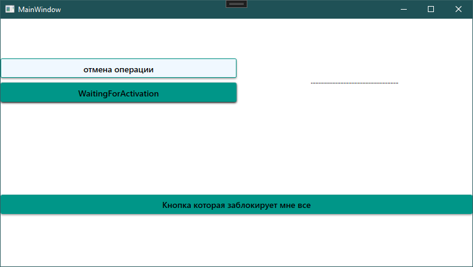

`RanToCompletion` — метод закончил своё выполнение. Такой статус может заработать в двух случаях — если метод правда закончил своё действие (например, у меня был не бесконечный цикл, а цикл `for` на 50 оборотов), и если я прервала его при помощи условия `token.IsCancellationRequested`. Во втором случае он также выдаст этот статус, потому что я просто прервала цикл — метод сам, без ошибок, дошел до конца.

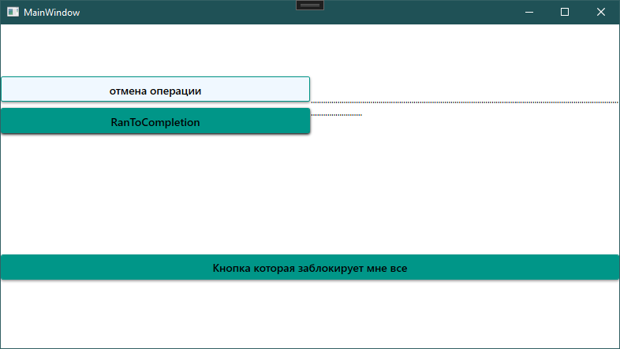

Чтобы посмотреть третий статус, я немного видоизменю метод `Tochki`. Создам бесконечный цикл `while(true)`, и если токен запросил отмену — выкину ему ошибку об отмене.

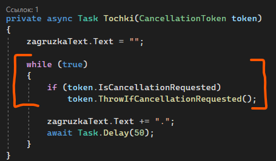

```csharp
private async Task Tochki(CancellationToken token)
{
    zagruzkaText.Text = "";

    while (true)
    {
        if (token.IsCancellationRequested)
            token.ThrowIfCancellationRequested();

        zagruzkaText.Text += ".";
        await Task.Delay(50);
    }
}
```

В этом случае, мы увидим третий статус задачи.

`Canceled` — задача отменена принудительно, метод закончился не самостоятельно, а из-за внутренней ошибки `OperationCanceledException`.

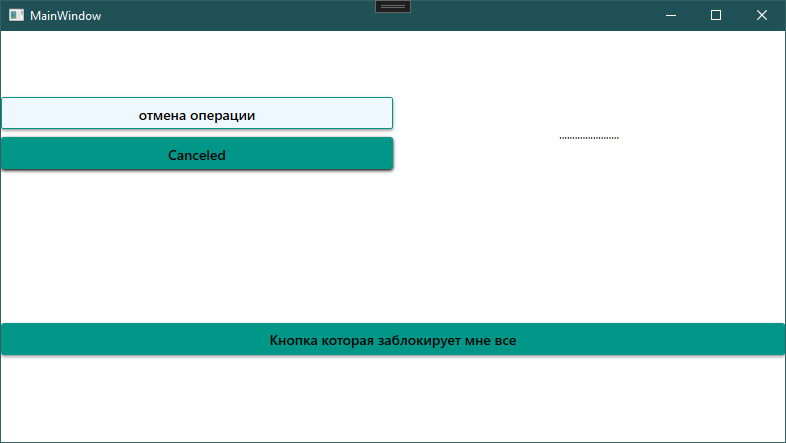

## Обработка OperationCanceledException

Эту ошибку можно обработать при помощи [try-catch](/csharp/trycatch). Скажем, при отмене, я напишу в текстовом поле слово «Отменено». Саму ошибку я буду обрабатывать там же, где ждала этот метод.

```csharp
private async void Button_Click(object sender, RoutedEventArgs e)
{
    zagruzkaGrid.Visibility = Visibility.Visible;

    try
    {
        isWorking = new CancellationTokenSource();
        task = Tochki(isWorking.Token);
        await task;
    }
    catch (OperationCanceledException)
    {
        zagruzkaText.Text = "Отменено";
    }

    zagruzkaGrid.Visibility = Visibility.Collapsed;
}
```

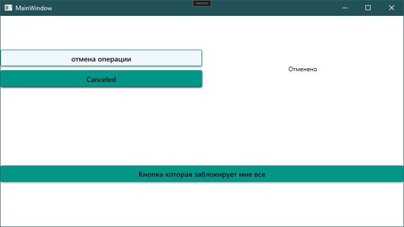

Эти три статуса позволят мне более подробно узнать в каком состоянии сейчас находится задача. Такого функционала `bool` нам дать не может, только если мы начнем очень костылять и создавать эти состояния самостоятельно.

Более того, возвращаясь к потокам, при помощи `CancellationToken` мы можем отменять и их. Делается это при помощи той же передачи токена внутрь потока.

## Зачем нужен CancellationToken

Итак, зачем нам нужен `CancellationToken`?

- Мы можем элегантно отменять задачи и говорить коду, какое действие должно произойти при отмене задачи.
- С его помощью мы можем довести задачу до третьего состояния — отменено, и также обрабатывать его.
- При помощи него можно отменять потоки.

Также, чтобы не засорять наш компьютер, после работы с `CancellationTokenSource` и `Task`, не забудьте вызвать метод `Dispose`, который освободит все ресурсы компа, которые были затрачены на этот токен :)

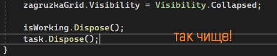

## Полный код примера

`MainWindow.xaml.cs` — отмена через `CancellationTokenSource`, отслеживание статуса, обработка `OperationCanceledException`:

```csharp
using System;
using System.Threading;
using System.Threading.Tasks;
using System.Windows;

namespace WpfApp1
{
    public partial class MainWindow : Window
    {
        private CancellationTokenSource isWorking;
        private Task task;

        public MainWindow()
        {
            InitializeComponent();
        }

        private async void Button_Click(object sender, RoutedEventArgs e)
        {
            zagruzkaGrid.Visibility = Visibility.Visible;

            try
            {
                isWorking = new CancellationTokenSource();
                task = Tochki(isWorking.Token);
                await task;
            }
            catch (OperationCanceledException)
            {
                zagruzkaText.Text = "Отменено";
            }

            zagruzkaGrid.Visibility = Visibility.Collapsed;

            isWorking.Dispose();
            task.Dispose();
        }

        private void Button_Click_1(object sender, RoutedEventArgs e)
        {
            isWorking.Cancel();
        }

        private void statusBtn_Click(object sender, RoutedEventArgs e)
        {
            statusBtn.Content = task.Status;
        }

        private async Task Tochki(CancellationToken token)
        {
            zagruzkaText.Text = "";

            while (true)
            {
                if (token.IsCancellationRequested)
                    token.ThrowIfCancellationRequested();

                zagruzkaText.Text += ".";
                await Task.Delay(50);
            }
        }
    }
}
```
