## ComboBox

А вот ComboBox не входит под общую гребенку с флагами. ComboBox — выпадающий список, элементы которого мы можем настроить как из кода, так и из XAML. Начнем с XAML.

Через свойства, если честно, делать неприятно долго. Давайте начнем с того, что раз у нас что-то должно быть внутри комбобокса, значит и элементы мы будем располагать внутри комбобокса. Нам нужен открывающий и закрывающий тэг. Внутри него мы будем располагать элементы комбобокса — `ComboBoxItem`. Текст для каждого элемента мы можем настроить с помощью свойства `Content`.

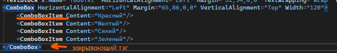

Таким образом, мой список будет выглядеть так.

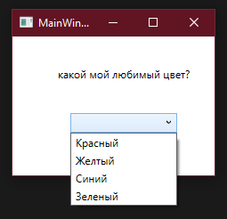

Через код нам необходимо создать какую-то коллекцию с элементами — массив или лист, а также дать имя комбобоксу, чтобы мы смогли привязать к нему список элементов. Дам ему имя `ColourCbx`. Предыдущие элементы в списке я удалю.

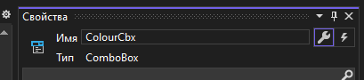

Теперь, я прямо в главном конструкторе, создам лист со своими элементами и присвою его через `ItemsSource` — источник элементов. Запомните это свойство, оно вам по жизни еще понадобится.

Заметьте, что присваиваю я после `InitializeComponent()`. Напоминаю, что если начать присваивать до этого метода, тогда мы схватим `NullPointException`, потому что сам интерфейс еще не был создан, и присваивать элементы некуда.

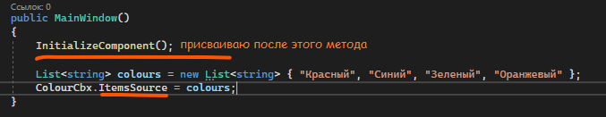

По итогу, с помощью двух простых строчек, мы присвоили элементы к списку. И теперь наш интерфейс выглядит вот так.

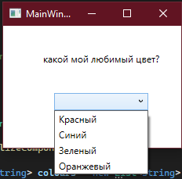

Элементы мы присвоили, а как найти нужный?

## Выбранный элемент списка

Всего мы можем взаимодействовать с выбранными элементами списка тремя способами — `SelectedIndex`, `SelectedItem` и `SelectedValue`. Последний нас пока не интересует, он будет нужен, когда отображаться будет один элемент, а само значение он будет хранить другое, например, отображается «Красный», а значение за ним «Red» (примерно, как с enum-ом). Давайте рассмотрим индекс и сам элемент.

Во-первых, событие, обрабатывающее измененный элемент списка, называется `SelectionChanged`. Давайте обработаем его, и сначала выведем выбранный элемент с помощью индекса. Выводить выбранный элемент я буду в MessageBox.

Чтобы вывести элемент с помощью `SelectedIndex`, нужно понимать, что все элементы — это некая коллекция. Называется она `Items` и обратиться к ней мы можем с помощью `НазваниеСписка.Items`. Чтобы отобразить элемент под выбранным индексом, необходимо написать `НазваниеСписка.Items[НазваниеСписка.SelectedIndex]`, т.е. все как в обычных коллекциях — обращение через индекс, но теперь наш индекс хранится внутри свойства `SelectedIndex`.

Однако просто так у нас не получится вывести наш элемент, так как элемент может быть любого типа данных.

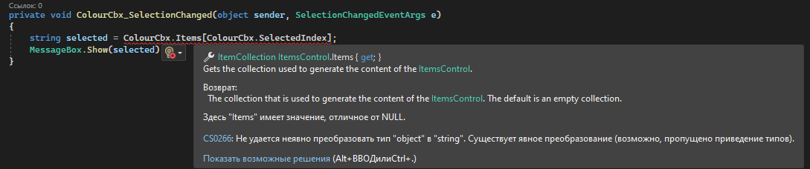

Давайте используем приведение типов данных, и приведем выбранный элемент к типу данных `string`, а затем получившийся результат выведу в MessageBox.

```csharp
private void ColourCbx_SelectionChanged(object sender, SelectionChangedEventArgs e)
{
    string selected = ColourCbx.Items[ColourCbx.SelectedIndex] as string;
    MessageBox.Show(selected);
}
```

Работать будет следующим образом. В своем списке я выбираю какой-то пункт, например, синий.

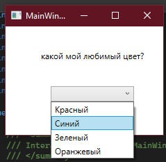

WPF понимает, что мы выбрали элемент под индексом 1, и отображает нам первый элемент.

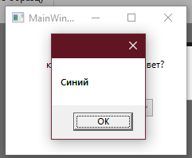

Тоже самое можно провернуть с помощью `SelectedItem`, только внутри этого свойства уже будет хранится не индекс, а сам элемент.

```csharp
private void ColourCbx_SelectionChanged(object sender, SelectionChangedEventArgs e)
{
    string selected = ColourCbx.SelectedItem as string;
    MessageBox.Show(selected);
}
```

Получившийся результат будет точно таким же.

## ListBox

Представим, что у меня есть какая-то коллекция с данными, которую я хочу вывести на экран. Как мне это сделать? С помощью ComboBox? Его каждый раз открывать надо. С помощью TextBlock? А что если я не знаю количество элементов в коллекции, или я буду его менять?

Для этого у нас есть `ListBox` — контейнер для коллекций. Давайте смотреть как он работает.

Работаем мы с ним примерно также, как и с ComboBox. Разница только в том, что ComboBox это выпадающий список, а ListBox — просто список, который мы видим всегда. Я создам один листбокс и дам ему имя.

```xml
<Grid>
    <ListBox x:Name="ExampleLbx"/>
</Grid>
```

Основные свойства у него такие же — `Items` и `ItemsSource`. Создать элементы мы можем как из XAML — используя `ListBoxItem`.

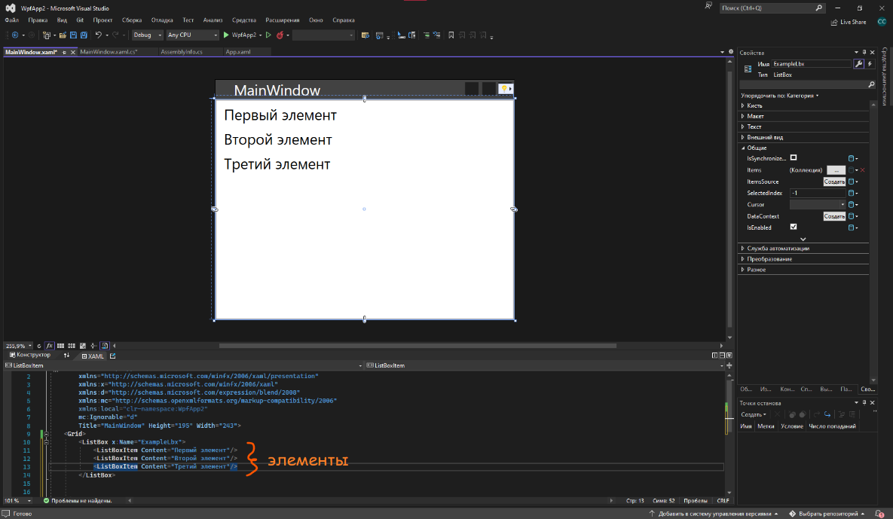

(кстати, мы еще можем ставить сепараторы между элементами — некие разделительные полосы, чтобы выглядело красиво)

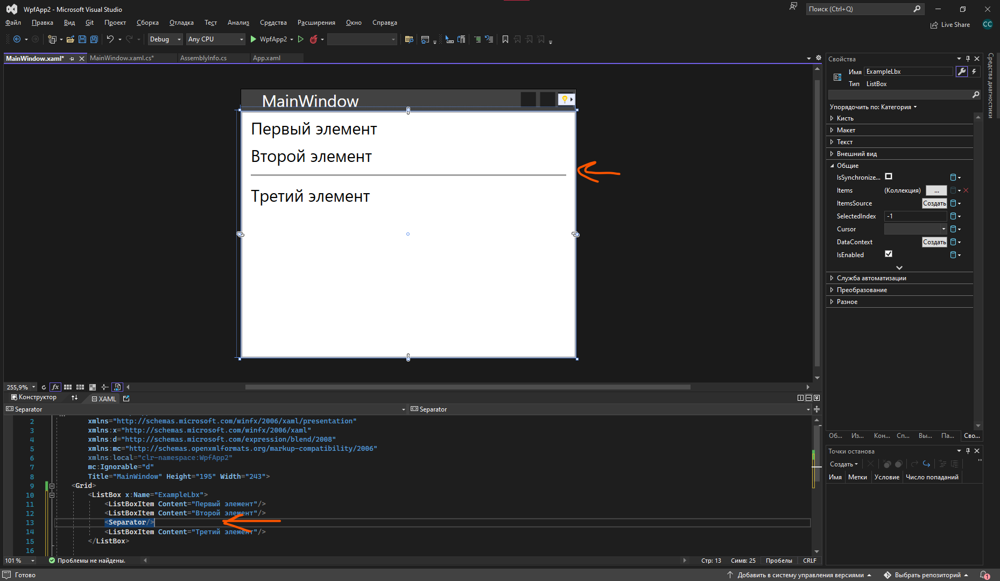

Так и через код, при помощи `ItemsSource`. Логика такая же, как и с выпадающими списками — создаем какую-то коллекцию, и присваиваем ее к `НазваниеЭлемента.ItemsSource`.

```csharp
public MainWindow()
{
    InitializeComponent();
    string[] items = new string[] { "Первый", "Второй", "Третий" };
    ExampleLbx.ItemsSource = items;
}
```

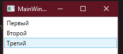

Выбранный элемент мы можем также взять с помощью двух свойств — `SelectedIndex` и `SelectedItem`. Событие по работе с измененным выбранным элементом такое же — `SelectionChanged`.

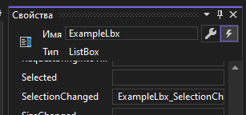

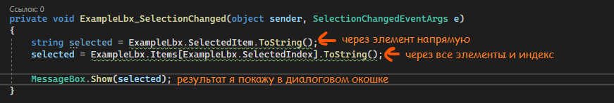

И по итогу мы сможем выводить все элементы и получить выбранный, чтобы в будущем с ним работать — показать его, записать в какую-то переменную, или построить с ним условие/цикл.

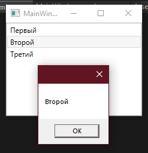

## Свой тип данных в списке

Но это просто обычный массив с текстом, что делать, если я хочу отобразить свой тип данных в листбоксе или комбобоксе?

Создам свой тип данных, например, с людьми — имя, фамилия, отчество. Создам внутри конструктор чтобы было удобнее заполнять данные.

```csharp
internal class Human
{
    public string FirstName;   // Фамилия
    public string Name;        // Имя
    public string Patronymic;  // Отчество

    public Human(string firstName, string name, string patronymic)
    {
        FirstName = firstName;
        Name = name;
        Patronymic = patronymic;
    }
}
```

И создам коллекцию с тремя разными людьми. Заполню ее до `InitializeComponent`, чтобы до создания интерфейса все уже было готово.

```csharp
public partial class MainWindow : Window
{
    List<Human> humans = new List<Human>();

    public MainWindow()
    {
        Human maks    = new Human("Макаров", "Максим",  "Матвеевич");
        Human alexey  = new Human("Левин",   "Алексей", "Данильевич");
        Human dmitriy = new Human("Семенов", "Дмитрий", "Елисеевич");

        humans.Add(maks);
        humans.Add(alexey);
        humans.Add(dmitriy);

        InitializeComponent();
    }
}
```

Раз мы создали коллекцию через код, то и через код нам нужно указать источник для листбокса — при помощи `ItemsSource`. Это пишем уже после `InitializeComponent`, чтобы интерфейс создался, и потом только мы что-то в нем настроили.

```csharp
InitializeComponent();
ExampleLbx.ItemsSource = humans;
```

Запустим и увидим следующее. Вместо красивого отображения мы видим везде Human Human Human. Так происходит, потому что программа выводит сам элемент. Когда элемент коллекции был текстом, он и выводил текст. Когда элемент коллекции был числом, он выводил число. Когда элемент коллекции является классом, он и выводит, что это за класс. Ему никто не говорил, что надо вывести что-то внутри этого класса.

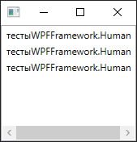

## DisplayMemberPath

А мы можем ему это сказать — при помощи свойства `DisplayMemberPath` у листбокса или комбобокса. Но вывести мы сможем только какой-то один атрибут — только фамилию, имя, или отчество в нашем случае.

`DisplayMemberPath` должен хранить в себе точное название атрибута, который мы хотим вывести. Хотим имя — пишем Name. Хотим фамилию — пишем FirstName и так далее.

Задать этот DisplayMemberPath можно либо в XAML, либо в коде.

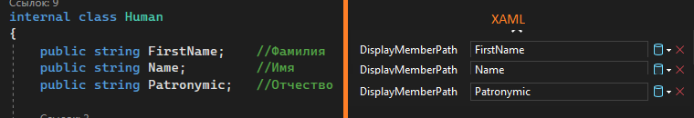

```xml
<ListBox x:Name="ExampleLbx" DisplayMemberPath="Patronymic"/>
```

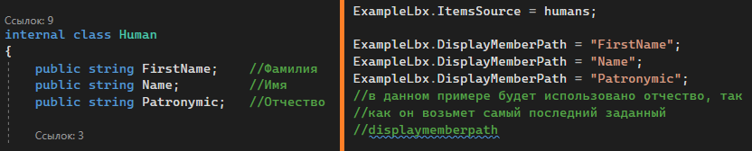

Если в наименовании `DisplayMemberPath` будет ошибка или он будет несовпадать с переменной, тогда ничего не отобразится. Если он совпадает с какой-то переменной, тогда вместо Human будет отображаться эта переменная. Например, я оставлю `Patronymic` для отображения.

Запускаю и вижу, что ничего не отображается, хотя написано все верно. Почему?

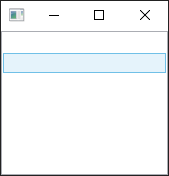

## get; set; для отображения

Более подробно мы разберем это на следующих парах, но сейчас кратко: если я хочу, чтобы интерфейс начал работать с переменными внутри класса, мне надо поставить всем переменным `{ get; set; }`, чтобы интерфейс их видел.

Без гет-сета интерфейс пытается взять (`get`) какое-то значение из переменной, а у него нет `get`. Он и не берет, он не знает что брать.

С гет-сетом интерфейс может взять (`get`) это значение и его отображить.

Поменяю свой класс `Human`, добавив везде `get` и `set`. Заметьте, что точка с запятой тоже уходит, именно заместо нее ставятся `get` и `set`.

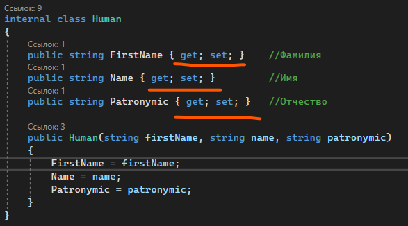

Перезапущу программу, оставив все как есть, только добавив гет-сеты.

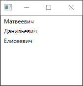

И все отображается! Тоже самое будет, если я изменю `DisplayMemberPath` на `FirstName` или `Name`.

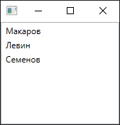

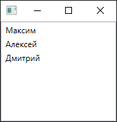

## Полный код примера

`MainWindow.xaml` с одним ListBox и заданным DisplayMemberPath:

```xml
<Window x:Class="WpfApp2.MainWindow"
        xmlns="http://schemas.microsoft.com/winfx/2006/xaml/presentation"
        xmlns:x="http://schemas.microsoft.com/winfx/2006/xaml"
        Title="MainWindow" Height="195" Width="243">
    <Grid>
        <ListBox x:Name="ExampleLbx" DisplayMemberPath="Patronymic"/>
    </Grid>
</Window>
```

`Human.cs` — класс со свойствами `get; set;`:

```csharp
namespace WpfApp2
{
    internal class Human
    {
        public string FirstName  { get; set; } // Фамилия
        public string Name       { get; set; } // Имя
        public string Patronymic { get; set; } // Отчество

        public Human(string firstName, string name, string patronymic)
        {
            FirstName = firstName;
            Name = name;
            Patronymic = patronymic;
        }
    }
}
```

`MainWindow.xaml.cs` — наполняем коллекцию и привязываем её к ListBox:

```csharp
using System.Collections.Generic;
using System.Windows;

namespace WpfApp2
{
    public partial class MainWindow : Window
    {
        List<Human> humans = new List<Human>();

        public MainWindow()
        {
            Human maks    = new Human("Макаров", "Максим",  "Матвеевич");
            Human alexey  = new Human("Левин",   "Алексей", "Данильевич");
            Human dmitriy = new Human("Семенов", "Дмитрий", "Елисеевич");

            humans.Add(maks);
            humans.Add(alexey);
            humans.Add(dmitriy);

            InitializeComponent();

            ExampleLbx.ItemsSource = humans;
        }
    }
}
```
