## Привязка команд, ICommand

Мы реализовали [архитектуру MVVM](/wpf/mvvm) и [привязку данных](/wpf/bindings), однако сейчас вся наша программа реализована вообще без кнопок и каких-либо действий. Да и не то, чтобы мы могли их сделать, так как в xaml.cs мы уже больше не пишем.

Давайте создадим кнопку для добавления и научимся создавать команды из кода и привязывать их к объектам.

Я использую старый проект, который мы разработали в предыдущей лекции. Пример этого проекта вы можете скачать в предыдущей лекции по ссылке внизу.

Создам кнопку для добавления записи. Заметьте, что я никак её не назову.

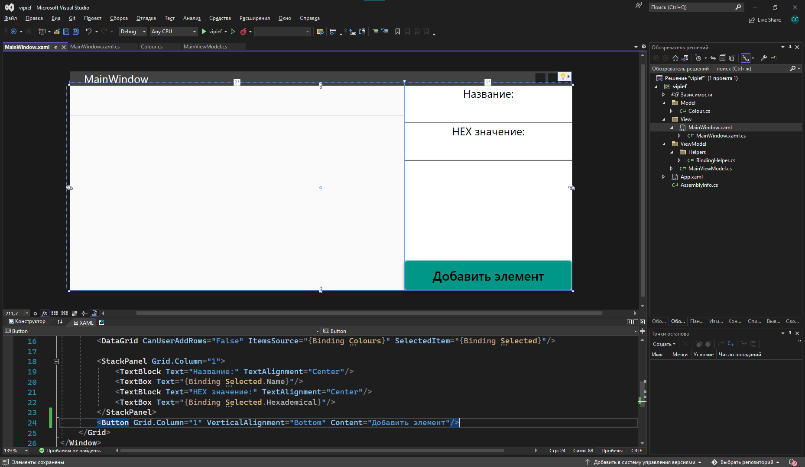

Затем мне нужно сделать внутри ViewModel метод, который будет что-то добавлять. Именно его мы должны будем как-то привязать к кнопке. Добавить мы можем следующее:

- Либо добавить какую-то заглушку напрямую, но в этом особого смысла нет, так как лучше чтобы пользователь вводил значения из текстовых полей с интерфейса:

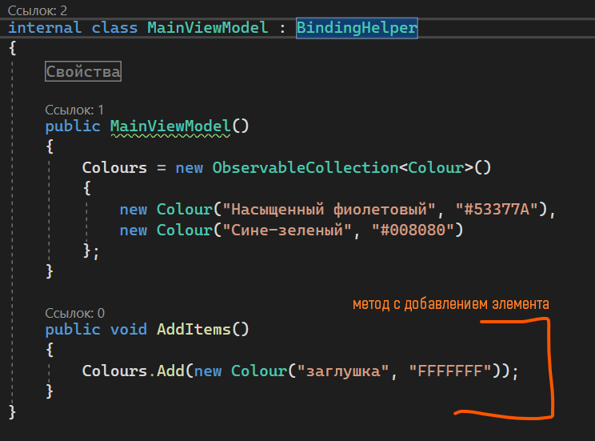

- Либо вспомнить что за свойства мы привязали. Зайдем в XAML и увидим, что к текстовым полям у нас привязана переменная `Selected`, внутри которой одно текстовое поле идет в `Name`, а другое — в `Hexademical`:

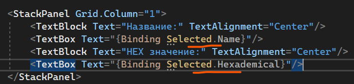

Это значит, что все введенные значения у меня хранятся в свойстве `Selected` внутри ViewModel.

И если я хочу в свою коллекцию элементов добавить значения из текстовых полей, мне нужно просто добавить туда переменную `Selected`:

```csharp
public void AddItems()
{
    Colours.Add(Selected);
}
```

Но чтобы быть точно уверенным, что значение внутри `Selected` не будет пустым, присвою новый экземпляр класса для приватной переменной. Для этого сделаю еще один пустой конструктор и после `selected` напишу `new Colour()`:

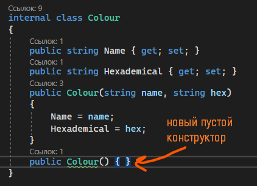

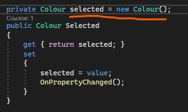

## BindableCommand на основе ICommand

Однако теперь перед нами стоит вопрос — как привязать этот метод к кнопке?

Для этого нам нужно создать свойство-команду, которую мы а) привяжем к кнопке и б) используем как коробочку для метода.

Однако, чтобы такое провернуть, нам нужно сделать класс, который мы будем использовать для создания команды. Назову его, например, `BindableCommand`. Размещу его в папке `Helpers`.

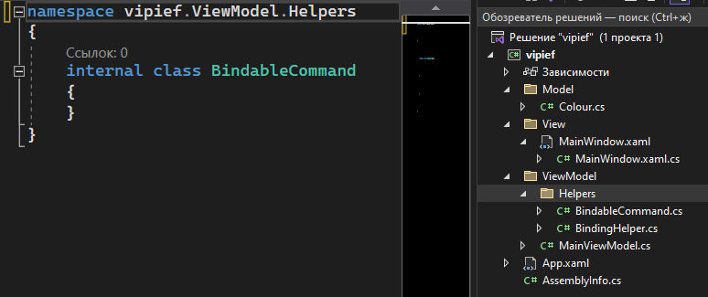

Внутрь я напишу следующее:

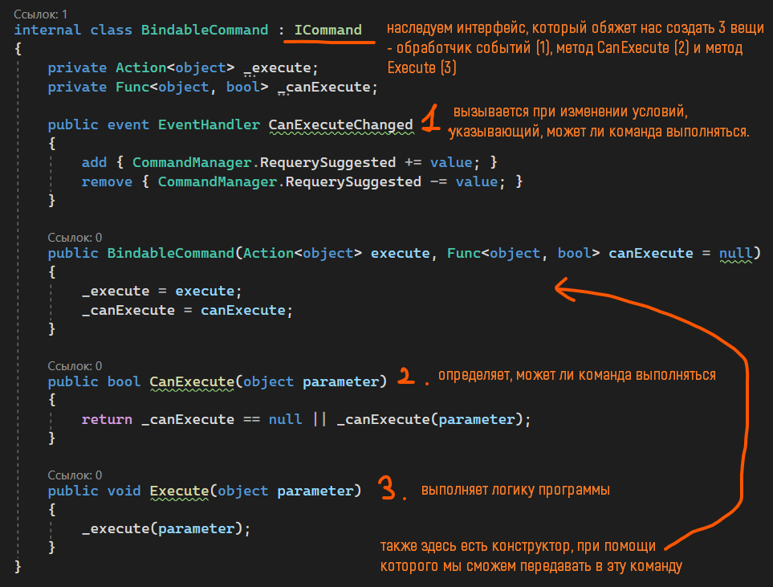

```csharp
using System;
using System.Windows.Input;

namespace vipief.ViewModel.Helpers
{
    internal class BindableCommand : ICommand
    {
        private Action<object> _execute;
        private Func<object, bool> _canExecute;

        public event EventHandler CanExecuteChanged
        {
            add { CommandManager.RequerySuggested += value; }
            remove { CommandManager.RequerySuggested -= value; }
        }

        public BindableCommand(Action<object> execute, Func<object, bool> canExecute = null)
        {
            _execute = execute;
            _canExecute = canExecute;
        }

        public bool CanExecute(object parameter)
        {
            return _canExecute == null || _canExecute(parameter);
        }

        public void Execute(object parameter)
        {
            _execute(parameter);
        }
    }
}
```

Для создания команды я, внутри ViewModel, создам новый регион с командами и создам новое свойство, где внутрь я помещу метод, который я хочу чтобы выполнялся. В моём случае — метод с добавлением. Команду я назову `AddCommand`:

```csharp
#region Команды

public BindableCommand AddCommand { get; set; }

#endregion
```

Внутри конструктора я укажу, какой метод должна выполнять команда. Заметьте структуру написания — `new BindableCommand(_ => Метод());`.

Внутрь этого метода также можно передавать параметры.

```csharp
public MainViewModel()
{
    AddCommand = new BindableCommand(_ => AddItems());
}
```

Саму команду я привяжу к кнопке при помощи свойства `Command`:

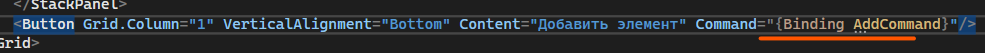

И теперь, при нажатии на кнопку, будет срабатывать именно тот метод, который мы привязали к команде. Опять же заметьте, что внутри ViewModel мы ни разу не трогали интерфейс напрямую. По правилам MVVM этого и не нужно делать, все проблемы решаются через привязки.

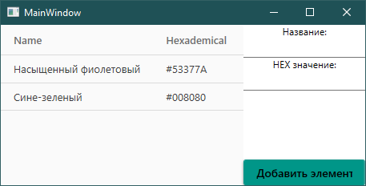

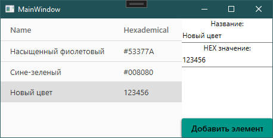

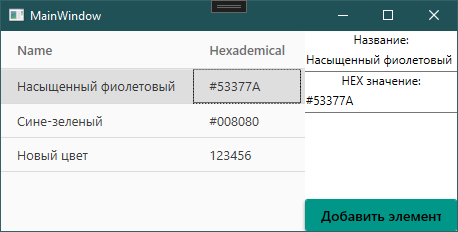

## Привязка к определенному событию

Если так подумать, то `Command` срабатывает только тогда, когда происходит какое-то основное событие с объектом (для кнопки — нажатие, для списков и таблиц — изменение выбора, для дейтпикера — изменение даты). Однако, что если я хочу привязать команду к какому-то экстраординарному событию, например, двойной клик?

Реализуем этот двойной клик у себя в программе. Начнем с того, что нужно хотя бы просто найти это свойство у кнопки.

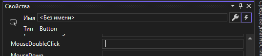

Нашли, называется он `MouseDoubleClick`, и теперь именно к нему надо привязать команду.

Теперь нам нужно сделать следующее:

- Уберём старую команду, она нам больше не понадобится:

```xml
<Button Grid.Column="1" VerticalAlignment="Bottom" Content="Добавить элемент"/>
```

- Добавим библиотеку для взаимодействия с событиями. Добавлять мы её будем прямо в окно. Назовем её `i`.
- Чтобы эта библиотека заработала, необходимо скачать библиотеку `Microsoft.Xaml.Behaviors.Wpf`.

```xml
xmlns:i="http://schemas.microsoft.com/xaml/behaviors"
```

- Откроем тэг с кнопкой и внутрь напишем следующее:

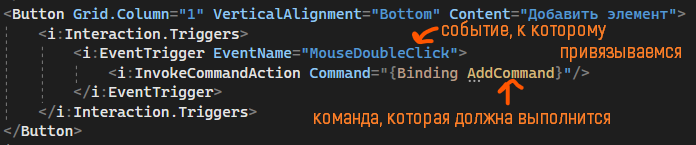

И теперь событие будет происходить по двойному клику по кнопке. Для всех остальных элементов привязка идентичная.

## Полный код примера

`ViewModel/Helpers/BindableCommand.cs` — обёртка над `ICommand`:

```csharp
using System;
using System.Windows.Input;

namespace vipief.ViewModel.Helpers
{
    internal class BindableCommand : ICommand
    {
        private Action<object> _execute;
        private Func<object, bool> _canExecute;

        public event EventHandler CanExecuteChanged
        {
            add { CommandManager.RequerySuggested += value; }
            remove { CommandManager.RequerySuggested -= value; }
        }

        public BindableCommand(Action<object> execute, Func<object, bool> canExecute = null)
        {
            _execute = execute;
            _canExecute = canExecute;
        }

        public bool CanExecute(object parameter)
        {
            return _canExecute == null || _canExecute(parameter);
        }

        public void Execute(object parameter)
        {
            _execute(parameter);
        }
    }
}
```

`ViewModel/MainViewModel.cs` с командой и методом добавления:

```csharp
using System.Collections.ObjectModel;
using vipief.Model;
using vipief.ViewModel.Helpers;

namespace vipief.ViewModel
{
    internal class MainViewModel : BindingHelper
    {
        #region Свойства

        private Colour selected = new Colour();
        public Colour Selected
        {
            get { return selected; }
            set
            {
                selected = value;
                OnPropertyChanged();
            }
        }

        private ObservableCollection<Colour> colours;
        public ObservableCollection<Colour> Colours
        {
            get { return colours; }
            set
            {
                colours = value;
                OnPropertyChanged();
            }
        }

        #endregion

        #region Команды

        public BindableCommand AddCommand { get; set; }

        #endregion

        public MainViewModel()
        {
            Colours = new ObservableCollection<Colour>()
            {
                new Colour("Насыщенный фиолетовый", "#53377A"),
                new Colour("Сине-зелёный", "#008080")
            };

            AddCommand = new BindableCommand(_ => AddItems());
        }

        public void AddItems()
        {
            Colours.Add(Selected);
        }
    }
}
```

`View/MainWindow.xaml` — кнопка с привязкой к двойному клику через `Interaction.Triggers`:

```xml
<Window x:Class="vipief.MainWindow"
        xmlns="http://schemas.microsoft.com/winfx/2006/xaml/presentation"
        xmlns:x="http://schemas.microsoft.com/winfx/2006/xaml"
        xmlns:i="http://schemas.microsoft.com/xaml/behaviors"
        Title="MainWindow" Height="250" Width="500">
    <Grid>
        <Button Grid.Column="1" VerticalAlignment="Bottom" Content="Добавить элемент">
            <i:Interaction.Triggers>
                <i:EventTrigger EventName="MouseDoubleClick">
                    <i:InvokeCommandAction Command="{Binding AddCommand}"/>
                </i:EventTrigger>
            </i:Interaction.Triggers>
        </Button>
    </Grid>
</Window>
```
