## Контекстное меню

Мы часто видим, и даже иногда используем дополнительное меню, которое открывается по нажатию ПКМ. Такое меню (которое называется контекстным) мы можем создавать самостоятельно.

Контекстное меню привязывается к какому-либо объекту, т.е. у разных элементов управления могут быть разные контекстные меню. Создам, например, текстовое поле и сделаю для него контекстное меню.

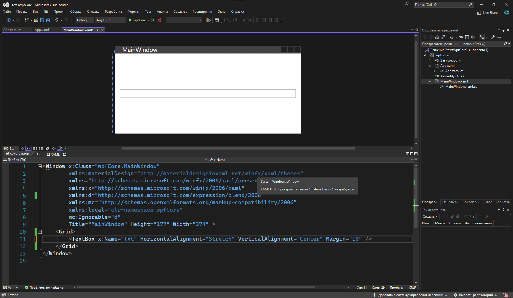

Чтобы создать текстовое меню, мне нужно из моего объекта сделать парный тэг, потому что я собираюсь внутри писать это меню. Чтобы начать его реализовывать, я напишу `названиеобъекта.ContextMenu`.

```xml
<TextBox x:Name="Txt" HorizontalAlignment="Stretch" VerticalAlignment="Center" Margin="10">
    <TextBox.ContextMenu>

    </TextBox.ContextMenu>
</TextBox>
```

Уже внутри начну реализовывать отдельный тэг — `ContextMenu`. Состоит он из `MenuItem`, который, по сути, является точно такой же кнопкой с кликом или командой. Также внутри можно ставить сепараторы — линеечки для разграничения кнопок.

```xml
<TextBox.ContextMenu>
    <ContextMenu>
        <MenuItem Header="Элемент 1"/>
        <MenuItem Header="Элемент 2"/>
        <MenuItem Header="Элемент 3"/>
        <Separator/>
        <MenuItem Header="Элемент 4"/>
        <MenuItem Header="Элемент 5"/>
    </ContextMenu>
</TextBox.ContextMenu>
```

При таком контекстном меню, ПКМ по объекту будет выглядеть так.

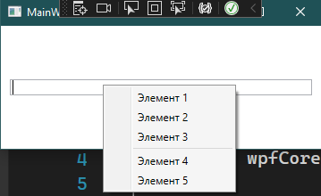

Кроме обычных элементов сюда можно вставить и другие элементы интерфейса, которые мы знаем.

```xml
<ContextMenu>
    <RadioButton Content="Это контекстное меню"/>
    <TextBox Text="Тут можно тыкать"/>
    <MenuItem Header="Элемент 3"/>
    <Separator/>
    <MenuItem Header="Элемент 4"/>
    <MenuItem Header="Элемент 5"/>
</ContextMenu>
```

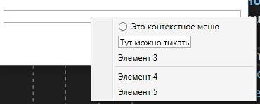

Каждому из этих объектов можно дать имя и взаимодействовать с ним. Это все ещё кнопки, которые могут иметь какое-то действие. Например, выведу в `MessageBox` значение из текстового поля, если я выбрала такой пункт внутри контекстного меню.

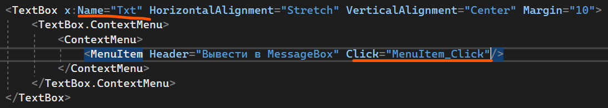

```csharp
private void MenuItem_Click(object sender, RoutedEventArgs e)
{
    MessageBox.Show(Txt.Text);
}
```

Результат будет следующим.

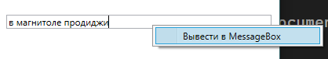

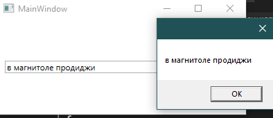

Если я хочу сделать выпадающий список из элементов меню, всё что мне нужно, это расположить `MenuItem` внутрь одного из `MenuItem`.

```xml
<ContextMenu>
    <MenuItem Header="Вывести в MessageBox" Click="MenuItem_Click">
        <MenuItem Header="Элемент 1"/>
        <MenuItem Header="Элемент 2"/>
        <Separator/>
        <MenuItem Header="Элемент 3"/>
    </MenuItem>
</ContextMenu>
```

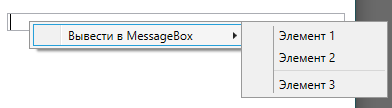

## Пользовательские элементы управления

Если мы хотим разнообразить интерфейс более интересными и проработанными элементами, мы можем создать свои элементы управления, а затем добавлять их в интерфейс.

Как вообще понять, что в интерфейсе есть карточка? Очень просто — если мы видим какой-то элемент, который часто повторяется, и состоит из нескольких объектов (картинка, текст, описание, ссылка, бла-бла-бла) — это карточка.

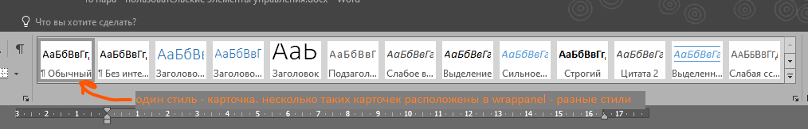


И вместо того, чтобы постоянно делать грид с картинкой, текстом и прочим, можно просто создать один элемент и не морочиться с `Ctrl + C`, `Ctrl + V`.

Например, следующий список был сделан с помощью пользовательского элемента управления. Попробуем сделать что-то подобное.

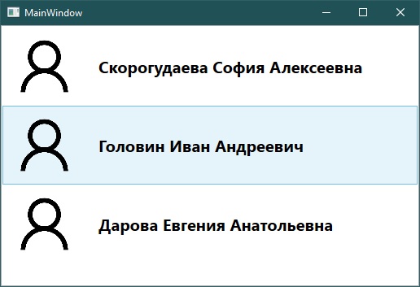

### Создание UserControl

Для начала создадим элемент управления через ПКМ по проекту → Добавить → Пользовательский элемент управления (WPF).

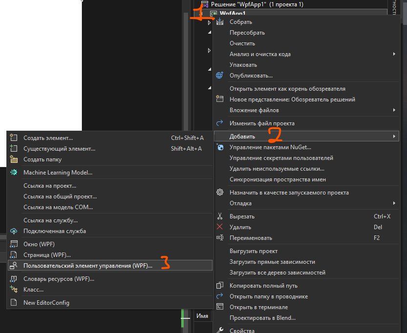

В появившемся окне назовем наш объект и добавим его в проект.

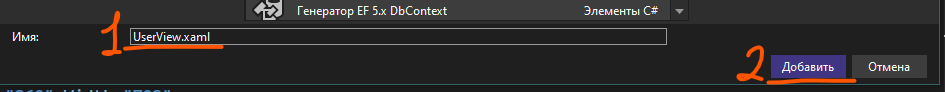

Как и в случае со страницами, пользовательские элементы управления не имеют фона (чтобы они смогли подстроится под фон основного окна) и первый тэг называется `UserControl`. Всё остальное полностью идентично — вся логика для этого элемента также находится в `xaml.cs`, все элементы интерфейса, сетки и картинки остались прежними.

Рассмотрим ещё раз наш пример элемента управления.


Всё, что мы здесь видим — картинка с человеком и текст, в который вписано ФИО. Скачаем картинку из интернета с таким человечком, и начнем создавать интерфейс элемента.

- `Grid.ColumnDefinition` — разделим сетку на 2 столбца: для картинки и для текста.
- `Width="4*"` — второй столбец в 4 раза больше чем первый.
- `Image` — расположим картинку в первой колонке. Дадим ей имя `UserImage`.
- `TextBlock` — расположим текст во второй колонке. Дадим ей текст-заглушку «Фамилия Имя Отчество» и дадим имя `UserName`.
- Уменьшим высоту самого окна под желаемую.

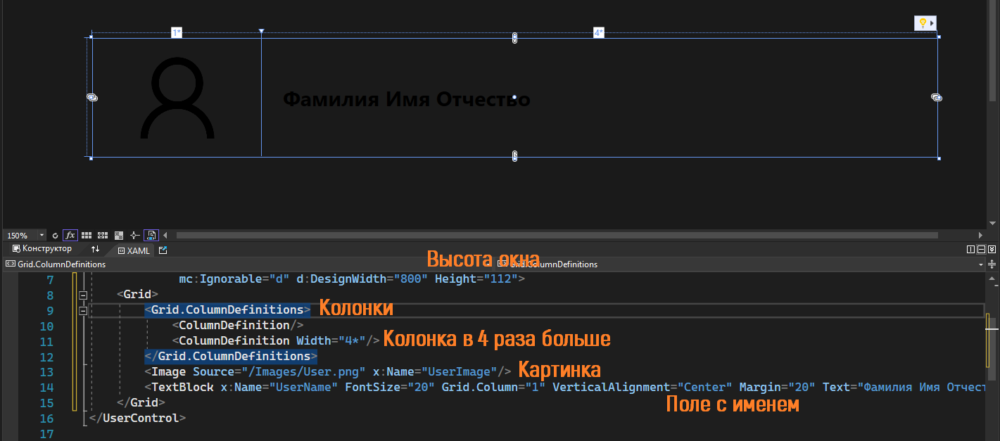

### Отображение карточек через код

Модель нашего элемента мы создали, осталось отобразить их в виде списка. Вернемся в главное окно (`MainWindow`) и создадим `ListBox` для отображения списка. Дадим ему название `UserList`.

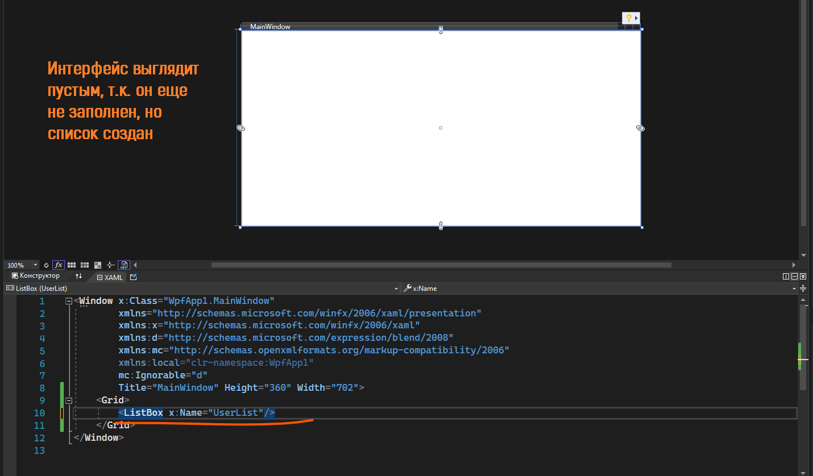

Так как мы хотим задать значения для списка прямо после создания интерфейса, то и список мы будем создавать после метода `InitializeComponent()`.

Чтобы создать наш пользовательский элемент прямо из кода, мы возьмем его название — `UserView` — и будем относится к нему как к сложному типу данных. Сложные типы данных создаются по принципу `типданных название = new типданных`, так что и свой элемент я создам как `UserView first = new UserView();`.

Создадим три таких элемента и запишем их в коллекцию. Эту коллекцию укажем как источник элементов для `ListBox` через `название.свойство` (`UserList.ItemsSource`).

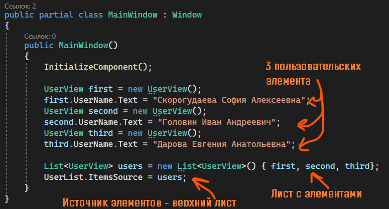

И после запуска мы сразу увидим подобный интерфейс, как на примере.

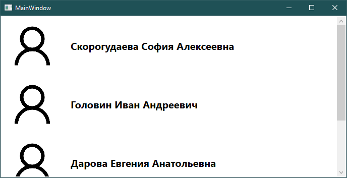

Вся остальная работа со списком остаётся прежней:

- Все элементы находятся в `ListBox`. Если мы хотим обработать изменение выбора, используем событие `SelectionChanged`. Выбранный элемент — `SelectedItem`. С помощью них я смогу взять данные из выбранного элемента управления.
- Если мне нужно обработать кнопки внутри элемента управления, я буду работать с ним в файле элемента управления (в данном случае — в `UserView`).

Так, например, если я хочу взять информацию из выбранного в листбоксе объекта, я возьму его при помощи `SelectedItem as <вставьте название вашей карточки>`, а потом из элементов внутри карточки я буду брать значения.

Например, вот так я возьму имя у выбранной карточки и выведу её в `MessageBox`.

```csharp
private void UserList_SelectionChanged(object sender, SelectionChangedEventArgs e)
{
    var name = (UserList.SelectedItem as UserView).UserName.Text;
    MessageBox.Show(name);
}
```

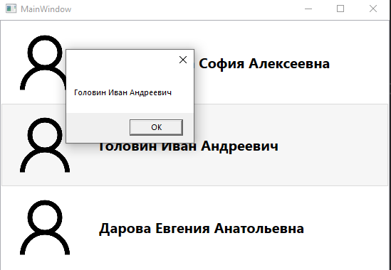

### Использование карточек внутри окна через XAML

Но всё это — создание и работа с карточками через код. Да, выделить по-другому, кроме как через код, элемент нельзя, но зато можно создавать его через интерфейс. Давайте попробуем.

Удалю созданные карточки из кода и перейду в XAML. Чтобы создать карточки внутри списка, мне необходимо его открыть и вместо обычных тэгов (типа `Button`) ввести туда тэг с названием моей карточки — `UserView`.

Если карточка находится в корне проекта, Visual Studio сама предложит как правильно написать этот тэг.

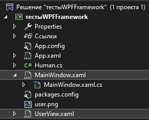

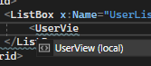

```xml
<ListBox x:Name="UserList">
    <local:UserView/>
</ListBox>
```

Но если карточка находится, например, в папке…

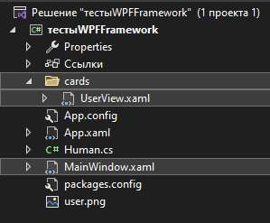

…то тогда сначала надо добавить ссылку на эту папку, а потом уже писать тэг-карточку. Ссылки добавляются при помощи `xmlns:любоеимя="ссылка"`. Вместо ссылки можете просто имя папки написать, Visual Studio разберется как правильно писать.

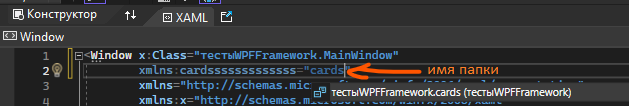

```xml
xmlns:cardsssssssssssss="clr-namespace:тестыWPFFramework.cards"
```

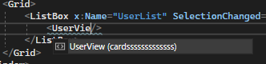

```xml
<ListBox x:Name="UserList" SelectionChanged="UserList_SelectionChanged">
    <cardsssssssssssss:UserView/>
    <cardsssssssssssss:UserView/>
    <cardsssssssssssss:UserView/>
</ListBox>
```

(Если у вас вместо отображения карточки появляется ошибка, просто нажмите `Ctrl+B`, или вверху, где файл/правка/вид, нажмите на «Сборка» → «Собрать решение».)

Хорошо, создавать мы их теперь можем в неограниченном количестве. Но они все выглядят не так, как мы хотим — нет картинки (это ок, запустите — появится), вместо нормальных имен стоит та заглушка — Фамилия Имя Отчество. Как поставить нормальные значения из XAML?

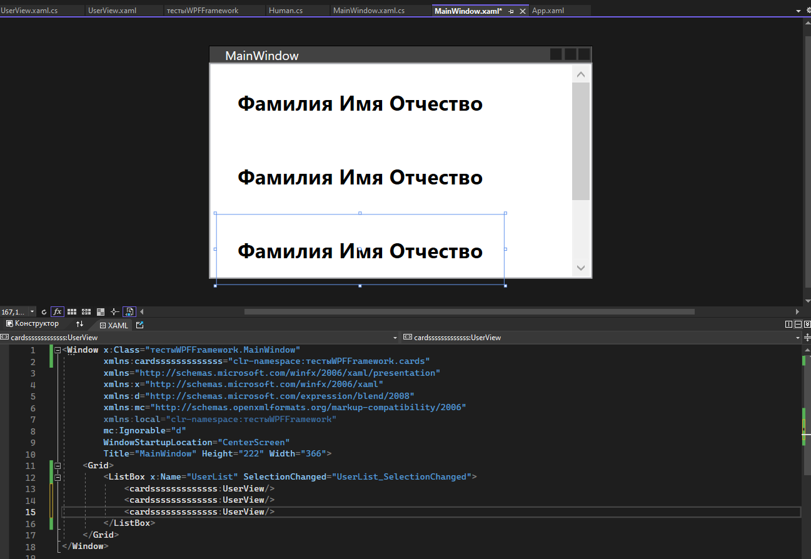

### Привязки для свойств карточки

Доступа к элементам и их свойствам отсюда у нас нет, так что нам опять нужно воспользоваться привязками.

Привязки будут простыми. Из сложного — карточке нужно сказать, что её контекст данных — она сама. Перейдем в код `UserView` и напишем 1 строчку.

```csharp
public partial class UserView : UserControl
{
    public UserView()
    {
        InitializeComponent();
        DataContext = this;
    }
}
```

Затем, чтобы сделать свойства, которые можно будет менять в XAML, нужно создать переменную. Хочу создать свойство для текста карточки — создам стринговую переменную `FIO`, обязательно с `get`/`set`.

```csharp
public partial class UserView : UserControl
{
    public string FIO { get; set; }

    public UserView()
    {
        InitializeComponent();
        DataContext = this;
    }
}
```

К нему привяжу свойство текста в карточке — вместо «Фамилия Имя Отчество».

```xml
<TextBlock x:Name="UserName" Text="Фамилия Имя Отчество"/>
```

```xml
<TextBlock x:Name="UserName" Text="{Binding FIO}"/>
```

Пересоберу проект при помощи `Ctrl+B` или Сборка → Собрать решение, и теперь я смогу изменять это `FIO` в окне, используя свойство `FIO`.

```xml
<ListBox x:Name="UserList" SelectionChanged="UserList_SelectionChanged">
    <cardsssssssssssss:UserView FIO="фамилия фамилия фамилия"/>
    <cardsssssssssssss:UserView FIO="иванов иван иванович"/>
    <cardsssssssssssss:UserView FIO="жаров жар жарович"/>
</ListBox>
```

Это свойство также будет отображаться через интерфейс — в вкладке «Разное».

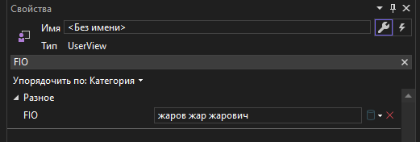

Если в интерфейсе что-то не отображается — опять пересоберите проект. А так — всё супер.

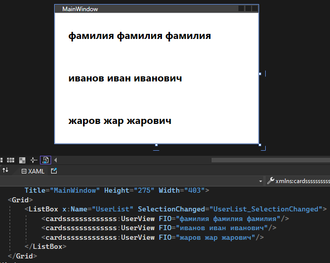

## Полный код примера

`UserView.xaml` (в папке `cards`) — карточка с картинкой и привязкой `FIO`:

```xml
<UserControl x:Class="тестыWPFFramework.cards.UserView"
             xmlns="http://schemas.microsoft.com/winfx/2006/xaml/presentation"
             xmlns:x="http://schemas.microsoft.com/winfx/2006/xaml"
             Height="112" d:DesignWidth="800">
    <Grid>
        <Grid.ColumnDefinitions>
            <ColumnDefinition/>
            <ColumnDefinition Width="4*"/>
        </Grid.ColumnDefinitions>
        <Image Source="/Images/User.png" x:Name="UserImage"/>
        <TextBlock x:Name="UserName" FontSize="20" Grid.Column="1"
                   VerticalAlignment="Center" Margin="20"
                   Text="{Binding FIO}"/>
    </Grid>
</UserControl>
```

`UserView.xaml.cs` — `DataContext = this` и публичное свойство `FIO`:

```csharp
using System.Windows.Controls;

namespace тестыWPFFramework.cards
{
    public partial class UserView : UserControl
    {
        public string FIO { get; set; }

        public UserView()
        {
            InitializeComponent();
            DataContext = this;
        }
    }
}
```

`MainWindow.xaml` — `xmlns` на папку `cards`, `ListBox` с карточками, `ContextMenu` у `TextBox`:

```xml
<Window x:Class="тестыWPFFramework.MainWindow"
        xmlns="http://schemas.microsoft.com/winfx/2006/xaml/presentation"
        xmlns:x="http://schemas.microsoft.com/winfx/2006/xaml"
        xmlns:cards="clr-namespace:тестыWPFFramework.cards"
        Title="MainWindow" Height="275" Width="403">
    <Grid>
        <ListBox x:Name="UserList" SelectionChanged="UserList_SelectionChanged">
            <cards:UserView FIO="фамилия фамилия фамилия"/>
            <cards:UserView FIO="иванов иван иванович"/>
            <cards:UserView FIO="жаров жар жарович"/>
        </ListBox>
    </Grid>
</Window>
```

`MainWindow.xaml.cs` — обработчик выбора карточки:

```csharp
using System.Windows;
using System.Windows.Controls;
using тестыWPFFramework.cards;

namespace тестыWPFFramework
{
    public partial class MainWindow : Window
    {
        public MainWindow()
        {
            InitializeComponent();
        }

        private void UserList_SelectionChanged(object sender, SelectionChangedEventArgs e)
        {
            var card = UserList.SelectedItem as UserView;
            if (card != null)
                MessageBox.Show(card.FIO);
        }
    }
}
```
