Что, если у меня есть много данных, которые проще всего вывести в табличном виде? Я не хочу создавать для каждого элемента новый текстблок, мне нужна какая-то таблица, внутри которой будут названные столбцы, и все элементы из моей коллекции. Для такой таблицы у меня есть специальный элемент управления — `DataGrid`.

Давайте создадим `DataGrid` в интерфейсе. Перетаскивая объект на окно, он, во-первых, займет все пространство окна, а во-вторых, покажет примерные данные, которые при запуске программы уберутся.

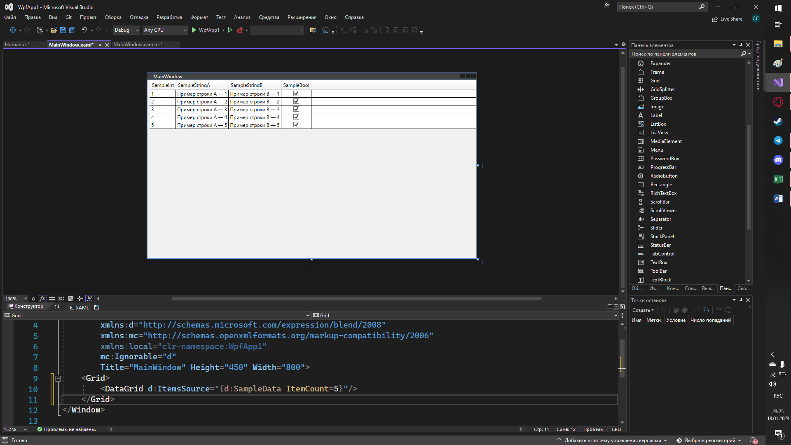

## ItemsSource и модель данных

Раз сейчас у нас в таблице нет ничего, кроме тестовых данных, мне нужно создать какую-то свою коллекцию и закинуть ее как источник элементов для таблицы — `ItemsSource` для таблицы. Давайте создадим какой-нибудь свой [тип данных](/csharp/classasmodel), с которым создадим в будущем коллекцию. `DataGrid` может работать только со сложными типами данных, для обычных строк или чисел таблица будет отображаться некорректно.

Для начала, я создам свою модель данных `Human` с именем и возрастом. Для удобства создания новых переменных, я сразу создам [конструктор](/csharp/classascontainer) `Human`. Это необязательно, но в лекции я это покажу.

```csharp
internal class Human
{
    public string Name;
    public int Age;

    public Human(string name, int age)
    {
        Name = name;
        Age = age;
    }
}
```

Затем, вся остальная работа такая же, как и с [ComboBox и ListBox](/wpf/combobox-listbox) — все элементы мы можем привязать через код, событие для изменения выбранного элемента — `SelectionChanged`, а свойство, где хранится выбранный элемент — `SelectedItem` или `SelectedIndex`.

Давайте сделаем пример для каждого из вышеперечисленных пунктов. Я хочу начать взаимодействовать со своей таблицей в интерфейсе, так что мне необходимо воспользоваться 4 пунктами, которые помогут мне понять, как правильно взаимодействовать с объектом:

- Дать имя объекту.
- Найти нужное свойство.
- Обработать событие.
- Объединить 1 и 2 пункт в формате «название.свойство».

Я хочу заполнить таблицу прямо при создании окна. Выполним первый пункт — дадим имя таблице, например, `MyDataGrid`.

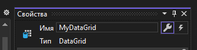

Затем, я хочу найти свойство, отвечающее за источник элементов моей таблицы. Такое свойство называется `ItemsSource`, запомним его.

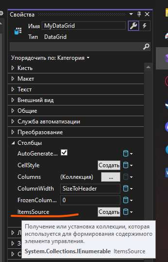

Дальше, по пунктам, мне нужно обработать событие. Но так как никакого события нет, и я хочу, чтобы данные привязывались к моей таблице сразу же, как я открыла окно, то весь код я буду располагать в конструкторе `MainWindow`, после создания окна. Для начала, создам [лист](/csharp/collections), внутри которого будут хранится все данные для отображения в таблице.

```csharp
public MainWindow()
{
    InitializeComponent();

    List<Human> human = new List<Human>()
    {
        new Human("Елизавета", 70),
        new Human("Павел", 33),
        new Human("София", 60)
    };
}
```

Затем, выполню пункт 4 — объединю название и свойство моей таблицы через точку, и присвою туда свой лист с людьми.

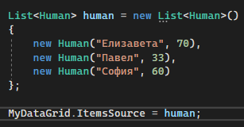

Запущу программу, и увижу, что моя таблица построилась неправильно. В ней вроде как есть 3 строчки, но самих значений и столбцов нет. Почему так?

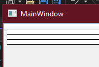

## Обязательные get; set;

Если кратко, это происходит потому, что у переменных нашего `Human` нет [свойств get и set](/wpf/properties). Они должны быть любыми, хоть заполненными, хоть пустыми, но их присутствие обязательно. Если я видоизменю свою модель данных следующим образом…

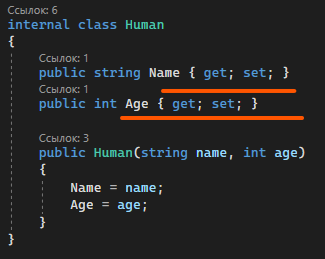

…тогда и сама программа у меня заработает, появятся названия столбцов, а к ним привяжутся строки.

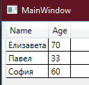

Если длинно, `DataGrid` ищет все свойства, у которых есть свойство `get`, и показывает только их. Если у меня у свойства нет слова `get`, то и `DataGrid` не может их увидеть, а значит, отображать их не будет. Таким образом, мы можем скрывать некоторые переменные внутри нашей модели данных, не выдавая им свойство `get`.

## Выбор элемента в DataGrid

Повторюсь, что для отслеживания изменения выбора в табличке у нас есть свойство `SelectionChanged`, а взять выбранный элемент мы можем при помощи свойств `SelectedIndex` и `SelectedItem`. Давайте разберемся, как это сделать.

Я хочу, чтобы при выборе строки, вся информация оттуда отображалась в [MessageBox](/wpf/events-msgbox). Опять же, воспользуемся четырьмя пунктами. Имя у таблицы у нас есть, свойства для выбранного элемента мы знаем, остался 3 и 4 пункт. В нашей задаче, событие, это «выбор строки». Чтобы обработать это событие, нажмем на таблицу, откроем ее свойства, выберем молнию и внутри найдем «SelectionChanged». Дважды нажмем по текстовому полю справа от названия, и у нас появится метод, где мы сможем писать код для этого события.

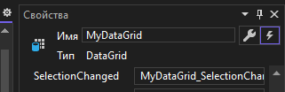

Чтобы взять информацию о выбранном элементе, возьму свойство `SelectedItem` из `MyDataGrid`. Чтобы работать с ним как с `Human`, мне необходимо привести его к типу данных `Human` с помощью [as](/csharp/transformation) (или как `(Human)MyDataGrid.SelectedItem`, но через `as` будет безопаснее). Получившийся результат я сохраню в переменную типа данных `Human`.

```csharp
private void MyDataGrid_SelectionChanged(object sender, SelectionChangedEventArgs e)
{
    Human selected = MyDataGrid.SelectedItem as Human;
}
```

И теперь, из этой переменной, я могу взять все, что душа пожелает, и отобразить это в `MessageBox`.

```csharp
private void MyDataGrid_SelectionChanged(object sender, SelectionChangedEventArgs e)
{
    Human selected = MyDataGrid.SelectedItem as Human;
    MessageBox.Show($"Имя: {selected.Name}. Возраст: {selected.Age}");
}
```

И я увижу следующий результат.

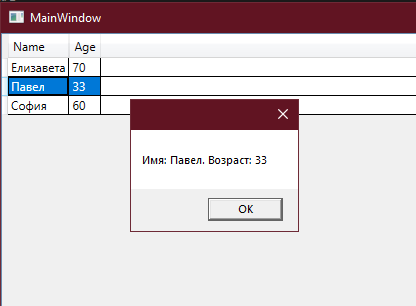

## Важный момент насчёт изменения коллекции элементов

Скажем, где-то в коде, по нажатию на кнопку, я добавляю новый элемент в своем листе. Давайте я быстро напишу код для этого — я создам кнопку на своем интерфейсе.

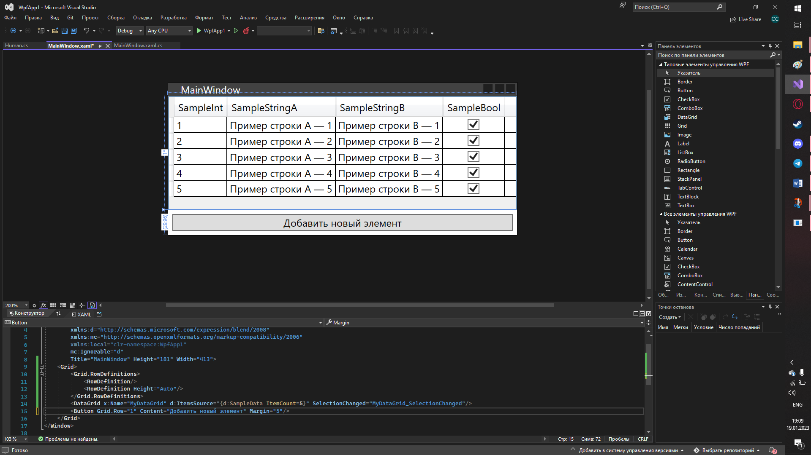

А в событие `Click` для этой кнопки напишу код, который будет добавлять в мой лист новые элемент с данными-заглушками (т.е. они не имеют смысла, мне нужно просто посмотреть, как будет работать добавление). Лист я сделаю глобальной переменной.

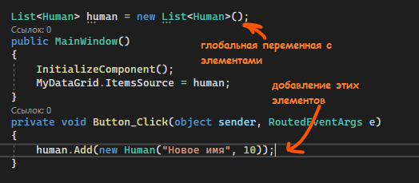

Запустим, и понажимаем несколько раз эту кнопку. Как мы видим, в табличке никаких новых данных не появилось.

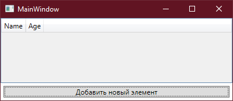

Происходит это потому, что с помощью `ItemsSource` мы говорим только один раз, что должно хранится в табличке. Мол: «Вот тебе лист, сейчас он пустой, сделай из него табличку. Все, что будет происходить в будущем, меня не касается». А мы хотим, чтобы после каждого изменения нашего листа, таблица брала все значения по-новому. Поэтому после каждого изменения листа — изменение элемента по индексу, удаление значения или добавление — таблица строилась заново, так что нам нужно снова и снова давать ему значение для `ItemsSource`.

Следующие строчки после добавления помогут нам пофиксить нашу проблему с отображением. Мы сначала все очистим из таблицы, а потом построим заново.

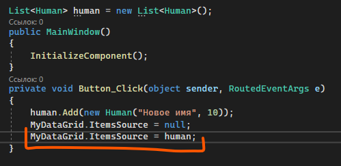

И теперь, каждый раз, когда мы будем добавлять элемент, они все отобразятся на интерфейсе.

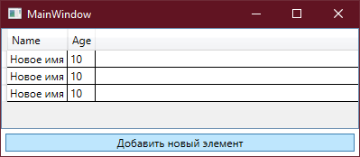

## Полный код примера

`MainWindow.xaml` с DataGrid и кнопкой добавления:

```xml
<Window x:Class="WpfApp1.MainWindow"
        xmlns="http://schemas.microsoft.com/winfx/2006/xaml/presentation"
        xmlns:x="http://schemas.microsoft.com/winfx/2006/xaml"
        Title="MainWindow" Height="250" Width="400">
    <Grid>
        <Grid.RowDefinitions>
            <RowDefinition/>
            <RowDefinition Height="Auto"/>
        </Grid.RowDefinitions>

        <DataGrid x:Name="MyDataGrid" SelectionChanged="MyDataGrid_SelectionChanged"/>
        <Button Grid.Row="1" Content="Добавить новый элемент" Click="Button_Click"/>
    </Grid>
</Window>
```

`Human.cs` — модель с обязательными `get; set;`:

```csharp
namespace WpfApp1
{
    internal class Human
    {
        public string Name { get; set; }
        public int Age { get; set; }

        public Human(string name, int age)
        {
            Name = name;
            Age = age;
        }
    }
}
```

`MainWindow.xaml.cs` — инициализация, обработчик выбора и добавление с перепривязкой:

```csharp
using System.Collections.Generic;
using System.Windows;
using System.Windows.Controls;

namespace WpfApp1
{
    public partial class MainWindow : Window
    {
        List<Human> human = new List<Human>();

        public MainWindow()
        {
            InitializeComponent();

            human = new List<Human>()
            {
                new Human("Елизавета", 70),
                new Human("Павел", 33),
                new Human("София", 60)
            };

            MyDataGrid.ItemsSource = human;
        }

        private void MyDataGrid_SelectionChanged(object sender, SelectionChangedEventArgs e)
        {
            Human selected = MyDataGrid.SelectedItem as Human;
            if (selected != null)
                MessageBox.Show($"Имя: {selected.Name}. Возраст: {selected.Age}");
        }

        private void Button_Click(object sender, RoutedEventArgs e)
        {
            human.Add(new Human("Новое имя", 10));
            MyDataGrid.ItemsSource = null;
            MyDataGrid.ItemsSource = human;
        }
    }
}
```
