Для разграничения ролей в наших программах существует авторизация. Все данные о пользователях должны храниться в базе данных, однако, как нам при помощи DataSet реализовать авторизацию, если до этого мы работали только с полной выгрузкой данных?

## Подготовка БД

Я создам две таблички — таблицу с ролями и таблицу с кредентиалами — данными о логине, пароле, и роли пользователя. В зависимости от роли у нас будут открываться разные окна.

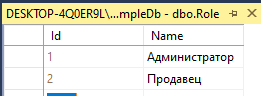

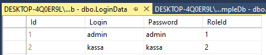

## Интерфейс

Внутри приложения WPF я создам маленький интерфейс для авторизации — поле для ввода логина — `LoginTbx`, для ввода пароля — `PasswordTbx` (заметьте, что поле для ввода пароля — это тэг `PasswordBox`. Чтобы взять из него текст, нам нужно написать `PasswordTbx.Password`), и кнопка для авторизации.

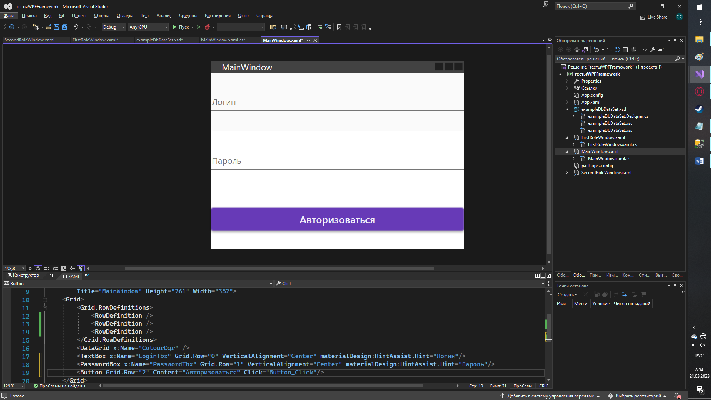

В самом обозревателе решений у меня также есть два окна — `FirstRoleWindow` и `SecondRoleWindow`. Если я авторизуюсь за администратора, должно показаться первое окно. Если за кассира — второе. Уже можно заметить, что в будущем у нас будет стоять условие по роли.

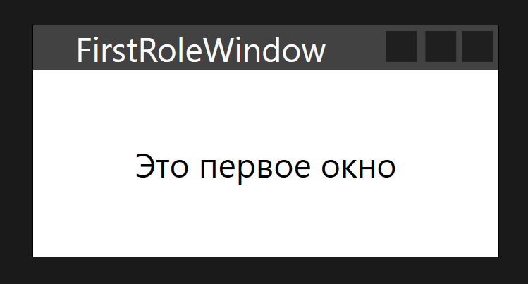

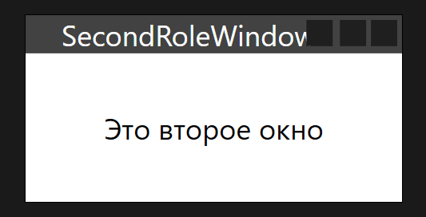

Для работы с БД у меня есть DataSet, куда я выгрузила две таблички — с ролями и с логином и паролем. Внутри них никакие дополнительные запросы мне не понадобятся.

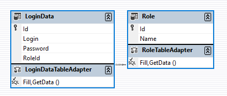

## Логика авторизации

Итак, как нам сделать авторизацию?

Я обработаю событие клика для кнопки — дважды нажму на кнопку, появится `Button_Click`.

Как только я нажимаю на эту кнопку, мне нужно выгрузить все данные из таблицы с логином и паролем. Я подключу DataSet в `using`, создам переменную с моей табличкой с логинами и паролями — `LoginDataTableAdapter` (`названиетаблицыTableAdapter`) и получу все данные из этой таблицы. Сохраню их в переменную `allLogins`.

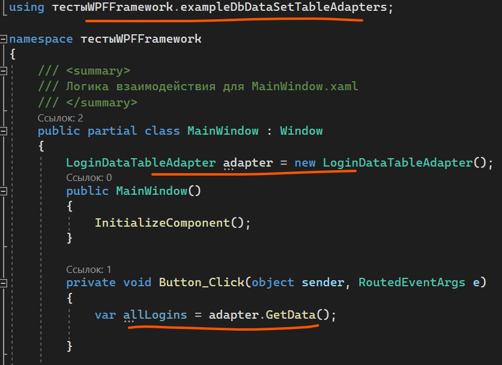

Я хочу пробежаться по каждой записи в таблице. Каждая запись — строка, поэтому я напишу что из таблицы я возьму именно строки.

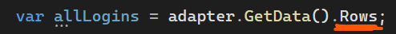

Раз я хочу пробежаться, мне нужен [цикл](/csharp/cycles). Элементы из строк мы будем брать при помощи индексов (подобно тому, как мы брали индекс для удаления), так что здесь мне понадобится цикл `for`. Пробегусь от 0 до количества строк в таблице.

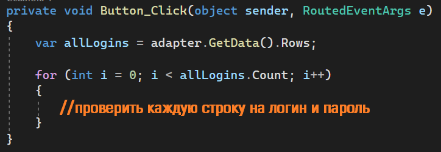

Далее мне для каждой строки нужно проверить, равен ли логин и пароль тому, что находится в строке. Напомню, что логин у меня в `LoginTbx`, пароль — `PasswordTbx`. Чтобы взять значение из ячейки, мне нужно представить `Rows` как матрицу, где сначала я указываю ряд, а потом место (столбец). Все строки мы перебираем при помощи цикла, так что всё будет начинаться с `allLogins.Rows[i]`. Чтобы взять нужный столбец, нужно понимать в каком порядке они идут.

Если я хочу сравнить логин, я возьму `allLogins[i][1]`. Хочу сравнить пароль — `allLogins[i][2]`. Всё я приведу к стрингу, чтобы сравнение было точным.

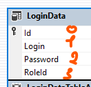

Таким образом условие будет выглядеть вот так:

```csharp
for (int i = 0; i < allLogins.Count; i++)
{
    if (allLogins[i][1].ToString() == LoginTbx.Text &&
        allLogins[i][2].ToString() == PasswordTbx.Password)
    {

    }
}
```

## Ветвление по ролям

Код войдёт в это условие только если и логин, и пароль, был верным. А если он верный, тогда нам остается только определиться какое [окно открыть](/wpf/material-design), согласно роли пользователя. Роль я возьму через `Rows[i][3]`, так как у меня это 4 столбец. Если роль `1`, тогда открою первое окно. `2` — второе окно.

```csharp
if (allLogins[i][1].ToString() == LoginTbx.Text &&
    allLogins[i][2].ToString() == PasswordTbx.Password)
{
    int roleId = (int)allLogins[i][3];

    switch (roleId)
    {
        case 1:
            FirstRoleWindow role = new FirstRoleWindow();
            role.Show();
            break;
        case 2:
            SecondRoleWindow second = new SecondRoleWindow();
            second.Show();
            break;
    }
}
```

Итогом будет следующее.

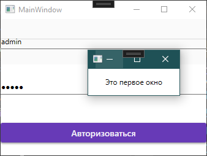

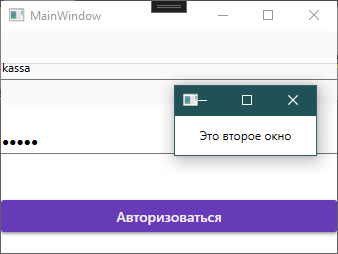

## Полный код примера

`MainWindow.xaml` — поля логина/пароля и кнопка:

```xml
<Window x:Class="тестыWPFFramework.MainWindow"
        xmlns="http://schemas.microsoft.com/winfx/2006/xaml/presentation"
        xmlns:x="http://schemas.microsoft.com/winfx/2006/xaml"
        xmlns:materialDesign="http://materialdesigninxaml.net/winfx/xaml/themes"
        Title="MainWindow" Height="261" Width="352">
    <Grid>
        <Grid.RowDefinitions>
            <RowDefinition/>
            <RowDefinition/>
            <RowDefinition/>
        </Grid.RowDefinitions>
        <TextBox x:Name="LoginTbx" VerticalAlignment="Center"
                 materialDesign:HintAssist.Hint="Логин"/>
        <PasswordBox x:Name="PasswordTbx" Grid.Row="1" VerticalAlignment="Center"
                     materialDesign:HintAssist.Hint="Пароль"/>
        <Button Grid.Row="2" Content="Авторизоваться" Click="Button_Click"/>
    </Grid>
</Window>
```

`MainWindow.xaml.cs` — перебор таблицы LoginData и выбор окна по RoleId:

```csharp
using System.Windows;
using тестыWPFFramework.exampleDbDataSetTableAdapters;

namespace тестыWPFFramework
{
    public partial class MainWindow : Window
    {
        LoginDataTableAdapter adapter = new LoginDataTableAdapter();

        public MainWindow()
        {
            InitializeComponent();
        }

        private void Button_Click(object sender, RoutedEventArgs e)
        {
            var allLogins = adapter.GetData().Rows;

            for (int i = 0; i < allLogins.Count; i++)
            {
                if (allLogins[i][1].ToString() == LoginTbx.Text &&
                    allLogins[i][2].ToString() == PasswordTbx.Password)
                {
                    int roleId = (int)allLogins[i][3];

                    switch (roleId)
                    {
                        case 1:
                            FirstRoleWindow role = new FirstRoleWindow();
                            role.Show();
                            break;
                        case 2:
                            SecondRoleWindow second = new SecondRoleWindow();
                            second.Show();
                            break;
                    }
                }
            }
        }
    }
}
```
