Источником данных для приложения может быть всё что угодно — код, файл, или база данных. Если с первыми двумя вещами мы умеем работать, давайте научимся работать с базой данных.

## Создание проекта

Прежде чем брать данные из БД, нужно подготовиться — создать проект «Приложение WPF (.NET Framework)» и подключить базу данных SQL в проект. «Приложение WPF (Майкрософт)» нам не подойдёт, так как DataSet там не работает.


## Подключение к SQL Server

Для того, чтобы подключиться к БД, нужно в Visual Studio выбрать «Средства» → «Подключиться к базе данных». Перед нами появится окно «Сменить источник данных», если мы ещё ни разу не подключали БД до этого. Здесь нам нужно выбрать «Microsoft SQL Server». Поставщиком данных будет .NET Framework.

Если Visual Studio попросит что-то докачать, смело докачивайте — это модули по управлению БД.

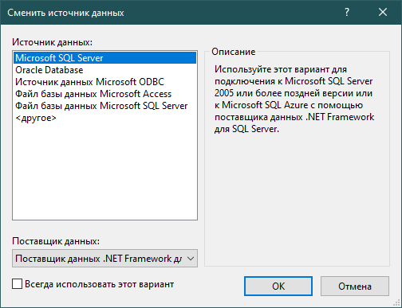

Нажимаем ОК и перед нами появляется окно добавления подключения. Здесь мы указываем:

- **Имя сервера.** Его можно взять из MSSQL, в окне соединения с сервером (самое стартовое).
- (Опционально) **Выбрать проверку подлинности.** При проверке через Windows не придётся вводить пароль, при проверке SQL — придётся. Если у вас удалённый сервер, лучше выбрать проверку SQL. Логин по умолчанию `sa`.


- **Выбрать базу данных.** Если первые два пункта заполнены верно, выпадающий список появится моментально. Если он не появляется — проверьте правильность первых двух пунктов. Внутри списка выберите к чему вы хотите подключиться.

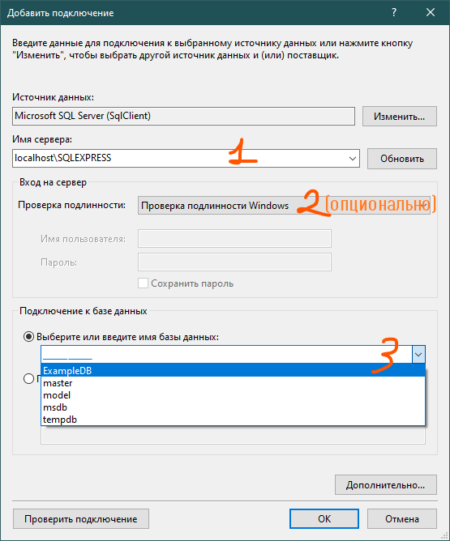

В некоторых случаях, на всех следующих этапах могут появиться ошибки, если у вас MSSQL имеет сертификат доверенности. Для этого, в дополнительных настройках поставьте `TrustServerCertificate = True`. Лишним никогда не будет.

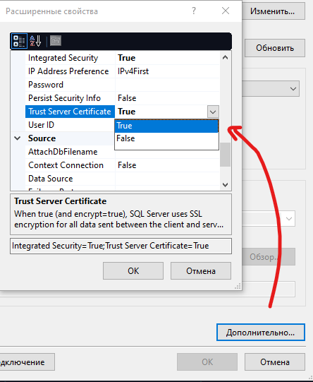

Нажимаем ОК и наше подключение будет сохранено в «Обозревателе серверов».

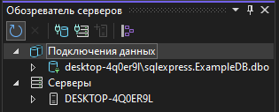

## Создание набора данных DataSet

Для этого примера у меня есть база данных `ExampleDB`. Внутри неё 2 таблицы — `Colour` и `Human` с любимым цветом.

Теперь нам нужно создать объект, при помощи которого мы в коде будем работать с БД — набор данных (DataSet). Его мы подключим при помощи мастера. Откроем «Проект» → «Добавить новый источник данных». Перед нами откроется мастер настройки источника данных.

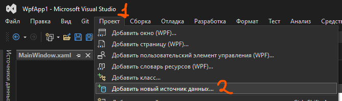

Внутри выберем, что как источник данных я хочу использовать БД, а создать из неё я хочу набор данных.

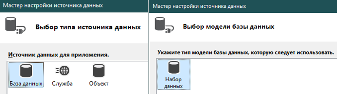

Далее выбираем строку подключения — заранее подключенную БД. В следующем окне («Сохранение подключения в файле конфигурации») оставляем всё как есть.

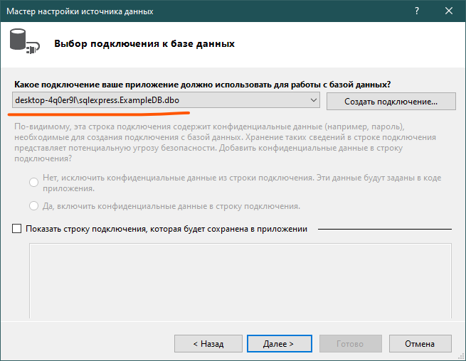

При выборе объектов базы данных выбираем всё то, с чем мы хотим работать. В нашем случае — это каждая таблица внутри БД. Нажимаем «Готово» и наш набор данных создастся.

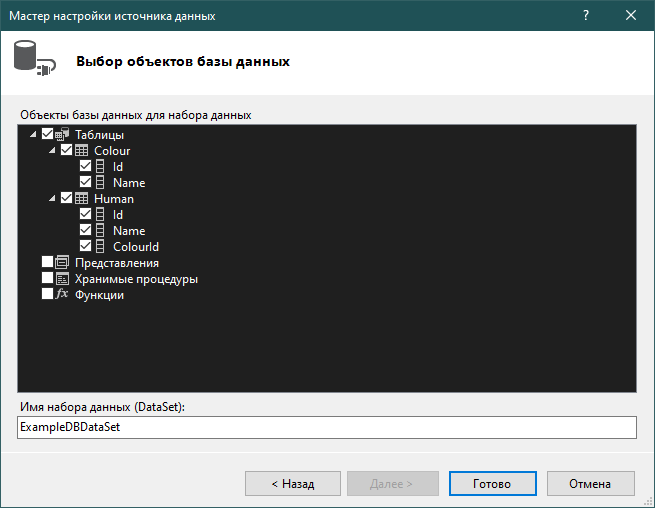

В обозревателе решений появится набор данных, который будет называться как `НазваниеБДDataSet.xsd` и будет включать в себя 3 файла. Откроем самый основной файл с расширением `xsd`.

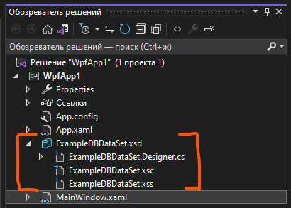

Внутри него мы увидим визуальную отрисовку нашей БД, которая похожа на физическую модель, а также некоторые методы под таблицами. Эти методы находятся внутри `TableAdapter`, это нужно запомнить. Из двух методов — `GetData()` и `Fill()` — нам понадобится только один из них — `GetData()`. При помощи него мы сможем получать данные из БД. Но как?

## Чтение данных из БД

Создадим в xaml.cs [таблицу](/wpf/datagrid), куда мы будем выгружать все данные. Здесь мы будем работать с данными о цветах, так что назовём его как `ColourDataGrid`. Далее перейдём в код — `xaml.cs`.

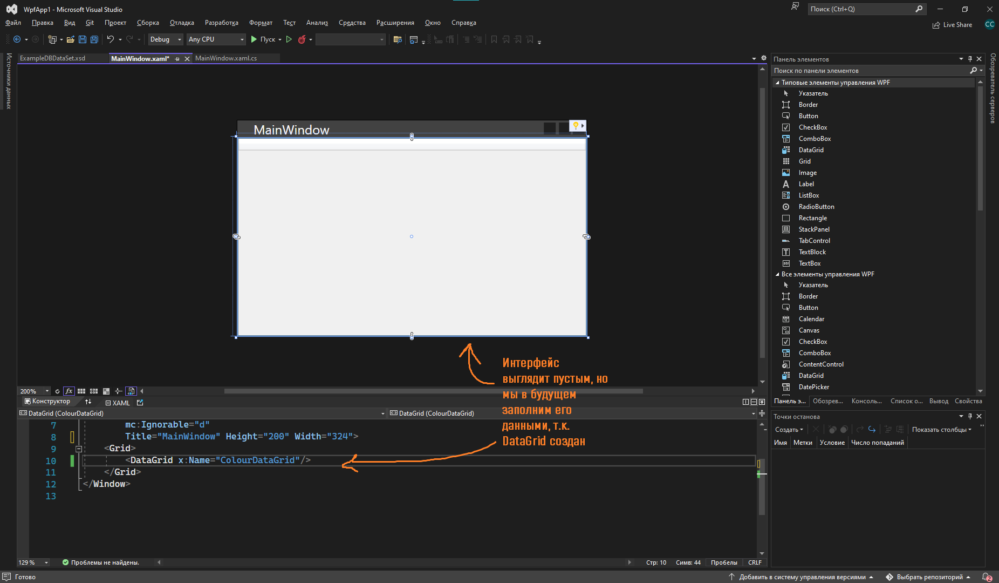

Для работы с данными из DataSet нам в `xaml.cs` нужно добавить один `using`. Выглядит он как:

```csharp
using <Название проекта>.<Название набора данных>TableAdapters;
```

В нашем примере проект называется `WpfApp1`, а датасет называется `ExampleDBDataSet`. В итоге получаем следующую строку.

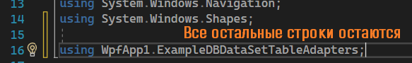

Внутри класса `MainWindow` мы создадим переменную, которая будет отвечать за нашу таблицу. Раз я хочу работать с таблицей `Colour`, я просто напишу её название — `Colour` — и нажму `Tab`. Помним, что методы для взаимодействия с таблицей у нас хранятся в `TableAdapter`. У меня автоматически найдётся тип данных `ColourTableAdapter`.

В вашем случае — замените `Colour` на название вашей таблицы.

Если `Tab` не сработал — пропишите эту переменную вручную. Итог должен выглядеть вот так.

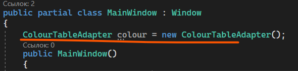

Чтобы вывести полную информацию из таблицы, вспомним, что в DataSet для каждой таблицы есть метод `GetData()`. Чтобы его использовать, напишем:

```csharp
<Название переменной с таблицей>.GetData();
```

Получившийся список мы можем записать как источник элементов для `DataGrid`.

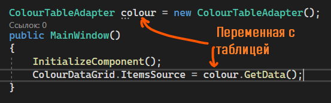

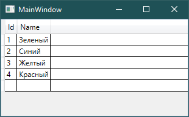

## Выгрузка данных в списки

Подобным образом данные можно выводить не только в таблицы, но и в [списки](/wpf/combobox-listbox) — обычный (`ListBox`) и выпадающий (`ComboBox`). Возьмём, например, выпадающий список. Назову его `ColourComboBox`.

Чтобы вывести туда данные, необходимо также, через источник элементов (`ItemsSource`), присвоить им значения из таблицы. Мы укажем, что источник элементов равен методу `GetData()`.

Однако теперь нам нужно ещё указать, какой именно столбец должен отобразиться. Сделаем мы это через `ColourComboBox.DisplayMemberPath = "<Название столбца>"`.

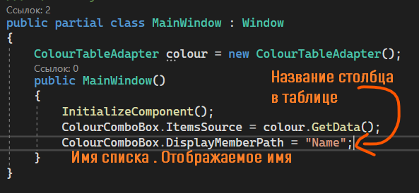

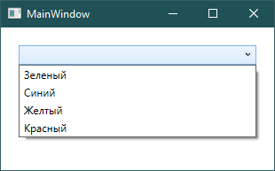

## Выбор данных из таблицы

Чтобы взять данные из таблицы или списка, я также буду использовать `SelectedItem` или `SelectedIndex`. Разберём пример с `SelectedItem`.

Верну `DataGrid` вместо `ComboBox`.

1. Дадим имя списку — уже есть, `ColourComboBox`.
2. Найдём нужное свойство — `SelectedItem`.
3. Обработаем событие — мне нужно изменение выбора, значит событие `SelectionChanged`.
4. Объединим 1 и 2 пункт — `ColourComboBox.SelectedItem`.

Далее, раз это таблица, то я хочу взаимодействовать с выбранной строкой как с `DataRowView` — `as DataRowView`. Из неё я хочу взять строку — `Row`.

Чтобы выбрать определённую ячейку из строки, нужно в квадратных скобках указать номер ячейки. Номера указываются с нуля. Скажем, я выбрала строку «Жёлтый». Столбец с ID будет иметь индекс 0, а столбец с названием — 1.

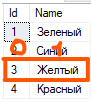

Чтобы выбрать определённую ячейку из строки, нужно в квадратных скобках указать номер столбца, так как строку мы уже взяли.

Хочу взять `ID` — напишу `0`.

![Код ColourComboBox_SelectionChanged: object cell = (ColourComboBox.SelectedItem as DataRowView).Row[0]; MessageBox.Show(cell.ToString()); — оранжевая подпись «Взяли ID (нулевой столбец)»](../../assets/wpf/dataset-connection/20_step.png)

Хочу взять имя — напишу `1`.

![Тот же код, но Row[1] — оранжевая подпись «Взяли имя (первый столбец)»](../../assets/wpf/dataset-connection/21_step.png)

С данными из ячейки я могу работать как захочу — вывести в [MessageBox](/wpf/events-msgbox), записать в текстовое поле, построить с этой переменной [условие](/csharp/if) и прочее.

## Полный код примера

`MainWindow.xaml` — DataGrid (или ComboBox):

```xml
<Window x:Class="WpfApp1.MainWindow"
        xmlns="http://schemas.microsoft.com/winfx/2006/xaml/presentation"
        xmlns:x="http://schemas.microsoft.com/winfx/2006/xaml"
        Title="MainWindow" Height="200" Width="324">
    <Grid>
        <DataGrid x:Name="ColourDataGrid" SelectionChanged="ColourDataGrid_SelectionChanged"/>
    </Grid>
</Window>
```

`MainWindow.xaml.cs` — TableAdapter, GetData() и работа с DataRowView:

```csharp
using System.Data;
using System.Windows;
using System.Windows.Controls;
using WpfApp1.ExampleDBDataSetTableAdapters;

namespace WpfApp1
{
    public partial class MainWindow : Window
    {
        ColourTableAdapter colour = new ColourTableAdapter();

        public MainWindow()
        {
            InitializeComponent();
            ColourDataGrid.ItemsSource = colour.GetData();
        }

        private void ColourDataGrid_SelectionChanged(object sender, SelectionChangedEventArgs e)
        {
            if (ColourDataGrid.SelectedItem == null) return;

            var row = (ColourDataGrid.SelectedItem as DataRowView).Row;
            object idCell = row[0];
            object nameCell = row[1];
            MessageBox.Show($"ID: {idCell}, Name: {nameCell}");
        }
    }
}
```
