Сейчас наша таблица только отображает данные. Давайте научимся добавлять, изменять и удалять данные в базу данных, чтобы все изменения сразу были в БД.

## Постановка

У нас есть пример — база данных с цветами и людьми с любимыми цветами и таблица, которая отображает цвета из БД.

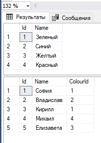

В DataSet каждый CRUD-запрос — это отдельный метод у TableAdapter (который мы [создали в прошлой лекции](/wpf/dataset-connection)), который мы создаём в мастере прямо у `xsd`-файла. Для каждой операции в TableAdapter появится свой метод вида `InsertQuery`, `UpdateQuery`, `DeleteQuery`, который мы потом вызываем из C#.

Основа приложения будет такая же — подключаем DataSet, создаём переменную с таблицей, указываем содержимое таблицы как источник элементов DataGrid. Плюс обработаем нажатие на кнопки.


```csharp
using System.Windows;
using WpfApp1.ExampleDBDataSetTableAdapters; // библиотека

namespace WpfApp1
{
    public partial class MainWindow : Window
    {
        ColourTableAdapter colour = new ColourTableAdapter(); // таблица из БД

        public MainWindow()
        {
            InitializeComponent();
            ColourDgr.ItemsSource = colour.GetData(); // данные из таблицы
        }
    }
}
```

## Добавление (Insert)

Мы хотим добавлять новые цвета, так что создадим текстовое поле, куда мы будем вписывать названия цветов. Также создадим кнопку, по которой будет происходить добавление.

Текстовое поле я назову `NameTbx`. Таблицу я назову `ColourDgr`.

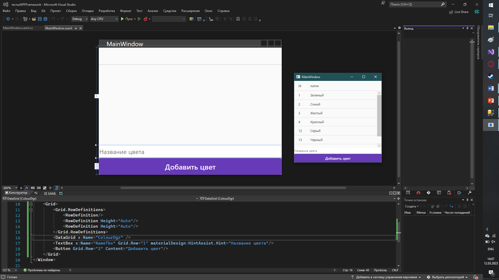

### Создание InsertQuery в мастере

Чтобы мы смогли взаимодействовать с БД из кода, нам нужно воспользоваться DataSet. Вспомним, в нём у нас есть метод `GetData()`, который позволяет взять всю информацию из БД.

Мы можем создавать подобные методы сами, например, метод добавления. Для этого нажмем ПКМ по нижней части таблицы, в которой мы хотим реализовать добавление (Colours, в нашем случае), и выберем «Добавить запрос».

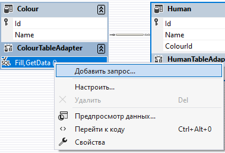

Откроется мастер настройки запросов адаптера таблицы. Так как мы хотим сделать обычный запрос, в самом первом пункте выберем «Использовать инструкции SQL».

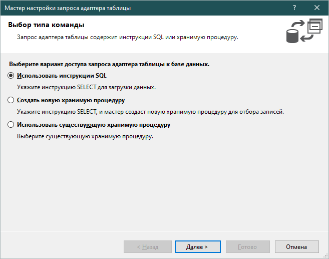

Заметьте, что если бы мы писали обычные запросы в SQL, мы бы вписывали каждое значение вручную:

```
values ('Зеленый'), ('Красный'), ('Желтый')
```

И так далее. Здесь значение должно идти из кода, поэтому фиксированное значение через кавычки мы дать не можем. Однако, вместо кавычек мы можем поставить переменную. Значение в неё будем записывать из TextBox.

Переменные в SQL отмечаются через `@<Название>`.

![Поле SQL: INSERT INTO [dbo].[Colour] ([Name]) VALUES (@Name); — оранжевая подпись «Переменная. Значение сюда будут идти через метод в коде»](../../assets/wpf/dataset-crud/06_insert_param_annotated.png)

Название и количество может быть любым, главное, чтобы они не повторялись внутри одного запроса.

Для добавления выберем тип запроса `Insert` и нажмём «Далее».

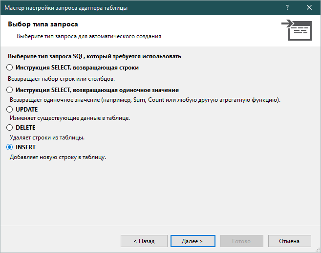

В следующем окне появится запрос на добавление данных, а затем на чтение этих добавленных значений. Из этого запроса необходимо удалить `select`, и его можно будет использовать.

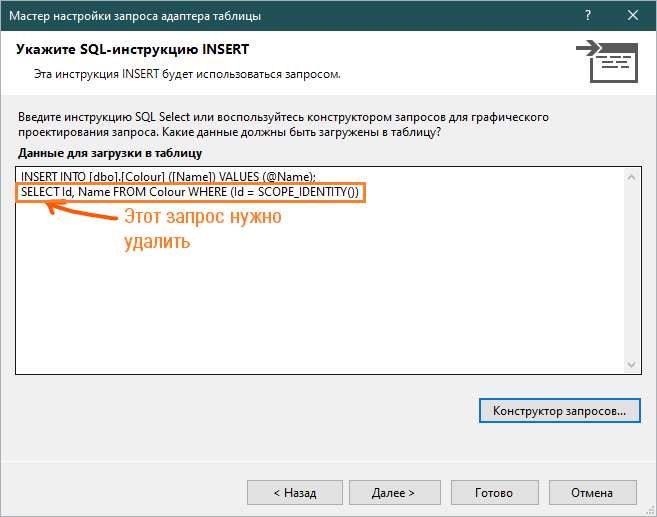

Если запрос нас полностью не устраивает, его можно переписать в этом окне, либо воспользоваться конструктором запросов.

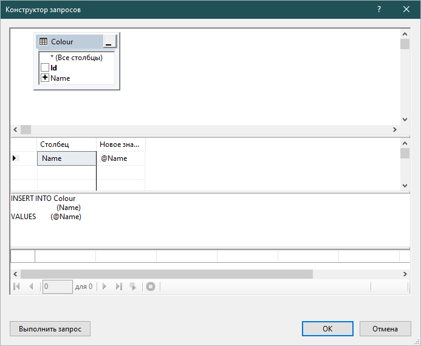

### Вызов InsertQuery из кода

Для добавления нам нужно вызвать метод `InsertQuery`, созданный ранее. Внутрь метода он попросит передать значение для добавления. Это значение мы возьмем из текстового поля `NameTbx`.

```csharp
private void Button_Click(object sender, RoutedEventArgs e)
{
    colour.InsertQuery(NameTbx.Text);
}
```

Для обновления таблицы нам снова необходимо прописать её источник элементов.

```csharp
private void Button_Click(object sender, RoutedEventArgs e)
{
    colour.InsertQuery(NameTbx.Text);
    ColourDgr.ItemsSource = colour.GetData();
}
```

## Изменение (Update)

Мы хотим, чтобы выбранная строка отобразилась в текстовых полях, мы ввели в них новое значение и отправили изменённый вариант в БД. Для этого потребуется текстовое поле для каждой ячейки кроме ID, а также кнопка для отправки изменений.

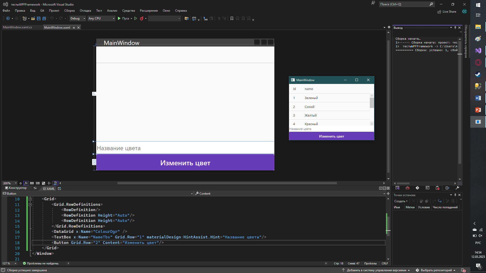

### Создание UpdateQuery в мастере

Снова ПКМ по `ColourTableAdapter` → «Добавить запрос» → «Использовать инструкции SQL». Для изменения выберем тип запроса `Update` и нажмём «Далее».

В следующем окне появится запрос на изменение данных, если все значения совпадают, а затем на вывод новых данных. В этом запросе нам нужно убрать последний `select`, а также отредактировать `update` запрос — оставить выбор только по ID.

![SQL UPDATE с двумя строками: первая UPDATE [dbo].[Colour] SET [Name] = @Name WHERE ((... AND ...)); и вторая SELECT Id, Name FROM Colour WHERE Id = @Id; — обе обведены оранжевым с подписями «Запрос на чтение убираем», «Убираем, оставляем только изменение по ID»](../../assets/wpf/dataset-crud/11_update_sql_annotated.png)

Финальный запрос: `UPDATE Colour SET Name = @Name WHERE (Id = @Original_Id)`.

Если запрос нас полностью не устраивает, его можно переписать в этом окне, либо воспользоваться конструктором запросов.

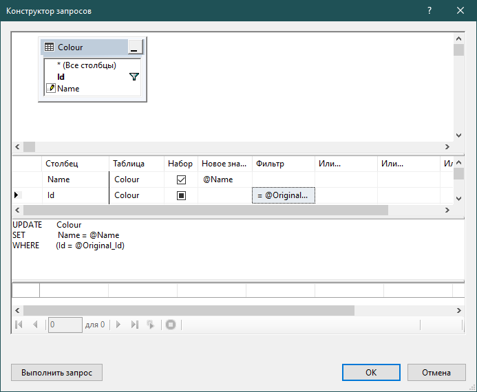

### Вызов UpdateQuery из кода

Для изменения нам необходимо взять выбранную строчку из таблицы при помощи `SelectedItem`. Из строки нужно взять ID, это 0 столбец.

![Код Button_Click: object id = (ColourDgr.SelectedItem as DataRowView).Row[0]; — оранжевые подписи «Взяли строку», «Столбец 0»](../../assets/wpf/dataset-crud/13_get_id_annotated.png)

После взятия ID воспользуемся методом `UpdateQuery`, созданным ранее. Внутрь метода, в следующей последовательности, передадим следующее: все столбцы, а затем ID строки, которую хотим изменить.

Значения для столбцов мы возьмём из текстовых полей.

![Код: object id = ...Row[0]; colour.UpdateQuery(NameTbx.Text, Convert.ToInt32(id)); — оранжевая стрелка к параметрам и IntelliSense ColourTableAdapter.UpdateQuery(string Name, int Original_Id)](../../assets/wpf/dataset-crud/14_updatequery_annotated.png)

```csharp
private void Button_Click(object sender, RoutedEventArgs e)
{
    object id = (ColourDgr.SelectedItem as DataRowView).Row[0];
    colour.UpdateQuery(NameTbx.Text, Convert.ToInt32(id));
    ColourDgr.ItemsSource = colour.GetData();
}
```

## Удаление (Delete)

Мы хотим, чтобы выбранная строка из таблицы удалялась. Для этого потребуется только кнопка.

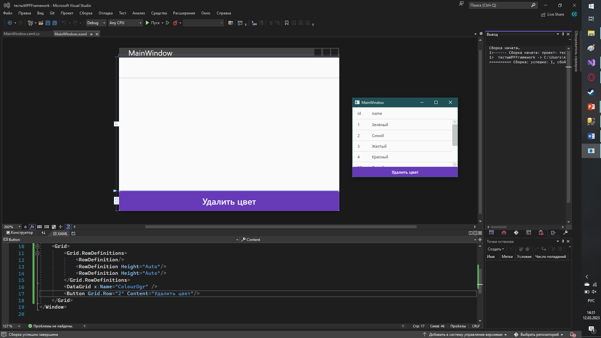

### Создание DeleteQuery в мастере

Снова ПКМ по `ColourTableAdapter` → «Добавить запрос» → «Использовать инструкции SQL». Для удаления выберем тип запроса `Delete` и нажмём «Далее».

В следующем окне появится запрос на удаление данных, если все значения совпадают. В этом запросе мы можем оставить только удаление по ID.

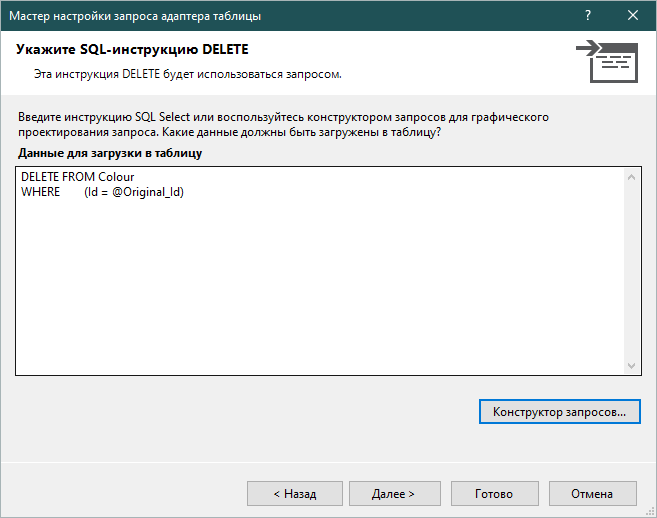

### Вызов DeleteQuery из кода

Для удаления нам необходимо взять выбранную строчку из [таблицы](/wpf/datagrid) при помощи `SelectedItem`. Из строки нужно взять ID, это 0 столбец.

После взятия ID воспользуемся методом `DeleteQuery`, созданным ранее. Внутрь метода передадим `id`, [конвертировав его в число](/csharp/converters).

```csharp
private void Button_Click(object sender, RoutedEventArgs e)
{
    object id = (ColourDgr.SelectedItem as DataRowView).Row[0];
    colour.DeleteQuery(Convert.ToInt32(id));
    ColourDgr.ItemsSource = colour.GetData();
}
```

## Полный код примера

`MainWindow.xaml` — DataGrid, поле и три кнопки:

```xml
<Window x:Class="WpfApp1.MainWindow"
        xmlns="http://schemas.microsoft.com/winfx/2006/xaml/presentation"
        xmlns:x="http://schemas.microsoft.com/winfx/2006/xaml"
        xmlns:materialDesign="http://materialdesigninxaml.net/winfx/xaml/themes"
        Title="MainWindow" Height="450" Width="400">
    <Grid>
        <Grid.RowDefinitions>
            <RowDefinition/>
            <RowDefinition Height="Auto"/>
            <RowDefinition Height="Auto"/>
            <RowDefinition Height="Auto"/>
            <RowDefinition Height="Auto"/>
        </Grid.RowDefinitions>

        <DataGrid x:Name="ColourDgr"/>
        <TextBox Grid.Row="1" x:Name="NameTbx"
                 materialDesign:HintAssist.Hint="Название цвета"/>
        <Button Grid.Row="2" Content="Добавить цвет" Click="Add_Click"/>
        <Button Grid.Row="3" Content="Изменить цвет" Click="Update_Click"/>
        <Button Grid.Row="4" Content="Удалить цвет"  Click="Delete_Click"/>
    </Grid>
</Window>
```

`MainWindow.xaml.cs` — полный CRUD через TableAdapter:

```csharp
using System;
using System.Data;
using System.Windows;
using WpfApp1.ExampleDBDataSetTableAdapters;

namespace WpfApp1
{
    public partial class MainWindow : Window
    {
        ColourTableAdapter colour = new ColourTableAdapter();

        public MainWindow()
        {
            InitializeComponent();
            ColourDgr.ItemsSource = colour.GetData();
        }

        private void Add_Click(object sender, RoutedEventArgs e)
        {
            colour.InsertQuery(NameTbx.Text);
            ColourDgr.ItemsSource = colour.GetData();
        }

        private void Update_Click(object sender, RoutedEventArgs e)
        {
            if (ColourDgr.SelectedItem == null) return;

            object id = (ColourDgr.SelectedItem as DataRowView).Row[0];
            colour.UpdateQuery(NameTbx.Text, Convert.ToInt32(id));
            ColourDgr.ItemsSource = colour.GetData();
        }

        private void Delete_Click(object sender, RoutedEventArgs e)
        {
            if (ColourDgr.SelectedItem == null) return;

            object id = (ColourDgr.SelectedItem as DataRowView).Row[0];
            colour.DeleteQuery(Convert.ToInt32(id));
            ColourDgr.ItemsSource = colour.GetData();
        }
    }
}
```
