В практической также должен быть реализован импорт данных из JSON. Её логика достаточно проста, но давайте подробнее разберёмся.

## Подготовка БД и интерфейса

Мне нужна таблица, куда я буду выгружать данные. Создам таблицу в БД с цветами.

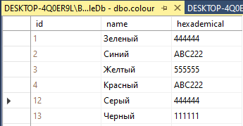

В WPF приложении подключу эту БД с таблицей и создам интерфейс, куда я выгружу таблицу и кнопку для импорта. Таблицу я назову `ColourDgr`.

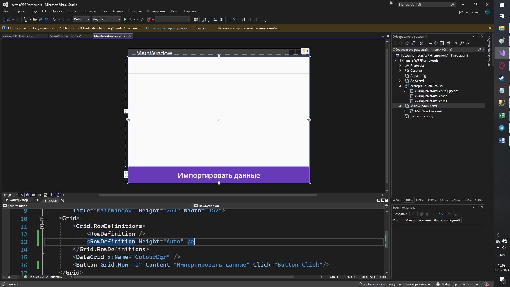

Также у меня есть подключенная БД с таблицей цветов. Внутри неё я создам запрос на добавление данных, чтобы я смогла добавить внутрь импортированные данные из файла.

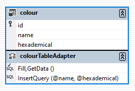

Выгружу данные из таблицы внутрь своего датагрида при помощи датасета. Таблица у меня называется colour, поэтому я подключу `colourTableAdapter`.

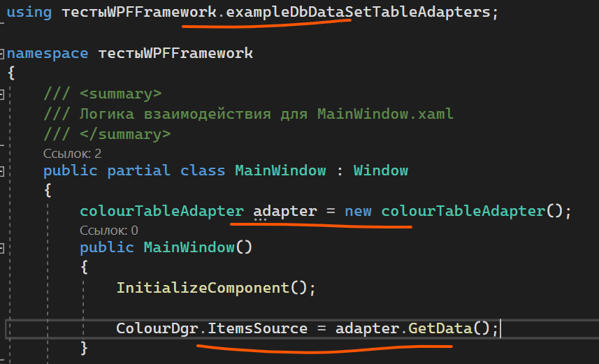

Сама программа будет работать следующим образом.

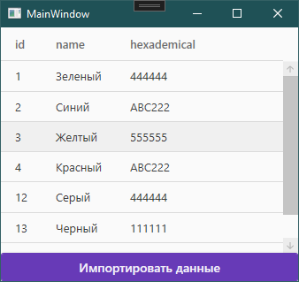

## Модель данных под JSON

Для того, чтобы импортнуть данные из [JSON](/csharp/json), мне нужно создать [модель данных](/csharp/classasmodel), который JSON будет принимать. Модель данных должна быть идентичной с таблицей, но без ID. То есть в своём случае я создам модель данных где у меня будет `name` и `hexademical`. Все свойства должны быть с [гетами и сетами](/wpf/properties).

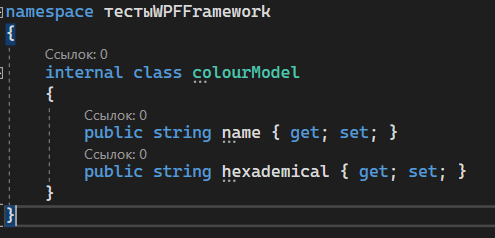

```csharp
namespace тестыWPFFramework
{
    internal class colourModel
    {
        public string name { get; set; }
        public string hexademical { get; set; }
    }
}
```

## Generic-десериализатор

Для импорта я возьму свой класс с generic-методами для сериализации и десериализации. Для импорта мне нужна только десериализация, сериализацию удалю.


```csharp
using System.IO;
using Microsoft.Win32;
using Newtonsoft.Json;

internal class LabaConverter
{
    public static T DeserializeObject<T>()
    {
        OpenFileDialog dialog = new OpenFileDialog();   // выбираю файл для десериализации
        if (dialog.ShowDialog() == true)
        {
            string json = File.ReadAllText(dialog.FileName);
            T obj = JsonConvert.DeserializeObject<T>(json); // если всё ок, читаю данные из файла и десериализую
            return obj;
        }
        else
        {
            return default(T);                          // если не ок, возвращаю значение типа данных по умолчанию
        }
    }
}
```

## Подготовка JSON через JsonCreator

Теперь мне нужен файл для десериализации. Здесь вам необходимо использовать маленькую программу, которая у вас хранится в папке `JsonCreator`.

Логика работы с программой:

Открываете программу в Visual Studio. Здесь вам не нужно менять никакой код, нужно только загрузить ваш тип данных который вы создали. В моём случае — `colourModel`.

`colourModel` я загружаю в папку `Models`. Остальные файлы я не трогаю.

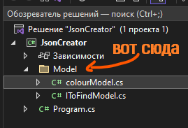

Чтобы программа нашла этот файл, она должна наследовать `IToFindModel`.

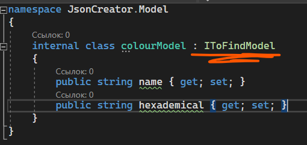

Запускаем программу, вводим количество данных, которые я хочу импортировать, и заполняю их значениями. В конце введу название JSON файла.

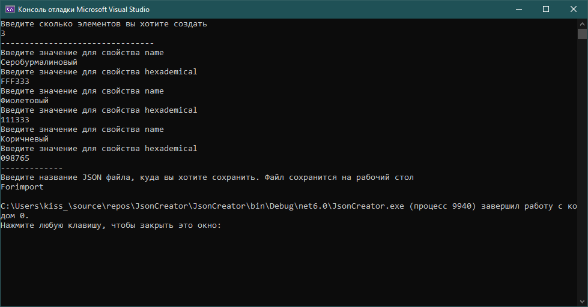

По итогу я получу следующий файл, который я смогу импортировать.

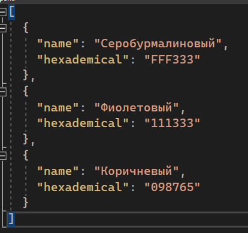

## Работа с основной программой — импорт данных

Чтобы сделать импорт, для начала я обработаю нажатие на кнопку импорта. Внутри я вызову свой класс с десериализацией данных из файла. Я хочу получить лист с цветами, поэтому, во-первых, тип данных будет `List<colourModel>`, а во-вторых, все данные я также сохраню в переменную с типом данных `List<colourModel>`.

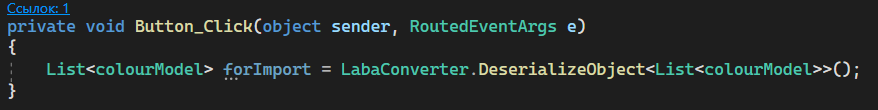

```csharp
private void Button_Click(object sender, RoutedEventArgs e)
{
    List<colourModel> forImport = LabaConverter.DeserializeObject<List<colourModel>>();
}
```

После того, как мы всё десериализовали, нам нужно пробежаться по каждому элементу и добавить данные внутрь БД. Создадим [цикл](/csharp/cycles) чтобы пробежаться по всему листу.

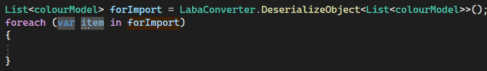

А внутри я вызову свой адаптер (название моей переменной для `colourTableAdapter`) и через него добавлю данные в БД. Данные я возьму из `item` — переменной внутри цикла.

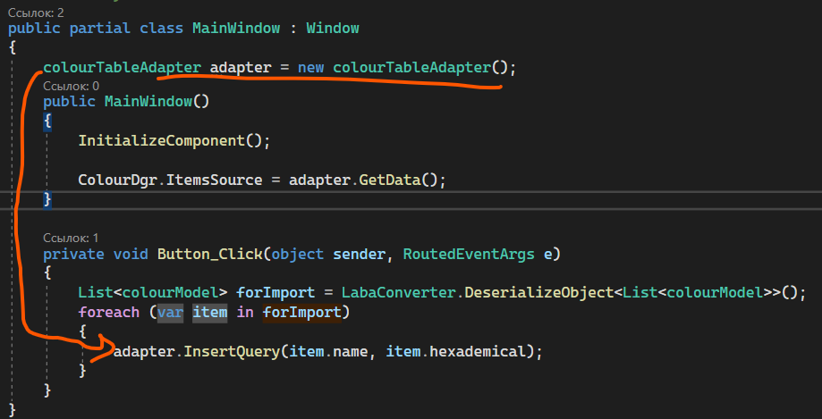

```csharp
foreach (var item in forImport)
{
    adapter.InsertQuery(item.name, item.hexademical);
}
```

В самом конце обновлю содержимое таблицы.

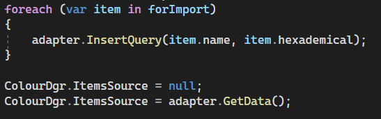

```csharp
foreach (var item in forImport)
{
    adapter.InsertQuery(item.name, item.hexademical);
}

ColourDgr.ItemsSource = null;
ColourDgr.ItemsSource = adapter.GetData();
```

Как итог — я могу выбрать файл и добавить из него данные в БД.

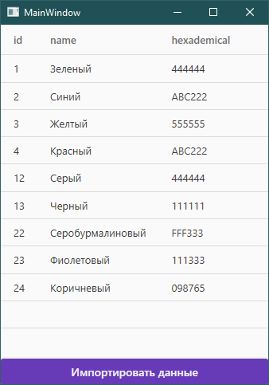

## Полный код примера

`colourModel.cs` — модель под JSON:

```csharp
namespace тестыWPFFramework
{
    internal class colourModel
    {
        public string name { get; set; }
        public string hexademical { get; set; }
    }
}
```

`LabaConverter.cs` — generic-десериализатор с OpenFileDialog:

```csharp
using System.IO;
using Microsoft.Win32;
using Newtonsoft.Json;

namespace тестыWPFFramework
{
    internal class LabaConverter
    {
        public static T DeserializeObject<T>()
        {
            OpenFileDialog dialog = new OpenFileDialog();
            if (dialog.ShowDialog() == true)
            {
                string json = File.ReadAllText(dialog.FileName);
                return JsonConvert.DeserializeObject<T>(json);
            }
            return default(T);
        }
    }
}
```

`MainWindow.xaml.cs` — отображение таблицы + импорт по кнопке:

```csharp
using System.Collections.Generic;
using System.Windows;
using тестыWPFFramework.exampleDbDataSetTableAdapters;

namespace тестыWPFFramework
{
    public partial class MainWindow : Window
    {
        colourTableAdapter adapter = new colourTableAdapter();

        public MainWindow()
        {
            InitializeComponent();
            ColourDgr.ItemsSource = adapter.GetData();
        }

        private void Button_Click(object sender, RoutedEventArgs e)
        {
            List<colourModel> forImport = LabaConverter.DeserializeObject<List<colourModel>>();
            if (forImport == null) return;

            foreach (var item in forImport)
            {
                adapter.InsertQuery(item.name, item.hexademical);
            }

            ColourDgr.ItemsSource = null;
            ColourDgr.ItemsSource = adapter.GetData();
        }
    }
}
```
