Когда мы отображаем данные из таблиц, у которых есть внешний ключ, они показывают ID записи, на которую они ссылаются. Согласитесь, что понять, что за цвет «1» достаточно сложно, а постоянно переключаться на другую таблицу — муторно. Поэтому давайте научимся отображать данные из нескольких таблиц внутри программы.

У нас есть пример — база данных с цветами и людьми с любимыми цветами и таблица, которая отображает цвета из БД.


## SQL JOIN и правило исходной структуры

Если я хочу объединить данные из нескольких таблиц, я буду использовать `join` — `inner`, `left`, `right`, `full` или `cross`. Например, чтобы показать только имя человека и его любимый цвет, я напишу следующий запрос.

![SSMS: select [human].[name], [colour].[name] from [human] inner join [colour] on [human].[id] = [colour].[id] — результат таблица из 2 колонок name/name](../../assets/wpf/dataset-multi-table/02_sql_join_two_names.png)

По факту, я могу написать подобнейший запрос и в DataSet, но есть проблема.

> Если я собираюсь выводить данные из сторонней таблицы, **первоначальная структура таблицы обязательно должна остаться**.

Покажу на примере. Я также хочу вывести данные из таблицы Human, добавив туда цвета. Первоначальная структура таблицы следующая:

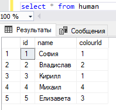

В этом случае, пример чуть выше (где 2 `name` — человека и цвета) я использовать не смогу, так как от первоначальной структуры таблицы остался только один столбец. В DataSet мне нужно также вывести все данные из основной таблицы, и просто добавить к ней столбцы, которые я хочу показать дополнительно.

![SSMS: select [human].[name], [colour].[name] from [human] inner join [colour] — результат 2 колонки name/name, оранжевая подпись «вот так не ок»](../../assets/wpf/dataset-multi-table/04_join_wrong_annotated.png)

![SSMS: select [human].id, [human].[name], [human].colourId, [colour].[name] from [human] inner join [colour] — результат 4 колонки id/name/colourId/name (зелёная обводка), зелёная подпись «вот так ок!»](../../assets/wpf/dataset-multi-table/05_join_correct_annotated.png)

Второй пример тут будет правильный, так как у нас полностью выгружается основная таблица. Именно в таком формате мы можем поместить запрос в DataSet. Заметьте, что запрос мы будем писать в ту же таблицу, для которой написали `from` (в запросе `from human`, в DataSet пишем для `human`).

## Куда поместить запрос

Поместить его можно в два места.

### Способ 1 — изменить GetData() (нежелательно)

Внутрь метода `GetData()` — нужно изменить запрос через «ПКМ» → «Настроить», и вставить получившийся запрос. Да, таким образом нам не нужно будет делать новый запрос, но тогда структура самой таблицы у нас поменяется, а появившаяся дополнительная строчка может очень сильно повлиять на изменение или на понимание кода в принципе, особенно, если вы будете менять их местами.

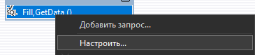

![Мастер «Какие данные должны быть загружены в таблицу?» с SQL: select [human].id, [human].[name], [human].colourId, [colour].[name] from [human] inner join [colour] on [human].[id] = [colour].[id]](../../assets/wpf/dataset-multi-table/07_wizard_full_query.png)

Вот как было до изменения GetData:

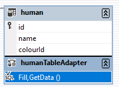

А вот как стало:

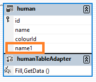

Так что чтобы у нас не появлялись ошибки с отображением, мы можем поместить его…

### Способ 2 — отдельный метод GetFullInfo

В отдельный метод — для этого как всегда нужно нажать ПКМ по методу, «Добавить запрос».

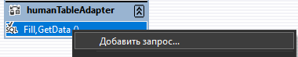

В последующих пунктах необходимо выбрать SELECT, возвращающий строки.


И внутрь также добавляем запрос на отображение всего. Не забываем убрать `FillBy` и поменять название на `GetFullInfo` (или любое другое осмысленное).

Если в конце концов у вас появится вот такое всплывающее окно, не переживайте, всё ок. Он как раз-таки предупреждает, что если в вашем запросе не было первоначальной таблицы, то у вас ничего не отобразится.


Я создала метод `GetFullInfo`. И уже при помощи него, я готова отобразить его в базе данных.

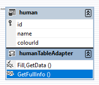

## Вывод в DataGrid

Заранее у меня было создано окно с [датагридом](/wpf/datagrid), который я назвала `HumanGrd`.

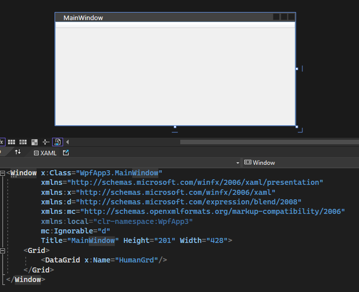

Отобразим данные в этой таблице подобно тому, как мы читали данные из таблицы ещё в [самой первой лекции](/wpf/dataset-connection).

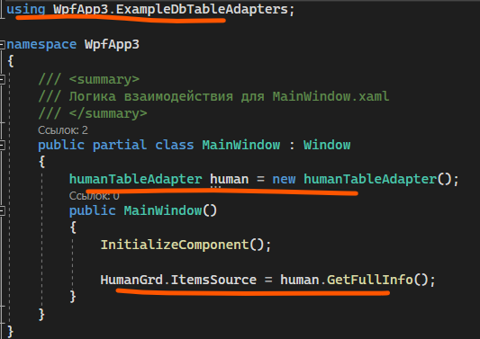

```csharp
using WpfApp3.ExampleDbTableAdapters;

public partial class MainWindow : Window
{
    humanTableAdapter human = new humanTableAdapter();

    public MainWindow()
    {
        InitializeComponent();
        HumanGrd.ItemsSource = human.GetFullInfo();
    }
}
```

Отображаться будет! Но проблема в том, что я хочу не отображать ID от имени и от `ColourId`. Но проблема как раз в том, что через запрос я не могу этого сделать. Значит придётся вручную — скрывать столбцы самого датагрида.

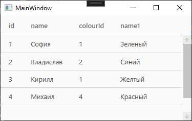

## Скрытие столбцов DataGrid

Для того, чтобы получить доступ ко всем столбцам из кода, мне нужно написать `названиедатагрида.Columns`. `Columns` — массив столбцов. Выбрав определённый по индексу, я могу задать ему видимость — `Visibility.Collapsed` в нашем случае.

Я хочу скрыть столбцы с Id. По счёту, первый id это 0 номер, `colourId` — 2 номер.

![Код в конструкторе: HumanGrd.Columns[0].Visibility = Visibility.Collapsed; HumanGrd.Columns[2].Visibility = Visibility.Collapsed;](../../assets/wpf/dataset-multi-table/17_columns_visibility_code.png)

Однако в этом случае код выдаст ошибку, так как данные из БД ещё не успели придти в таблицу и колонок нет. Чтобы мы были уверены, что уже всё подгрузилось, давайте создадим [событие](/wpf/events-msgbox) `Loaded` для `Window`, и поместим код туда.

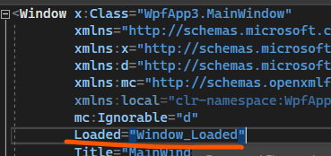

![Код MainWindow с обработчиком Window_Loaded(object sender, RoutedEventArgs e) с двумя строчками Columns[0]/Columns[2].Visibility = Visibility.Collapsed; — оранжевая скобка вокруг обработчика](../../assets/wpf/dataset-multi-table/19_loaded_handler_annotated.png)

И тогда всё будет очень красиво отображаться!

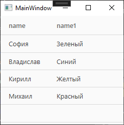

## Полный код примера

`MainWindow.xaml` — DataGrid с обработчиком Loaded:

```xml
<Window x:Class="WpfApp3.MainWindow"
        xmlns="http://schemas.microsoft.com/winfx/2006/xaml/presentation"
        xmlns:x="http://schemas.microsoft.com/winfx/2006/xaml"
        Title="MainWindow" Height="201" Width="428"
        Loaded="Window_Loaded">
    <Grid>
        <DataGrid x:Name="HumanGrd"/>
    </Grid>
</Window>
```

`MainWindow.xaml.cs` — выгрузка через GetFullInfo + скрытие лишних столбцов на Loaded:

```csharp
using System.Windows;
using WpfApp3.ExampleDbTableAdapters;

namespace WpfApp3
{
    public partial class MainWindow : Window
    {
        humanTableAdapter human = new humanTableAdapter();

        public MainWindow()
        {
            InitializeComponent();
            HumanGrd.ItemsSource = human.GetFullInfo();
        }

        private void Window_Loaded(object sender, RoutedEventArgs e)
        {
            HumanGrd.Columns[0].Visibility = Visibility.Collapsed; // id
            HumanGrd.Columns[2].Visibility = Visibility.Collapsed; // colourId
        }
    }
}
```
