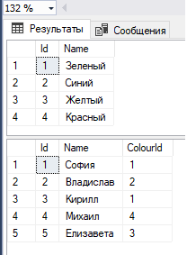
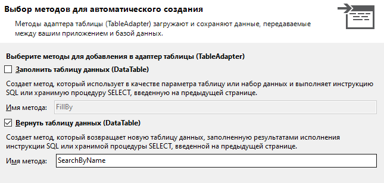
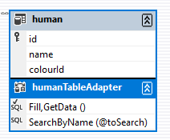
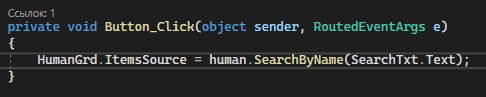
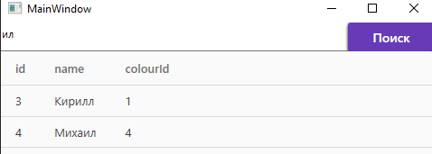
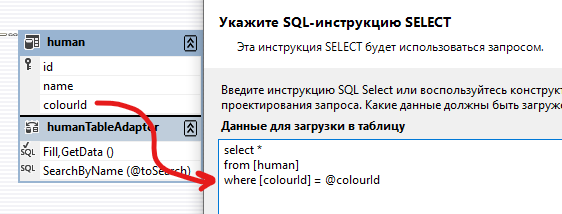
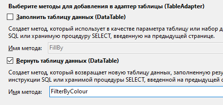
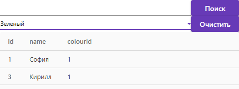

Если данных слишком много, у нас должна быть возможность что-то среди них найти, либо просто отфильтровать пункты по каким-то свойствам. По факту, все выборки делаются просто через различные запросы, коих нужно сделать немало, если мы хотим сделать правильную выборку. Однако давайте разберём пару примеров по тому, как нужно сделать поиск по одному полю и фильтрацию по одному полю.

## Постановка

Сделаем интерфейс с табличкой, куда мы будем выгружать данные о пользователях и их любимых цветах. Табличку я назову `HumanDgr`.


Как всегда, подключу базу данных и создам DataSet для работы с БД. БД буду использовать ту же, с людьми и их любимыми цветами. Вот пример данных, чтобы понимать, что внутри.



Также напишу код для того, чтобы у меня данные из таблицы Human отобразились в моём `DataGrid`.

```csharp
public partial class MainWindow : Window
{
    humanTableAdapter human = new humanTableAdapter();

    public MainWindow()
    {
        InitializeComponent();
        HumanGrd.ItemsSource = human.GetData();
    }
}
```

## Поиск через SQL WHERE LIKE

Если мы хотим сделать поиск, то необходимо ещё добавить текстовое поле и кнопку. Текстовое поле я назову как `SearchTxt`. Сразу обработаем и Click для кнопки.


Сделаем поиск только по названию. Если мы хотим сделать поиск по БД, мы можем поступить двумя способами:

- Сделать поиск из тех данных, которые мы выгрузили. Затрат для базы данных будет меньше, однако в плане кода писать нужно больше.
- Сделать поиск через SQL запрос. Затрат для БД больше, но в плане кода уже всё нам знакомо — нужно сделать только запрос в БД и обновлять табличку базы данных каждый раз, когда мы нажимаем на кнопку поиска. Так и поступим.

Создадим новый запрос на поиск по полю `name`. Если я хочу написать запрос по поиску, мне необходимо поставить `where` в конце, в виде `where [поледляпоиска] like '%' + нашапеременная + '%'`.

Чтобы создать запрос, опять же нажмём по полю в датасете у нашей таблички `human` ПКМ и выберем «Добавить запрос». Далее выбираем «SELECT, возвращающая строки», и меняем запрос, добавляя в конец WHERE. В качестве переменной укажу `toSearch`. Напоминаю, что переменные мы пишем через `@`.

![Мастер «Укажите SQL-инструкцию SELECT»: select * from [human] where [name] like '%'+@toSearch+'%'](../../assets/wpf/dataset-search/04_search_wizard_sql.png)

В следующем окошке убираем галочку с `FillBy` и меняем имя на `SearchByName`.



Появится новый метод. Главное, если вы всё правильно написали, проверить, что у вас в круглых скобках появилась ваша переменная.



При нажатии на кнопку обновим таблицу `HumanGrd` этим методом. Внутрь напишем текст из текстбокса.



```csharp
private void Button_Click(object sender, RoutedEventArgs e)
{
    HumanGrd.ItemsSource = human.SearchByName(SearchTxt.Text);
}
```

И тогда, при вводе и нажатии на кнопку, мы увидим найденные данные.



## Фильтрация через ComboBox

Фильтрация делается по той же схеме, что и поиск, однако она изначально показывает варианты, по которым можно найти поиск (например, вместо того, чтобы нам вписывать текст «зелёный», мы можем просто выбрать пункт «зелёный», и он автоматом нам отобразит все элементы с зелёным цветом). Поэтому, чтобы сделать фильтрацию по цвету, давайте сделаем [выпадающий список](/wpf/combobox-listbox) с выгруженным туда цветом, и кнопку для очистки фильтрации. Список я назову `ColourCbx`.


В этот список нужно выгрузить все данные из таблички `Colours` + чтобы у нас отображался текст, в качестве `DisplayMemberPath` укажем название вашего столбца с именем. У меня такой столбец называется `name`.

```csharp
colourTableAdapter colour = new colourTableAdapter();

public MainWindow()
{
    InitializeComponent();
    HumanGrd.ItemsSource = human.GetData();
    ColourCbx.ItemsSource = colour.GetData();
}
```

```xml
<ComboBox x:Name="ColourCbx" DisplayMemberPath="name"/>
```

При изменении выбора в `ComboBox` (событие `SelectionChanged`, которое надо создать, дважды нажав по списку), нам нужно взять объект, который мы нашли, взять из него id, и отправить запрос на выборку данных по цвету с выбранным id. Давайте всё постепенно.

Проверим, точно ли у нас есть выбор через `SelectedItem != null`. Если есть, возьмём айдишник.

![Код ColourCbx_SelectionChanged: var id = (int)(ColourCbx.SelectedItem as DataRowView).Row[0]; внутри if SelectedItem != null](../../assets/wpf/dataset-search/10_get_id_annotated.png)

```csharp
private void ColourCbx_SelectionChanged(object sender, SelectionChangedEventArgs e)
{
    if (ColourCbx.SelectedItem != null)
    {
        var id = (int)(ColourCbx.SelectedItem as DataRowView).Row[0];
    }
}
```

По этому айдишнику нужно сделать выборку. Добавим новый запрос в DataSet. Также, как и в первом случае с поиском, запрос у нас идёт в табличку Human, и выбрать мы должны инструкцию `Select`, возвращающую строки. Изменим запрос, добавив туда `where` на столбец с цветом. Изменим название итогового метода и уберём метод `FillBy`.



```sql
select *
from [human]
where [colourId] = @colourId
```



Возьмём новоиспечённый метод и поместим его внутрь метода SelectionChanged, туда, где мы взяли id. Результат строк поместим в `HumanGrd.ItemsSource`.

![Код: внутри if SelectedItem != null — var id = (int)(...).Row[0]; HumanGrd.ItemsSource = human.FilterByColour(id); — подчёркнуто красным](../../assets/wpf/dataset-search/13_filterbycolour_call.png)

```csharp
private void ColourCbx_SelectionChanged(object sender, SelectionChangedEventArgs e)
{
    if (ColourCbx.SelectedItem != null)
    {
        var id = (int)(ColourCbx.SelectedItem as DataRowView).Row[0];
        HumanGrd.ItemsSource = human.FilterByColour(id);
    }
}
```

На всякий случай, сразу же, давайте пропишем `Click` для кнопки «Очистить». Внутри неё нужно просто снова отправить запрос на получение информации.

```xml
<Button Content="Очистить" Grid.Column="1" Click="Button_Click_1"/>
```

```csharp
private void Button_Click_1(object sender, RoutedEventArgs e)
{
    HumanGrd.ItemsSource = human.GetData();
}
```

И тогда при выборе цвета отобразятся необходимые поля.




## Полный код примера

`MainWindow.xaml` — TextBox поиска, ComboBox фильтра и DataGrid:

```xml
<Window x:Class="WpfApp2.MainWindow"
        xmlns="http://schemas.microsoft.com/winfx/2006/xaml/presentation"
        xmlns:x="http://schemas.microsoft.com/winfx/2006/xaml"
        Title="MainWindow" Height="337" Width="496">
    <Grid>
        <Grid.RowDefinitions>
            <RowDefinition Height="Auto"/>
            <RowDefinition Height="Auto"/>
            <RowDefinition/>
        </Grid.RowDefinitions>

        <Grid>
            <Grid.ColumnDefinitions>
                <ColumnDefinition Width="4*"/>
                <ColumnDefinition/>
            </Grid.ColumnDefinitions>
            <TextBox x:Name="SearchTxt"/>
            <Button Grid.Column="1" Content="Поиск" Click="Button_Click"/>
        </Grid>

        <Grid Grid.Row="1">
            <Grid.ColumnDefinitions>
                <ColumnDefinition Width="4*"/>
                <ColumnDefinition/>
            </Grid.ColumnDefinitions>
            <ComboBox x:Name="ColourCbx" DisplayMemberPath="name"
                      SelectionChanged="ColourCbx_SelectionChanged"/>
            <Button Content="Очистить" Grid.Column="1" Click="Button_Click_1"/>
        </Grid>

        <DataGrid x:Name="HumanGrd" Grid.Row="2"/>
    </Grid>
</Window>
```

`MainWindow.xaml.cs` — поиск, фильтр и очистка через TableAdapter:

```csharp
using System.Data;
using System.Windows;
using System.Windows.Controls;
using WpfApp2.ExampleDBDataSetTableAdapters;

namespace WpfApp2
{
    public partial class MainWindow : Window
    {
        humanTableAdapter human = new humanTableAdapter();
        colourTableAdapter colour = new colourTableAdapter();

        public MainWindow()
        {
            InitializeComponent();
            HumanGrd.ItemsSource = human.GetData();
            ColourCbx.ItemsSource = colour.GetData();
        }

        private void Button_Click(object sender, RoutedEventArgs e)
        {
            HumanGrd.ItemsSource = human.SearchByName(SearchTxt.Text);
        }

        private void ColourCbx_SelectionChanged(object sender, SelectionChangedEventArgs e)
        {
            if (ColourCbx.SelectedItem != null)
            {
                var id = (int)(ColourCbx.SelectedItem as DataRowView).Row[0];
                HumanGrd.ItemsSource = human.FilterByColour(id);
            }
        }

        private void Button_Click_1(object sender, RoutedEventArgs e)
        {
            HumanGrd.ItemsSource = human.GetData();
        }
    }
}
```
