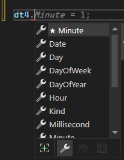
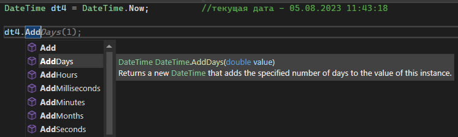
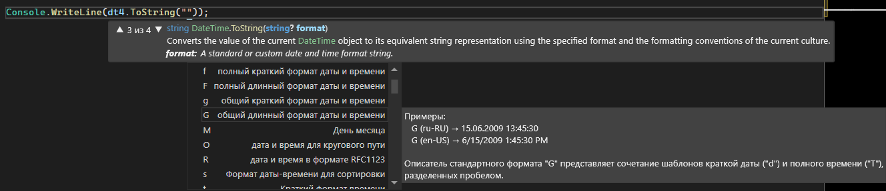
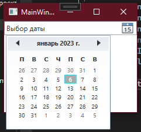
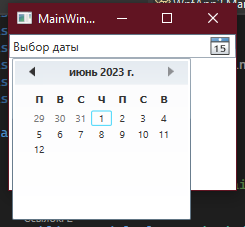
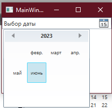
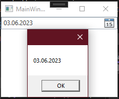

## DateTime — повторение

Мы помним, что у нас есть тип данных DateTime, позволяющий работать с датами и временем. Давайте кратко его вспомним.

DateTime позволяет нам работать с полным набором — секунды, минуты, часы, дни, месяцы и года, не разбивая это все на 6 отдельных интовых переменных. Создается как сложные переменные — **типданных название = new типданных**. Создать можно несколькими способами — пустая дата, только дата, дата со временем, и текущая дата при помощи `DateTime.Now`.

```csharp
DateTime dt  = new DateTime();                    // 01.01.0001 00:00:00
DateTime dt2 = new DateTime(2022, 12, 30);        // 30.12.2022 00:00:00
DateTime dt3 = new DateTime(2022, 12, 30, 23, 40, 59); // 30.12.2022 23:40:59
DateTime dt4 = DateTime.Now;                      // текущая дата — 05.08.2023 11:43:18
```

Из каждой такой даты можно по отдельности взять любое число — год, месяц, дату и прочее.



К датам можно прибавлять или убирать дни, месяцы, года и т.п. при помощи методов `AddDays`, `AddMonths`, `AddYears` и прочее.



Чтобы наоборот, вычесть что-либо, необходимо вписать отрицательное число в эти методы. Новую дату обязательно надо присвоить!

```csharp
DateTime dt4 = DateTime.Now;     // текущая дата — 05.08.2023 11:43:18
dt4 = dt4.AddDays(-4);           // 01.08.2023
```

Даты можно также отображать в различных форматах — длинном и кратком. Язык в длинной дате зависит от языка вашей системе.

```csharp
Console.WriteLine(dt4.ToShortDateString()); // 01.08.2023
Console.WriteLine(dt4.ToLongDateString());  // 01 августа 2023 г.
```

Можно еще сделать собственное отображение при помощи `ToString("<тут формат>")`. Возможности формата будут написаны внутри подсказки от Visual Studio и вы можете их использовать как душа пожелает.



Буквы будут обозначать здесь необходимое отображение даты и времени.

```csharp
Console.WriteLine(dt4.ToString("День недели: dddd, Дата: dd MMMM yyyy, Время: HH:mm:ss, Часовой пояс: K"));
// День недели: вторник, Дата: 01 августа 2023, Время: 12:07:27, Часовой пояс: +03:00
```

## DatePicker

Однако как нам работать с датами прямо в интерфейсе? Создавать списки с днями, месяцами и годами? Это слишком муторно, поэтому был придуман специальный элемент интерфейса — DatePicker. TimePicker, к сожалению, в элементах по умолчанию нет. Давайте научимся работать с датами.

Создадим DatePicker на нашем окне. По умолчанию, он будет выглядеть вот так.



Из основных настроек, мы можем настроить следующее:

- Даты или промежуток дат, которые мы не можем выбрать — `BlackoutDays`.
- Отображаемая дата по умолчанию — `DisplayDate`.
- Максимальная дата — `DisplayDateEnd`.
- Минимальная дата — `DisplayDateStart`.
- Первый день недели (по умолчанию — воскресение) — `FirstDayOfWeek`.
- Выделена ли сегодняшняя дата — `IsTodayHighlighted`.
- Формат выбранной даты — `SelectedDateFormat`.
- Выбранная дата — `Text`.

Со всеми этими свойствами мы также можем работать из кода, используя тип данных DateTime. Например, выставить значение для первой и последней отображаемой даты.

```csharp
ExampleDtp.DisplayDateStart = new DateTime(2023, 02, 12);
ExampleDtp.DisplayDateEnd   = new DateTime(2023, 06, 12);
```

Итог будет выглядеть вот так.





Как уже было сказано выше, выбранная дата у нас будет хранится в тексте. Но, логично, что она будет отображаться в виде текста, так что чтобы ее использовать, нам каждый раз придется конвертировать ее в DateTime.

Чтобы работать с измененной выбранной датой, у нас есть свойство `SelectedDateChanged`. Давайте с помощью нее посмотрим, что за дата у нас отображается. Я буду выводить ее, например, в MessageBox.

Если мы сразу конвертируем текст в DateTime, мы сможем спокойно взаимодействовать в ним как с датой — сортировать по дате, взять год, прибавить дни и прочее. Если же нам нужен просто текст, мы можем и не конвертировать содержимое в дату, а оставить все как есть и работать со стрингом.

```csharp
private void DatePicker_SelectedDateChanged(object sender, SelectionChangedEventArgs e)
{
    DateTime date = Convert.ToDateTime(ExampleDtp.Text);
    MessageBox.Show(date.ToShortDateString());
}
```

Выглядеть это будет вот так.



## Полный код примера

`MainWindow.xaml` с одним DatePicker и привязанным событием:

```xml
<Window x:Class="WpfApp2.MainWindow"
        xmlns="http://schemas.microsoft.com/winfx/2006/xaml/presentation"
        xmlns:x="http://schemas.microsoft.com/winfx/2006/xaml"
        Title="MainWindow" Height="450" Width="800">
    <Grid>
        <DatePicker x:Name="ExampleDtp"
                    HorizontalAlignment="Stretch" VerticalAlignment="Top"
                    Margin="10"
                    SelectedDateChanged="DatePicker_SelectedDateChanged"/>
    </Grid>
</Window>
```

`MainWindow.xaml.cs` с настройкой диапазона дат и обработчиком выбора:

```csharp
using System;
using System.Windows;
using System.Windows.Controls;

namespace WpfApp2
{
    public partial class MainWindow : Window
    {
        public MainWindow()
        {
            InitializeComponent();

            ExampleDtp.DisplayDateStart = new DateTime(2023, 02, 12);
            ExampleDtp.DisplayDateEnd   = new DateTime(2023, 06, 12);
        }

        private void DatePicker_SelectedDateChanged(object sender, SelectionChangedEventArgs e)
        {
            DateTime date = Convert.ToDateTime(ExampleDtp.Text);
            MessageBox.Show(date.ToShortDateString());
        }
    }
}
```
