Иногда нам не хватает созданных библиотек с интерфейсами, или, самая частое желание, мы хотим убрать синий цвет у кнопки, когда на неё наводится мышка. Реализовать мы это можем при помощи стилей приложения, которые, для удобства, будут хранится в отдельных словарях данных — отдельных xaml файлах.

Словари данных созданы не только для того, чтобы хранить стили, они созданы для того, чтобы в принципе хранить внутри себя какие-либо данные. Например, с их помощью можно реализовать локализацию приложения — два файла с значениями, которые переключаются в зависимости от выбранного языка.

Данные из файла и в первом и во втором случае подтягиваются при помощи привязки данных к этим файлам.

## Использование словарей данных для создания стилей

Я создам самое простое маленькое приложение с кнопкой посередине. Кнопка имеет стиль по умолчанию — прямоугольник, серый фон, тёмно-серые границы и прочее.

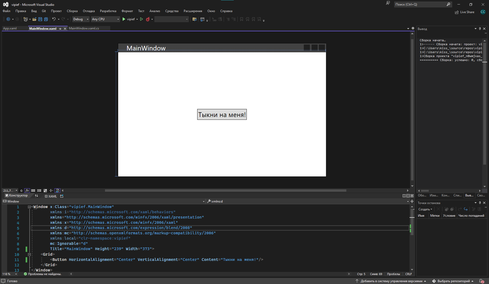

Её стиль я и буду менять.

### Создание словаря ресурсов

Для хранения словарей данных я создам новую папку в обозревателе решений — `Resources`, и буду в ней создавать словари данных.

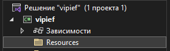

Для того, чтобы создать данных, я ПКМ нажму по папке → Добавить → Словарь данных (WPF).

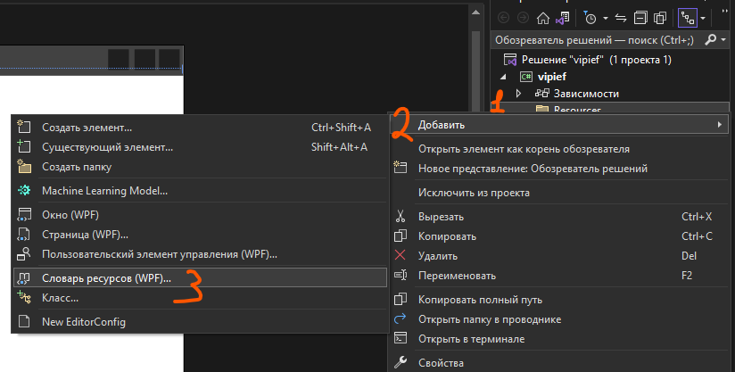

Эти файлы можно назвать как угодно. Для того, чтобы однозначно определить, что это стиль, назову их как `___Style.xaml`. Скажем, я хочу создать стиль для кнопки, тогда я создам `ButtonStyle.xaml`.

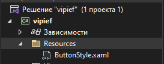

После создания файла у меня появятся вот такое содержимое файла. Именно в нем нам и нужно будет писать стили.

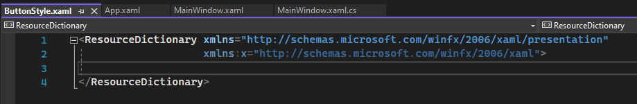

### Способ 1 — поиск стиля в гугле

Для того, чтобы изменить существующий стиль кнопки (или в принципе понять, что менять), нам необходимо до него добраться. Сделать это можно двумя способами.

- Загуглите «`<название элемента> style wpf`». Например, стиль для кнопки.

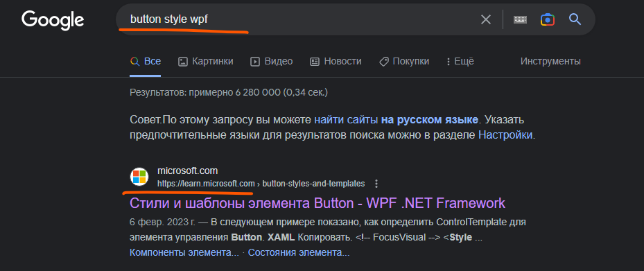

- Выберите самую первую ссылку на документацию Microsoft и скопируйте оттуда `ControlTemplate`.

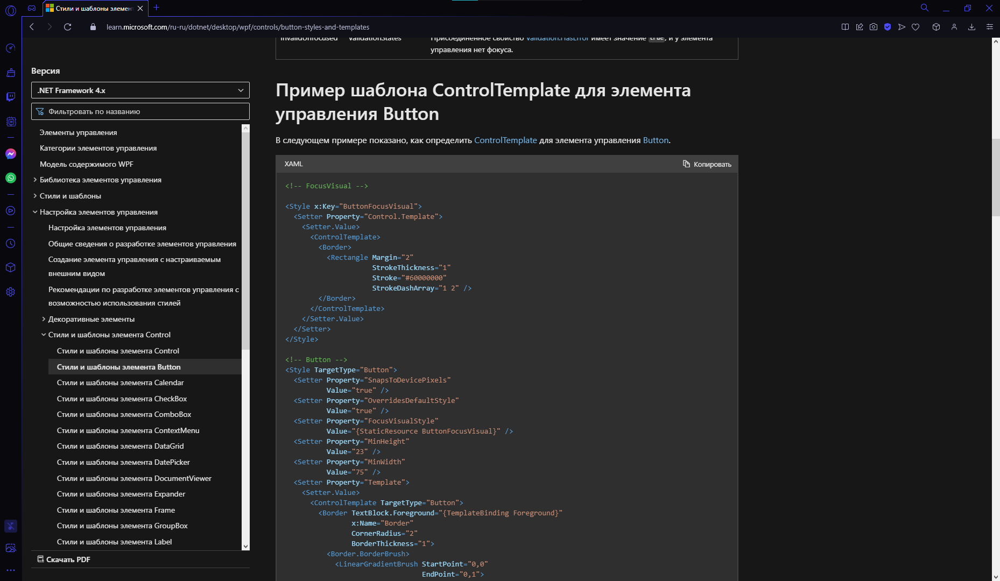

- Скопированный код вставить внутрь словаря ресурсов.
- Если появятся ошибки, то заменить значения цветов (и всего прочего, на что реализована привязка) на заглушки, например, цвет `Color="{DynamicResource ControlLightColor}"` на `Color="AliceBlue"`.

```xml
<ResourceDictionary xmlns="http://schemas.microsoft.com/winfx/2006/xaml/presentation"
                    xmlns:x="http://schemas.microsoft.com/winfx/2006/xaml">
    <!-- FocusVisual -->
    <Style x:Key="ButtonFocusVisual">
        <Setter Property="Control.Template">
            <Setter.Value>
                <ControlTemplate>
                    <Border>
                        <Rectangle Margin="2"
                                   StrokeThickness="1"
                                   Stroke="#60000000"
                                   StrokeDashArray="1 2" />
                    </Border>
                </ControlTemplate>
            </Setter.Value>
        </Setter>
    </Style>

    <!-- Button -->
    <Style TargetType="Button">
        <Setter Property="SnapsToDevicePixels" Value="true"/>
        <Setter Property="OverridesDefaultStyle" Value="true"/>
        <!-- ... -->
    </Style>
</ResourceDictionary>
```

### Способ 2 — правка копии существующего стиля

Чтобы изменить существующий стиль, необходимо нажать ПКМ в конструкторе, стиль которого мы хотим поменять, выбрать «Правка шаблона» → «Правка копии».

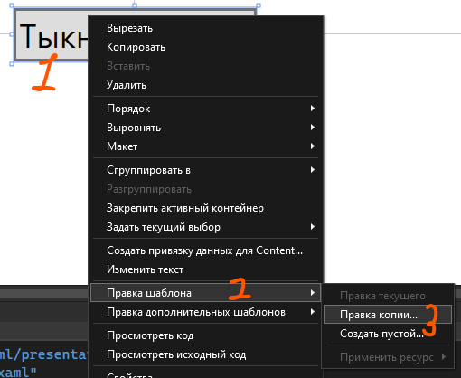

В появившемся окне укажу название для стиля, которое я буду использовать для привязки, а также расположение, откуда мы сможем быстро забрать наш стиль. Название любое, а вот для пути лучше всего использовать «Приложение». Создам стиль `NewButtonStyle` и нажму ОК.

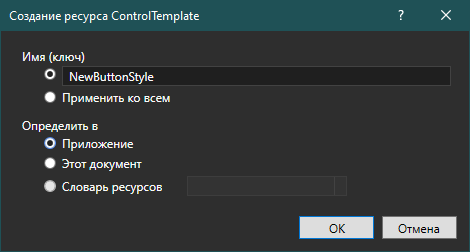

Стиль у меня создался внутри `App.xaml`, а внутри XAML окна у меня появилось внутренне окно, которое я закрою, чтобы оно не мозолило мне глаза.

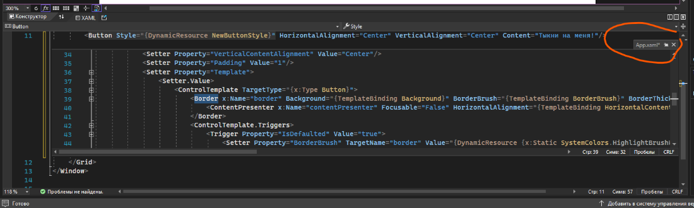

Зайду в `App.xaml` и вырежу всё содержимое `Application.Resources`, которое отвечало за стиль кнопки. Этот стиль вставлю в мой словарь данных.

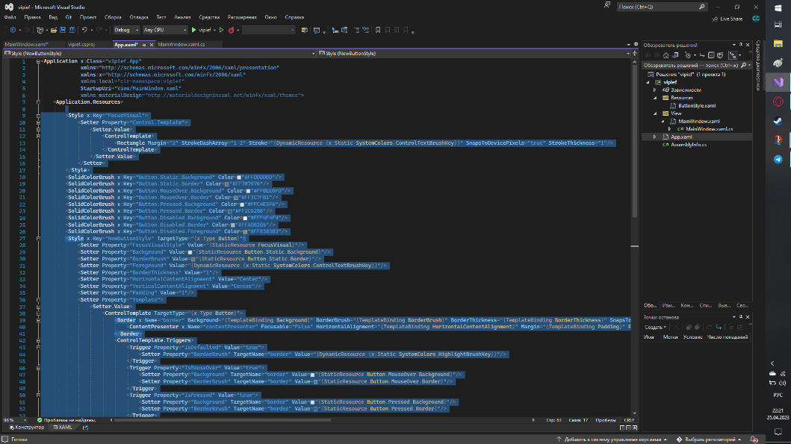

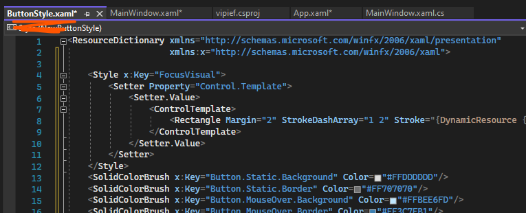

На этом создание базового стиля закончено.

### Подключение словаря в App.xaml

Чтобы использовать стиль из словаря ресурсов, его необходимо объявить в `App.xaml`. Для этого нужно написать тэг `<ResourceDictionary Source="путь до файла" />` внутрь `Application.Resources`.

```xml
<Application.Resources>
    <ResourceDictionary Source="/Resources/ButtonStyle.xaml" />
</Application.Resources>
```

Перепроверим, что нужный стиль имеет имя. Для этого у тега `Style` должен быть ключ при помощи `x:Key`. Если у вас нет тега `Style`, значит ключ должен быть у тега `ControlTemplate`.

```xml
<Style x:Key="NewButtonStyle" TargetType="{x:Type Button}">
```

Если всё есть, тогда мы можем указать желаемый стиль при помощи `DynamicResource название свойства`. Заметьте, что именно `Dynamic`, потому что есть ещё и `Static`.

> `StaticResource` будет назначен свойству во время загрузки XAML, которая происходит до фактического запуска приложения. Он будет назначен только один раз, и любые изменения в словаре ресурсов будут игнорироваться.
>
> `DynamicResource` присваивает объект во время загрузки, но фактически не ищет ресурс до тех пор, пока во время выполнения программа не запросит значение у объекта. Это откладывает поиск ресурса до тех пор, пока он не понадобится во время выполнения. Он обновит цель, если исходный словарь ресурсов изменится.

### Кастомизация стиля

И теперь мы можем видоизменять наш стиль как мы хотим, даже удалять некоторые триггеры и свойства. Скажем, видоизменю фон, углы кнопки и, самое главное, противный синий цвет при наведении на кнопку.

Было — снизу.

```xml
<Style x:Key="NewButtonStyle" TargetType="{x:Type Button}">
    <Setter Property="Template">
        <Setter.Value>
            <ControlTemplate TargetType="{x:Type Button}">
                <Border x:Name="border" Background="{TemplateBinding Background}" .../>
                <ControlTemplate.Triggers>
                    <Trigger Property="IsDefaulted" Value="true">
                        <Setter Property="BorderBrush" TargetName="border"
                                Value="{DynamicResource {x:Static SystemColors.HighlightBrushKey}}"/>
                    </Trigger>
                    <Trigger Property="IsMouseOver" Value="true">...</Trigger>
                    <!-- ... -->
                </ControlTemplate.Triggers>
            </ControlTemplate>
        </Setter.Value>
    </Setter>
</Style>
```

Стало — фон Teal, углы, без триггера наведения.

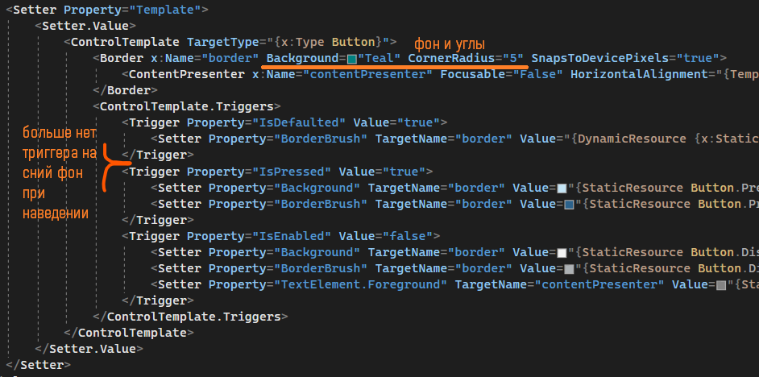

И XAML сразу же поменяется.

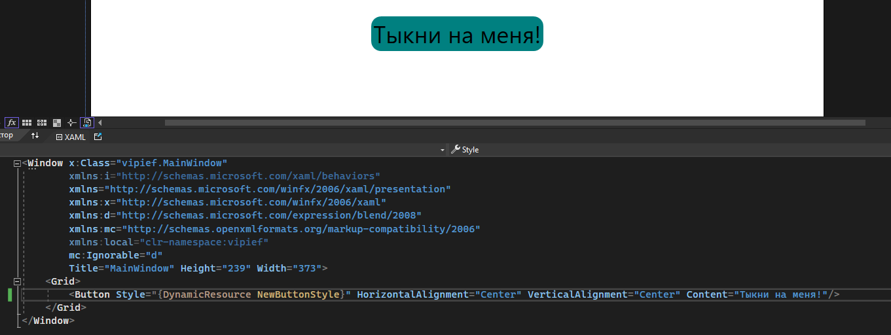

Остальное изменение стиля элемента интерфейса зависит только от вас и ваших экспериментов со стилями. Я люблю выводить окно с элементом на другую вкладку и менять XAML стиля — так я сразу вижу изменения и могу с ними быстро экспериментировать.

Этот стиль можно использовать и на другие кнопки, главное, чтобы это была кнопка. Если я хочу реализовать стиль для чего-то ещё, или, может, другой вид кнопки, мне понадобится сделать новый файл и также его привязать в `App.xaml`.

Также можно так захардкодить цвета, которые я использую чаще всего.

## Использование словарей данных для создания собственных цветов

Если вы часто делали разный фон для элементов, вы могли заметить, что если вписать какое-то слово внутрь цвета, то цвет выставится автоматически. То есть, есть какие-то определённые цвета в виде слов — `Green` — зеленый, `Teal` — цвет морской волны, `Peach` — персиковый. Мы можем сделать подобное.

Создам новый словарь данных с цветами.

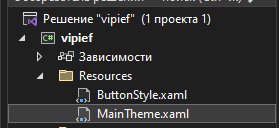

Внутри мы можем создать тэг `Brush` или `Colour` (в зависимости от того, что именно мне нужно — `Brush` для интерфейса, `Color` для кода). Название также указывается через `x:Key`. Значение указывается внутри тега.

Создам два цвета — `PrimaryColour` и `SecondaryColour`.

```xml
<ResourceDictionary xmlns="http://schemas.microsoft.com/winfx/2006/xaml/presentation"
                    xmlns:x="http://schemas.microsoft.com/winfx/2006/xaml">
    <Brush x:Key="PrimaryColour">#C9A0DC</Brush>
    <Brush x:Key="SecondaryColour">#8A21B5</Brush>
</ResourceDictionary>
```

Добавлю этот словарь данных внутрь `App.xaml`. Заметьте, что теперь мне их нужно поместить внутрь `MergedDictionaries`, чтобы XAML объединил все наши файлы в один (для своего удобства) и указал его как словарь ресурсов.

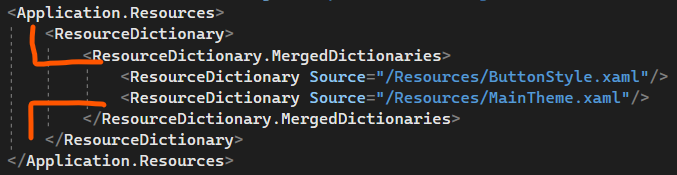

И теперь, я могу ставить эти цвета через привязки.

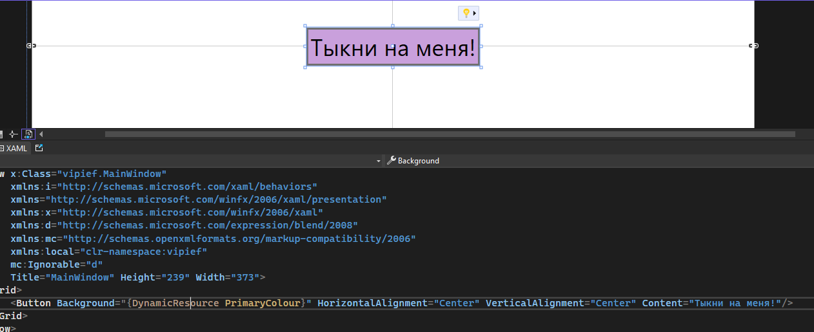

В будущем, заменяя значения этих файлов (или в принципе заменяя эти файлы) можно будет реализовать изменение темы.

Таким же образом можно реализовать и локализацию, только вместо `Brush` будет `String` или `Int`.

## Изменение темы приложения

В новомодных приложениях есть такая функция как изменение цвета приложения — её темы. В своих приложениях мы можем реализовать подобное при помощи словарей данных, которые будут хранить в себе разные цвета, но одинаковые названия.

### Подготовка двух тем

Скажем я хочу сделать две темы для своего приложения — фиолетовую и оранжевую. Для этого мне необходимо определить цвета, которые я буду использовать в этом приложении. Сделаю это в словарях данных. Создам сначала один словарь данных и назову его `OrangeTheme`.

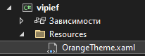

Внутри него создам 2 цвета, которые я хочу использовать в приложении. Если мне нужно будет больше цветов, то и создам я соответственно больше.

Запомните их имя — `Primary` и `Secondary`.

```xml
<ResourceDictionary xmlns="http://schemas.microsoft.com/winfx/2006/xaml/presentation"
                    xmlns:x="http://schemas.microsoft.com/winfx/2006/xaml">
    <Brush x:Key="Primary">#CC7722</Brush>
    <Brush x:Key="Secondary">#955F20</Brush>
</ResourceDictionary>
```

Затем я создам ещё один файл с уже другими цветами, но абсолютно таким же их количеством и названием — два цвета, `Primary` и `Secondary`.

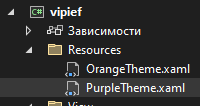

```xml
<ResourceDictionary xmlns="http://schemas.microsoft.com/winfx/2006/xaml/presentation"
                    xmlns:x="http://schemas.microsoft.com/winfx/2006/xaml">
    <Brush x:Key="Primary">Purple</Brush>
    <Brush x:Key="Secondary">MediumPurple</Brush>
</ResourceDictionary>
```

Затем эти темы мне необходимо добавить внутрь моего `App.xaml`, чтобы приложение их смогло увидеть. Но здесь есть некоторые правила:

- Чтобы наш будущий код сработал, наш словарик с темой обязательно должен быть на первом месте.
- Словарик с темой должен быть только один — дефолтный — либо фиолетовый, либо оранжевый. Я оставлю оранжевый.
- Сразу же помещу этот словарик внутрь `MergedDictionaries`, потому что словариков в приложении может быть много. Опять же, наша тема самая первая.

```xml
<Application.Resources>
    <ResourceDictionary>
        <ResourceDictionary.MergedDictionaries>
            <ResourceDictionary Source="/Resources/OrangeTheme.xaml"/>
        </ResourceDictionary.MergedDictionaries>
    </ResourceDictionary>
</Application.Resources>
```

Теперь создам самое простое приложение по переключению темы — две кнопки. Также ещё местами поставлю цвет из моих ресурсных файлов, чтобы я заметила изменение цветов.

Помним, что цвет мы ставим при помощи `{DynamicResource названиецветавсловарике}`.

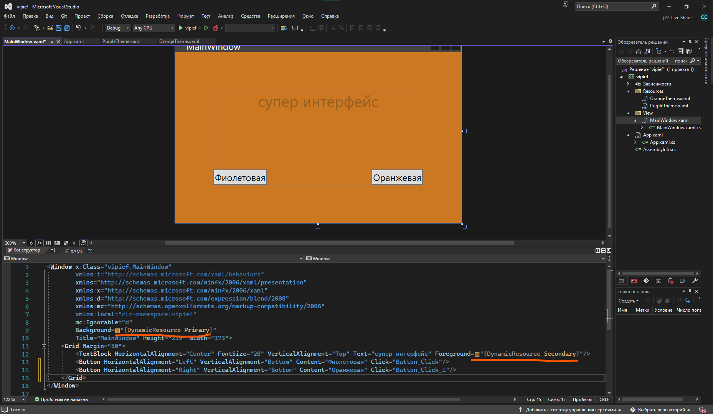

### Логика переключения темы из кода

А теперь самое интересное — изменение темы. Оно должно происходить внутри всего приложения, так что теперь нам код нужно будет написать внутри `App.xaml.cs`.

Перейду в этот файл и увижу, что в нём только абсолютно пустой класс. Давайте начнем с малого — сначала хотя бы создадим конструктор с `InitializeComponent`.

```csharp
public partial class App : Application
{
    public App()
    {
        InitializeComponent();
    }
}
```

Хорошо, этот `InitializeComponent` позволит нам создать наше приложение, подключить словарики, а затем мы уже сможем с ними работать.

Но работать как? Как переключить тему приложения через словарики?

Алгоритм следующий:

- Сейчас у нас внутри словаря ресурсов находится наш дефолтный файл с цветами.

```xml
<ResourceDictionary.MergedDictionaries>
    <ResourceDictionary Source="/Resources/OrangeTheme.xaml"/>
</ResourceDictionary.MergedDictionaries>
```

- Мы будем заменять этот файл на другой из кода, чтобы вместо `OrangeTheme` появилась, например, `PurpleTheme`. Старый словарик при этом будет удаляться, и наоборот.
- Выбранный файл мы сохраним в статическую переменную, которую создадим внутри `App`, а потом в файл, чтобы наша выбранная тема сохранилась и после закрытия приложения.
- Через эту статическую переменную мы будем менять значения цвета в других файлах, например, `MainWindow`.

Начнём.

Для начала создадим переменную, которая будет хранить в себе название файлика с цветом. Она должна быть полная, чтобы мы сразу настроили всю логику при изменении значения.

```csharp
public partial class App : Application
{
    private static string theme;

    public static string Theme
    {
        get { return theme; }
        set { theme = value; }
    }
}
```

Давайте сразу настроим наши кнопки, чтобы мы меняли значение этой переменной. Так как она находится в классе `App`, то и брать мы её будем при помощи `App.Theme`.

Внутрь просто впишем название словарика, на который мы хотим поменять тему.

```csharp
private void Button_Click(object sender, RoutedEventArgs e)   // кнопка «Фиолетовый»
{
    App.Theme = "PurpleTheme";
}

private void Button_Click_1(object sender, RoutedEventArgs e) // кнопка «Оранжевый»
{
    App.Theme = "OrangeTheme";
}
```

Дальше нам надо прописать логику изменения нашей темы, как только мы выдали переменной новое значение. Значит пишем в `set`.

Как она будет работать? Мы должны старый словарик с темой убрать, а вместо него поставить новый с таким же названием, который мы передали.

Для начала, создадим наш словарик из кода. Если мы создавали в XAML его вот так:

```xml
<ResourceDictionary Source="/Resources/BlueTheme.xaml"/>
```

То в коде его создание будет выглядеть вот так:


Но единственная проблема — у нас теперь всегда будет ставится именно `BlueTheme`, а нам надо поставить то название, которое мы передаем внутрь переменной. Название хранится внутри `value`, так что я прямо просто посередине этой строки вставлю `value` вместо названия файла.

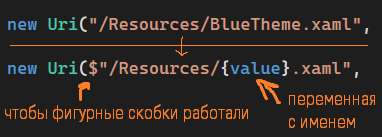

Далее мы убираем старый словарик из `MergedDictionaries` (вспомним, что он у нас самый первый, поэтому он под индексом 0), а затем добавить на ту же позицию наш словарик.

В целом код выглядит так:

```csharp
public static string Theme
{
    get { return theme; }
    set
    {
        theme = value;
        var dict = new ResourceDictionary { Source = new Uri($"/Resources/{value}.xaml", UriKind.Relative) };

        Current.Resources.MergedDictionaries.RemoveAt(0);
        Current.Resources.MergedDictionaries.Insert(0, dict);
    }
}
```

И уже на данном моменте тема будет меняться.

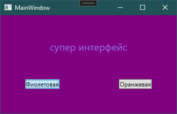

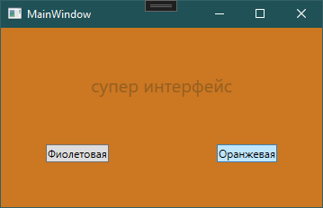

### Сохранение темы в файл

Мы также можем сохранить выбранную тему, чтобы она оставалась даже после закрытия приложения. Никаких json, просто обычный текстовик!

В самом конце `set` сохраним название нашего словарика куда угодно, я например сохраню на рабочий стол.

```csharp
Current.Resources.MergedDictionaries.Insert(0, dict);
File.WriteAllText("D:\\Рабочий стол\\theme.txt", value);
```

(Если я хочу код сделать универсальнее, я заставлю код найти этот рабочий стол.)

```csharp
Current.Resources.MergedDictionaries.Insert(0, dict);

var desktop = Environment.GetFolderPath(Environment.SpecialFolder.Desktop);
File.WriteAllText($"{desktop}\\theme.txt", value);
```

А при открытии приложения мы будем выгружать значение из этого файла (если файл существует конечно). Опять же, сделаем универсальный рабочий стол.

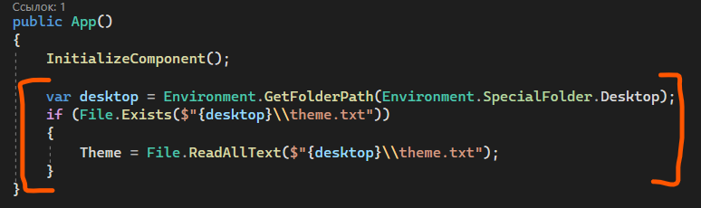

Результат будет следующим: поменяю тему на фиолетовую, закрою программу, проверю файл.

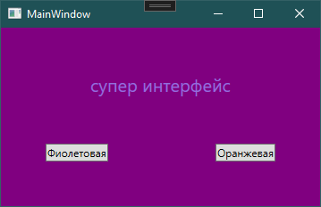

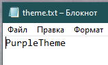

Снова открою программу и цвет останется тем же, что мы выбрали до этого.

## Полный код примера

`Resources/OrangeTheme.xaml` и `Resources/PurpleTheme.xaml` — два словаря с одинаковыми ключами:

```xml
<ResourceDictionary xmlns="http://schemas.microsoft.com/winfx/2006/xaml/presentation"
                    xmlns:x="http://schemas.microsoft.com/winfx/2006/xaml">
    <Brush x:Key="Primary">#CC7722</Brush>
    <Brush x:Key="Secondary">#955F20</Brush>
</ResourceDictionary>
```

```xml
<ResourceDictionary xmlns="http://schemas.microsoft.com/winfx/2006/xaml/presentation"
                    xmlns:x="http://schemas.microsoft.com/winfx/2006/xaml">
    <Brush x:Key="Primary">Purple</Brush>
    <Brush x:Key="Secondary">MediumPurple</Brush>
</ResourceDictionary>
```

`App.xaml` — дефолтная тема в `MergedDictionaries`:

```xml
<Application x:Class="vipief.App"
             xmlns="http://schemas.microsoft.com/winfx/2006/xaml/presentation"
             xmlns:x="http://schemas.microsoft.com/winfx/2006/xaml"
             StartupUri="MainWindow.xaml">
    <Application.Resources>
        <ResourceDictionary>
            <ResourceDictionary.MergedDictionaries>
                <ResourceDictionary Source="/Resources/OrangeTheme.xaml"/>
            </ResourceDictionary.MergedDictionaries>
        </ResourceDictionary>
    </Application.Resources>
</Application>
```

`App.xaml.cs` — статическое свойство `Theme` с заменой словаря и сохранением в txt:

```csharp
using System;
using System.IO;
using System.Windows;

namespace vipief
{
    public partial class App : Application
    {
        private static string theme;

        public static string Theme
        {
            get { return theme; }
            set
            {
                theme = value;
                var dict = new ResourceDictionary { Source = new Uri($"/Resources/{value}.xaml", UriKind.Relative) };

                Current.Resources.MergedDictionaries.RemoveAt(0);
                Current.Resources.MergedDictionaries.Insert(0, dict);

                var desktop = Environment.GetFolderPath(Environment.SpecialFolder.Desktop);
                File.WriteAllText($"{desktop}\\theme.txt", value);
            }
        }

        public App()
        {
            InitializeComponent();

            var desktop = Environment.GetFolderPath(Environment.SpecialFolder.Desktop);
            if (File.Exists($"{desktop}\\theme.txt"))
            {
                Theme = File.ReadAllText($"{desktop}\\theme.txt");
            }
        }
    }
}
```

`MainWindow.xaml.cs` — кнопки переключают тему через `App.Theme`:

```csharp
using System.Windows;

namespace vipief
{
    public partial class MainWindow : Window
    {
        public MainWindow()
        {
            InitializeComponent();
        }

        private void Button_Click(object sender, RoutedEventArgs e)
        {
            App.Theme = "PurpleTheme";
        }

        private void Button_Click_1(object sender, RoutedEventArgs e)
        {
            App.Theme = "OrangeTheme";
        }
    }
}
```
